# String 详解


> 作者：[村雨遥](https://github.com/cunyu1943)
> 
> 不要哀求，学会争取，若是如此，终有所获
>
> 

## 🎈 号外

最近，公众号之外，建立了微信交流群，不定期会在群里分享各种资源（影视、IT 编程、考试提升……）&知识。如果有需要，可以**扫码或者后台添加小编微信备注入群**。进群后**优先看群公告**，**呼叫群中【资源分享小助手】**，还能免费帮找资源哦～

<center>
 
</center>

## 概述

`String` 类代表字符串，定义的变量可以用来指向字符串对象，然后操作该字符串，同时还提供了许多用于操作字符串的功能。Java 中，所有的字符串都用双引号 `""` 括起来。

此外，`String` 是不可变的字符串类型，它的对象一旦创建，就不能够再被更改。

但在实际使用过程中，给我们的实际观感可能会觉得 `String` 是可变的，但实际上 `String` 每次的修改都是产生并指向了新的字符串对象，原来的字符串对象实际上是没有改变的。

## 创建对象的两种方式

1.  直接赋值

```java
String wepublic = "村雨遥";
```

2.  通过构造方法创建

```java
// 创建一个不含任何内容的空白字符串对象
String wepublic = new String();
```

```java
// 根据传入的字符串内容创建字符串对象
String wepublic = new String("村雨遥");
```

| 构造方法                         | 说明                                 |
| -------------------------------- | ------------------------------------ |
| `public String()`                | 创建一个不含任何内容的空白字符串对象 |
| `public String(String original)` | 根据传入的字符串内容来创建字符串对象 |
| `public String(char[] chs)`      | 根据字符串数组的内容来创建字符串对象 |
| `public String(bytes[] chs)`     | 根据字节数组的内容来创建字符串对象   |

两者的区别在于，利用 `""` 方式所给出的字符串对象，存储在字符串常量池中，而且相同内容只会在其中存储一份。但是通过构造方法 `new` 对象，每次 `new` 都会产生一个新对象，它们是存放在堆内存中的。

这里要注意，任何类型的数据与字符串相加时，得到的会是一个字符串。

```java
"cunyu" + 1943 = "cunyu1943"
```

## 字符串常用 API

### public boolean equals(Object anotherObject)

1.  **功能**

将此字符串与指定对象比较，只关心字符串内容是否一致。

2.  **示例**

```java
public class EqualsTest {
    public static void main(String[] args) {
        String str1 = "村雨遥";
        String str2 = "村雨";
        String str3 = "村雨";

        System.out.println(str1.equals(str2));
        System.out.println(str2.equals(str3));
    }
}
```

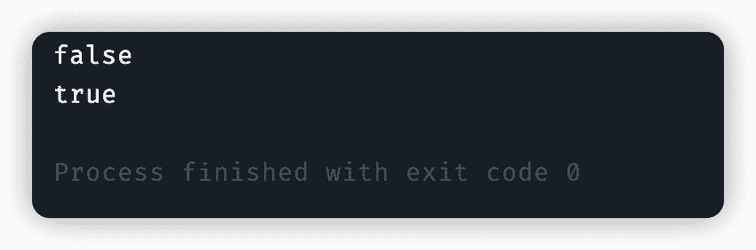

### public boolean equalsIgnoreCase(String anotherString)

1.  **功能**

将此字符串与指定对象进行比较，忽略大小写比较字符串内容是否一致。

2. **示例**

```java
public class EqualsIgnoreCaseTest {
    public static void main(String[] args) {
        String str1 = "cunyu1943";
        String str2 = "CUNYU1943";

        System.out.println(str1.equalsIgnoreCase(str2));
    }
}
```

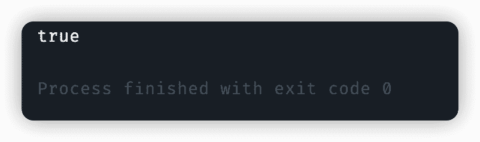

### public int length()

1.  **功能**

求字符串长度。

2. **示例**

```java
import java.util.Scanner;

public class LengthTest {
    public static void main(String[] args) {
        Scanner scanner = new Scanner(System.in);

        System.out.println("输入一个字符串");

        String str = scanner.next();

        System.out.println("输入的字符串的长度为: " + str.length());
    }
}

```

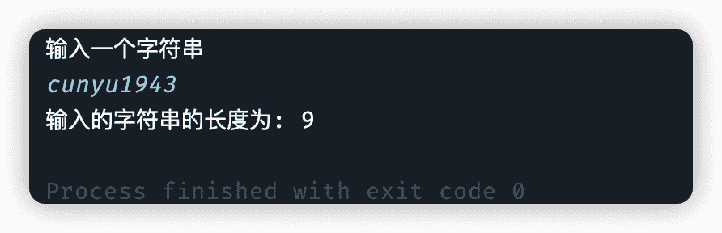

### public char charAt(int index)

1.  **功能**

获取某个索引位置处的字符。

2. **示例**

```java
public class CharAtTest {
    public static void main(String[] args) {
        String str = "cunyu1943";

        System.out.println("索引位置为 3 的字符为: " + str.charAt(3));
    }
}
```

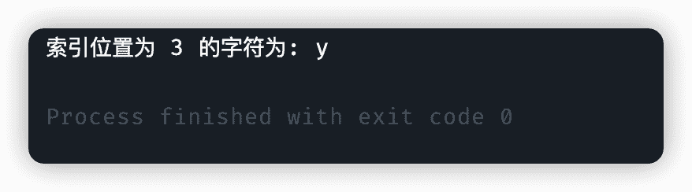

### public char[] toCharArray()

1.  **功能**

字符串转换为字符串数组。

2. **示例**

```java
public class ToCharArrayTest {
    public static void main(String[] args) {
        String str = "cunyu1943";

        char[] charArray = str.toCharArray();

        System.out.println(Arrays.toString(charArray));
    }
}
```

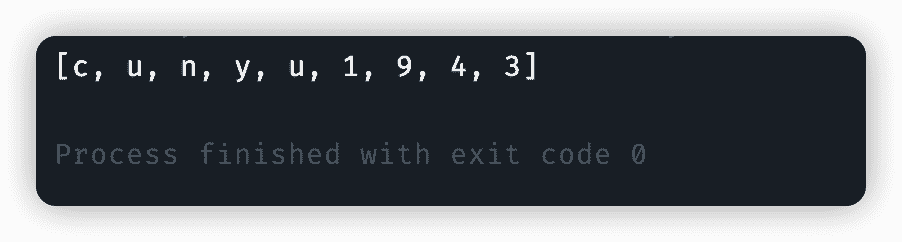

### public String substring(int beginIndex, int endIndex)

1.  **功能**

根据开始和结束索引进行截取得到新的子串（左闭右开）。

2. **示例**

```java
public class SubstringTest {
    public static void main(String[] args) {
        String name = "cunyu1943";

        System.out.println(name.substring(2, 5));
    }
}

```

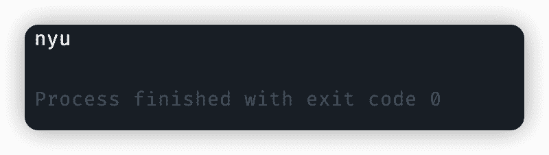

### public String replace(CharSequence target, CharSequence replacement)

1.  **功能**

使用新值将字符串中的旧值替换得到新字符串。

2. **示例**

```java
public class ReplaceTest {
    public static void main(String[] args) {
        char ch1 = 'u';
        char ch2 = 'x';

        String str = "cunyu1943";

        System.out.println("原字符串: " + str);
        System.out.println("替换后的字符串: " + str.replace(ch1, ch2));
    }
}
```

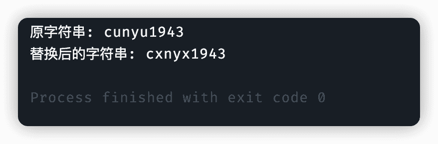

### public String[] split(String regex)

1.  **功能**

通过正则规则切割字符串，得到字符串数组。

2. **示例**

```java
public class SplitTest {
    public static void main(String[] args) {
        String str = "010-110-119";

        String[] splitArray = str.split("-");

        System.out.println(Arrays.toString(splitArray));
    }
}
```

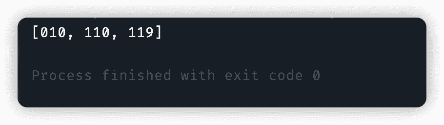

## StringBuilder

`StringBuilder` 可以看做一个容器，创建后其中的内容可变，主要是为了提高字符串 `String` 的操作效率。

### 构造方法

| 方法                               | 说明                                     |
| ---------------------------------- | ---------------------------------------- |
| `public StringBuilder()`           | 创建一个不含任何内容的空白可变字符串对象 |
| `public StringBuilder(String str)` | 根据字符串内容，创建可变字符串对象       |

```java
public class StringBuilderConstrcutor {
    public static void main(String[] args) {
        StringBuilder stringBuilder = new StringBuilder();
        System.out.println("无参构造：" + stringBuilder);

        StringBuilder stringBuilder1 = new StringBuilder("村雨遥");
        System.out.println("有参构造：" + stringBuilder1);
    }
}
```

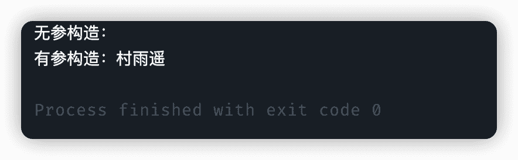

### 常用方法

| 方法                                      | 说明                               |
| ----------------------------------------- | ---------------------------------- |
| `public int length()`                     | 返回字符串长度                     |
| `public String toString()`                | 将 `StringBuilder` 转换为 `String` |
| `public StringBuilder append(Object obj)` | 添加数据并返回对象本身             |
| `public StringBuilder reverse()`          | 反转容器中的内容                   |

```java
public class StringBuilderMethodTest {
    public static void main(String[] args) {
        StringBuilder stringBuilder = new StringBuilder("村雨遥");

        System.out.println("原字符串：" + stringBuilder);

        System.out.println("length(): " + stringBuilder.length());

        stringBuilder.append("cunyu1943");
        System.out.println("append(): " + stringBuilder);

        System.out.println("toString(): " + stringBuilder.toString());

        System.out.println("reverse(): " + stringBuilder.reverse());


    }
}
```

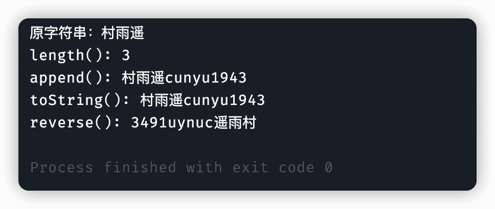

## StringJoiner

类似于 `StringBuilder`，都可以把它们看做是一个容器，而且它们里面的内容还是可变的，而它的出现也是为了提高操作字符串的效率。

### 构造方法

| 方法                                              | 说明                                                                 |
| ------------------------------------------------- | -------------------------------------------------------------------- |
| `public StringJoiner(间隔符)`                     | 创建一个 `StringJoiner` 对象并指定拼接时的间隔符                     |
| `public StringJoiner(间隔符, 开始符号, 结束符号)` | 创建一个 `StringJoiner` 对象并指定拼接时的间隔符、开始符号、结束符号 |

```java
import java.util.StringJoiner;

public class StringJoinerConstructorTest {
    public static void main(String[] args) {
        StringJoiner stringJoiner = new StringJoiner("*");
        stringJoiner.add("123");
        stringJoiner.add("13");

        System.out.println(stringJoiner);

        StringJoiner stringJoiner1 = new StringJoiner("*", "[", "]");
        stringJoiner1.add("123");
        stringJoiner1.add("13");

        System.out.println(stringJoiner1);
    }
}
```

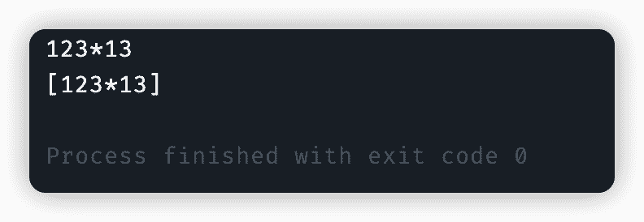

### 常用方法

| 方法                                  | 说明                              |
| ------------------------------------- | --------------------------------- |
| `public StringJoiner add(Object obj)` | 添加数据后返回对象本身            |
| `public int length()`                 | 返回字符串长度                    |
| `public String toString()`            | 将 `StringJoiner` 转换为 `String` |

```java
import java.util.StringJoiner;

public class StringJoinerMethodTest {
    public static void main(String[] args) {
        StringJoiner stringJoiner = new StringJoiner("---", "{", "}");

        stringJoiner.add("cunyu");
        stringJoiner.add("1943");
        stringJoiner.add("村雨遥");

        System.out.println("length(): " + stringJoiner.length());
        System.out.println("toString(): " + stringJoiner.toString());
    }
}
```

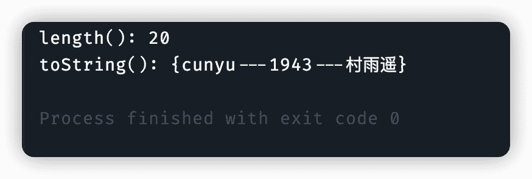

## 总结

以上就是关于 `Java` 中字符串的相关知识点了，主要介绍了 `String` 类创建对象的两种方式以及常用 `API`。此外，为了提高字符串的操作效率，还了解 `StringBuilder` 和 `StringJoiner` 的构造方法以及常用方法，方便后续编程中使用。

## ⏳ 联系

想解锁更多知识？不妨关注我的微信公众号：**村雨遥（id：JavaPark）**。

扫一扫，探索另一个全新的世界。

<center>

</center>