# 输入输出流

>
> 不要哀求，学会争取。若是如此，终有所获。
> 

## 🎈 号外

最近，公众号之外，建立了微信交流群，不定期会在群里分享各种资源（影视、IT 编程、考试提升……）&知识。如果有需要，可以**扫码或者后台添加小编微信备注入群**。进群后**优先看群公告**，**呼叫群中【资源分享小助手】**，还能免费帮找资源哦～

<center>
 
</center>

## 前言

我们日常开发过程中，有许多方面都涉及到 IO 流，比如上传下载、传输、设计模式等等。而所有的一切都是基于 IO 流来进行，所以今天就来看看 Java 中 IO 流的相关知识点。

本文主要内容安排如下：

- **文件对象**
- **流简介**
- **字节流**
- **字符流**

## 文件对象

### 文件路径

Java 标准库 `java.io` 提供了 `File` 对象用于操作文件和目录，也就是说我们的文件和目录都是可以通过 `File` 封装成对象的。构造 `File` 对象时，需要传入我们的文件或目录的路径名，常用的构造方法如下：

| 方法                                | 描述                                               |
| ----------------------------------- | -------------------------------------------------- |
| `File(String pathName)`             | 通过将给定路径名字符串转换为抽象路径名来创建新实例 |
| `File(String parent, String child)` | 从父路径名字符串和子路径名字符串创建新实例         |
| `File(File parent, String child)`   | 从父抽象路径名和子路径名字符串创建新实例           |

```java
import java.io.File;

/**
 * @author : cunyu
 * @version : 1.0
 * @className : FileObject
 * @date : 2021/4/20 9:20
 * @description : 创建 File 对象的三个构造方法
 */

public class FileObject {
    public static void main(String[] args) {

        File file1 = new File("D:/PersonalFiles/github/githubCodes/IDEA/TheWay2Java/IOStream/data/1.txt");
        System.out.println(file1);

        File file2 = new File("D:/PersonalFiles/github/githubCodes/IDEA/TheWay2Java/IOStream/data", "1.txt");
        System.out.println(file2);

        File file3 = new File("D:/PersonalFiles/github/githubCodes/IDEA/TheWay2Java/IOStream/data");
        File file4 = new File(file3, "1.txt");
        System.out.println(file4);
    }
}
```

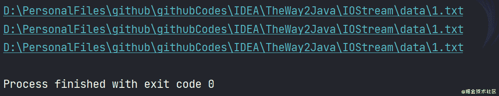

对于我们传入文件的路径，既可以使用绝对路径，也可以使用相对路径。

- **相对路径**：以当前文件所在位置为参考，然后建立出另一个文件所在位置路径。我们最常用的有 `.` 和 `..`，前者表示当前目录，而后者则表示当前目录的上一级目录。假设我们当前目录为 `/home/cunyu1943/data`，则 `.` 仍然表示该目录，而 `..` 则表示 `/home/cunyu1943` 目录。
- **绝对路径**：又可以分为 **本地绝对路径** 和 **网络绝对路径**。本地绝对路径以根目录为参考，指文件在硬盘中真实存在的路径，比如在 Windows 系统，我们的一个绝对路径是 `D:\\Softwares\\Typora\\Typora.exe`，而在类 `Unix` 系统中则为 `/home/cunyu1943/IO.md`，此时需要注意平台间的分隔符是不一样的，但为了同一，推荐同一写成 `/`，这样程序在不同系统中迁移时也不会出现问题。而网络绝对位置则指带有网址的路径，比如 `https://cunyu1943.site/index.html`。

```java
import java.io.File;
import java.io.IOException;

/**
 * @author : cunyu
 * @version : 1.0
 * @className : FilePath
 * @date : 2021/4/20 9:55
 * @description : 文件路径
 */

public class FilePath {
    public static void main(String[] args) throws IOException {
        File file = new File("../data/1.txt");
        System.out.println(file.getPath());
        System.out.println(file.getAbsolutePath());
        System.out.println(file.getCanonicalPath());
    }
}
```

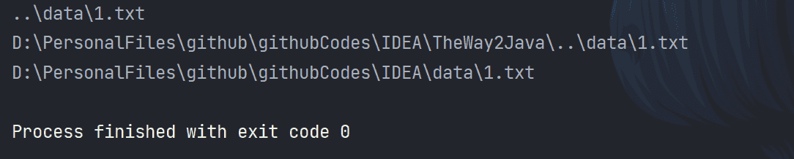

### 文件和目录操作

#### 创建与删除

既然拿到了 `File` 对象，接下来就是通过操作该对象来进行创建和删除文件或目录了，以下是一些 `File` 类常用的创建和删除方法。

| 返回值    | 方法              | 描述                                                                                 |
| --------- | ----------------- | ------------------------------------------------------------------------------------ |
| `boolean` | `createNewFile()` | 当具有该名称的文件不存在时，创建一个由该抽象路径名命名的新空文件；存在时，则创建失败 |
| `boolean` | `mkdir()`         | 创建由此抽象路径名命名的目录                                                         |
| `boolean` | `mkdirs()`        | 创建由此抽象路径名命名的多级目录，包括任何必需但不存在的父目录                       |
| `boolean` | `delete()`        | 删除由此抽象路径名命名的文件或目录，删除目录的前提是该目录必须为空                   |

```java
import java.io.File;
import java.io.IOException;

/**
 * @author : cunyu
 * @version : 1.0
 * @className : CreateAndDelete
 * @date : 2021/4/20 10:40
 * @description : 创建&删除
 */

public class CreateAndDelete {
    public static void main(String[] args) throws IOException {
        File file1 = new File("D:/PersonalFiles/github/githubCodes/IDEA/TheWay2Java/IOStream/data/2.txt");
        if (file1.createNewFile()) {
            System.out.println("创建文件成功");
        } else {
            System.out.println("创建文件失败");
        }

        if (file1.delete()) {
            System.out.println("删除文件成功");
        } else {
            System.out.println("删除文件失败");
        }

        File file2 = new File("D:/PersonalFiles/github/githubCodes/IDEA/TheWay2Java/IOStream/data/demo");
        if (file2.mkdir()) {
            System.out.println("创建文件夹成功");
        } else {
            System.out.println("创建文件夹失败");
        }

        File file3 = new File("D:/PersonalFiles/github/githubCodes/IDEA/TheWay2Java/IOStream/data/JavaSE/demo");
        if (file3.mkdirs()) {
            System.out.println("创建多级目录成功");
        } else {
            System.out.println("创建多级目录失败");
        }
    }
}
```

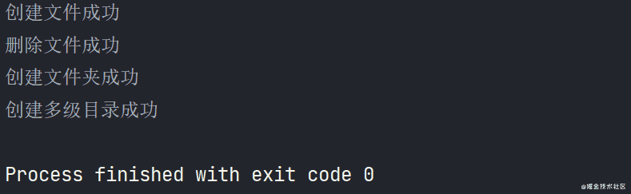

**注意**：

- 创建文件时，调用的是 `createNewFile()` 方法，而创建目录时调用的是 `mkdir()` 或者 `mkdirs()` 方法。我们在调用时要注意区分，否则就算你的路径是文件，当调用了创建目录的方法后它也会创建成目录而非文件。对应的，就算你给定的路径是目录，当调用创建文件的方法后它也会创建成文件而非目录。

- 删除目录时，若目录中有内容（目录、文件），则 **不能直接删除**，而是应该先删除目录中的内容，然后才能删除目录；

#### 相关属性

获取到 `File` 对象后，我们可以对其相关属性进行判断，常用方法如下：

| 返回值    | 方法           | 描述                                 |
| --------- | -------------- | ------------------------------------ |
| `long`    | `length()`     | 该抽象路径名表示的文件的所占字节大小 |
| `boolean` | `canRead()`    | 该抽象路径名表示的文件是否可读       |
| `boolean` | `canWrite()`   | 该抽象路径名表示的文件是否可写       |
| `boolean` | `canExecute()` | 该抽象路径名表示的文件是否可执行     |

```java
import java.io.File;

/**
 * @author : cunyu
 * @version : 1.0
 * @className : Main
 * @date : 2021/4/20 11:04
 * @description : 相关属性
 */

public class Main {
    public static void main(String[] args) {
        File file = new File("D:/PersonalFiles/github/githubCodes/IDEA/TheWay2Java/IOStream/data/new.txt");

        if (file.canExecute()) {
            System.out.println("该对象可执行");
        } else {
            System.out.println("该对象不可执行");
        }
        if (file.canRead()) {
            System.out.println("该对象可读");
        } else {
            System.out.println("该对象不可读");
        }
        if (file.canWrite()) {
            System.out.println("该对象可写");
        } else {
            System.out.println("该对象不可写");
        }

        System.out.println("文件大小：" + file.length() + " Byte");
    }
}

```

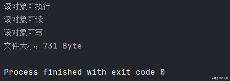

#### 判断和获取

获取到 `File` 对象后，我们既可以用它来表示文件，也可以用来表示目录。而对于文件和目录的判断和获取功能，可以使用如下常用的方法：

| 返回值     | 方法                | 描述                                                   |
| ---------- | ------------------- | ------------------------------------------------------ |
| `boolean`  | `isFile()`          | 测试此抽象路径名表示的文件是否为普通文件               |
| `boolean`  | `isDirectory()`     | 测试此抽象路径名表示的文件是否为目录                   |
| `boolean`  | `exists()`          | 测试此抽象路径名表示的文件或目录是否存在               |
| `String`   | `getPath()`         | 将抽象路径转换为路径字符串                             |
| `String`   | `getAbsolutePath()` | 返回此抽象路径名的绝对路径名字符串                     |
| `String`   | `getName()`         | 返回由此抽象路径名表示的文件或目录的名称               |
| `String[]` | `list()`            | 返回字符串数组，表示该抽象路径名表示目录下的文件和目录 |
| `File[]`   | `listFiles()`       | 返回抽象路径名数组，表示该抽象路径名表示目录下的文件   |

```java
import java.io.File;

/**
 * @author : cunyu
 * @version : 1.0
 * @className : Main
 * @date : 2021/4/20 11:15
 * @description : 判断和获取
 */

public class Main {
    public static void main(String[] args) {
        File file = new File("D:/PersonalFiles/github/githubCodes/IDEA/TheWay2Java/IOStream/data");
        System.out.println(file.isDirectory());
        System.out.println(file.isFile());
        System.out.println(file.exists());
        System.out.println("-------------------------");
        System.out.println(file.getPath());
        System.out.println(file.getAbsolutePath());
        System.out.println(file.getName());
        System.out.println("-------------------------");
        System.out.println("目录下的文件和目录列表：（文件或目录名）");
        for (String path : file.list()) {
            System.out.println(path);
        }
        System.out.println("-------------------------");
        System.out.println("目录下的文件和目录列表：（完整绝对路径）");
        for (File path : file.listFiles()) {
            System.out.println(path);
        }
    }
}
```

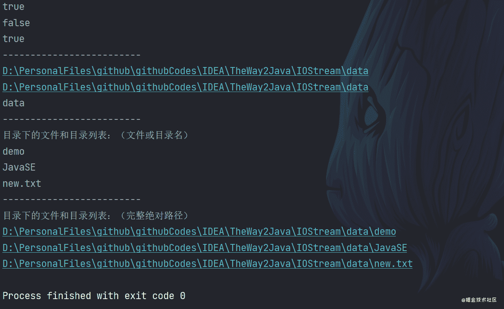

### 练习

假设我们要遍历 Windows 下 C 盘的 Windows 目录，并且列出其中文件名和文件大小，而不用列出目录名，我们可以利用如下代码来实现：

```java
import java.io.File;

/**
 * @author : cunyu
 * @version : 1.0
 * @className : Test
 * @date : 2021/4/20 11:40
 * @description : 遍历 C 盘 Windows 目录下的文件，并打印文件名和大小
 */

public class Test {
    public static void main(String[] args) {
        File file = new File("C:/windows");
        for (File item : file.listFiles()) {
            if (item.isFile()) {
                System.out.println("文件名：" + item.getName() + "\t文件大小占：" + item.length() + " 字节");
            }
        }
    }
}
```

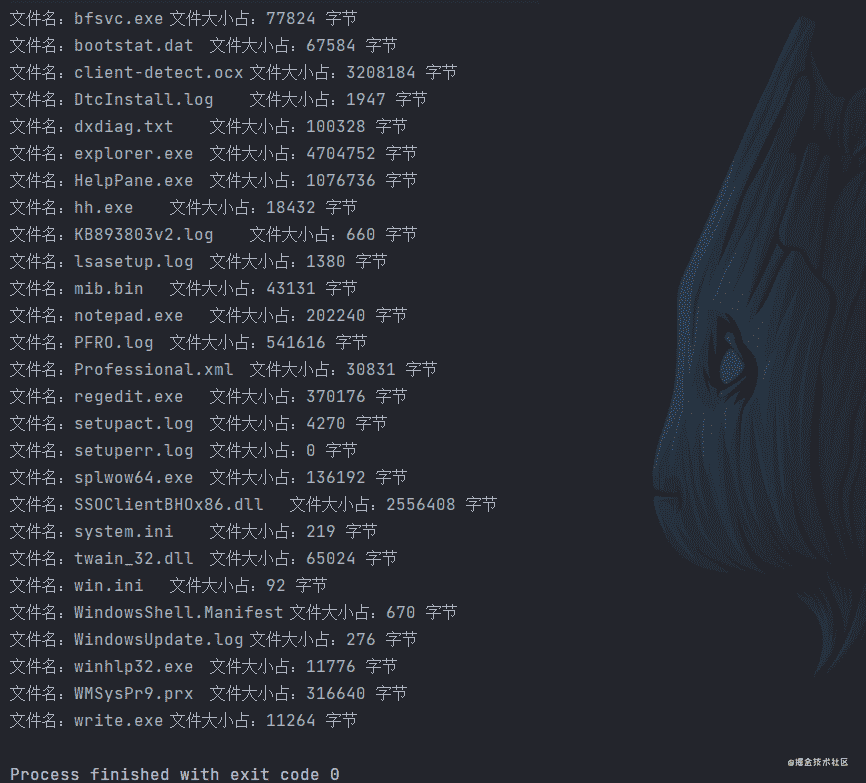

## 流

### 什么是流

所谓流，就是一系列数据的组合。当我们需要进行数据交互的时候，比如在服务器和客户端之间进行数据交互时，我们此时就可以使用 Java 中的流来实现。Java 中，数据的输入和输出都是以流的形式来进行的。根据数据流方向的不同，我们可以将其分为：**输入流**、**输出流**。而根据处理的数据单位不同，可分为：**字节流**、**字符流**。两者的关系可以描述为下表：

|            | 字节流         | 字符流   |
| ---------- | -------------- | -------- |
| **输入流** | `InputStream`  | `Reader` |
| **输出流** | `OutputStream` | `Writer` |

而对于字节流和字符流的选用原则，我们建议遵循如下规则：**如果数据能够通过 Windows 自带笔记本软件打开并且能够读懂其中的内容，则选用字符流，否则选择字节流。而如果我们也不知道应该使用何种类型的流，则默认使用字节流**。

下图描述了字节流和字符流的类层次图，注意：**无论是字节流还是字符流，其子类名都是以其父类名作为子类名的后缀的**。

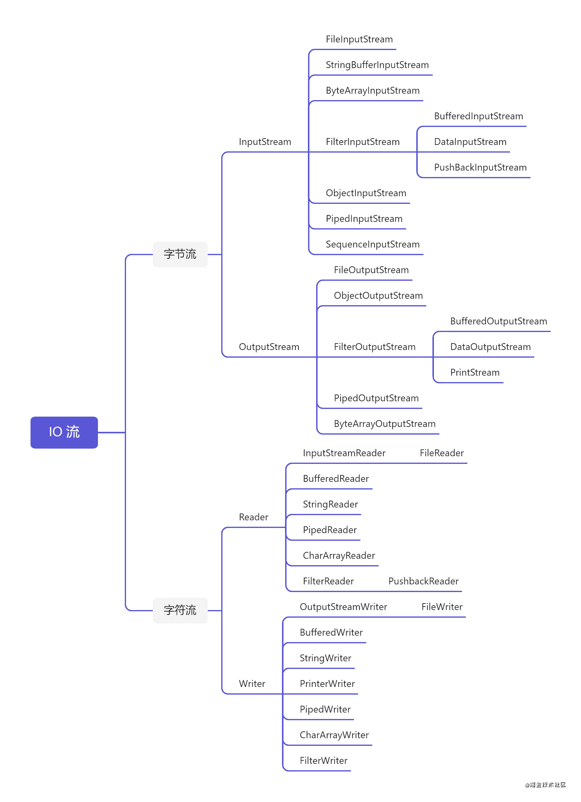

### InputStream

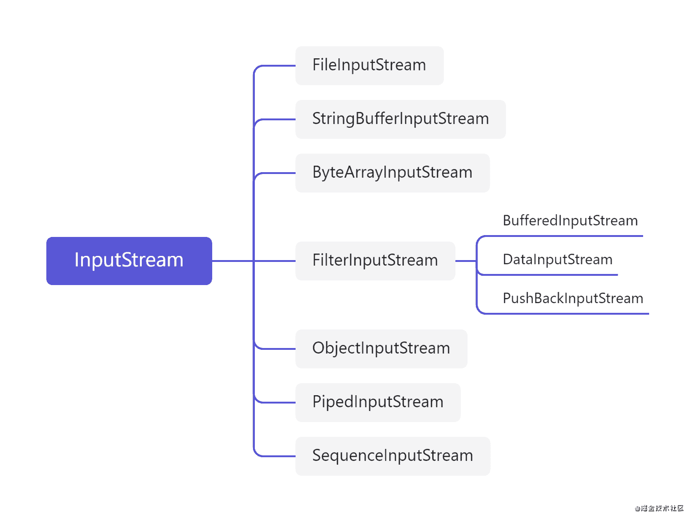

注意，`InputStream` 并非是并不是一个接口，而是所有字节输入流所有类的父类。下面我们主要以 `FileInputStream` 来举例，所谓 `FileInputStream`，就是从文件流中读取数据，然后将数据从文件中读取到内存，常用方法如下：

| 返回值 | 方法              | 描述                                         |
| ------ | ----------------- | -------------------------------------------- |
| `int`  | `available()`     | 返回该输入流中可以读取的字节数的估计值       |
| `void` | `close()`         | 关闭输入流并释放相关资源                     |
| `int`  | `read(bytep[] b)` | 从输入流读取一些字节数，并将其存储到缓冲区 b |

下面是一个从文件中读取数据到内存中的实例，文件内容如下：

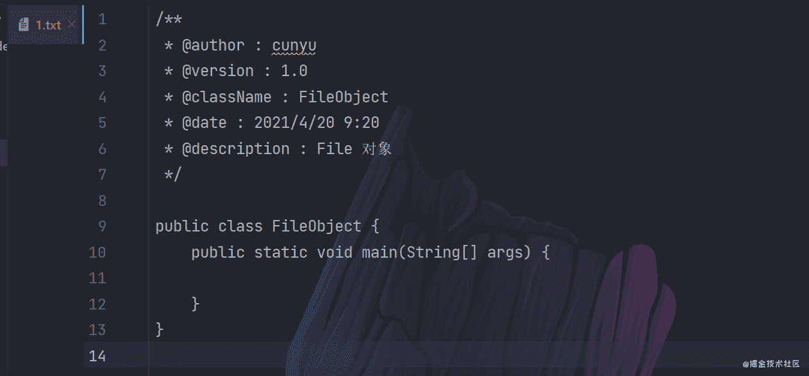

```java
import java.io.File;
import java.io.FileInputStream;
import java.io.IOException;
import java.io.InputStream;

/**
 * @author : cunyu
 * @version : 1.0
 * @className : TestInputStream
 * @date : 2021/4/20 15:29
 * @description : InputStream 实例
 */

public class TestInputStream {

    public static void main(String[] args) {

        String result = null;
        File file = new File("D:/PersonalFiles/github/githubCodes/IDEA/TheWay2Java/IOStream/data/1.txt");
        try (InputStream inputStream = new FileInputStream(file)) {

//            读取输入流中可以被读的 bytes 估计值
            int size = inputStream.available();
//            根据 bytes 数创建数组
            byte[] array = new byte[size];
//            数据读取到数组
            inputStream.read(array);
//            数组转化为字符串
            result = new String(array);

        } catch (IOException e) {
            e.printStackTrace();
        }

//        打印字符串
        System.out.println(result);

    }
}
```

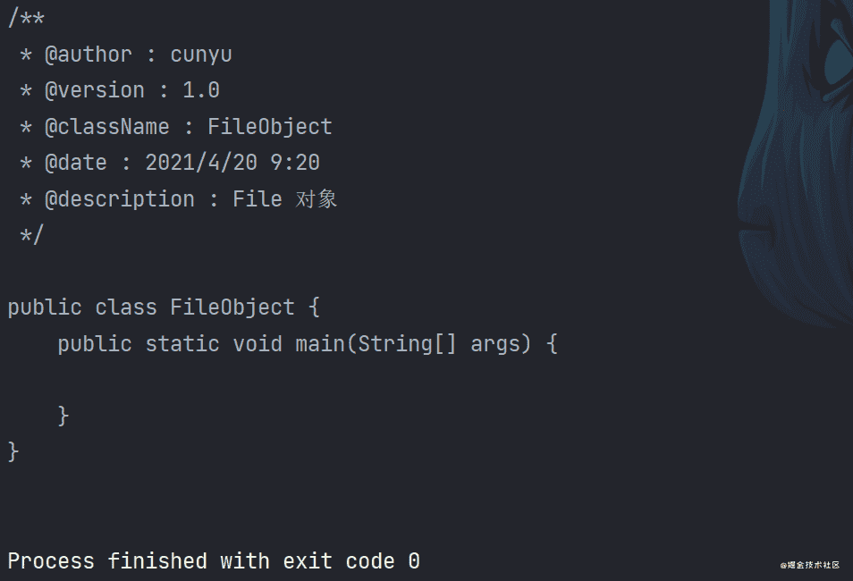

### OutputStream

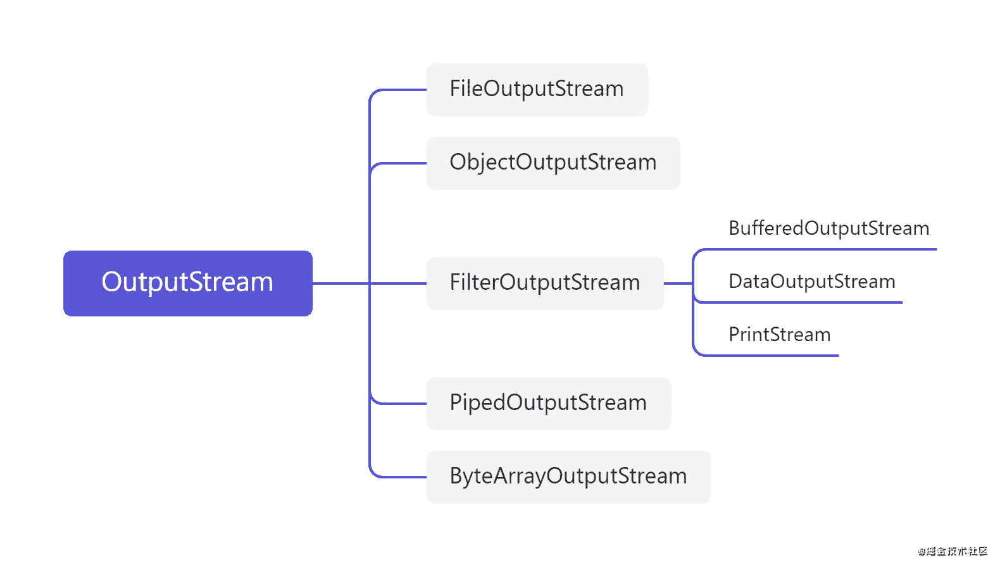

`OutputStream` 并非是并不是一个接口，而是所有输出字节流的所有类的父类。下面我们主要以 `FileOutputStream` 来举例，所谓 `FileOutputStream`，就是从内存中读取数据，然后将数据从内存存放到文件中，常用方法如下：

| 返回值 | 方法              | 描述                                               |
| ------ | ----------------- | -------------------------------------------------- |
| `void` | `write(byte[] b)` | 将 `b.length` 个字节从指定字节数组写入此文件输出流 |
| `void` | `close()`         | 关闭文件输出流并释放相关资源                       |

```java
import java.io.*;

/**
 * @author : cunyu
 * @version : 1.0
 * @className : TestOutputStream
 * @date : 2021/4/20 15:58
 * @description : OutputStream 实例
 */

public class TestOutputStream {
    public static void main(String[] args) {
        File file = new File("D:/PersonalFiles/github/githubCodes/IDEA/TheWay2Java/IOStream/data/2.txt");
        String content = "这是一个 OutputStream 实例！";
        try (OutputStream outputStream = new FileOutputStream(file)) {
//            字符串转换为 byte 数组
            byte[] array = content.getBytes();

//            写入数据
            outputStream.write(array);
        } catch (IOException e) {
            e.printStackTrace();
        }

        System.out.println("写入成功");
    }
}
```

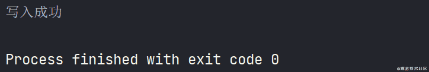

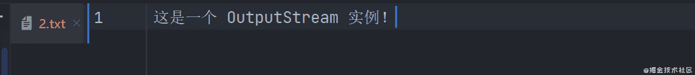

需要注意的点：

- 字节流写入数据时如何实现换行？

写入换行的转义字符的字节数组即可，但是需要注意，不同系统下换行的转义字符不同，Windows 下为 `\r\n`，macOS 下为 `\r`，而 Linux 下为 `\m`。

- 字节流写入数据时如何实现追加？

调用 `public FileOutputStream(String name, boolean append)` 这个构造方法即可，当 `append` 为 `true` 时，表示追加，默认情况下是 `false`，表示不追加。

### 字符串中的编解码问题

#### 编码

- `byte[] getBytes()`：使用平台默认字符集将该字符串编码成一系列字节，然后将结果存储到新的字节数组中；
- `byte[] getBytes(String charsetName)`：使用指定字符集将该字符串编码为一系列字节，然后将结果存储到新的字节数组中；

#### 解码

- `String(byte[] bytes)`：使用平台默认字符集解码指定的字节数来构造新的字符串；
- `String(byte[] bytes, String charsetName)`：通过指定的字符集解码指定的字节数组来构造新的字符串；

```java
import java.io.UnsupportedEncodingException;
import java.util.Arrays;

/**
 * @author : cunyu
 * @version : 1.0
 * @className : EncodeAndDecode
 * @date : 2021/4/21 9:37
 * @description : 编码和解码
 */

public class EncodeAndDecode {
    public static void main(String[] args) throws UnsupportedEncodingException {
//        编码
        String str = "村雨遥";
        byte[] bytes1 = str.getBytes();
        byte[] bytes2 = str.getBytes("UTF-8");
        byte[] bytes3 = str.getBytes("GBK");

        System.out.println(Arrays.toString(bytes1));
        System.out.println(Arrays.toString(bytes2));
        System.out.println(Arrays.toString(bytes3));

//        解码
        String res1 = new String(bytes1);
        String res2 = new String(bytes1, "UTF-8");
        String res3 = new String(bytes1, "GBK");

        System.out.println(res1);
        System.out.println(res2);
        System.out.println(res3);
    }
}
```

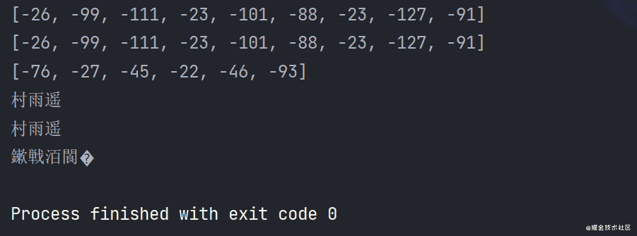

### Writer

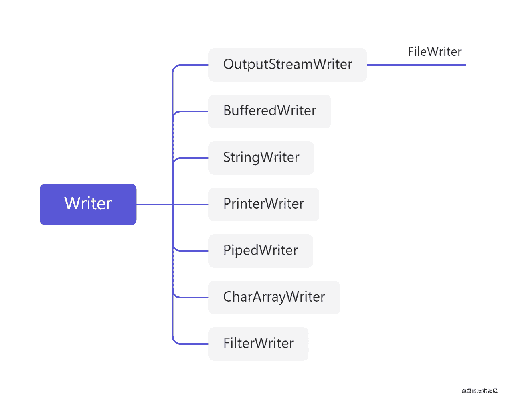

当我们要写入基于字符的数据到数据源中时，需要使用写入器 `Writer`. 以其中的 `FileWriter` 具体展开，其常用方法如下：

| 返回值 | 方法        | 描述                         |
| ------ | ----------- | ---------------------------- |
| `void` | `close()`   | 先刷新再关闭流，不能再写数据 |
| `void` | `flush()`   | 刷新流，可以继续写数据       |
| `void` | `newLine()` | 写入行分隔符                 |
| `void` | `write()`   | 写入字符或字符串             |

```java
import java.io.BufferedWriter;
import java.io.File;
import java.io.FileWriter;
import java.io.IOException;

/**
 * @author : cunyu
 * @version : 1.0
 * @className : TestWriter
 * @date : 2021/4/20 18:35
 * @description : Writer 实例
 */

public class TestWriter {
    public static void main(String[] args) {
        File file = new File("D:/PersonalFiles/github/githubCodes/IDEA/TheWay2Java/IOStream/data/2.txt");
        try (BufferedWriter bufferedWriter = new BufferedWriter(new FileWriter(file))) {
            bufferedWriter.write("公众号：村雨遥");
            bufferedWriter.newLine();
            bufferedWriter.write("Blog：https://cunyu1943.site");
            bufferedWriter.newLine();
            bufferedWriter.flush();
        } catch (IOException e) {
            e.printStackTrace();
        }
        System.out.println("写入成功");
    }
}
```

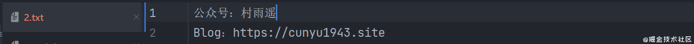

### Reader

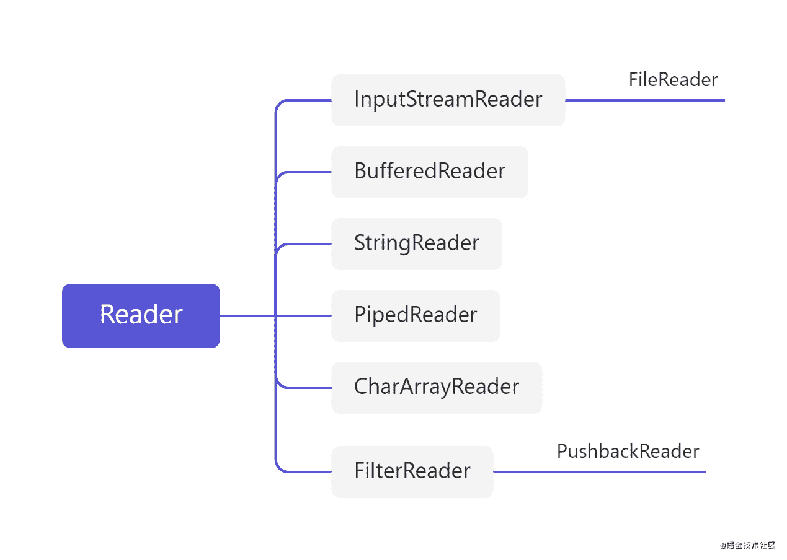

当我们要从数据源读取基于字符的数据时，需要使用读取器 `Reader`. 我们以 `FileReader` 实践，其常用的方法有：

| 返回值    | 方法         | 描述                     |
| --------- | ------------ | ------------------------ |
| `void`    | `close()`    | 关闭流并释放相关资源     |
| `int`     | `read()`     | 读取一个字符             |
| `String`  | `readLine()` | 读一行文字               |
| `boolean` | `ready()`    | 获取该流是否准备好被读取 |

我们以从文件中读取内容为例：

```java
import java.io.*;

/**
 * @author : cunyu
 * @version : 1.0
 * @className : TestReader
 * @date : 2021/4/20 18:40
 * @description : Reader 实例
 */

public class TestReader {
    public static void main(String[] args) {
        String content = null;
        File file = new File("D:/PersonalFiles/github/githubCodes/IDEA/TheWay2Java/IOStream/data/2.txt");
        System.out.println("内容如下：");
        try (BufferedReader bufferedReader = new BufferedReader(new FileReader(file))) {
            while ((content = bufferedReader.readLine()) != null) {
                System.out.println(content);
            }
        } catch (IOException e) {
            e.printStackTrace();
        }
    }
}
```

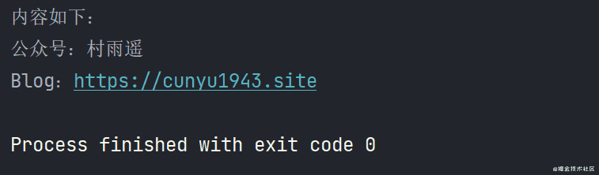

## 总结

好了，关于 IO 流的知识点到此就结束了，赶紧学起来！如果你觉得本文对你有所帮助，那就点赞关注一波吧！

对于文中遗漏或者错误的知识点，欢迎大家评论留言，咱们评论区见！

**关注公众号，获取最新文章更新**

::: center

:::

## ⏳ 联系

想解锁更多知识？不妨关注我的微信公众号：**村雨遥（id：JavaPark）**。

扫一扫，探索另一个全新的世界。

<center>

</center>