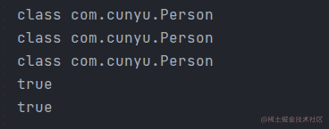
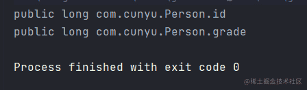
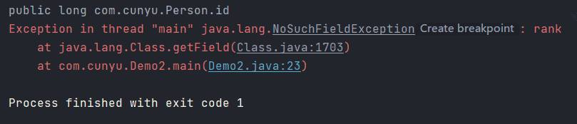
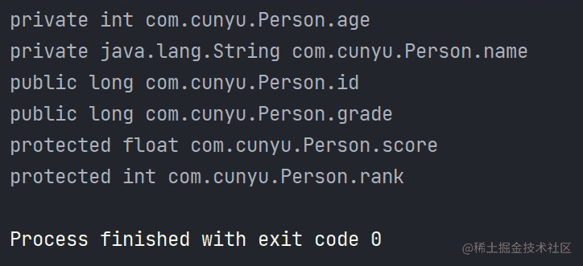
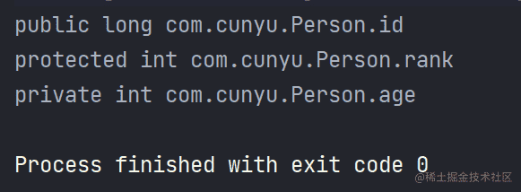
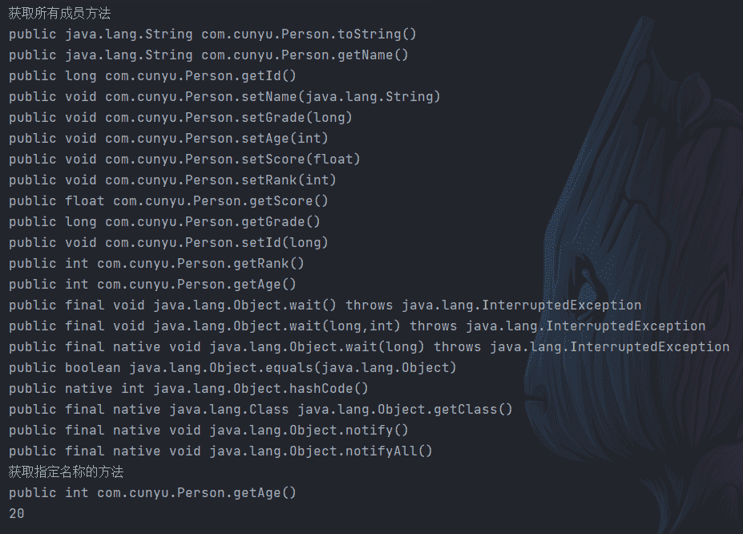
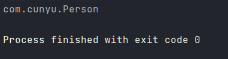
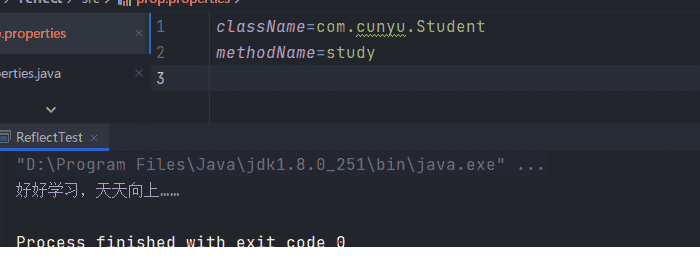
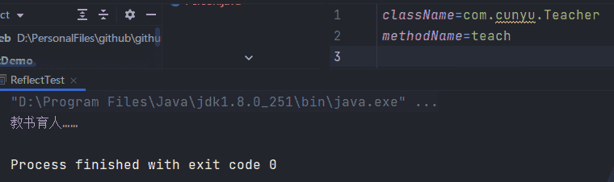

# 反射机制详解


::: info 共勉
不要哀求，学会争取。若是如此，终有所获。
:::
::: tip 原文
https://mp.weixin.qq.com/s/f0sJpAhgI6B7oirsJfv9jQ

:::

## 反射概述

### 什么是反射

将类的各个组成部分封装为其他对象的过程就叫做 **反射**，其中 **组成部分** 指的是我们类的 **成员变量（Field）**、**构造方法（Constructor）**、**成员方法（Method）**。

### 使用反射的优缺点

- **优点**

  1.  在 **程序运行过程中** 可以操作类对象，增加了程序的灵活性；
  2.  解耦，从而提高程序的可扩展性，提高代码的复用率，方便外部调用；
  3.  对于任何一个类，当知道它的类名后，就能够知道这个类的所有属性和方法；而对于任何一个对象，都能够调用它的一个任意方法。

- **缺点**
  1.  **性能问题**：Java 反射中包含了一些动态类型，JVM 无法对这些动态代码进行优化，因此通过反射来操作的方式要比正常操作效率更低。
  2.  **安全问题**：使用反射时要求程序必须在一个没有安全限制的环境中运行，如果程序有安全限制，就不能使用反射。
  3.  **程序健壮性**：反射允许代码执行一些平常不被允许的操作，破坏了程序结构的抽象性，导致平台发生变化时抽象的逻辑结构无法被识别。

## Class 对象的获取及使用

### 获取 Class 对象的方式

1. `Class.forName("全类名")`

源代码阶段，它能将字节码文件加载进内存中，然后返回 `Class` 对象，多用于 **配置文件** 中，将类名定义在配置文件中，通过读取配置文件来加载类。

2. `类名.class`

类对象阶段，通过类名的 `class` 属性来获取，多用于 **参数的传递**。

3. `对象.getClass()`

运行时阶段，`getClass()` 定义在 `Object` 类中，表明所有类都能使用该方法，多用于 **对象的获取字节码** 的方式。

我们首先定义一个 `Person` 类，用于后续反射功能的测试；

```java
package com.cunyu;

/**
 * @author : cunyu
 * @version : 1.0
 * @className : Person
 * @date : 2021/4/7 22:37
 * @description : Person 类
 */

public class Person {
    private int age;
    private String name;
    public long id;
    public long grade;
    protected float score;
    protected int rank;


    public Person(int age, String name, long id, long grade, float score, int rank) {
        this.age = age;
        this.name = name;
        this.id = id;
        this.grade = grade;
        this.score = score;
        this.rank = rank;
    }

    public Person() {
    }

    public int getAge() {
        return age;
    }

    public void setAge(int age) {
        this.age = age;
    }

    public String getName() {
        return name;
    }

    public void setName(String name) {
        this.name = name;
    }

    public long getId() {
        return id;
    }

    public void setId(long id) {
        this.id = id;
    }

    public long getGrade() {
        return grade;
    }

    public void setGrade(long grade) {
        this.grade = grade;
    }

    public float getScore() {
        return score;
    }

    public void setScore(float score) {
        this.score = score;
    }

    public int getRank() {
        return rank;
    }

    public void setRank(int rank) {
        this.rank = rank;
    }

    @Override
    public String toString() {
        final StringBuffer sb = new StringBuffer("Person{");
        sb.append("age=").append(age);
        sb.append(", name='").append(name).append('\'');
        sb.append(", id=").append(id);
        sb.append(", grade=").append(grade);
        sb.append(", score=").append(score);
        sb.append(", rank=").append(rank);
        sb.append('}');
        return sb.toString();
    }
}
```

定义好 `Person` 类之后，我们尝试用 3 种不同的方式来获取 `Class` 对象，并比较它们是否相同。

```java
package com.cunyu;

/**
 * @author : cunyu
 * @version : 1.0
 * @className : Demo1
 * @date : 2021/4/7 23:29
 * @description : Class 对象的获取
 */

public class Demo1 {
    public static void main(String[] args) throws ClassNotFoundException {
//        第一种方式，Class.forName("全类名")
        Class class1 = Class.forName("com.cunyu.Person");
        System.out.println(class1);

//        第二种方式，类名.class
        Class class2 = Person.class;
        System.out.println(class2);

//        第三种方式，对象.getName()
        Person person = new Person();
        Class class3 = person.getClass();
        System.out.println(class3);

//        比较三个对象是否相同
        System.out.println(class1 == class2);
        System.out.println(class1 == class3);
    }
}
```



上述代码中，会发现最后输出的比较结果返回的是两个 `true`，说明通过上述三种方式获取的 `Class` 对象都是同一个，**同一个字节码文件（`*.class`）在一次运行过程中只会被加载一次**。

### Class 对象的使用

#### 获取成员变量

| 方法                                  | 说明                                                                           |
| ------------------------------------- | ------------------------------------------------------------------------------ |
| `Field[] getFields()`                 | 返回包含一个数组 `Field`对象反射由此表示的类或接口的所有可访问的公共字段类对象 |
| `Field getField(String name)`         | 返回一个 `Field`对象，它反映此表示的类或接口的指定公共成员字段类对象           |
| `Field[] getDeclaredFields()`         | 返回的数组 `Field`对象反映此表示的类或接口声明的所有字段类对象                 |
| `Field getDeclaredField(String name)` | 返回一个 `Field`对象，它反映此表示的类或接口的指定已声明字段类对象             |

- `Field[] getFields()`

```java
package com.cunyu;

import java.lang.reflect.Field;

/**
 * @author : cunyu
 * @version : 1.0
 * @className : Demo2
 * @date : 2021/4/7 23:39
 * @description : Class 对象的使用
 */

public class Demo2 {
    public static void main(String[] args) throws ClassNotFoundException {
        Class class1 = Class.forName("com.cunyu.Person");

        Field[] fields = class1.getFields();
        for (Field field : fields) {
            System.out.println(field);
        }

    }
}
```



回顾下我们的 `Person` 类，可以发现 `id`、`grade` 成员变量都是被 `public` 所修饰的，说明该方法是用于获取类中所有被 `public` 所修饰的成员变量（**包括父类**）。

- `Field getField(String name)`

```java
package com.cunyu;

import java.lang.reflect.Field;

/**
 * @author : cunyu
 * @version : 1.0
 * @className : Demo2
 * @date : 2021/4/7 23:39
 * @description : Class 对象的使用
 */

public class Demo2 {
    public static void main(String[] args) throws ClassNotFoundException, NoSuchFieldException {
        Class class1 = Class.forName("com.cunyu.Person");

        Field field1 = class1.getField("id");
        System.out.println(field1);
        Field field2 = class1.getField("age");
        System.out.println(field2);
        Field field3 = class1.getField("rank");
        System.out.println(field3);

    }
}
```




从上面的结果分析可知，该方法只能用于获取类中指定名称的 `public` 所修饰的成员变量，对于 `protected`、`private` 所修饰的成员变量，该方法是无法获取的（**包括父类**）。而获取或设置成员变量值时，可以通过 `get/set` 方法来操作，具体操作方法如下。

```java
// 假设我们获取到的 Field 为上面的 id，获取和设置 id 的值就可以通过如下操作来进行
// 1. 获取
Field idField = personClass.getField("id");
Person person = new Person();
Object idValue = idField.get(person);
System.out.println("id：" + idValue);
// 2. 设置
idField.set(person, "1312120");
System.out.println("person：" + person);
```

- `Field[] getDeclaredFields()`

```java
package com.cunyu;

import java.lang.reflect.Field;

/**
 * @author : cunyu
 * @version : 1.0
 * @className : Demo2
 * @date : 2021/4/7 23:39
 * @description : Class 对象的使用
 */

public class Demo2 {
    public static void main(String[] args) throws ClassNotFoundException, NoSuchFieldException {
        Class class1 = Class.forName("com.cunyu.Person");

        Field[] fields = class1.getDeclaredFields();
        for (Field field : fields) {
            System.out.println(field);
        }
    }
}
```



观察上面的结果可知，该方法可用于获取所有的成员变量，不用考虑修饰符的限制（**不包括父类**）。

- `Field getDeclaredField(String name)`

```java
package com.cunyu;

import java.lang.reflect.Field;

/**
 * @author : cunyu
 * @version : 1.0
 * @className : Demo2
 * @date : 2021/4/7 23:39
 * @description : Class 对象的使用
 */

public class Demo2 {
    public static void main(String[] args) throws ClassNotFoundException, NoSuchFieldException {
        Class class1 = Class.forName("com.cunyu.Person");

        Field field1 = class1.getDeclaredField("id");
        System.out.println(field1);
        Field field3 = class1.getDeclaredField("rank");
        System.out.println(field3);
        Field field2 = class1.getDeclaredField("age");
        System.out.println(field2);
    }
}
```



观察上面的结果可知，该方法可用于获取指定的成员变量，不用考虑成员变量修饰符的限制（**不包括父类**）。但是在利用 `set`、`get` 方法来获取和设置 `private`、`protected` 修饰的成员变量时，需要利用 `setAccessible()` 来忽略访问全新啊修饰符的安全检查，否则程序将会报错。

#### 获取构造方法

| 方法                                                             | 说明                                                                                 |
| ---------------------------------------------------------------- | ------------------------------------------------------------------------------------ |
| `Constructor<?>[] getConstructors()`                             | 返回包含一个数组 `Constructor`对象反射由此表示的类的所有公共构造类对象               |
| `Constructor<T> getConstructor(类<?>... parameterTypes)`         | 返回一个 `Constructor` 对象，该对象反映 `Constructor`对象表示的类的指定的公共类函数  |
| `Constructor<?>[] getDeclaredConstructors()`                     | 返回一个反映 `Constructor` 对象表示的类声明的所有 `Constructor` 对象的数组类         |
| `Constructor<T> getDeclaredConstructor(类<?>... parameterTypes)` | 返回一个 `Constructor` 对象，该对象反映 `Constructor` 对象表示的类或接口的指定类函数 |

```java
package com.cunyu;

import java.lang.reflect.Constructor;
import java.lang.reflect.InvocationTargetException;

/**
 * @author : cunyu
 * @version : 1.0
 * @className : Demo3
 * @date : 2021/4/8 13:28
 * @description : 构造对象获取
 */

public class Demo3 {
    public static void main(String[] args) throws ClassNotFoundException, NoSuchMethodException, IllegalAccessException, InvocationTargetException, InstantiationException {
        Class personClass = Class.forName("com.cunyu.Person");

//        1. 获取所有构造方法
        System.out.println("所有构造方法");
        Constructor[] constructors = personClass.getConstructors();
        for (Constructor constructor : constructors) {
            System.out.println(constructor);
        }

//        2. 获取指定构造方法

//        空参构造方法
        System.out.println("空参构造方法");
        Constructor constructor1 = personClass.getConstructor();
        System.out.println(constructor1);
//        带参构造方法
        System.out.println("带参构造方法");
        Constructor constructor2 = personClass.getConstructor(int.class, String.class, long.class, long.class, float.class, int.class);
        System.out.println(constructor2);

//        获取构造方法后，可以利用它来创建对象
        System.out.println("空参创建对象");
//        第一种方法
        Object person = constructor1.newInstance();
        System.out.println(person);
//        第二种方法
        Object person1 = personClass.newInstance();
        System.out.println(person1);

        System.out.println("带参创建对象");
        Object object = constructor2.newInstance(20, "村雨遥", 1312020, 3, 99.0F, 2);
        System.out.println(object);
    }
}
```


- `Constructor<?>[] getConstructors()`

  类似于通过 `Class` 实例来获取成员变量，该方法用于获取所有 `public` 所修饰的构造方法（**包括父类**）；

- `Constructor<T> getConstructor(类<?>... parameterTypes)`

该方法用于获取某一指定参数类型后的 `public` 所修饰的构造方法（**包括父类**）；

- `Constructor<?>[] getDeclaredConstructors()`

该方法用于获取所有 `public` 所修饰的构造方法（**不包括父类**）；

- `Constructor<T> getDeclaredConstructor(类<?>... parameterTypes)`

该方法用于获取某一指定参数类型后的 `public` 所修饰的构造方法（**不包括父类**）；

而获取到构造方法之后，我们就可以利用 `newInstance()` 方法来创建类的实例。特殊的，如果我们的构造方法是无参的，此时则可以直接利用 `Class.newInstance()` 来构造实例。

#### 获取成员方法

| 方法                                                             | 说明                                                                                                                                    |
| ---------------------------------------------------------------- | --------------------------------------------------------------------------------------------------------------------------------------- |
| `Method[] getMethods()`                                          | 返回包含一个数组 方法对象反射由此表示的类或接口的所有公共方法 类对象，包括那些由类或接口和那些从超类和超接口继承的声明                  |
| `Method getMethod(String name, 类<?>... parameterTypes)`         | 返回一个方法对象，它反映此表示的类或接口的指定公共成员方法 类对象                                                                       |
| `Method[] getDeclaredMethods()`                                  | 返回包含一个数组方法对象反射的类或接口的所有声明的方法，通过此表示 类对象，包括公共，保护，默认（包）访问和私有方法，但不包括继承的方法 |
| `Method getDeclaredMethod(String name, 类<?>... parameterTypes)` | 返回一个方法对象，它反映此表示的类或接口的指定声明的方法类对象                                                                          |

```java
package com.cunyu;

import java.lang.reflect.InvocationTargetException;
import java.lang.reflect.Method;

/**
 * @author : cunyu
 * @version : 1.0
 * @className : Demo4
 * @date : 2021/4/8 13:51
 * @description : 成员方法获取
 */

public class Demo4 {
    public static void main(String[] args) throws ClassNotFoundException, NoSuchMethodException, InvocationTargetException, IllegalAccessException {
        Class personClass = Class.forName("com.cunyu.Person");

//        获取所有 public 成员方法
        System.out.println("获取所有成员方法");
        Method[] methods = personClass.getMethods();
        for (Method method : methods) {
            System.out.println(method);
        }

//        获取指定名称的方法
        System.out.println("获取指定名称的方法");
        Method getAgeMethod = personClass.getMethod("getAge");
        System.out.println(getAgeMethod);

//        执行方法
        Person person = new Person(20, "村雨遥", 1312020, 3, 99.0F, 2);
        int age = (int) getAgeMethod.invoke(person);
        System.out.println(age);

    }
}
```



- `Method[] getMethods()`

用于获取当前类的所有 `public` 所修饰的成员方法（**包括父类**）。

- `Method getMethod(String name, 类<?>... parameterTypes)`

用于获取当前类的某一个指定名称 `public` 所修饰的成员方法（**包括父类**）。

- `Method[] getDeclaredMethods()`

用于获取当前类的所有 `public` 所修饰的成员方法（**不包括父类**）。

- `Method getDeclaredMethod(String name, 类<?>... parameterTypes)`

用于获取当前类的某一个指定名称 `public` 所修饰的成员方法（**不包括父类**）。

而当我们获取到类的成员方法后，如果要执行某一个方法，可以使用 `invoke()` 方法来执行该方法。

#### 获取类名

```java
package com.cunyu;

/**
 * @author : cunyu
 * @version : 1.0
 * @className : Demo5
 * @date : 2021/4/8 14:06
 * @description : 获取类名
 */

public class Demo5 {
    public static void main(String[] args) throws ClassNotFoundException {
        Person person = new Person();
        Class personClass = person.getClass();

        String className = personClass.getName();
        System.out.println(className);
    }
}
```



- `String getName()`

从上述程序的结果可知，当我们获取到 `Class` 对象之后，如果不知道类的全名，就可以使用 `getName()` 来获取该类的全名。

## 反射实例

假设我们有如下需求：在不改变类的代码的前提下，我们能够创建任意类的对象，并执行其中的方法。

此时，我们可以通过 **配置文件 + 反射** 的方式来实现这一效果，而这也就是我们现在所用框架中的基础，当我们使用反射后，只需要通过修改配置文件中的内容就能够不用去改代码就实现对应的功能。

假设我们有两个类，一个 `Student`，一个 `Teacher`，两者的定义如下；

```java
package com.cunyu;

/**
 * @author : cunyu
 * @version : 1.0
 * @className : Teacher
 * @date : 2021/4/8 15:15
 * @description : 教师类
 */

public class Teacher {
    private String name;
    private int age;

    public void teach() {
        System.out.println("教书育人……");
    }
}
```

```java
package com.cunyu;

/**
 * @author : cunyu
 * @version : 1.0
 * @className : Student
 * @date : 2021/4/8 15:16
 * @description : 学生类
 */

public class Student {
    private String name;
    private float score;

    public void study() {
        System.out.println("好好学习，天天向上……");
    }
}
```

要实现我们的需求，通常需要如下步骤：

1.  将要创建对象的全类名和要执行的方法都配置在配置文件中；

定义的配置文件 `prop.properties` ，其中主要内容包括 `className` 和 `methodName` 两个属性，分别代表类的全类名和要调用方法的名字。一个具体实例如下，分别代表名为 `Student` 的类和名为 `study` 的方法。

```properties
className=com.cunyu.Student
methodName=study
```

2.  然后在主方法中加载读取配置文件；

```java
//        创建配置文件对象
Properties properties = new Properties();
//        加载配置文件
ClassLoader classLoader = ReflectTest.class.getClassLoader();
InputStream inputStream = classLoader.getResourceAsStream("prop.properties");
properties.load(inputStream);

//        获取配置文件中定义的数据
String className = properties.getProperty("className");
String methodName = properties.getProperty("methodName");
```

3.  利用反射技术将类加载到内存中；

```java
//        加载进内存
Class name = Class.forName(className);
```

4.  接着利用 `newInstance()` 方法创建对象；

```java
//        创建实例
Object object = name.newInstance();
```

5.  最后则是利用 `invoke()` 方法来执行方法；

```java
//        获取并执行方法
Method method = name.getMethod(methodName);
method.invoke(object);
```

将整个流程汇总起来就是：

```java
package com.cunyu;

import java.io.IOException;
import java.io.InputStream;
import java.lang.reflect.InvocationTargetException;
import java.lang.reflect.Method;
import java.util.Properties;

/**
 * @author : cunyu
 * @version : 1.0
 * @className : ReflectTest
 * @date : 2021/4/8 15:27
 * @description : 测试
 */

public class ReflectTest {
    public static void main(String[] args) throws IOException, ClassNotFoundException, IllegalAccessException, InstantiationException, InvocationTargetException, NoSuchMethodException {
//        创建配置文件对象
        Properties properties = new Properties();
//        加载配置文件
        ClassLoader classLoader = ReflectTest.class.getClassLoader();
        InputStream inputStream = classLoader.getResourceAsStream("prop.properties");
        properties.load(inputStream);

//        获取配置文件中定义的数据
        String className = properties.getProperty("className");
        String methodName = properties.getProperty("methodName");

//        加载进内存
        Class name = Class.forName(className);

//        创建实例
        Object object = name.newInstance();

//        获取并执行方法
        Method method = name.getMethod(methodName);
        method.invoke(object);
    }
}
```

此时，我们只需要改动配置文件 `prop.properties` 中的配置即可输出不同结果；





## 总结

好了，感谢耐心看到这里的各位。如果您觉得本文对您有所帮助，那就给我点个赞吧！

最后，对于文中知识点有错误或欠缺的地方，还请大家见谅，欢迎大家评论留言给我指正~

**关注公众号，获取最新文章更新**

::: center

:::

## ⏳ 联系

想解锁更多知识？不妨关注我的微信公众号：**村雨遥（id：JavaPark）**。

扫一扫，探索另一个全新的世界。


<Share colorful />