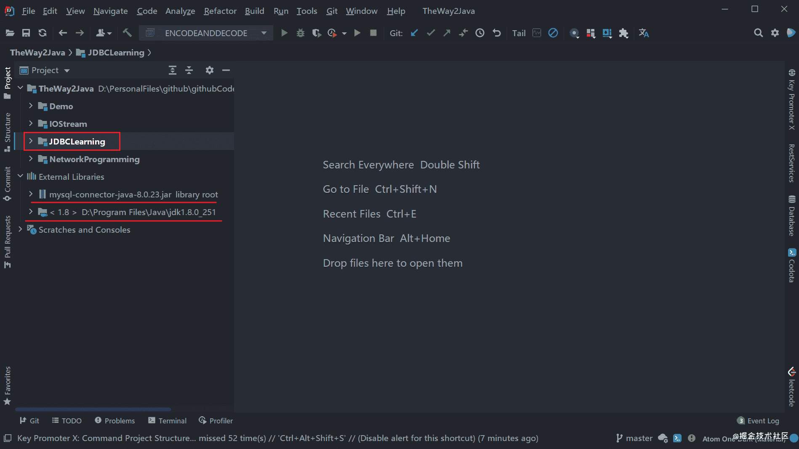
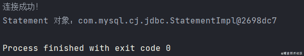
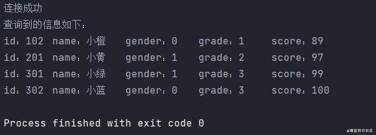
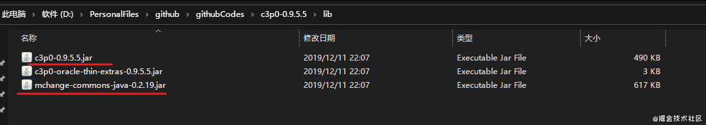
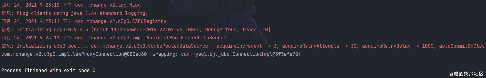

# JDBC 入门指南

::: info 共勉
不要哀求，学会争取。若是如此，终有所获。
:::
::: tip 原文
https://mp.weixin.qq.com/s/DOXFxk5dk9WBfAVK0UJUng
:::

## 前言

在我们日常使用的 APP 或网站中，往往需要存取数据，比如在微信中，需要存储我们的用户名、手机号、用户密码…… 等一系列信息。依靠之前所学习的 Java 相关知识已经无法满足这一需求。现在的应用程序中最基本、应用最广的也就是关系型数据库，如 MySQL。Java 语言中为了实现与关系型数据库的通信，制定了标准的访问接口，即 JDBC（Java Database Connectivity）。本文主要介绍在 Java 中使用 JDBC 的相关知识，主要内容如下：

- **JDBC 简介**
- **数据的增删改查**
- **事务**
- **连接池**

## JDBC 简介

JDBC（Java Database Connectivity），即 Java 数据库连接。是 Java 语言中用于规范客户端程序如何来访问数据库的应用程序接口，它是面向关系型数据库的，提供了查询和更新数据库中数据的方法。

本文以 MySQL 来演示如何使用 JDBC，所以需要事先在你的机器上准备好 MySQL，而且最好是懂一些 MySQL 的使用。

首先我们需要建立 MySQL 与 Java 程序间的联系，所以需要事先好 mysql-connector-java 这个第三方包，下载地址：https://downloads.mysql.com/archives/c-j/

### 导入驱动包

以在 IDEA 中导入 jar 包为例，当我们建立好项目后，导包过程如下：

1.  首先依次打开 `File -> Project Structure -> Modules -> Dependencies`；


2.  然后点击 `+` 号，选择 `1 JARs or Directories`，找到你下载好的 jar 包导入；


3.  导入成功，点击 `OK` 即可；




### 初始化并建立连接

导入我们的 jar 包之后，就需要进行初始化工作。新建一个类，用于初始化并连接。先将驱动类加载到 JVM 中，加载过程中会执行其中的静态初始化块，从而完成驱动的初始化工作。然后建立数据库与程序之间的连接，此时需要提供数据库的 IP 地址、端口号、数据库名、编码方式、用户名、用户密码等信息。

首先，我们在数据库中建立一个表 `student`，建表语句如下，用于后续实践。

```sql
-- 创建数据库 javalearning
CREATE DATABASE if not exists javalearning;
-- 创建表 students
USE javalearning;
CREATE TABLE students (
  id BIGINT AUTO_INCREMENT NOT NULL, -- 学号
  name VARCHAR(50) NOT NULL, -- 姓名
  gender TINYINT(1) NOT NULL, -- 性别
  grade INT NOT NULL, -- 年级
  score INT NOT NULL, -- 分数
  PRIMARY KEY(id) -- 主键
) Engine=INNODB DEFAULT CHARSET=UTF8;

-- 插入部分数据
INSERT INTO students (id, name, gender, grade, score) VALUES (101,'小红', 0, 1, 100);
INSERT INTO students (id, name, gender, grade, score) VALUES (102,'小橙', 0, 1, 89);
INSERT INTO students (id, name, gender, grade, score) VALUES (201,'小黄', 1, 2, 97);
INSERT INTO students (id, name, gender, grade, score) VALUES (301,'小绿', 1, 3, 99);
```


创建好数据库及表之后，我们就可以进行初始化和连接工作了，这里的步骤主要分为如下几步：

1.  首先需要加载驱动，主要是利用 `Class.forName()` 将驱动类加载到 JVM；
2.  建立程序和数据库之间的连接，主要是创建 `Connection` 对象；
3.  接着是创建用于执行 SQL 语句的 `Statement` 对象；
4.  最后则是关闭连接从而释放资源，先关闭 `Statement` ，再关闭 `Connection` ；

```java
import java.sql.Connection;
import java.sql.DriverManager;
import java.sql.SQLException;
import java.sql.Statement;

/**
 * @author : cunyu
 * @version : 1.0
 * @className : InitJDBC
 * @date : 2021/4/23 10:56
 * @description : 初始化并建立连接
 */

public class InitJDBC {
    public static void main(String[] args) {
        Connection connection = null;
        Statement statement = null;
        try {
//            初始化，注册驱动
            Class.forName("com.mysql.cj.jdbc.Driver");
//            建立连接
            connection = DriverManager.getConnection("jdbc:mysql://localhost/javalearning?characterEncoding=UTF-8", "root", "12345");
            System.out.println("连接成功！");
//            创建 Statement 用于执行 SQL 语句
            statement = connection.createStatement();
            System.out.println("Statement 对象：" + statement);
        } catch (ClassNotFoundException | SQLException e) {
            e.printStackTrace();
        } finally {
            try {
                if (statement != null) {
                    statement.close();
                }
            } catch (SQLException throwables) {
                throwables.printStackTrace();
            }
            try {

                if (connection != null) {
                    connection.close();
                }
            } catch (SQLException throwables) {
                throwables.printStackTrace();
            }
        }
    }
}
```



对于上述关闭 `Connection` 和 `Statement` 的方式，可能略显繁琐，为了进一步简化，可以使用 `try-with-source` 的方式自动关闭，简化后的代码如下；

```java
import java.sql.Connection;
import java.sql.DriverManager;
import java.sql.SQLException;
import java.sql.Statement;

/**
 * @author : cunyu
 * @version : 1.0
 * @className : InitJDBC2
 * @date : 2021/4/23 13:53
 * @description : 初始化与连接
 */

public class InitJDBC2 {
    public static void main(String[] args) {
        try {
            Class.forName("com.mysql.cj.jdbc.Driver");
        } catch (ClassNotFoundException e) {
            e.printStackTrace();
        }

        try (Connection connection = DriverManager.getConnection("jdbc:mysql://localhost:3306/javalearning?characterEncoding=UTF-8", "root", "12345"); Statement statement = connection.createStatement();) {
            System.out.println("连接成功");
            System.out.println("State 对象：" + statement);
        } catch (SQLException throwables) {
            throwables.printStackTrace();
        }
    }
}
```

## JDBC 增删改查

当我们初始化并建立 JDBC 连接之后，我们就可以对数据库进行 CRUD （增加、查询、更新、删除）等操作。

在正式开始 CRUD 前，我们最好先了解下 MySQL 中的数据类型在 Java 中所对应的数据类型，以便后续操作数据。一般来讲，两者中的数据类型对应关系如下表所示。

| SQL 中的数据类型   | 对应的 Java 数据类型          |
| ------------------ | ----------------------------- |
| `BIT`、`BOOL`      | `boolean`                     |
| `INTEGER`          | `int`                         |
| `BIGINT`           | `long`                        |
| `REAL`             | `float`                       |
| `FLOAT`、 `DOUBLE` | `double`                      |
| `CHAR`、 `VARCHAR` | `String`                      |
| `DECIMAL`          | `BigDecimal`                  |
| `DATE`             | `java.sql.Date`、`LocalDate`  |
| `TIME`             | `java.sql.Time`、 `LocalTime` |

此外，虽然我们在 JDBC 的简介部分在初始化和建立连接时使用的是用 `Statement` 来创建一个对象并用于后续操作，但是在实际使用过程中时，SQL 参数基本都是从方法参数传入的，这时使用 `Statement` 就十分容易引起 SQL 注入，为了解决这一问题，大牛们提出了如下两个办法：

1.  对字符串中的参数进行转义，然后利用转义后的参数来进行操作。但是转义十分麻烦，而且一使用 SQL，我们就必须增加转义代码。
2.  利用 `PreparedStatement`，它利用 `?` 作为占位符，将数据联通 SQL 本身传递给数据库，从而保证每次传给数据库的 SQL 语句都是保持一致的，每次变动的只是占位符中的数据不同。通过使用 `PreparedStatement`，我们就能够 **完全避免 SQL 注入 问题**。

针对后续利用 JDBC 操作数据库的过程，为了尽量避免 SQL 注入问题，我们优先采用 `PreparedStatement` 而非 `Statement`.

### 查询数据

首先，我们来进行查询操作。进行查询时，可以总结为如下几个步骤：

1.  通过创建一个 `Connection` 对象从而建立连接；
2.  然后利用 `prepareStatement()` 方法创建一个 `PreparedStatement` 对象并传入 SQL 语句，用于执行查询操作；
3.  接着执行 `PreparedStatement` 对象所提供的 `executeQuery()` 方法，获取查询结果并返回到一个 `ResultSet` 结果集中；
4.  最后则是利用 `ResultSet` 对象的 `next()` 方法去读取我们所查询返回的结果；

> 需要注意的地方：
>
> 1.  如果你不是利用 `try-with-source` 的方式，那么一定要记得在使用完连接之后记得释放资源；
> 2.  结果集 `ResultSet` 中，索引位置是从 `1` 开始的，而不是从 `0` 开始，这一点要特别注意！

```java
import java.sql.*;

/**
 * @author : cunyu
 * @version : 1.0
 * @className : QueryTest
 * @date : 2021/4/23 14:01
 * @description : 查询
 */

public class QueryTest {
    public static void main(String[] args) {
        try {
            Class.forName("com.mysql.cj.jdbc.Driver");
        } catch (ClassNotFoundException e) {
            e.printStackTrace();
        }

        String url = "jdbc:mysql://localhost:3306/javalearning?characterEncoding=UTF-8";
        String username = "root";
        String password = "0908";
        String queryString = "SELECT * FROM students";
        try (Connection connection = DriverManager.getConnection(url, username, password); PreparedStatement preparedStatement = connection.prepareStatement(queryString); ResultSet resultSet = preparedStatement.executeQuery();) {
            System.out.println("连接成功");

            System.out.println("查询到的信息如下：");
            while (resultSet.next()) {
//                查询到的结果索引从 1 开始
                System.out.println("id：" + resultSet.getLong(1) + "\tname：" + resultSet.getString(2) + "\tgender：" + resultSet.getInt(3) + "\tgrade：" + resultSet.getLong(4) + "\tscore：" + resultSet.getLong(5));
            }
        } catch (SQLException throwables) {
            throwables.printStackTrace();
        }
    }
}
```


### 增加数据

即插入一条新记录，和查询语句很像，但是区别在于最后 `PreparedStatement` 对象执行的不是 `executeQuery()`，而是 `executeUpdate()`. 插入记录的步骤总结如下：

1.  创建 `Connection` 对象从而建立连接；
2.  利用 `prepareStatement()` 方法创建一个 `PreparedStatement` 对象并传入 SQL 语句，用于执行插入操作；
3.  然后依次设置占位符所代表的值；
4.  执行 `PreparedStatement` 对象所提供的 `executeUpdate()` 方法，此时返回的是一个 `int` 类型的数，表示插入记录的条数；

```java
import java.sql.Connection;
import java.sql.DriverManager;
import java.sql.PreparedStatement;
import java.sql.SQLException;

/**
 * @author : cunyu
 * @version : 1.0
 * @className : InsertTest
 * @date : 2021/4/23 15:04
 * @description : 新增数据
 */

public class InsertTest {
    public static void main(String[] args) {
        try {
            Class.forName("com.mysql.cj.jdbc.Driver");
        } catch (ClassNotFoundException e) {
            e.printStackTrace();
        }

        String url = "jdbc:mysql://localhost:3306/javalearning?characterEncoding=UTF-8";
        String username = "root";
        String password = "110120";
        String insertString = "INSERT INTO students VALUES (?,?,?,?,?)";

        try (Connection connection = DriverManager.getConnection(url, username, password); PreparedStatement preparedStatement = connection.prepareStatement(insertString);) {
            System.out.println("连接成功");
            //            依次插入数据
            preparedStatement.setLong(1, 302);
            preparedStatement.setString(2, "小蓝");
            preparedStatement.setInt(3, 0);
            preparedStatement.setLong(4, 3);
            preparedStatement.setLong(5, 100);
            System.out.println("插入数据成功");
            preparedStatement.executeUpdate();
        } catch (SQLException throwables) {
            throwables.printStackTrace();
        }
    }
}
```

新增数据后，接着查询数据，得到如下结果，可以看到我们新插入的数据成功加入到了数据库中！


### 删除数据

删除数据和新增数据的方式基本一样，两者最大的区别在于 SQL 语句的不同，删除操作利用的是 `DELETE` 语句，能一次删除若干列。

```java
import java.sql.Connection;
import java.sql.DriverManager;
import java.sql.PreparedStatement;
import java.sql.SQLException;

/**
 * @author : cunyu
 * @version : 1.0
 * @className : DeleteTest
 * @date : 2021/4/23 15:23
 * @description : 删除数据
 */

public class DeleteTest {
    public static void main(String[] args) {
        try {
            Class.forName("com.mysql.cj.jdbc.Driver");
        } catch (ClassNotFoundException e) {
            e.printStackTrace();
        }

        String url = "jdbc:mysql://localhost:3306/javalearning?charactersetEncoding=UTF-8";
        String username = "root";
        String password = "0908";
        String deleteString = "DELETE FROM students WHERE id = ?";
        try (Connection connection = DriverManager.getConnection(url, username, password); PreparedStatement preparedStatement = connection.prepareStatement(deleteString);) {
            System.out.println("连接成功");
            preparedStatement.setLong(1, 101);
            preparedStatement.executeUpdate();
            System.out.println("删除成功");
        } catch (SQLException throwables) {
            throwables.printStackTrace();
        }
    }
}
```

删除数据后，接着查询数据，得到如下结果，可以看到 `id = 101` 的数据列已经被删除了，说明我们删除数据成功了！



### 修改数据

修改数据的方式同删除数据和新增数据基本一致，最大的区别在于 SQL 语句的不同，修改操作利用的是 `UPDATE` 语句，能一次更新若干列。

```java
import java.sql.Connection;
import java.sql.DriverManager;
import java.sql.PreparedStatement;
import java.sql.SQLException;

/**
 * @author : cunyu
 * @version : 1.0
 * @className : UpdateTest
 * @date : 2021/4/23 15:23
 * @description : 更新数据
 */

public class UpdateTest {
    public static void main(String[] args) {
        try {
            Class.forName("com.mysql.cj.jdbc.Driver");
        } catch (ClassNotFoundException e) {
            e.printStackTrace();
        }

        String url = "jdbc:mysql://localhost:3306/javalearning?charactersetEncoding=UTF-8";
        String username = "root";
        String password = "0908";
        String updateString = "UPDATE students SET name = ? WHERE id = ?";
        try (Connection connection = DriverManager.getConnection(url, username, password); PreparedStatement preparedStatement = connection.prepareStatement(updateString);) {
            System.out.println("连接成功");
            preparedStatement.setString(1, "村雨遥");
            preparedStatement.setLong(2, 201);
            preparedStatement.executeUpdate();
            System.out.println("更新成功");
        } catch (SQLException throwables) {
            throwables.printStackTrace();
        }
    }
}
```

修改数据后，接着查询数据，得到如下结果，可以看到 `id = 201` 对应的数据列中，`name` 从小黄变成了村雨遥，说明数据更新成功。


### 注意

当我们的数据库表设置自增主键后，在新增数据时无需指定主键也会自动更新。但是在获取自增主键的值时，不能先插入再查询，否则可能会导致冲突。要正确获取自增主键，需要在创建 `PreparedStatement` 时，指定一个标志位 `RETURN_GENERATED_KEYS`，用于表示 JDBC 驱动必须返回插入的自增主键。

假设我们创建表时，设置了自增长的键：

```sql
CREATE TABLE students(
	id int(11) AUTO_INCREMENT,
    …
);
```

此时无论是 `executeQuery()` 还是 `execureUpdate()` 都不会返回这个自增长的 `id`，所以需要在创建 `PreparedStatement` 对象时加入 `Statement.RETURN_GENERATED_KEYS` 参数以确保会返回自增长 ID，然后通过 `getGeneratedKeys` 获取该字段；

```java
import java.sql.*;

/**
 * @author : cunyu
 * @version : 1.0
 * @className : QueryTest
 * @date : 2021/4/23 18:01
 * @description : 自增主键查询
 */

public class QueryTest {
    public static void main(String[] args) {
        try {
            Class.forName("com.mysql.cj.jdbc.Driver");
        } catch (ClassNotFoundException e) {
            e.printStackTrace();
        }

        String url = "jdbc:mysql://localhost:3306/javalearning?characterEncoding=UTF-8";
        String username = "root";
        String password = "12345";
        String queryString = "INSET INTO students VALUES(null,?,……)";
        try (Connection connection = DriverManager.getConnection(url, username, password); PreparedStatement preparedStatement = connection.prepareStatement(queryString, Statement.RETURN_GENERATED_KEYS); ResultSet resultSet = preparedStatement.getGeneratedKeys();) {
            System.out.println("连接成功");
            preparedStatement.setString(1, "村雨遥");
            ……
            preparedStatement.executeUpdate();
            System.out.println("查询到的信息如下：");
            while (resultSet.next()) {
//                查询到的结果索引从 1 开始
                System.out.println("id：" + resultSet.getLong(1));
            }
        } catch (SQLException throwables) {
            throwables.printStackTrace();
        }
    }
}
```

### JDBC 工具类

观察上面的代码，我们可以注意到每次都需要注册驱动、传递参数，关闭连接等操作，为了提高工具通用性，我们利用配置文件来配置数据库相关信息，然后创建一个 JDBC 工具类来简化上述操作。

1.  首先在 `src` 目录下创建一个配置文件 `jdbc.properties`，并且填入数据库的相关信息；

```properties
url=jdbc:mysql://localhost/demo?characterEncoding=UTF-8
user=root
password="12345"
driver=com.mysql.jdbc.cj.Driver
```

2.  创建工具类

```java
import java.io.FileReader;
import java.io.IOException;
import java.net.URL;
import java.sql.*;
import java.util.Properties;

/**
 * @author : cunyu
 * @version : 1.0
 * @className : JDBCUtils
 * @date : 2021/4/24 15:10
 * @description : JDBC 工具类
 */

public class JDBCUtils {
    //    配置文件中的各个参数
    private static String url;
    private static String user;
    private static String password;
    private static String driver;

    //    静态代码块
    static {
        try {
//        读取配置文件并获取参数值
//        创建集合类
            Properties properties = new Properties();

//        获取配置文件所在位置
            ClassLoader classLoader = JDBCUtils.class.getClassLoader();
            URL resource = classLoader.getResource("jdbc.properties");
            String path = resource.getPath();
            System.out.println("配置文件所在位置");
//        加载配置文件
            properties.load(new FileReader(path));

//            获取参数的值并赋值
            url = properties.getProperty("url");
            user = properties.getProperty("user");
            password = properties.getProperty("password");
            driver = properties.getProperty("driver");

//            注册驱动
            Class.forName(driver);
        } catch (IOException | ClassNotFoundException e) {
            e.printStackTrace();
        }
    }

    /**
     * @param
     * @return 连接对象
     * @description 获取连接
     * @date 2021/4/24 15:24
     * @author cunyu1943
     * @version 1.0
     */
    public static Connection getConnection() {
        try {
            return DriverManager.getConnection(url, user, password);
        } catch (SQLException throwables) {
            throwables.printStackTrace();
        }
        return null;
    }

    /**
     * @param preparedStatement 预声明
     * @param connection        连接对象
     * @return
     * @description 关闭连接
     * @date 2021/4/24 15:27
     * @author cunyu1943
     * @version 1.0
     */
    public static void close(PreparedStatement preparedStatement, Connection connection) {
        if (preparedStatement != null) {
            try {
                preparedStatement.close();
            } catch (SQLException throwables) {
                throwables.printStackTrace();
            }
        }

        if (connection != null) {
            try {
                connection.close();
            } catch (SQLException throwables) {
                throwables.printStackTrace();
            }
        }
    }


    /**
     * @param resultSet         结果集
     * @param preparedStatement 预声明对象
     * @param connection        连接对象
     * @return
     * @description 关闭连接
     * @date 2021/4/24 15:28
     * @author cunyu1943
     * @version 1.0
     */
    public static void close(ResultSet resultSet, PreparedStatement preparedStatement, Connection connection) {
        if (resultSet != null) {
            try {
                resultSet.close();
            } catch (SQLException throwables) {
                throwables.printStackTrace();
            }
        }

        if (preparedStatement != null) {
            try {
                preparedStatement.close();
            } catch (SQLException throwables) {
                throwables.printStackTrace();
            }
        }

        if (connection != null) {
            try {
                connection.close();
            } catch (SQLException throwables) {
                throwables.printStackTrace();
            }
        }
    }
}
```

## JDBC 事务

### 事务 4 大特性

事务是一个不可分割的数据库操作序列，也是数据库并发控制的基本单位，其执行结果必须使数据库从一种一致性状态切换到另一中一致性状态。事务是逻辑上的一组操作，要么都执行，要么都不执行。事务能够在数据库提交工作时确保要么所有修改都保存，要么所有修改都不保存。**即事务是逻辑上的一组操作，要么都执行，要么都不执行**。

1.  **原子性（Atomicity）**

原子性是整个数据库事务中不可分割的工作单位，只有事务中的所有的数据库操作都执行成功，才代表整个事务成功，如果其中任一环节执行失败，那么就算已经执行成功的 SQL 语句也必须撤销，回滚到事务执行前的状态。即原子性能够保证 **动作要么全部完成，要么完全不起作用。** **即事务是最小的执行单位，不允许分割**。

2.  **一致性（Consistency）**

指事务将数据库从一种一致性状态变为另一种一致性状态。在事务开始前后，数据库的完整性约束未被破坏。**在事务执行前后，数据能够保持一致，多个事务对统一数据读取的结果相同**。

3.  **隔离性（Isolation）**

并发访问数据库时，隔离性要求每个读写事务对其他事务的操作对象能够相互分离，即一个用户的事务不被其他事务所干扰，各并发事务间数据库是独立的；

4.  **持久性（Durability）**

表示事务一旦被提交，其结果就是永久性的，它对数据库中数据的改变是持久的，即便数据库发生故障也不应该对其产生影响；

### 脏读、幻读 & 不可重复读

了解事务隔离级别之前，先来看看这几个读的概念：

1.  **脏读（Dirty Read）**

表示某一事务已经更新了一份数据，另一个事务在此时读取了同一份数据。当前一个事务撤销操作后，就会导致后一个事务所读取的数据不正确。

2.  **幻读（Phantom Read）**

在一个事务的两次查询中数据量不一致，假如有一个事务查询了几列数据，同时另一个事务中在此时查询了新的数据，则查询事务在后续查询中，就会发现数据比最开始的查询数据更丰富。

3.  **不可重复读（Non-repeatable Read）**

一个事务中两次查询数据不一致，有可能是因为两次查询过程中插入了一个更新原有数据的事务。

**注意：不可重复读和幻读的区别在于：**

> **不可重复读的重点在于修改，** 比如多次读取一条记录发现其中某些列的值被修改，而 **幻读的重点在于新增或删除**，比如多次读取一条记录发现记录增多或减少了。

### 隔离级别

SQL 标准定义了 4 个隔离级别，隔离级别从低到高分别是：

1.  **READ-UNCOMMITTED（读取未提交）**

最低的隔离级别，允许读取尚未提交的数据变更，**可能导致脏读、幻读或不可重复读**。

2.  **READ-COMMITTED（读取已提交）**

允许读取并发事务已经提交的数据，**能够阻止脏读，但可能导致幻读或不可重复读**。

3.  **REPEATABLE-READ（可重复读）**

对同一字段的多次读取结果时一致的，除非数据是被本身事务自己所修改，**能够阻止脏读和不可重复读，但可能导致幻读**。

4.  **SERIALIZABLE（可串行化）**

最高的隔离级别，完全服从 ACID 的隔离级别，所有事务依次逐个执行，这样事务之间就完全不可能产生干扰，**能够防止脏读、幻读以及不可重复读**。

以下是 SQL 隔离级别和各种读之间的关系：

| 隔离级别           | 脏读 | 不可重复读 | 幻读 |
| ------------------ | ---- | ---------- | ---- |
| `READ-UNCOMMITTED` | ✔    | ✔          | ✔    |
| `READ-COMMITTED`   | ❌    | ✔          | ✔    |
| `REPEATABLE-READ`  | ❌    | ❌          | ✔    |
| `SERIALIZABLE`     | ❌    | ❌          | ❌    |

### 实例

关于回滚，主要涉及 `Connection` 对象，常用的三个方法如下：

| 返回值 | 方法                                | 描述                                                                                            |
| ------ | ----------------------------------- | ----------------------------------------------------------------------------------------------- |
| `void` | `setAutoCommit(boolean autoCommit)` | 设定连接的自动提交模式，`true` 表示自动提交，`false` 表示手动提交                               |
| `void` | `commit()`                          | 使上次提交/回滚以来所做的所有更改成为永久更改，并释放此 `Connection` 对象当前持有的所有数据库锁 |
| `void` | `rollback()`                        | 撤销当前十五中所做的所有更改，并释放此 `Connection` 对象当前持有的所有数据库锁                  |

以下是一个回滚实例，我们当我们第一次插入一条数据时，由于是新数据，所以不会报错，但是如果我们执行一次程序之后再次执行，此时按理来说就会报错，因为插入的数据重复，这时候利用事务就可以十分方便的解决这个问题，我们设置插入出错就回滚到未出错之前的状态，这样就能保证插入数据不会报错了。

```java
import java.sql.Connection;
import java.sql.DriverManager;
import java.sql.PreparedStatement;
import java.sql.SQLException;

/**
 * @author : cunyu
 * @version : 1.0
 * @className : AffairTest
 * @date : 2021/4/23 22:35
 * @description : 事务
 */

public class AffairTest {
    public static void main(String[] args) {
        try {
            Class.forName("com.mysql.cj.jdbc.Driver");
        } catch (ClassNotFoundException e) {
            e.printStackTrace();
        }

        String url = "jdbc:mysql://localhost:3306/javalearning?characterEncoding=UTF-8";
        String username = "root";
        String password = "12345";
        String insertString = "INSERT INTO students VALUES (?,?,?,?,?)";
        Connection connection = null;
        PreparedStatement preparedStatement = null;

        try {
            connection = DriverManager.getConnection(url, username, password);
//            关闭自动提交
            connection.setAutoCommit(false);
            preparedStatement = connection.prepareStatement(insertString);
            System.out.println("连接成功");
//            依次插入数据
            preparedStatement.setLong(1, 401);
            preparedStatement.setString(2, "小紫");
            preparedStatement.setInt(3, 0);
            preparedStatement.setLong(4, 4);
            preparedStatement.setLong(5, 88);
            preparedStatement.executeUpdate();
//            如果没有出错，则提交事务
            connection.commit();
            System.out.println("插入数据成功");

        } catch (SQLException throwables) {
//            一旦出错，则回滚事务
            try {
                connection.rollback();
            } catch (SQLException e) {
                e.printStackTrace();
            }
        } finally {
//            最后关闭连接
            if (connection != null) {
                try {
                    connection.close();
                } catch (SQLException throwables) {
                    throwables.printStackTrace();
                }
            }
            if (preparedStatement != null) {
                try {
                    preparedStatement.close();
                } catch (SQLException throwables) {
                    throwables.printStackTrace();
                }
            }
        }
    }
}
```

除了上述回滚的方式外，JDBC 还支持设置保存点的方式，我们可以使用事务回滚到指定的保存点，主要涉及的方法如下：

- `setSavepoint(String savePointName)`：创建新的保存点，返回一个 `SavePoint` 对象；
- `rollback(String savePointName)`：回滚到指定保存点；

## 连接池

### 简介

当我们使用多线程时，每个线程如果都需要连接数据库来执行 SQL 语句，那么每个线程都得创建一个连接，然后在使用之后关闭。这个创建和关闭连接的过程是十分耗时的，一旦多线程并发时，就容易导致系统卡顿。针对这一问题，提出使用数据库连接池。数据库连接池，其实就相当于一个集合，是一个存放数据库连接的容器。当我们的系统初始化好之后，集合就被创建，集合中会申请一些连接对象，当用户来访问数据库时，从集合中获取连接对象，一旦用户访问完毕，就将连接对象返还给容器。

使用数据库连接池的优点：一来是节约资源，二来提高了用户访问的效率。

### 常用数据库连接池

#### C3P0

1.  导包

首先需要导包，先去下载 C3P0 对象的 jar 包，下载地址：https://sourceforge.net/projects/c3p0/，然后将其中的如下两个包导入；



2.  定义配置文件

创建 C3P0 对应的配置文件，注意：配置文件一般放在 `src` 路径下，而且文件的名称要必须为以下其中的一个：

- `c3p0.properties`
- `c3p0-config.xml`

```xml
<c3p0-config>
    <!-- 使用默认的配置读取连接池对象 -->
    <default-config>
        <!--  连接参数 -->
        <property name="driverClass">com.mysql.cj.jdbc.Driver</property>
        <property name="jdbcUrl">jdbc:mysql://localhost:3306/javalearning?characterEncoding=UTF-8</property>
        <property name="user">root</property>
        <property name="password">0908</property>

        <!-- 连接池参数 -->
        <!--    初始化申请的连接数-->
        <property name="initialPoolSize">5</property>
        <!--        最大连接数-->
        <property name="maxPoolSize">10</property>
        <!--      超时时间-->
        <property name="checkoutTimeout">3000</property>
    </default-config>
</c3p0-config>
```

3.  创建连接池对象

4.  获取连接对象

```java
import com.mchange.v2.c3p0.ComboPooledDataSource;

import javax.sql.DataSource;
import java.sql.Connection;
import java.sql.SQLException;

/**
 * @author : cunyu
 * @version : 1.0
 * @className : C3POTest
 * @date : 2021/4/24 16:01
 * @description : C3PO 连接池
 */

public class C3POTest {
    public static void main(String[] args) {
//        创建数据库连接池对象
        DataSource dataSource = new ComboPooledDataSource();
//        获取连接对象
        try {
            Connection connection = dataSource.getConnection();
            System.out.println(connection);
        } catch (SQLException throwables) {
            throwables.printStackTrace();
        }
    }
}
```



#### Druid

1.  导包

导入 Druid 的 jar 包，下载地址：https://repo1.maven.org/maven2/com/alibaba/druid/

2.  定义配置文件

配置文件名称无要求，但是后缀名为 `.properties`，而且可以存放在任意目录下；

```properties
driver=com.mysql.cj.jdbc.Driver
url=jdbc:mysql://localhost:3306/javalearning?characterEncoding=UTF-8
username=root
password=12345
initialSize=5
maxActive=10
maxWait=3000
```

3.  加载配置文件
4.  创建连接池对象
5.  获取连接对象

```java
import com.alibaba.druid.pool.DruidDataSourceFactory;

import javax.sql.DataSource;
import java.io.InputStream;
import java.sql.Connection;
import java.util.Properties;

/**
 * @author : cunyu
 * @version : 1.0
 * @className : DruidTest
 * @date : 2021/4/24 19:56
 * @description : Druid 连接池
 */

public class DruidTest {
    public static void main(String[] args) {
        try {
//            加载配置文件
            Properties properties = new Properties();
            InputStream resourceAsStream = DruidTest.class.getClassLoader().getResourceAsStream("druid.properties");
            properties.load(resourceAsStream);
//            获取连接池对象
            DataSource dataSource = DruidDataSourceFactory.createDataSource(properties);
//            获取连接
            Connection connection = dataSource.getConnection();
            System.out.println(connection);
        } catch (Exception e) {
            e.printStackTrace();
        }
    }
}
```


## 总结

今天的内容到此就结束了，老规矩，点赞关注走一波 🧐。

对于文中有错或遗漏的地方，还烦请各位大佬在评论区指出来。我是村雨遥，一个技术栈主要为 Java 的菜鸟程序员，关注我，一起学习成长吧！

**关注公众号，获取最新文章更新**

::: center

:::

## ⏳ 联系

想解锁更多知识？不妨关注我的微信公众号：**村雨遥（id：JavaPark）**。

扫一扫，探索另一个全新的世界。


<Share colorful />