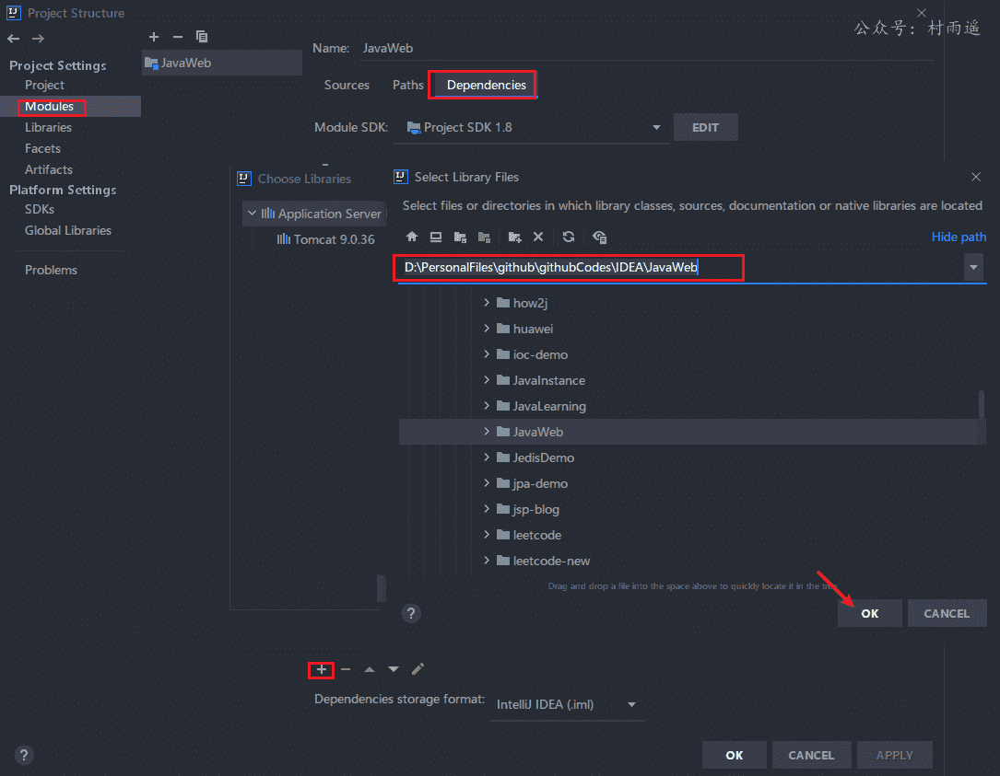
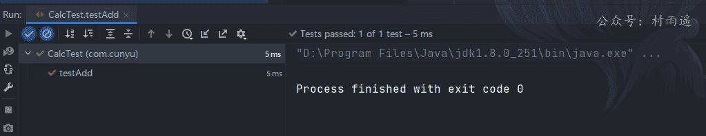
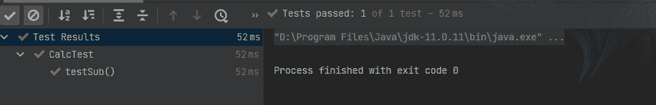
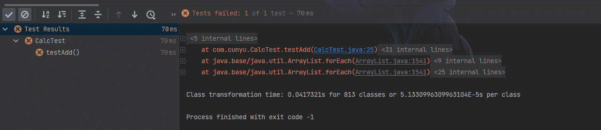
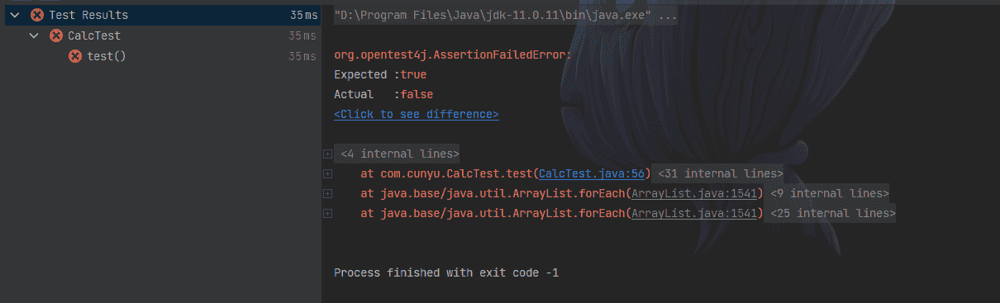

# 是时候拥抱 Junit 单元测试了

>
> 不要哀求，学会争取。若是如此，终有所获。
> 
::: tip 原文
https://mp.weixin.qq.com/s/_FWd0Bj3DlbCReex6pqJKQ

:::

## 🎈 号外

最近，公众号之外，建立了微信交流群，不定期会在群里分享各种资源（影视、IT 编程、考试提升……）&知识。如果有需要，可以**扫码或者后台添加小编微信备注入群**。进群后**优先看群公告**，**呼叫群中【资源分享小助手】**，还能免费帮找资源哦～

<center>
 
</center>

## 何为测试

在计算机领域中，所谓测试，描述的是一种用来鉴定软件正确性、完整性和质量的过程。而软件测试又一般可以分为黑盒测试和白盒测试，两者的相关定义如下。

### 黑盒测试

> 黑盒测试（`black-box testing`），也称黑箱测试，是软件测试方法，测试应用程序的功能，而不是其内部结构或运作。测试者不需具备应用程序的代码、内部结构和编程语言的专门知识。测试者只需知道什么是系统应该做的事，即当键入一个特定的输入，可得到一定的输出。测试案例是依应用系统应该做的功能，照规范、规格或要求等设计。测试者选择有效输入和无效输入来验证是否正确的输出。

黑盒测试方法可适合大部分的软件测试，例如集成测试（`integration testing`）以及系统测试（`system testing`）。

### 白盒测试

> 白盒测试（`white-box testing`），又称透明盒测试 `glass box testing`、结构测试 `structural testing` 等）是一个测试软件的方法，测试应用程序的内部结构或运作，而不是测试应用程序的功能（即黑盒测试）。在白盒测试时，以编程语言的角度来设计测试案例。测试者输入资料验证资料流在程序中的流动路径，并确定适当的输出，类似测试电路中的节点。

白盒测试可以应用于单元测试（`unit testing`）、集成测试（`integration testing`）和系统的软件测试流程，可测试在集成过程中每一单元之间的路径，或者主系统跟子系统中的测试。尽管这种测试的方法可以发现许多的错误或问题，它可能无法检测未使用部分的规范。

介绍一下黑白盒测试，主要是为了大家有一个概念，明白两者之间的区别，关于更多测试的内容，这里就不展开讲了，毕竟我们的重点是 JUnit。

## JUnit 简介

### 什么是 JUnit

> 官网：https://junit.org/

JUnit 是一个编写可重复测试的简单框架，是单元测试框架 xUnit 的一个实例，属于白盒测试。

针对 Java 语言而言，程序中最小的功能单元是方法，因此，对 Java 程序进行单元测试就是针对单个 Java 方法的测试。

在我们简单的小程序中，平常测试使用的方法是在主类中创建对象，然后调用对应方法。但是这样一来存在两个缺点：

1.  不能将测试代码和业务代码分离；
2.  未打印出测试结果和期望结果；

因此此时我们就需要一种新的测试框架来帮助我们编写测试，而 JUnit 则是专门针对 Java 而设计的一种标准单元测试框架。作为一个 Java 开发者，学习 JUnit 来进行测试是必备技能。

### 如何安装 JUnit

- **本地安装**

对于这种方法，我们只需要去下载 JUnit 最新的包，当前有 Junit4 和 Junit5 两个版本，可以根据自己的需要进行选择然后导入我们 IDE 的依赖文件即可，依赖文件下载地址如下：

> JUnit4：https://github.com/junit-team/junit4/releases/
>
> JUnit5：https://github.com/junit-team/junit5/releases/

以 IDEA 为例，依次打开 `File -> Project Structure -> Project Settings -> Modules -> Dependencies -> 点击 + -> Library... -> Java`，最后找到下载的 JUnit 文件即可；



- **Maven 安装**

当使用 Maven 之后，我们就能十分简单地安装 JUnit 了，只需要在项目的 `pom.xml` 配置文件中导入依赖即可；

```xml
<dependencies>
    <dependency>
        <groupId>junit</groupId>
        <artifactId>junit</artifactId>
        <version>4.13</version>
        <scope>test</scope>
    </dependency>
</dependencies>
```

### 使用 Junit 进行单元测试

首先我们需要有一个主类，然后基于该类来进行测试，这里我们以简单的运算器为例；

创建一个简易计算机类 `Calc`，然后包括加法 `add` 和减法 `sub` 两个方法；

```java
package com.cunyu;

/**
 * @author : cunyu
 * @version : 1.0
 * @className : Calc
 * @date : 2021/3/30 10:04
 * @description : 简易计算器
 */

public class Calc {
    /**
     * @param num1 加数
     * @param num2 加数
     * @return 两数之和
     * @description 加法
     * @date 2021/3/30 10:04
     * @author cunyu
     * @version 1.0
     */
    public int add(int num1, int num2) {
        return num1 + num2;
    }

    /**
     * @param num1 减数
     * @param num2 被减数
     * @return 两数之差
     * @description 两数之差
     * @date 2021/3/30 10:11
     * @author cunyu
     * @version 1.0
     */
    public int sub(int num1, int num2) {
        return num1 - num2;
    }
}
```

定义好上述主类之后，我们来进行测试，测试步骤如下；

1.  **定义测试类**

定义测试类时，我们推荐定义类名时就是 **主类 Test** 的形式，比如我们上面的类为 `Calc`，我们要对其进行测试，则测试类的类名为 `CalcTest`；

```java
package com.cunyu;

/**
 * @author : cunyu
 * @version : 1.0
 * @className : CalcTest
 * @date : 2021/3/30 10:15
 * @description : 简易计算器测试
 */

public class CalcTest {
}
```

2.  **定义测试方法**

测试类定义好之后，我们就可以定义测试方法了，而定义测试方法时，我们也有几点建议；

- 测试方法名是在主类方法名前加上 `test`，比如我们上边的方法为 `add`，则我们对应的测试方法名为 `testAdd`；
- 针对测试方法的返回值，因为我们只需要在方法内给出结果即可，不用再供其他人调用，所以建议返回值设置为 `void`；
- 针对测试方法的参数列表，由于我们主要还是针对传统建类调用方法测试的方法，所以此时最好是保持参数列表为空；

```java
package com.cunyu;

import org.junit.Assert;
import org.junit.Test;

/**
 * @author : cunyu
 * @version : 1.0
 * @className : CalcTest
 * @date : 2021/3/30 10:15
 * @description : 简易计算器测试
 */

public class CalcTest {

    @Test
    public void testAdd(){
        Calc calc = new Calc();
        int result = calc.add(1,5);
        Assert.assertEquals(6,result);
    }
}
```

其中，`@Test` 为注解，用来注释一个普通的方法为一条测试用例。`assertEquals` 方法用于断言两个值是否相等。

如果测试成功，则在 IDE 中会出现如下提示。



一般来讲，测试成功一般是绿色，而测试失败则是红色。

- 测试成功的界面



- 测试失败的界面



总结起来，我们针对一个方法的具体测试的步骤如下：

1.  首先是创建被测试类的对象；
2.  然后调用被测试的方法；
3.  最后加入断言，判断调用方法得到结果和实际的结果之间是否相同；

## JUnit 常用注解

由于现在主要用到的有 Junit4 和 Junit5 两个版本，而两者之间也是存在一些区别的，所以在这里给出两者中常用注解的一些差异。

下表中，给出了 Junit4 和 Junit5 中所共有功能的对应注解：

|  Junit4 注解  | Junit5 注解   | 说明                   |
| :-----------: | ------------- | :--------------------- |
|    `@Test`    | `@Test`       | 标识一条测试用例       |
|   `@Ignore`   | `@Disable`    | 忽略的测试用例         |
|   `@Before`   | `@BeforeEach` | 每一个测试方法之前运行 |
|   `@After`    | `@AfterEach`  | 每一个测试方法之后运行 |
| `@BefreClass` | `@BeforeAll`  | 所有测试开始之前运行   |
| `@AfterClass` | `@AfterAll`   | 所有测试结果之后运行   |
|  `@Category`  | `@Tag`        | 标记和过滤             |

而相对于 Junit4，Junit5 也有做出升级，其特有的一些注解如下：

| 注解           | 说明                 |
| -------------- | -------------------- |
| `@TestFactory` | 测试工厂进行动态测试 |
| `@Nested`      | 嵌套测试             |
| `@ExtendWith`  | 注册自定义扩展       |

## 常用断言方法

而在测试中，我们经常用到断言方法。这些断言方法都来自于由继承了 `java.lang.Object` 的 `Assert` 类，用于提供编写测试。

| 方法                                                                    | 说明                                                       |
| :---------------------------------------------------------------------- | :--------------------------------------------------------- |
| `void assertArrayEquals([String message],expected array, result array)` | 断言预期数组和结果数组相等                                 |
| `void assertEquals([String message],expected value, actual value)`      | 断言两个值是否相等。类似于字符串比较使用的 `equals()` 方法 |
| `void assertNotEquals(String message], first, second)`                  | 查看两个对象是否不相等                                     |
| `void assertNull(String message], object)`                              | 查看对象是否为空                                           |
| `void assertNotNull(String message], object)`                           | 查看对象是否不为空                                         |
| `void assertSame(String message], expected, actual)`                    | 查看两个对象的引用是否相等。类似于使用 `==` 比较两个对象   |
| `void assertNotSame(String message], unexpected, actual)`               | 查看两个对象的引用是否不相等。类似于使用 `!=` 比较两个对象 |
| `void assertTrue(String message], boolean condition)`                   | 查看运行结果是否为 `true`                                  |
| `void assertFalse([String message], boolean condition)`                 | 查看运行结果是否为 `false`                                 |
| `void assertThat([String message], actual, matcher)`                    | 查看实际值是否满足指定的条件                               |
| `fail()`                                                                | 让测试失败                                                 |

```java
package com.cunyu;

import org.junit.jupiter.api.AfterEach;
import org.junit.jupiter.api.BeforeEach;
import org.junit.jupiter.api.Test;

import static org.junit.jupiter.api.Assertions.*;

public class CalcTest {

    @Test
    public void test() {
        String str1 = "村雨遥";
        String str2 = "村雨遥";
        String str3 = "1943";
        String str4 = "1943";
        String str5 = null;
        int num1 = 1;
        int num2 = 2;
        int[] arr1 = {1, 2, 3};
        int[] arr2 = {1, 2, 3};

        assertEquals(str1, str2);

        assertSame(str3, str4);

        assertNotSame(str2, str4);

        assertNotNull(str1);

        assertNull(str5);

        assertTrue(num1 == num2);

        assertArrayEquals(arr1, arr2);
    }
}

```



## 总结

好了，以上就是有关单元测试 Junit 的简单使用指南了。虽说大家现在还是有很多人在使用 Junit4，但如果你之前并未接触过 Junit，个人建议那就直接学习 Junit5 吧。当然了，Junit4 了解也是很有必要的，毕竟技多不压身，多一份技能少求人嘛。

**关注公众号，获取最新文章更新**

## ⏳ 联系

想解锁更多知识？不妨关注我的微信公众号：**村雨遥（id：JavaPark）**。

扫一扫，探索另一个全新的世界。

<center>

</center>