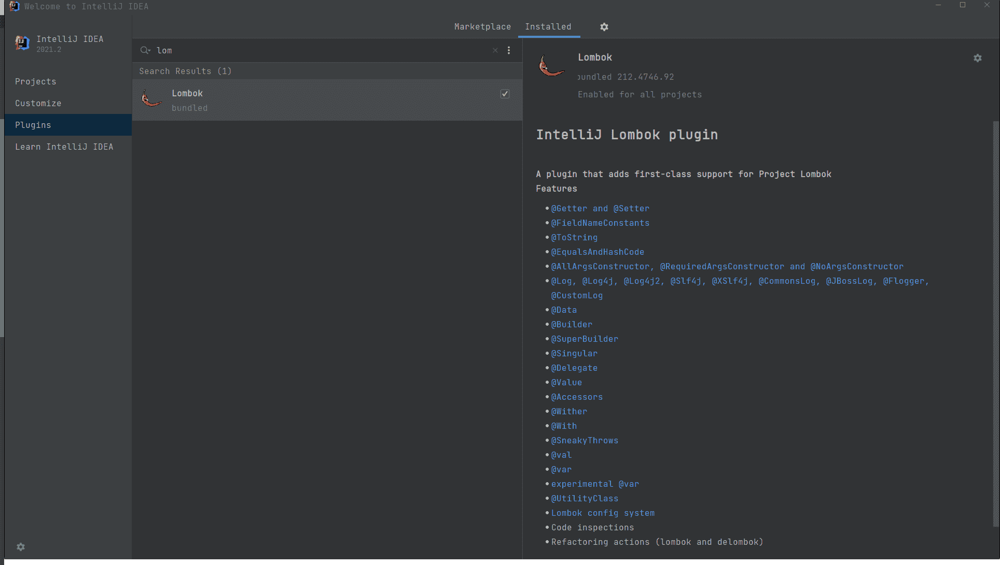
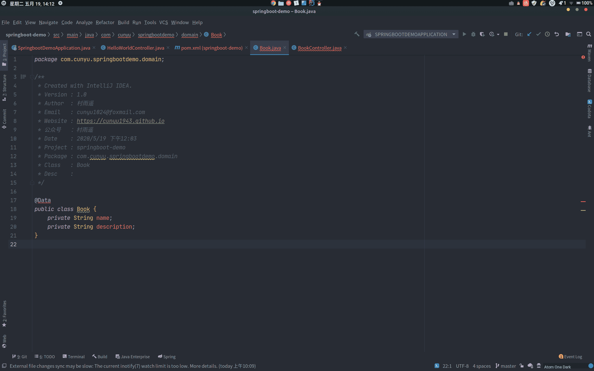

# Lombok 安装及使用指南

::: info 共勉
不要哀求，学会争取。若是如此，终有所获。
:::
::: tip 原文
https://mp.weixin.qq.com/s/t4h5VRfbYqNIRZVlMaqPEg

:::

## 简介

为了减少写一些 `get/set/toString` 方法，让项目代码更加整洁，提高开发效率，发现大家都开始采用 Lombok 这个工具。Lombok 是一个 Java 类库，它会自动插入编辑器和构建工具，用于帮助开发人员消除 Java 中冗长样板代码。而我们开发人员所要做的，仅仅是添加几个 Lombok 中的注解，就可以替换掉原来的多行 `get/set/toString` 方法代码，既简洁也易于维护。下面我们就来看看，如何安装并使用这一工具。

## 安装 Lombok

日常开发中，相信大多数人现在使用的都是 IDEA 这个 Java 神器了，如果你还在使用 Eclipse 或者 MyEclipse 等工具，那强烈推荐你去体验一把 IDEA，相信你一用上它就会爱上它的强大！下面我就以在 IDEA 中使用 Lombok 为例，看看如何安装并使用它。

在先前 IDEA 的版本中，Lombok 是需要通过插件来安装的，安装方法如下：依次进入`File -> Settings -> Plugins`，然后搜索 Lombok ，最后进行安装即可。而在新版本的 IDEA 中，Lombok 已经被集成到 IDEA 中，我们不用再去安装它就可以直接使用，可以说是十分方便了。

- 老版本 IDEA 安装 Lombok


- 新版本中集成了 Lombok



以上就是 Lombok 的安装过程了，是不是十分简单？那接下来我们就来看看，如何在我们的项目中使用 Lombok！

## Lombok 使用

现在大家进行项目管理时用的工具大多应该都是 Maven，所以我们直接在需要使用 Lombok 的项目中加入 Lombok 编译支持，也就是在 `pom.xml` 文件中加入以下依赖。

```xml
<dependency>
    <groupId>org.projectlombok</groupId>
    <artifactId>lombok</artifactId>
</dependency>
```

导入相关依赖之后，接下来就是具体使用过程了。

### 具体使用

在需要的实体类中引入相关注解即可，只不过注解不同它们所对应的功能也不同，而且同一个注解可能在不同位置的功能也不一样。如下图；



### 常用注解

#### @Data

注解在 **类** 上：给类的所有属性提供 `get` 和 `set` 方法，此外还有 `equals、canEqual、hashCode、toString` 方法以及 **默认参数为空的构造方法**；

- **使用前**

```java
package com.cunyu.user.entity;

public class User {
    private Long id;
    private String name;
    private Integer age;
    private String email;

    public User() {
    }

    public Long getId() {
        return this.id;
    }

    public String getName() {
        return this.name;
    }

    public Integer getAge() {
        return this.age;
    }

    public String getEmail() {
        return this.email;
    }

    public void setId(final Long id) {
        this.id = id;
    }

    public void setName(final String name) {
        this.name = name;
    }

    public void setAge(final Integer age) {
        this.age = age;
    }

    public void setEmail(final String email) {
        this.email = email;
    }

    public boolean equals(final Object o) {
        if (o == this) {
            return true;
        } else if (!(o instanceof User)) {
            return false;
        } else {
            User other = (User)o;
            if (!other.canEqual(this)) {
                return false;
            } else {
                label59: {
                    Object this$id = this.getId();
                    Object other$id = other.getId();
                    if (this$id == null) {
                        if (other$id == null) {
                            break label59;
                        }
                    } else if (this$id.equals(other$id)) {
                        break label59;
                    }

                    return false;
                }

                Object this$age = this.getAge();
                Object other$age = other.getAge();
                if (this$age == null) {
                    if (other$age != null) {
                        return false;
                    }
                } else if (!this$age.equals(other$age)) {
                    return false;
                }

                Object this$name = this.getName();
                Object other$name = other.getName();
                if (this$name == null) {
                    if (other$name != null) {
                        return false;
                    }
                } else if (!this$name.equals(other$name)) {
                    return false;
                }

                Object this$email = this.getEmail();
                Object other$email = other.getEmail();
                if (this$email == null) {
                    if (other$email != null) {
                        return false;
                    }
                } else if (!this$email.equals(other$email)) {
                    return false;
                }

                return true;
            }
        }
    }

    protected boolean canEqual(final Object other) {
        return other instanceof User;
    }

    public int hashCode() {
        int PRIME = true;
        int result = 1;
        Object $id = this.getId();
        int result = result * 59 + ($id == null ? 43 : $id.hashCode());
        Object $age = this.getAge();
        result = result * 59 + ($age == null ? 43 : $age.hashCode());
        Object $name = this.getName();
        result = result * 59 + ($name == null ? 43 : $name.hashCode());
        Object $email = this.getEmail();
        result = result * 59 + ($email == null ? 43 : $email.hashCode());
        return result;
    }

    public String toString() {
        Long var10000 = this.getId();
        return "User(id=" + var10000 + ", name=" + this.getName() + ", age=" + this.getAge() + ", email=" + this.getEmail() + ")";
    }
}
```

- **使用后**

```java
package com.cunyu.user.entity;

import lombok.Data;

/**
 * Created with IntelliJ IDEA.
 *
 * @author : zhangliang
 * @version : 1.0
 * @project : User
 * @package : com.cunyu.user.entity
 * @className : User
 * @createTime : 2021/8/6 17:14
 * @description : 用户实体类
 */

@Data
public class User {
    private Long id;
    private String name;
    private Integer age;
    private String email;
}
```

#### @Setter

注解在 **类** 上：为该类所有属性均提供 `set` 方法，同时提供 **默认构造方法**；

- **使用前**

```java
package com.cunyu.user.entity;

public class User {
    private Long id;
    private String name;
    private Integer age;
    private String email;

    public User() {
    }

    public void setId(final Long id) {
        this.id = id;
    }

    public void setName(final String name) {
        this.name = name;
    }

    public void setAge(final Integer age) {
        this.age = age;
    }

    public void setEmail(final String email) {
        this.email = email;
    }
}
```

- **使用后**

```java
package com.cunyu.user.entity;

import lombok.Setter;

/**
 * Created with IntelliJ IDEA.
 *
 * @author : zhangliang
 * @version : 1.0
 * @project : User
 * @package : com.cunyu.user.entity
 * @className : User
 * @createTime : 2021/8/6 17:14
 * @description : 用户实体类
 */

@Setter
public class User {
    private Long id;
    private String name;
    private Integer age;
    private String email;
}
```

注解在 **属性** 上：为该属性提供 `set` 方法，同时提供 **默认构造方法**；

- **使用前**

```java
package com.cunyu.user.entity;

public class User {
    private Long id;
    private String name;
    private Integer age;
    private String email;

    public User() {
    }

    public void setId(final Long id) {
        this.id = id;
    }
}
```

- **使用后**

```java
package com.cunyu.user.entity;

import lombok.Setter;

/**
 * Created with IntelliJ IDEA.
 *
 * @author : zhangliang
 * @version : 1.0
 * @project : User
 * @package : com.cunyu.user.entity
 * @className : User
 * @createTime : 2021/8/6 17:14
 * @description : 用户实体类
 */

public class User {
    @Setter
    private Long id;
    private String name;
    private Integer age;
    private String email;
}
```

#### @Getter

注解在 **类** 上：为该类所有属性均提供 `get` 方法，同时提供 **默认构造方法**；

- **使用前**

```java
package com.cunyu.user.entity;

public class User {
    private Long id;
    private String name;
    private Integer age;
    private String email;

    public User() {
    }

    public Long getId() {
        return this.id;
    }

    public String getName() {
        return this.name;
    }

    public Integer getAge() {
        return this.age;
    }

    public String getEmail() {
        return this.email;
    }
}
```

- **使用后**

```java
package com.cunyu.user.entity;

import lombok.Getter;

/**
 * Created with IntelliJ IDEA.
 *
 * @author : zhangliang
 * @version : 1.0
 * @project : User
 * @package : com.cunyu.user.entity
 * @className : User
 * @createTime : 2021/8/6 17:14
 * @description : 用户实体类
 */

@Getter
public class User {
    private Long id;
    private String name;
    private Integer age;
    private String email;
}
```

注解在 **属性** 上：为该属性提供 `get` 方法，同时提供 **默认构造方法**；

- **使用前**

```java
package com.cunyu.user.entity;

public class User {
    private Long id;
    private String name;
    private Integer age;
    private String email;

    public User() {
    }

    public Long getId() {
        return this.id;
    }
}
```

- **使用后**

```java
package com.cunyu.user.entity;

import lombok.Getter;

/**
 * Created with IntelliJ IDEA.
 *
 * @author : zhangliang
 * @version : 1.0
 * @project : User
 * @package : com.cunyu.user.entity
 * @className : User
 * @createTime : 2021/8/6 17:14
 * @description : 用户实体类
 */

public class User {
    @Getter
    private Long id;
    private String name;
    private Integer age;
    private String email;
}
```

#### @ToString

注解在 **类** 上：生成所有参数的 `toString()` 方法，同时提供 **默认构造方法**；

- **使用前**

```java
package com.cunyu.user.entity;

public class User {
    private Long id;
    private String name;
    private Integer age;
    private String email;

    public User() {
    }

    public String toString() {
        return "User(id=" + this.id + ", name=" + this.name + ", age=" + this.age + ", email=" + this.email + ")";
    }
}
```

- **使用后**

```java
package com.cunyu.user.entity;

import lombok.ToString;

/**
 * Created with IntelliJ IDEA.
 *
 * @author : zhangliang
 * @version : 1.0
 * @project : User
 * @package : com.cunyu.user.entity
 * @className : User
 * @createTime : 2021/8/6 17:14
 * @description : 用户实体类
 */

@ToString
public class User {
    private Long id;
    private String name;
    private Integer age;
    private String email;
}
```

#### @Value

注解在 **类** 上：生成 `get` 方法，以及 `equals、hashCode、toString` 方法，同时提供 **含所有参数的构造方法**；

- **使用前**

```java
package com.cunyu.user.entity;

public final class User {
    private final Long id;
    private final String name;
    private final Integer age;
    private final String email;

    public User(final Long id, final String name, final Integer age, final String email) {
        this.id = id;
        this.name = name;
        this.age = age;
        this.email = email;
    }

    public Long getId() {
        return this.id;
    }

    public String getName() {
        return this.name;
    }

    public Integer getAge() {
        return this.age;
    }

    public String getEmail() {
        return this.email;
    }

    public boolean equals(final Object o) {
        if (o == this) {
            return true;
        } else if (!(o instanceof User)) {
            return false;
        } else {
            User other;
            label56: {
                other = (User)o;
                Object this$id = this.getId();
                Object other$id = other.getId();
                if (this$id == null) {
                    if (other$id == null) {
                        break label56;
                    }
                } else if (this$id.equals(other$id)) {
                    break label56;
                }

                return false;
            }

            label49: {
                Object this$age = this.getAge();
                Object other$age = other.getAge();
                if (this$age == null) {
                    if (other$age == null) {
                        break label49;
                    }
                } else if (this$age.equals(other$age)) {
                    break label49;
                }

                return false;
            }

            Object this$name = this.getName();
            Object other$name = other.getName();
            if (this$name == null) {
                if (other$name != null) {
                    return false;
                }
            } else if (!this$name.equals(other$name)) {
                return false;
            }

            Object this$email = this.getEmail();
            Object other$email = other.getEmail();
            if (this$email == null) {
                if (other$email != null) {
                    return false;
                }
            } else if (!this$email.equals(other$email)) {
                return false;
            }

            return true;
        }
    }

    public int hashCode() {
        int PRIME = true;
        int result = 1;
        Object $id = this.getId();
        int result = result * 59 + ($id == null ? 43 : $id.hashCode());
        Object $age = this.getAge();
        result = result * 59 + ($age == null ? 43 : $age.hashCode());
        Object $name = this.getName();
        result = result * 59 + ($name == null ? 43 : $name.hashCode());
        Object $email = this.getEmail();
        result = result * 59 + ($email == null ? 43 : $email.hashCode());
        return result;
    }

    public String toString() {
        Long var10000 = this.getId();
        return "User(id=" + var10000 + ", name=" + this.getName() + ", age=" + this.getAge() + ", email=" + this.getEmail() + ")";
    }
}
```

- **使用后**

```java
package com.cunyu.user.entity;

import lombok.Value;

/**
 * Created with IntelliJ IDEA.
 *
 * @author : zhangliang
 * @version : 1.0
 * @project : User
 * @package : com.cunyu.user.entity
 * @className : User
 * @createTime : 2021/8/6 17:14
 * @description : 用户实体类
 */

@Value
public class User {
    private Long id;
    private String name;
    private Integer age;
    private String email;
}
```

#### @AllArgsConstructor

注解在 **类** 上：为类提供一个 **全参构造方法**，但此时不再提供默认构造方法；

- **使用前**

```java
package com.cunyu.user.entity;

public class User {
    private Long id;
    private String name;
    private Integer age;
    private String email;

    public User(final Long id, final String name, final Integer age, final String email) {
        this.id = id;
        this.name = name;
        this.age = age;
        this.email = email;
    }
}
```

- **使用后**

```java
package com.cunyu.user.entity;

import lombok.AllArgsConstructor;

/**
 * Created with IntelliJ IDEA.
 *
 * @author : zhangliang
 * @version : 1.0
 * @project : User
 * @package : com.cunyu.user.entity
 * @className : User
 * @createTime : 2021/8/6 17:14
 * @description : 用户实体类
 */

@AllArgsConstructor
public class User {
    private Long id;
    private String name;
    private Integer age;
    private String email;
}
```

#### @NoArgsConstructor

注解在 **类** 上：为类提供一个 **无参构造方法**；

- **使用前**

```java
package com.cunyu.user.entity;

public class User {
    private Long id;
    private String name;
    private Integer age;
    private String email;

    public User() {
    }
}
```

- **使用后**

```java
package com.cunyu.user.entity;

import lombok.NoArgsConstructor;

/**
 * Created with IntelliJ IDEA.
 *
 * @author : zhangliang
 * @version : 1.0
 * @project : User
 * @package : com.cunyu.user.entity
 * @className : User
 * @createTime : 2021/8/6 17:14
 * @description : 用户实体类
 */

@NoArgsConstructor
public class User {
    private Long id;
    private String name;
    private Integer age;
    private String email;
}
```

#### @RequiredArgsConstructor

注解在 **类** 上：使用类中所有带 `@NonNull` 注解的或带有 `final` 修饰的成员变量生成对应构造方法；

- **使用前**

```java
package com.cunyu.user.entity;

import lombok.NonNull;

public class User {
    @NonNull
    private Long id;
    private String name;
    private Integer age;
    @NonNull
    private String email;

    public User(@NonNull final Long id, @NonNull final String email) {
        if (id == null) {
            throw new NullPointerException("id is marked non-null but is null");
        } else if (email == null) {
            throw new NullPointerException("email is marked non-null but is null");
        } else {
            this.id = id;
            this.email = email;
        }
    }
}
```

- **使用后**

```java
package com.cunyu.user.entity;

import lombok.RequiredArgsConstructor;

/**
 * Created with IntelliJ IDEA.
 *
 * @author : zhangliang
 * @version : 1.0
 * @project : User
 * @package : com.cunyu.user.entity
 * @className : User
 * @createTime : 2021/8/6 17:14
 * @description : 用户实体类
 */

@RequiredArgsConstructor
public class User {
    @NonNull
    private Long id;
    private String name;
    private Integer age;
    @NonNull
    private String email;
}
```

#### @NonNull

注解在 **属性** 上，自动生成一个关于该参数的非空检查，若参数为 `null`，则抛出一个空指针异常，同时提供 **默认构造方法**，具体用法可以参照上面的例子；

#### @EqualsAndHashCode

注解在 **类** 上，生成 `equals、canEquals、hasnCode` 方法，同时会生成默认构造方法；

- **使用前**

```java
//
// Source code recreated from a .class file by IntelliJ IDEA
// (powered by FernFlower decompiler)
//

package com.cunyu.user.entity;

public class User {
    private Long id;
    private String name;
    private Integer age;
    private String email;

    public User() {
    }

    public boolean equals(final Object o) {
        if (o == this) {
            return true;
        } else if (!(o instanceof User)) {
            return false;
        } else {
            User other = (User)o;
            if (!other.canEqual(this)) {
                return false;
            } else {
                label59: {
                    Object this$id = this.id;
                    Object other$id = other.id;
                    if (this$id == null) {
                        if (other$id == null) {
                            break label59;
                        }
                    } else if (this$id.equals(other$id)) {
                        break label59;
                    }

                    return false;
                }

                Object this$age = this.age;
                Object other$age = other.age;
                if (this$age == null) {
                    if (other$age != null) {
                        return false;
                    }
                } else if (!this$age.equals(other$age)) {
                    return false;
                }

                Object this$name = this.name;
                Object other$name = other.name;
                if (this$name == null) {
                    if (other$name != null) {
                        return false;
                    }
                } else if (!this$name.equals(other$name)) {
                    return false;
                }

                Object this$email = this.email;
                Object other$email = other.email;
                if (this$email == null) {
                    if (other$email != null) {
                        return false;
                    }
                } else if (!this$email.equals(other$email)) {
                    return false;
                }

                return true;
            }
        }
    }

    protected boolean canEqual(final Object other) {
        return other instanceof User;
    }

    public int hashCode() {
        int PRIME = true;
        int result = 1;
        Object $id = this.id;
        int result = result * 59 + ($id == null ? 43 : $id.hashCode());
        Object $age = this.age;
        result = result * 59 + ($age == null ? 43 : $age.hashCode());
        Object $name = this.name;
        result = result * 59 + ($name == null ? 43 : $name.hashCode());
        Object $email = this.email;
        result = result * 59 + ($email == null ? 43 : $email.hashCode());
        return result;
    }
}
```

- **使用后**

```java
package com.cunyu.user.entity;

import lombok.EqualsAndHashCode;

/**
 * Created with IntelliJ IDEA.
 *
 * @author : zhangliang
 * @version : 1.0
 * @project : User
 * @package : com.cunyu.user.entity
 * @className : User
 * @createTime : 2021/8/6 17:14
 * @description : 用户实体类
 */

@EqualsAndHashCode
public class User {
    private Long id;
    private String name;
    private Integer age;
    private String email;
}
```

#### @Cleanup

注解在 **局部变量** 前，保证该变量代表的资源使用后自动关闭，默认调用资源的 `close()` 方法，若该资源有其它关闭方法，可用 `@Cleanup("方法名")` 来指定要调用的方法，同时提供 默认构造方法；

- **使用前**

```java
import java.io.*;

public class CleanupExample {
    public static void main(String[] args) throws IOException {
        InputStream in = new FileInputStream(args[0]);
        try {
            OutputStream out = new FileOutputStream(args[1]);
            try {
                byte[] b = new byte[10000];
                while (true) {
                    int r = in.read(b);
                    if (r == -1) break;
                    out.write(b, 0, r);
                }
            } finally {
                if (out != null) {
                    out.close();
                }
            }
        } finally {
            if (in != null) {
                in.close();
            }
        }
    }
}
```

- **使用后**

```java
import lombok.Cleanup;
import java.io.*;

public class CleanupExample {
    public static void main(String[] args) throws IOException {
        @Cleanup InputStream in = new FileInputStream(args[0]);
        @Cleanup OutputStream out = new FileOutputStream(args[1]);
        byte[] b = new byte[10000];
        while (true) {
            int r = in.read(b);
            if (r == -1) break;
            out.write(b, 0, r);
        }
    }
}
```

#### @Synchronized

注解在 **类方法 或 实例方法**：效果与 `synchronized` 关键字相同，区别在于锁对象不同，对于类方法和实例方法，`synchronized` 关键字的锁对象分别是 **类的** `**class**` **对象和** `**this**` **对象**，而 `@Synchronized` 的锁对象分别是 **私有静态** `**final**` **对象** `**lock**` **和 私有** `**final**` **对象** `**lock**`，也可以自己指定锁对象，同时提供默认构造方法；

- **使用前**

```java
public class SynchronizedExample {
    private static final Object $LOCK = new Object[0];
    private final Object $lock = new Object[0];
    private final Object readLock = new Object();

    public static void hello() {
        synchronized($LOCK) {
            System.out.println("world");
        }
    }

    public int answerToLife() {
        synchronized($lock) {
            return 42;
        }
    }

    public void foo() {
        synchronized(readLock) {
            System.out.println("bar");
        }
    }
}
```

- **使用后**

```java
import lombok.Synchronized;

public class SynchronizedExample {
    private final Object readLock = new Object();

    @Synchronized
    public static void hello() {
        System.out.println("world");
    }

    @Synchronized
    public int answerToLife() {
        return 42;
    }

    @Synchronized("readLock")
    public void foo() {
        System.out.println("bar");
    }
}
```

#### @SneakyThrows

注解在 **方法** 上：将方法中的代码用 `try-catch` 语句包裹，捕获异常并在 `catch` 中用 `Lombok.sneakyThrow(e)` 将异常抛出，还可以用 `@SneakyThrows(Exception.class)` 的形式指定抛出异常类型，同时提供 **默认构造方法**；

- **使用前**

```java
import lombok.Lombok;

public class SneakyThrowsExample implements Runnable {
    public String utf8ToString(byte[] bytes) {
        try {
            return new String(bytes, "UTF-8");
        } catch (UnsupportedEncodingException e) {
            throw Lombok.sneakyThrow(e);
        }
    }

    public void run() {
        try {
            throw new Throwable();
        } catch (Throwable t) {
            throw Lombok.sneakyThrow(t);
        }
    }
}
```

- **使用后**

```java
import lombok.SneakyThrows;

public class SneakyThrowsExample implements Runnable {
    @SneakyThrows(UnsupportedEncodingException.class)
    public String utf8ToString(byte[] bytes) {
        return new String(bytes, "UTF-8");
    }

    @SneakyThrows
    public void run() {
        throw new Throwable();
    }
}
```

#### @Log

注解在 **类** 上：主要用于我们记录日志信息，同时提供 **默认构造方法**。它封装了多个主流 `Log` 库，主要有如下几个；

- `@Log`
- `@Slf4j`

- `Log4j`
- `Log4j2`

## 总结

以上就是关于 Lombok 的相关使用小技巧了，如果你还没有使用过它，那就赶紧去试试吧！

最后，创作不易，如果你觉得我的文章对你有所帮助，那就来个一键三连吧！

## 参考资料

1.  https://projectlombok.org/features/all

**关注公众号，获取最新文章更新**

## ⏳ 联系

想解锁更多知识？不妨关注我的微信公众号：**村雨遥（id：JavaPark）**。

扫一扫，探索另一个全新的世界。


<Share colorful />