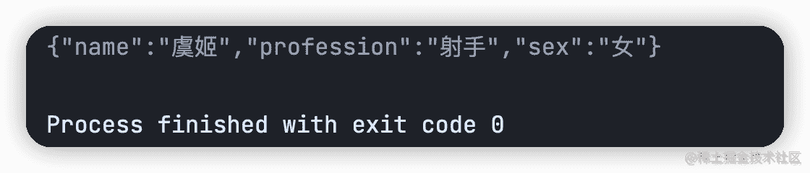
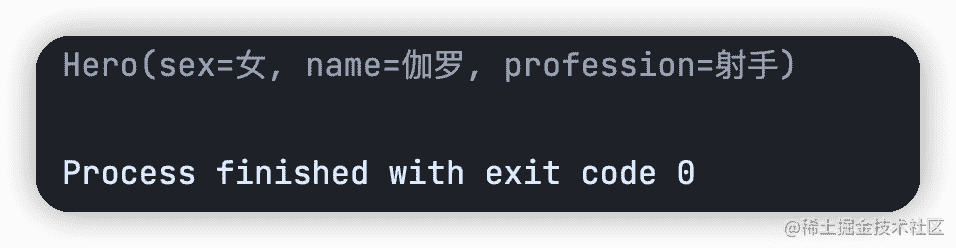
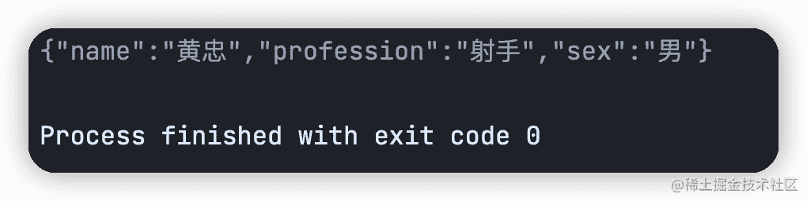
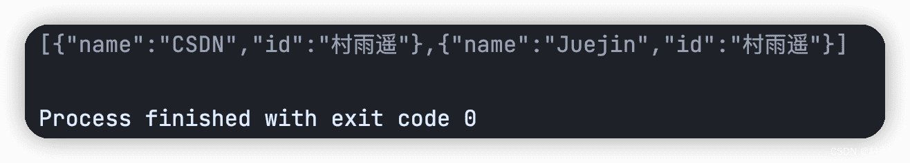

# Fastjson V2 简单使用手册

:::info 共勉
不要哀求，学会争取。若是如此，终有所获。
:::

## 前言

在日常 Java 企业级开发中，可能避不开 `JSON` 这个格式。 `JSON` 源于 1999 年的 `JS` 语言规范 `ECMA262` 的一个子集，然后又在 2003 年作为一种数据格式 `ECMA404` 发布，到了 2006 年，又作为 `rfc4627` 发布。直到现在，`JSON` 的应用已经十分广泛了。

`JSON` 基于纯文本，所以阅读起来也十分轻松，而且规范简单，容易处理，能够做到开箱即用，最最重要的是，`JSON` 和平台无关，所以能够作为不同系统间的传输格式协议。

`JSON` 有 7 大基本数值，分别是：`false`、`null`、`true`、`object`、`array`、`number`、`string`。其结构也非常简单，只有两种结构：一个是 **数组**，一个是**对象中的键值对集合**。其中，对象用 `{}` 来表示，其内部是 `key:value` 形式，而数组则是用 `[]` 来表示，不同值之间用逗号 `,` 分隔。

以下就是一个 `JSON` 的简单示例：

```json
{
    "baseInfo": {
        "name": "cunyu1943",
        "wepublic": "村雨遥",
        "wechat": "cunyu1943",
        "platform": ["juejin", "CSDN", "Github", "zhihu"]
    }
}
```

而在 Java 中，主流的 `JSON` 库只要有以下三个：

1. `Fastjson`：国内阿里巴巴公司所开发的 `JSON` 库，性能出众且快速。
2. `Jackson`：`Spring` 默认的 `JSON` 库，社区十分活跃，更新迭代快。
3. `Gson`：谷歌出品的 `JSON` 库，算是目前来说功能最全的 `JSON` 库了。

得益于 `Fastjson` 的超高性能，国内的大部分公司都选择了阿里出品的 `Fastjson` 作为处理 `JSON` 的工具库。本文就来看看，`Fastjson` 的一些常用的使用技巧。

## 使用技巧

首先，我们创建一个 `Maven` 项目，用来演示 `Fastjson` 的使用，也方便我们管理依赖。同时，这里选择 `Fastjson v2` 来作为今天的演示主角。

当然，首要的工作就是创建一个 `Maven` 项目，如果你还有点摸不着头脑，那可以移步先去看看前备知识：

> [Maven 教程：使用 IDEA 创建 Maven 项目](https://cunyu1943.github.io/JavaPark/md/java/maven/20220104-maven-project-with-idea)

当我们创建完成一个 `Maven` 项目之后，首要的工作就是在项目的 `pom.xml` 中添加 `Fastjson V2` 的依赖。

```xml
<dependency>
    <groupId>com.alibaba.fastjson2</groupId>
    <artifactId>fastjson2</artifactId>
    <version>2.0.6</version>
</dependency>
```

接着我们创建一个 `Hero` 类，方便后续过程中的使用。

```java
@Data
@NoArgsConstructor
@AllArgsConstructor
public class Hero {
    private String sex;
    private String name;
    private String profession;
}
```

### Java 对象序列化为 JSON

在我们的主类中创建一个 `Hero` 对象，然后利用 `toJSONString()` 方法将其转换为 `JSON` 字符串，可以看到结果正确转换了。

```java
public class MainApplication {
    public static void main(String[] args) {
        //  Java 对象转 JSON
        Hero hero = new Hero("女", "虞姬", "射手");
        String heroJson = JSON.toJSONString(hero);
        System.out.println(heroJson);
    }
}
```



### JSON 解析为 Java 对象

假设有一个 `JSON` 字符串，我们想将其转换为 Java 对象，则可以使用 `parseObject()` 方法。

```java
public class MainApplication {
    public static void main(String[] args) {
        // JSON 字符串转 Java 对象
        String shooter = "{"name":"伽罗","profession":"射手","sex":"女"}";
        Hero hero = JSON.parseObject(shooter, Hero.class);
        System.out.println(hero.toString());
    }
}
```



### JSON 解析为 JSONObject

将 `JSON` 解析为 `JSONObject` 的方法和将 `JSON` 转换为 Java 对象的方法类似，但是少了一个参数，这里需要注意。

```java
public class MainApplication {
    public static void main(String[] args) {
        // JSON 解析为 JSONObject
        String shooter = "{"name":"黄忠","profession":"射手","sex":"男"}";
        JSONObject heroJson = JSON.parseObject(shooter);
        System.out.println(heroJson.toJSONString());
    }
}
```



### JSON 解析为 JSONArray

要将 `JSON` 解析为 `JSONArray`，此时可以使用 `parseArray()` 方法。

```java
public class MainApplication {
    public static void main(String[] args) {
        // JSON 解析为 JSONArray
        String platform = "[{"name":"CSDN","id":"村雨遥"},{"name":"Juejin","id":"村雨遥"}]";
        JSONArray platformArray = JSON.parseArray(platform);
        System.out.println(platformArray.toJSONString());
    }
}
```



## 总结

以上就是日常开发中常见的 4 种其他格式和 `JSON` 格式之间的转换过程了，其中，最常用的应该莫过于 `JSON` 和 Java 对象之间的相互转换了，一定要熟练掌握！关于 `Fastjson V2` 的简单使用就介绍到这里了，关于更多 `Fastjson V2` 的高级使用技巧，等待我们后续文章再见吧！

## ⏳ 联系

想解锁更多知识？不妨关注我的微信公众号：**村雨遥（id：JavaPark）**。

扫一扫，探索另一个全新的世界。


<Share colorful />