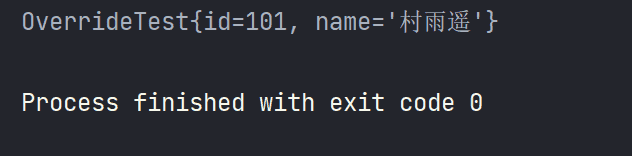
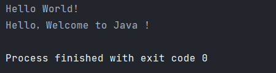
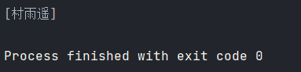

# 深入浅出 Java 注解

>
> 不要哀求，学会争取。若是如此，终有所获。
> 

## 🎈 号外

最近，公众号之外，建立了微信交流群，不定期会在群里分享各种资源（影视、IT 编程、考试提升……）&知识。如果有需要，可以**扫码或者后台添加小编微信备注入群**。进群后**优先看群公告**，**呼叫群中【资源分享小助手】**，还能免费帮找资源哦～

<center>
 
</center>

## 注解简介

所谓注解，其实就像一种拥有特定作用的注释，自 JDK1.5 及之后版本所引入的特性，它是放在 Java 源码的类、方法、字段、参数前的一种用作标注的“元数据”，与类、接口、枚举处于同一个层次中。

通过其作用的不同，我们常常将注解分为如下 3 类：

1.  **编写文档**：通过代码中标识的注解生成对应文档（即类似于 Java doc 的文档）；
2.  **代码分析**：通过代码中标识的注解对代码进行分析（使用反射）；
3.  **编译检查**：通过代码中标识的注解让编译器能实现基本的编译检查（`@Override`）；

## 常用的预定义注解

### `@Override`

一般是用在方法上，表示重写该父类的方法，比如我们使用最多的 `toString()` 方法，它是 `Object` 类的一个方法，而我们的写的类都是继承自 `Object` 类，所以我们自定义的所有类都是有 `toString()` 方法的。但是如果我们自定义类中的方法在父类中没有，则不能使用该注解，否则会导致无法编译通过。

```java
package com.cunyu;

/**
 * Created with IntelliJ IDEA.
 *
 * @author : cunyu
 * @version : 1.0
 * @email : 747731461@qq.com
 * @website : https://cunyu1943.github.io
 * @date : 2021/6/20 10:04
 * @project : JavaWeb
 * @package : com.cunyu
 * @className : OverrideTest
 * @description :
 */

public class OverrideTest {
    private Integer id;
    private String name;

    public OverrideTest(Integer id, String name) {
        this.id = id;
        this.name = name;
    }

    @Override
    public String toString() {
        final StringBuffer sb = new StringBuffer("OverrideTest{");
        sb.append("id=").append(id);
        sb.append(", name='").append(name).append('\'');
        sb.append('}');
        return sb.toString();
    }

    public static void main(String[] args) {
        Integer id = 101;
        String name = "村雨遥";
        OverrideTest overrideTest = new OverrideTest(id, name);

        System.out.println(overrideTest);
    }
}
```



### `@Deprecated`

一般用在方法之前，表示该方法已经过期，不建议再继续使用（但是仍然有效，只不过可能有更新的版本，推荐使用更新的版本）。

```java
package com.cunyu;

/**
 * Created with IntelliJ IDEA.
 *
 * @author : cunyu
 * @version : 1.0
 * @email : 747731461@qq.com
 * @website : https://cunyu1943.github.io
 * @公众号 : 村雨遥
 * @date : 2021/6/20 10:07
 * @project : JavaWeb
 * @package : com.cunyu
 * @className : DeprecateTest
 * @description :
 */

public class DeprecateTest {
    @Deprecated
    public static void sayHello() {
        System.out.println("Hello World!");
    }

    public static void newSayHello() {
        System.out.println("Hello，Welcome to Java !");
    }

    public static void main(String[] args) {
        sayHello();
        newSayHello();
    }
}
```



### `@SuppressWarnings`

表示忽略警告信息，常用的值以及含义如下表：

| 值            | 描述                                                        |
| ------------- | ----------------------------------------------------------- |
| `deprecation` | 使用了不赞成使用的类或方法时的警告                          |
| `unchecked`   | 使用了未经检查的转换时的警告                                |
| `fallthrough` | 当 `switch` 程序块直接通往下一种情况而没有 `break` 时的警告 |
| `path`        | 在类路径、源文件路径等中有不存在的路径时的警告              |
| `serial`      | 当在可序列化的类上缺少 `serialVersionUID` 定义时的警告      |
| `finally`     | 任何 `finally` 子句不能正常完成时的警告                     |
| `rawtypes`    | 泛型类型未指明                                              |
| `unused`      | 引用定义了，但是没有被使用                                  |
| `all`         | 关闭以上所有情况的警告                                      |

```java
package com.cunyu;

import java.util.ArrayList;
import java.util.List;

/**
 * Created with IntelliJ IDEA.
 *
 * @author : cunyu
 * @version : 1.0
 * @email : 747731461@qq.com
 * @website : https://cunyu1943.github.io
 * @公众号 : 村雨遥
 * @date : 2021/6/20 10:07
 * @project : JavaWeb
 * @package : com.cunyu
 * @className : SuppressWarningsTest
 * @description :
 */

public class SuppressWarningsTest {
    @SuppressWarnings("unchecked")
    public static void main(String[] args) {
        String item = "村雨遥";
        @SuppressWarnings("rawtypes")
        List items = new ArrayList();
        items.add(item);

        System.out.println(items);
    }
}
```



## 自定义注解

### 格式

我们可以使用 `@interface` 来自定义注解，其格式如下：

```java
public @interface AnnotationName{
    // 属性列表
    ……
}
```

一个简单的示例如下，其中 `AnnoDemo` 代表着我们自定义注解的名称，而 `name()`、`age()`、`score()` 则分别表示自定义注解的三个属性，而且我们利用关键字 `default` 对每个属性都赋予了默认值。

```java
public @interface AnnoDemo{
    String name() default "村雨遥";
    int age() default 20;
    float score() default 60.0f;
}
```

### 原理

注解本质上相当于一个接口，它默认继承自 `java.lang.annotation.Annotation`。

```java
public interface AnnotationName extends java.lang.annotation.Annotation{}
```

### 参数

注解的参数类似于无参的方法，通常我们推荐用 `default` 来设定一个默认值，对于方法的基本要求通常有如下几点：

1.  方法的返回值类型不可以是 `void`；
2.  如果定义了方法，那么在使用时需要给方法进行赋值，赋值的规则如下：
    1.  若定义方法时，使用了关键字 `default` 对方法赋予了默认初始值，那么在使用注解时，可以不用对方法进行再次赋值；
    2.  若只有一个方法需要赋值，且方法名为 `value`，那么此时 `value` 可以省略，直接定义值即可；
    3.  数组赋值时，值需要用大括号 `{}` 包裹，若数组中只有一个值，那么此时 `{}` 可以省略；

```java
public @interface AnnoDemo{
    String name() default "村雨遥";
    int age() default 20;
    float score() default 60.0f;
}
```

如上述例子中，`name()`、`age()`、`score()` 就是我们自定义注解的参数。而当我们要是用该注解时，则通过如下方式来对参数进行赋值。

```java
@AnnoDemo(name = "村雨遥", age = 26, score = 95.0f)
public class Demo{
    ……
}
```

## 元注解

### 定义

所谓元注解(`meta annotation`)，就是可以用来修饰其他注解的注解。

### 常用的元注解

1.  `@Target`

描述注解所修饰的对象范围，其取值主要有如下几种：

| 值                        | 说明                     |
| ------------------------- | ------------------------ |
| `ElementType.TYPE`        | 表示可以作用于类或接口   |
| `ElementType.FIELD`       | 表示可以作用于成员变量   |
| `ElementType.METHOD`      | 表示可以作用于方法       |
| `ElementType.CONSTRUCTOR` | 表示可以作用于构造方法   |
| `ElementType.PARAMETER`   | 表示可以作用于方法的参数 |

```java
@Target(ElementType.TYPE)
public @interface AnnoDemo{
    String name() default "村雨遥";
    int age() default 20;
    float score() default 60.0f;
}
```

2.  `@Retention`

用于约束注解的生命周期，其取值如下：

| 值                        | 说明                                                                                                                   |
| ------------------------- | :--------------------------------------------------------------------------------------------------------------------- |
| `RetentionPolicy.SOURCE`  | 表示在源代码文件中有效，注解将被编译器丢弃（注解信息仅保留在源码中，源码经编译后注解信息丢失，不再保留到字节码文件中） |
| `RetentionPolicy.CLASS`   | 表示在字节码文件中有效，注解在字节码文件中可用，但会被 JVM 丢弃                                                        |
| `RetentionPolicy.RUNTIME` | 表示在运行时有效，此时可以通过反射机制来读取注解的信息                                                                 |

```java
@Target(ElementType.TYPE)
@Retention(RetentionPoicy.RUNTIME)
public @interface AnnoDemo{
    String name() default "村雨遥";
    int age() default 20;
    float score() default 60.0f;
}
```

3.  `@Documented`

描述其他类型的注解是否被抽取到 API 文档中。

```java
@Target(ElementType.TYPE)
@Retention(RetentionPoicy.RUNTIME)
@Documented
public @interface AnnoDemo{
    String name() default "村雨遥";
    int age() default 20;
    float score() default 60.0f;
}
```

4.  `@Inherited`

这是一个标记注解，描述某个注解能够被子类继承，但是该元注解只适合已经配置了 `@Target(ElementType.TYPE)` 类型的自定义注解，而且仅针对于类的继承，而对于接口的继承则无效。

```java
@Inherited
public @interface AnnoDemo{
    String name() default "村雨遥";
    int age() default 20;
    float score() default 60.0f;
}
```

5.  `@Repeatable`

该注解是从 JDK1.8 新引入的元注解，表示在同一位置能够重复相同的注解。在没有该注解之前，我们一般是无法在同一类型上使用相同注解的，但引入该注解后，我们就可以在同一类型上使用相同注解。

```java
@Target(ElementType.TYPE)
@Repeatable(AnnoDemos.class)
public @interface AnnoDemo{
    String name() default "村雨遥";
    int age() default 20;
    float score() default 60.0f;
}

public @interface AnnoDemos{
	AnnoDemo[] value();
}
```

利用 `@Repeatable` 配置自定义注解之后，我们就可以在某个类型声明处添加多个我们自定义的注解了。

```java
@AnnoDemo(name = "村雨遥", age = 26, score = 88.0f)
@AnnoDemo(name = "晓瑜", age = 27, score = 90.0f)
public class Student{
    ……
}
```

## 总结

总结上述的知识点，我们将自定义注解的过程归纳为如下 3 步。

1.  **定义一个注解**

```java
public @interface AnnoDemo{
}
```

2.  **添加参数并设置默认值**

```java
public @interface AnnoDemo{
    String name() default "村雨遥";
    int age() default 20;
    float score() default 60.0f;
}
```

3.  **利用元注解来配置我们的自定义注解**

```java
@Target(ElementType.TYPE)
@Retention(RetentionPolicy.RUNTIME)
public @interface AnnoDemo{
    String name() default "村雨遥";
    int age() default 20;
    float score() default 60.0f;
}
```

在实际应用过程中，利用元注解配置自定义注解时，必须设置 `@Target` 和 `@Retention` 两个元注解，而且 `@Retention` 的值通常是设置为 `RetentionPolicy.RUNTIME`。

好了，以上就是我们注解的相关概念以及自定义注解所需要的掌握的一些知识点了，如果你觉得对你有所帮助，那就来一波点赞关注吧！
**关注公众号，获取最新文章更新**

::: center

:::


## ⏳ 联系

想解锁更多知识？不妨关注我的微信公众号：**村雨遥（id：JavaPark）**。

扫一扫，探索另一个全新的世界。

<center>

</center>