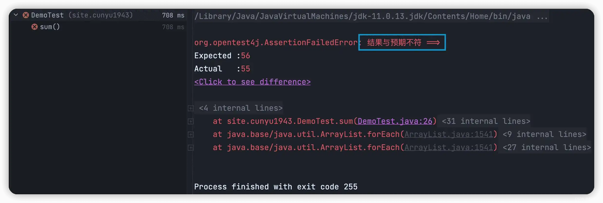

# Mockito + JUnit 单元测试实例

## 前言

在日常 Java 开发中，一般都需要进行单元测试，而 `Mock` 测试则是单元测试中的重要方法之一。所谓 `Mock` 测试，就是指在测试过程中，对于一些不容易构造或难以获取的较为复杂的对象，用一个虚拟的对象来代表，从而方便测试的一种测试方法。其中，这个虚拟的对象就叫做 `Mock` 对象，最常见的就是用它来代表 `Servlet` 中 `HttpServletRequest` 对象，`JDBC` 中的 `ResultSet` 对象等。

通过使用 `Mock`，我们能够降低单元测试的耦合，如果代码中对其他类或者接口有依赖关系，通过 `Mock` 就能帮我们模拟出这些依赖，并且帮我们验证所调用的依赖行为。通过使用 `Mock`，我们就可以验证对象的某些方法的调用情况，调用了多少次，方法的参数又是哪些。

之前我们介绍过 Junit 相关的知识点，不熟悉的小伙伴可以去看看我之前的一篇文章 ->  [是时候拥抱 JUnit 单元测试了！](20220718-test-with-junit.md) 。但使用 JUnit 时有个问题就是针对难以构造的复杂对象，我们可能需要费很大劲儿才能搞定。此时，我们就可以利用 `Mock` 测试和 JUnit 结合起来。

在众多的 `Mock` 框架中，`Mockito` 算是比较流行的一个框架了，大家经常将它和 JUnit 结合起来使用。`Mockito` 允许我们创建和配置 `Mock` 对象，从而最大程度上简化对外部依赖的测试类的开发。

通常，使用 `Mockito` 可以分为以下三个步骤：

1.   首先，模拟并替换测试代码中的外部依赖。
2.   其次，执行测试代码。
3.   最后，验证测试代码是否被正确执行。

下面就来看看，如何使用 `Mockito` + JUnit。

## 创建项目并添加依赖

既然要测试，那肯定得上代码了。这里为了方便管理依赖，所以创建一个 Maven 项目来作为示例。

创建好项目之后，项目结构如下图所示。


紧接着，我们向项目的 `pom.xml` 中添加 `Mockito` 和 `JUnit` 的依赖。

```xml
<dependencies>
    <dependency>
        <groupId>org.junit.jupiter</groupId>
        <artifactId>junit-jupiter-api</artifactId>
        <version>5.8.2</version>
        <scope>test</scope>
    </dependency>
    <dependency>
        <groupId>org.mockito</groupId>
        <artifactId>mockito-core</artifactId>
        <version>4.3.1</version>
        <scope>test</scope>
    </dependency>
</dependencies>
```

最终得到的 `pom.xml` 文件内容如下：

```xml
<project xsi:schemaLocation="http://maven.apache.org/POM/4.0.0 http://maven.apache.org/maven-v4_0_0.xsd"
         xmlns:xsi="http://www.w3.org/2001/XMLSchema-instance" xmlns="http://maven.apache.org/POM/4.0.0">
        <modelVersion>4.0.0</modelVersion>
    <groupId>site.cunyu1943</groupId>
    <artifactId>mockito-junit-demo</artifactId>
    <version>1.0-SNAPSHOT</version>
    <name>mockito-junit-demo Tapestry 5 Application</name>

    <properties>
        <project.build.sourceEncoding>UTF-8</project.build.sourceEncoding>
        <maven.compiler.source>11</maven.compiler.source>
        <maven.compiler.target>11</maven.compiler.target>
    </properties>
    <dependencies>
        <dependency>
            <groupId>org.junit.jupiter</groupId>
            <artifactId>junit-jupiter-api</artifactId>
            <version>5.8.2</version>
            <scope>test</scope>
        </dependency>
        <dependency>
            <groupId>org.mockito</groupId>
            <artifactId>mockito-core</artifactId>
            <version>4.3.1</version>
            <scope>test</scope>
        </dependency>
    </dependencies>
</project>
```

## 编写代码并测试

经过创建项目并添加相关依赖之后，我们就可以来编写代码并继续测试了。

同样的，首先我们在项目中添加一个简单的 `Demo` 类，并在其中声明一个方法，其最终代码如下。

```java
public class Demo {
    public int sum(int start, int end) {
        int sum = 0;
        for (int i = start; i <= end ; i++) {
            sum += i;
        }
        return sum;
    }
}
```

接着在 `Demo` 类中单击鼠标右键，选择 `Generate`，会弹出以下选择项，我们选择 `Test` 来自动生成该类的测试代码。


选择 `Test` 之后，IDEA 并不会立马生成对应的测试类，而是会弹出以下配置窗口让我们配置后再进行生成。这里主要注意的点在于：

1.   `Testing library`：用于测试的类库，我们一般测试都是选择 `JUint4` 或者 `JUnit5`。
2.   `Class name`：测试类的类名，这里一般默认的就是 `类名 + Test`，可以根据自己的需要来进行修改。
3.   `Destination package`：生成的测试类所在的包，一般是对应于上面的类所在的包。
4.   `Generate test methods for`：这里主要是选择需要生成测试的方法，在下面的 `Member` 中进行勾选即可。


配置完成后，IDEA 会在 `test/java` 文件夹下自动创建包并生成对应测试类，最终自动生成的测试类如下。


最后，我们按照 `Mock` 测试的三个步骤来书写代码，得到最终的测试方法如下。

```java
class DemoTest {
    @Test
    void sum() {
        Demo demo = Mockito.mock(Demo.class);
        Mockito.when(demo.sum(1, 10)).thenReturn(55);
        Assertions.assertEquals(55, demo.sum(1, 10), "结果与预期不符");
    }
}
```

其中，`@Test` 是 `JUnit` 中的注解，用于标识测试方法。

然后以上代码中的第 4 行则对应测试中的第一步，模拟外部依赖，创建 `Demo` 的对象。

第 5 行则对应测试中的第二步，执行测试代码，然后返回执行结果。

第 6 行则对应测试中的第三步，验证代码是否被正确执行。这里主要用到的是 `Mockito` 中的断言方法。

最后，执行测试类中的方法，如果测试通过，则 IDEA 中出现如下结果。


假设我们修改下以上代码中断言中的期望值，则测试不通过，此时 IDEA 会返回断言中的提示信息。

```java
class DemoTest {
    @Test
    void sum() {
        Demo demo = Mockito.mock(Demo.class);
        Mockito.when(demo.sum(1, 10)).thenReturn(55);
        Assertions.assertEquals(56, demo.sum(1, 10), "结果与预期不符");
    }
}
```





## 总结

以上内容就是关于 `Mockito` 搭配 `JUnit` 进行单元测试的简单示例了，主要从两个方面来展开。一方面是如何创建并添加对应依赖，另一方面则是如何编写代码并自动生成对应测试类，然后编写测试代码。而更多关于 `Mockito` 的使用技巧，我们将到另一篇文章中进行介绍。