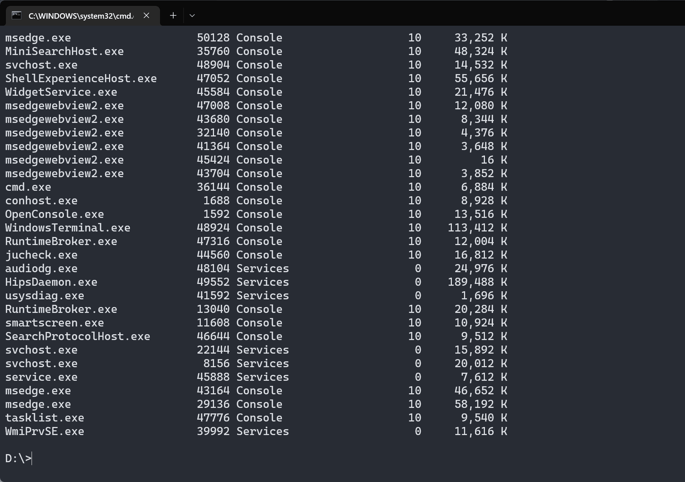
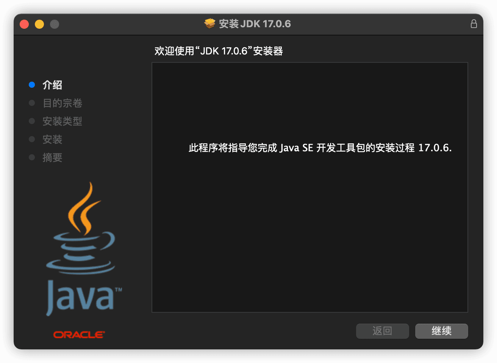

# 一、Java 概述

## 本文预览


## 计算机软硬件

###  计算机的组成


计算机的组成只要指的是系统结构的逻辑实现，包括机器内的数据流和控制流的组成以及逻辑设计等。主要分为五个部分，分别是：

-   **控制器**

计算机的核心，调度计算机中各部件间的相互协调工作。在控制器的指挥下，计算机就能按照程序所设定的步骤去自动完成一系列操作，完成我们预设的任务。控制器内部的主要部件有：

1.   **指令寄存器**：存放从存储器获取的指令。
2.   **译码器**：将指令中的操作码翻译为控制信号。
3.   **指令计数器**：计算并指出下一条指令的存放地址。

-   **运算器**

计算机中负责各种算术和逻辑运算的部件，如加、减、乘、除算数运算，与、或、非等逻辑运算，又叫做算术逻辑部件（`ALU`）。运算器是计算机中处理数据的功能部件，主要由以下部分组成：

1.   **算术逻辑单元（ALU）**
2.   **累加器**
3.   **状态寄存器**
4.   **通用寄存器**

-   **存储器**

计算机中的记忆设备，用于存放程序和各种数据信息。按照使用类型可以分为只读存储器（`ROM`）和随机存取存储器（`RAM`）。

-   **输入设备**

向计算机输入数据和信息的设备，是用户和计算机之间沟通的桥梁，最常见的输入设备有键盘、鼠标、摄像头等。

-   **输出设备**

计算机硬件设备的终端设备，用于接收计算机数据的输出，最常见的输出设备有屏幕、音箱、打印机等。

###  CPU、内存、硬盘

1.   **CPU**

`Central Processing Unit`，中文译为中央处理器，是整个计算机中最为核心的部件，计算机就是通过 `CPU` 来进行运算和控制的。如果把计算机比作一个人，那么 `CPU` 就是人的大脑。

2.   **硬盘**

主要用于存储计算机中的数据，是计算机中最主要的存储设备，具有容量大、断电不怕数据丢失的特点。目前，常见的硬盘主要分为：

-   **机械硬盘（HDD）**：传统普通硬盘，主要由盘片，磁头，盘片转轴及控制电机，磁头控制器，数据转换器，接口，缓存等部分组成。
-   **固态硬盘（SSD）**：又叫固态驱动器，是固态电子存储芯片阵列制成的硬盘，由控制单元和存储单元共同组成。
-   **混合硬盘（SSHD）**：除了机械硬盘必备的碟片、马达、磁头等等，还内置了 `NAND` 闪存颗粒，这些颗粒将用户经常访问的数据进行储存，从而达到 `SSD` 的读取效果。

固态硬盘无论是在开机速度还是程序运行方面，其加载速度都远超机械硬盘，但有一个缺点就是价格昂贵，因此无法做到全面取代机械硬盘。

3.   **内存**

主要负责计算机中硬盘和 `CPU` 之间的数据交换处理。一般用来保存从硬盘中读取数据，然后提供给 `CPU` 使用。此外，对于 `CPU` 中的一些临时的运算结果，也通常保存在内存中，以便 `CPU` 再次使用或直接保存到硬盘中。不同于硬盘就算断电也不会丢数据的特点，内存一旦断电，那么它所保存的数据就将丢失。


## 软件简介

### 什么是软件

>   软件 = 数据结构 + 算法

所谓软件，就是一系列按照特顺序组织的数据和指令的合集，如果说硬件是计算机中的有形部分，那么软件则是计算机中的无形部分。一般来说，计算机软件可以分为系统软件、应用软件，以及介于这两种之间的中间件。

1.   **系统软件**

系统软件指的是控制和协调计算机以及外设，支持应用软件开发和运行的系统，无需用户干预的各种程序的合集。最主要的功能是调度、监控和维护计算机系统，负责计算机中相互独立的硬件，让它们能够协调工作。最常见的系统软件有 `macOS`、`Windows 11`、`Linux`、`Android`、`iOS` 等。

2.   **应用软件**

应用软件是软件的主要分类，指针对用户的某种特殊应用目的所编写的程序，如文本处理、浏览器、沟通交流等。最常见的应用软件有微信、`QQ`、钉钉、网易云音乐、`Chrome` 等。

### 人机交互方式

人机交互方式是指通过计算机输入、输出设备，以有效的方式从而实现人与计算机对话。比如计算机通过输出设备如显示器给人提供大量相关信息，而人通过输入设备如键盘给计算机输入相关指令，让计算机完成对应工作等。

1.   **命令行方式**

需要在控制台中输入特定的指令，然后计算机才能去完成对应的操作。此时就需要使用者对指令十分熟悉，否则将无法使用计算机。


2.   **图形化界面**

简单直观，使用者能够十分容易就上手，只需要点点鼠标、输入文字等就能完成对应的操作。


### 常用 Dos 命令

`Dos（Disk Operating System）`，中文译为磁盘操作系统。它是微软早期在推出 `Windows` 之前的一个操作系统，是一个单用户、单任务的操作系统，能够直接操纵管理硬盘中的文件。

#### 如何打开 Dos 窗口

打开的方式很多，这里例举常用的 `5` 种。

1.  **方法 1**

`Win + R` 快捷键打开运行，输入 `cmd` 后回车。

2.  **方法 2**

依次打开开始菜单 -> `Windows` 系统（`Windows` 工具） -> 命令提示符。

3.  **方法 3**

打开资源管理器，然后在地址栏输入 `cmd` 后回车。

4.  **方法 4**

鼠标右键点击开始菜单的 `Win` 图标，找到命令提示符（终端）并进入。

5.  **方法 5**

在任务栏中的搜索栏中搜索 `cmd` 并打开。

####  目录操作

1.  **磁盘切换**

```shell
盘符 + 冒号
```

如 `D:` 就代表进入 `D` 盘。


2.  **进入指定目录**

```shell
cd 目录
```


3.  **返回磁盘根目录**

```shell
cd \
```


4.  **返回上级目录**

```shell
cd ..
```


5.  **新建目录**

```shell
md 目录名
```


6.  **查看当前目录中内容**

```shell
dir
```


7.  **查看指定目录结构**

```shell
tree 目录
```


8.  **删除目录**

```shell
rd 目录名
```


9.  **复制文件**

```shell
copy 源文件 目标文件
```


10. **删除文件**

```shell
del 文件名
```


#### 开关机操作

1.  **关机**

```shell
shutdown /s
```

2.  **重启**

```shell
shutdown /r
```

3.  **注销**

```shell
shutdown /l
```

4.  **休眠**

```shell
shutdown /h /f
```

5.  **定时关机**

```shell
shutdown /s /t 时间（秒）
```


6.  **取消关机**

```shell
shutdown /a
```


####  网络操作

1.  **测试网络延迟和丢包率**

```shell
ping ip/域名
```


2.  **查看本机 ip 地址**

```shell
ipconfig
```


3.  **清除本地 DNS 缓存**

```shell
ipconfig /flushdns
```


4.  **路由追踪**

```shell
tracert ip/域名
```


####  进程/服务操作

1.  **查看当前运行的进程**

```shell
tasklist
```


2.  **运行指定程序或命令**

```shell
start 程序名
```

3.  **按名称结束进程**

```shell
taskkill /im 进程名
```


4.  **按 PID 结束进程**

```shell
taskkill /pid PID
```


5.  **查看当前运行的服务**

```shell
net start
```


6.  **启动指定服务**

```shell
net start 服务名
```


7.  **停止指定服务**

```shell
net stop 服务名
```


####  其他操作

1.  **清除屏幕**

```shell
cls
```




2.  **退出**

```shell
exit
```

##  编程语言

###  什么是计算机语言

在聊计算机语言之前，我们先来看看什么叫做语言。所谓语言，就是人与人之间沟通的一种方式。比如我们日常生活中用普通话沟通，而和外国人则是用英语沟通。

而计算机语言指用于人和计算机之间相互沟通的语言，我们通过编程语言编程后对计算机下达指令，然后让计算机去完成我们所需的功能。计算机是人和计算机之间信息传递的媒介，它和人类语言一样，也有很多种，比如 `C`、`C++`、`Java`、`Python`、`Go` 等。

###  计算机语言分类

计算机语言的种类非常多，但总体上可分为以下三大类：

-   **机器语言**
-   **汇编语言**
-   **高级语言**

1.   **机器语言**

机器语言指的是一台计算机全部的指令集合。最开始，计算机中的指令和数据都是由 `0` 和 `1` 组成的二进制数，以下即为一个机器语言的实例。机器语言虽然效率很高，是直接和计算机进行交互，但是晦涩难懂，如果没有系统性学习过，很难掌握。

```bash
0000, 0000, 000000010000
```

2.   **汇编语言**

由于机器语言难以掌握，于是开始发明用英文所写的助记符来表示基本操作，而这些助记符就构成了汇编语言的基础。同样的，汇编语言是面向计算机的。但因为计算机架构的不同，因此会有不同的汇编语言，这样造成不同平台间难以通用。导致程序难以移植，调试难度加大。相比于机器语言，汇编语言简化了很多，学习难度也随之降低，开发效率进一步提高。

目前，汇编语言在工业电子编程、软件加解密、计算机病毒分析等领域仍应用广泛。

3.   **高级语言**

一种接近于人们使用习惯的程序设计语言，让程序员能够接近日常使用英语的指令来编写程序。而程序中的各种操作符和运算也和数学中的方程式接近，容易被掌握。

不同于汇编语言对于计算机的依赖性，高级语言是独立于计算机的，具有一定的通用性。因此高级语言编写的程序往往都具有通用性，能够在不同平台之间复用。

但有一点需要注意，计算机是不能直接识别和执行高级语言的。高级语言最终需要转换为机器语言才能够被识别和执行，而这个转换器也就是我们常说的编译器/解释器。


根据程序设计方法的不同，高级语言也常被划分为两类：

-   **面向过程的编程语言**：如 `C`、`Pascal`、`Fortran` 等
-   **面向对象的编程语言**：如 `Java`、`C#`、`Python`、`JavaScript` 等

### 计算机语言排行榜

可以通过以下链接查看各种流行编程语言的排行榜以及各语言在不同年份之间的涨幅趋势。

>   https://www.tiobe.com/tiobe-index/


##  Java 简介

### 发展历史

1990 年代初，`Sun` 公司的詹姆斯·高斯林等人为了实现电视机、电话、闹钟等家用电器的控制和通信，开发了一套用于设置在家用电器等小型系统中的编程语言。在当时，这门语言被命名为 `Oka`。但由于市场需求不高，所以该计划被逐渐放弃。

随着 1990 年代互联网的发展，`Sun` 公司发现 `Oka` 语言在互联网中的应用前景广泛。于是决定对 `Oka` 进行改造，并在 1995 年 5 月以 `Java` 的名义正式发布。

随着互联网的迅猛发展，`Java` 也得以逐渐成为重要的网络编程语言，詹姆斯·高斯林也被大家公认为 `Java` 之父。

到了 2009 年， `Sun` 公司被 `Oracle` 公司所收购，自此 `Java` 成为 `Oracle` 公司的一大产品直至今日。

以下是截止到本文写作时间（2023 年 2 月 22 日）`Java` 的历史年表，累计经过了 19 次主要版本更新，目前来到了 `Java` 19。不过虽然 `Java` 已经经历了这么多版本的更新，但国内目前用得最多的应该还是 `Java` 8 版本。而出于对稳定性的考虑，企业开发更喜欢 `LTS` 版本，这也是为什么至今 `Java` 8 还占有如此高的市场比例。

|       版本        |   发布日期    | 主要事件                                                     |
| :---------------: | :-----------: | :----------------------------------------------------------- |
|     JDK Beta      |     1995      | `Java` 语言发布，用 `Java` 实现的浏览器和 `Java Applet` 被大量应用 |
|     Java 1.0      | 1996 年 1 月  | 奠定了 `JDK`、`JRE`、`JVM` 的体系结构                        |
|     Java 1.1      | 1997 年 2 月  | 加入 `JIT`，提升 `JDK` 效率                                  |
|     Java 1.2      | 1998 年 12 月 | 确立 `J2SE`、`J2EE`、`J2ME` 产品结构                         |
|     Java 1.3      | 2000 年 5 月  | 内置 `HotSpot JVM`                                           |
|     Java 1.4      | 2002 年 2 月  | `XML` 处理、断言、支持正则表达式                             |
|     Java 5.0      | 2004 年 9 月  | 静态导入、泛型、`for-each` 循环、自动拆，装箱、枚举、可变参数 |
|      Java 6       | 2006 年 12 月 | 提供动态语言支持、同步垃圾回收                               |
|      Java 7       | 2011 年 7 月  | 字符串的 `switch` 语句、多异常捕抓                           |
| **Java 8 (LTS)**  | 2014 年 3 月  | `Lambda` 表达式                                              |
|      Java 9       | 2017 年 9 月  | 轻量级 `json` `API`、垃圾收集机制更新                        |
|      Java 10      | 2018 年 3 月  | 局部变量类型推断，`Java` 后续版本快速迭代更新                |
| **Java 11 (LTS)** | 2018 年 9 月  | 常用类增强，`Java` 11 是继 `Java` 8 之后的首个长期支持本版   |
|      Java 12      | 2019 年 3 月  | `switch` 表达式增强                                          |
|      Java 13      | 2019 年 9 月  | 文本块支持                                                   |
|      Java 14      | 2020 年 3 月  | `instanceof` 支持模式匹配                                    |
|      Java 15      | 2020 年 9 月  | `EdDSA` 数字签名算法、 密封类、隐藏类                        |
|      Java 16      | 2021 年 3 月  | 启用 `C++` 14 语言特性、`Vector API`                         |
| **Java 17 (LTS)** | 2021 年 9 月  | 恢复总是严格的浮点语义、增强型伪随机数生成器                 |
|      Java 18      | 2022 年 3 月  | 默认 `UTF-8` 编码、代码片段、简单的网络服务器                |
|      Java 19      | 2022 年 9 月  | 记录模式、外部函数与内存 `API`、`Linux`/`RISC-V` 移植、虚拟线程、结构化并发 |
|      JDK 20       | 2023 年 3 月  | 1. 作用域值<br />2. 记录模式<br />3. `switch` 模式匹配<br />4. 外部函数和内存 `API`<br />5. 虚拟线程<br />6. 结构化并发<br />7. 向量 `API` |
| **JDK 21（LTS）** | 2023 年 9 月  | 1. 分代 `ZGC`<br />2. 序列集合<br />3. 弃用 `Windows` 32 位 `x86`<br />4. 密钥封装机制 `API`<br />5. 字符串模板<br />6. 未命名类和实例主方法 |


### 技术体系

根据传统意义上 `Sun` 官方定义， `Java` 技术体系的组成主要就是我们常说的 `JDK`，即以下三部分：

1.  **Java 程序设计语言**
2.  **Java 虚拟机**
3.  **Java API 类库**


同时，`Java` 技术体系又可以主要分为以下 3 个平台。

1.  **Java SE**

`Java Standard Edition`，即 `Java` 标准版。主要是 `Java` 技术的核心和基础，要想学好 `Java`，那么首先你得掌握好这部分。主要运行在桌面级应用，如 `Windows` 应用程序。

2.  **Java EE**

`Java Enterprise Editon`，即 `Java` 企业版。从它的名字就不难看出，这是 `Java` 针对企业级应用开发所提供的一套解决方案，主要用于架设高性能企业网站。

3.  **Java ME**

`Java Micro Edition`，即 `Java` 小型版。主要是 `Java` 针对移动设备应用所提供的一套解决方案，主要运行在手机、`pad` 等移动端。


### 优缺点

1.   **优点**

-   **跨平台**：编写完成后的 `Java` 程序能够在不同操作系统上运行。其核心在于每个操作系统中安装好 `Java` 虚拟机之后，`Java` 程序的运行就由它来负责。
-   **面向对象**：面向对象是一种程序设计思想，支持封装、继承、多态三大核心特性，设计出的程序具有高内聚、低耦合的特点。
-   **健壮**：取其精华，吸收了 `C/C++` 语言中的优点，而去掉了其中有碍于程序健壮性的部分，提供了相对安全的内存管理和访问机制。
-   **简单**：`Java` 可以看做是 `C++` 的一个精简版，去掉了 `C++` 中的指针、联合、操作符重载等语法。
-   **高性能**：最初发展阶段，`Java` 的性能是比较弱的，但通过长时间的发展，通过对 `JVM` 的优化，`Java` 的性能早已得到了大幅提升。
-   **安全系数高**：适合于网络/分布式环境，需要提供一个安全机制从而防止恶意代码的攻击。

2.   **缺点**

-   **语法复杂且严谨**：相较于 `Python、PHP` 等编程语言，`Java` 对于开发者的约束更多。
-   **并非适合所有领域**：`Java` 更加适用于大型网站开发，整个架构会比较繁重。对于移动端的一些程序可能就更使用使用其他开发语言。如 `iOS` 与 `Swift、Object C` 更兼容，而 `Windows` 程序开发者则更偏爱于 `C++、C#` 等。

##  Java 开发环境

### JDK & JRE

1.   **JDK**

`Java Development Kit`，`Java` 程序开发工具包，包含了 `JRE` 以及我们开发时用到的工具。

2.   **JRE**

`Java Runtime Environment`，`Java` 程序运行时环境，包含 `JVM` 和运行时所需的核心类库。


### JDK 下载

1.   打开下载地址：https://www.oracle.com/java/technologies/downloads/，然后选择需要下载的安装包即可。


2.   如果需要下载其他版本的 `JDK`，则可以点击上方的 `Java archive`，在这里可以找到其他版本的 `JDK`。


### JDK 安装及验证

#### Windows

-   **安装**

1.   双击下载后的安装包，打开安装程序。


2.   设置安装 `JDK` 的目标路径。


3.   等待安装进度跑完即可。


-   **配置**

完成上面的步骤后，我们的 `JDK` 就已经安装好了。这里需要注意，如果安装的是 `Java 17` ，那么此时就可以直接使用了，而如果安装的是 `Java 8/11`，那就还需要完成以下配置。

打开系统属性来进行环境变量配置，打开系统属性并进行配置的步骤如下：

1.  **Windows + R** 快捷键组合唤醒 `Windows` 运行窗口，然后输入 `sysdm.cpl`，紧接着回车即可，一般会打开如下界面，然后点击最上方的 **高级**。


2.  点击高级后，就会打开如下界面，然后打开环境变量。


3.  新建环境变量 **JAVA_HOME**，然后变量值填入刚才安装 `JDK` 的路径（刚才提醒过要记住！）；


4.  编辑 **Path** 环境变量，然后新建一个变量值，填入如下内容：`%JAVA_HOME%\bin`。


5.  各种确定，然后突出系统属性即可，到这一步，理论上我们的 `JDK` 就安装并配置成功了，接下来我们就去确认一下到底安装好了没；

-   **验证**

按照上述步骤操作完成之后，接下来就是验证了。

打开命令控制台（**Windows + R，然后输入 cmd 回车**），然后输入以下三个命令进行验证。

```shell
# 查看 JDK 版本
java -version
```


```shell
# 编译命令
javac
```


```shell
# 运行命令
java
```


#### macOS

-   **安装**

1.   双击下载好的 `.dmg` 安装包，然后开始安装。



2.   安装过程中会让你输入密码，也就是你本机的密码，然后等待安装即可。


3.   如果看到以下界面，说明此时安装成功了。


- **验证**

不同于 `Windows`，`macOS` 下不用再去配置了，它会给你自动配置好，我们只需要去验证即可。

1.  查看 `JDK` 版本。

```bash
java -version
```


2.  编译命令 `javac`。


3.  运行命令 `java`。


### 安装目录详解

安装好 `JDK` 之后，打开安装路径，通常情况下会有如下的目录结构，而各个模块的功能则如下表所示。

```shell
.
├── LICENSE -> legal/java.base/LICENSE
├── README
├── bin
├── conf
├── include
├── jmods
├── legal
├── lib
└── release
```

| 目录      |                                                                                           |
| --------- | ----------------------------------------------------------------------------------------- |
| `bin`     | 用于存放各种工具命令，比如我们最常用的 `javac`、`java` 等                                 |
| `lib`     | 存放工具的一些补充 `jar` 包                                                               |
| `conf`    | 存放相关配置文件                                                                          |
| `include` | 存放一些平台特定的头文件，比如 `Windows`、`macOS`、`Linux` 平台下这里的头文件是有所不同的 |
| `legal`   | 存放各模块的授权文件                                                                      |
| `jmods`   | 存放各种模块                                                                              |
| `release` | 版本发布内容以及版本信息                                                                  |
| `README`  | `JDK` 信息                                                                                |
| `LICENSE` | 版权和签证相关的说明文档                                                                  |

##  Hello World

### 开发步骤

要开发一个 `Java` 程序，主要分成 3 个步骤：

1.  **编写代码**

将 `Java` 代码写入扩展名为 `.java` 的源文件中。

2.   **编译代码**

源文件准备好之后，就可以用利用 `javac` 命令来编译该文件，然后生成一个或多个后缀为 `.class` 的字节码文件。

3.   **运行代码**

最后，利用 `java` 命令运行生成的 `.class` 即可。


### 代码实践

1.  打开编辑器（推荐 `VS Code`），如果没有，记事本也成，然后写入如下内容，最后保存为 `Main.java`。这里注意，文件名一定要是 `Main`，文件后缀名为 `.java`。

```java
public class Main{
    public static void main(String[] args){
        System.out.println("Hello World!");
    }
}
```

2.  打开控制命令台，然后进入上述文件存放的路径，使用如下命令进行编译，然后会生成一个 `Main.class` 文件。

```bash
javac Main.java
```


3.  运行，使用如下命令进行运行，然后就可以看到打印出的最终结果了！

```bash
java Main
```


### 知识点说明

我们的 `Hello World` 是打印出来了，但是你肯定对里边的代码很感兴趣，这一节就主要针对我们的 `Hello World` 程序进行说明。

```java
public class Main{
    public static void main(String[] args){
        System.out.println("Hello World!");
    }
}
```

- `public`：权限修饰符，表示这一个可以公开访问的类，类似的还有 `protected、default、private`，后续学习过程中再一一介绍。
- `class`：`Java` 关键字，表示这是一个类。
- `Main`： 表示我们的类名，在保存时文件一定要和它同名，否则你的程序是编译不了的。你可以试试，如果把我们上面的 `Main.java` 改成其他名字，你看看是不是还能编译成功呢？
- `public static void main(String[] args){}`：主方法，这是我们以后最常接触到的一个方法，每个主类当中都必须有一个 `main` 方法。而且它的格式是固定的，这里只需要记住就行了。
- `System.out.println("Hello World!")`：控制台输出语句，执行该语句会在控制台中输出字符串，字符串要用双引号 `""` 括起来，你可以把其中的 `Hello Wolrd!` 换成你想要打印的内容试试看。

##  注释

所谓注释，就是写在程序里边对代码进行结束说明的文字，既方便自己也方便他人查看，更快理解程序含义。而且注释是不影响程序的执行的，在我们对 `Java` 源代码进行编译后，字节码文件中不含源代码中的注释内容。

在 `Java` 中，通常支持三种注释方式，它们分别是：

- `//`：单行注释
- `/* */`：多行注释
- `/** */`：文档注释

### 单行注释

单行注释是以双斜杠 `//` 来标识，表示只注释当前行内容，一般用在需要注释的内容较少的地方，以下就是一个单行注释的实例。

```java
// 第一个 Java 程序
public class HelloWorld{
    public static void main(String[] args){
        System.out.println("Hello World!");
    }
}
```

### 多行注释

通常我们把要注释的内容放在 `/*` 和 `*/` 之间，表示在两者之间的内容都是我们的注释内容，以下是一个多行注释的实例。

```java
/*
* 第一个 Java 程序
* 这是许多初学者都会写的一个程序
*/
public class HelloWorld{
    public static void main(String[] args){
        System.out.println("Hello World!");
    }
}
```

### 文档注释

文档注释和多行注释很像，它是将我们所需要注释的内容包含在 `/**` 和 `*/` 之间。而文档注释和其他两种注释最大的区别就在于：我们可以利用 `javadoc` 工具来提取文档注释，然后生成一个 `HTML` 文档，类似于 `Java` 官网所提供的 `API` 文档，以下是一个文档注释的实例。

```java
/**
* 第一个 Java 程序
* 这是许多初学者都会写的一个程序
*/
public class HelloWorld{
    /**
    * 主函数
    * @param args 主函数参数列表
    */
    public static void main(String[] args){
        System.out.println("Hello World!");
    }
}
```

然后我们通过终端，使用 `javadoc` 命令就可以为上述文件生成一个 `HTML` 文档。

```bash
javadoc HelloWorld.java
```

而文档注释相比于其他两种注释，也有更多值得注意的地方，下面就分别来看看需要留意的地方。

1.  **常用文档注释分类**

- **类注释**

顾名思义，所谓类注释，就是针对整个类的说明，它必须放在 `import` 之后，但又必须放在类定义之前。以下是一个类注释的实例：

```java
/**
* Animal，动物类
*/
public class Animal{
    ...
}
```

这里需要注意的是，在 `/**` 和 `*/` 之间的其他行注释，`*` 是可有可无的，之所以加上，更大情况出于美观的考虑，上面的实例写成如下样式也是合法的。

```java
/**
  Animal，动物类
*/
public class Animal{
    ...
}
```

- **方法注释**

同样的，方法注释也就是针对类中方法的注释，它必须放在所描述的方法之前。而一般情况下，除开说明该方法的功能之外，我们经常使用如下标记来对方法进行注释。

| 标记                          | 说明                                 |
| ----------------------------- | ------------------------------------ |
| `@param variable description` | 用于介绍当前方法的参数，可以占据多行 |
| `@return description`         | 用于描述当前方法的返回值，可以跨多行 |
| `@throws class description`   | 用于表示该方法有可能抛出的异常       |

以下就是一个方法注释的实例：

```java
/**
* 求两数之h
* @param num1 加数1
* @param num2 加数2
@ return 两数之和
*/
public int add(int num1, int num2){
    return num1 + num2;
}
```

- **字段注释**

字段注释顾名思义，也就是对于类中字段的说明，用于描述字段的含义，以下是一个字段注释的例子。

```java
public class Cunyu{
    /**
    * 公众号
    */
    public String wePublic;
}
```

当然，如果你不喜欢把一个字段的注释分成多行的话，也可以写成以下格式。

```java
public class Cunyu{
    /** 公众号 */
    public String wePublic;
}
```

两种方式都是可以的，也没有优劣之分，可以根据自己的风格来选择。但是在 `IntelliJ IDEA` 等 `IDE` 中，如果对代码进行格式化，`IDEA` 会将第二种方式格式化成第一种方式，这一点需要注意。

2.  **如何提取文档注释**

假设有以下一段代码，我们需要生成关于代码的文档说明。那么就可以使用 `JDK` 中所提供的 `javadoc` 命令来提取代码的文档注释。

```java
/**
* 第一个 Java 程序
* 这是初学者基本都会写的一个程序
* @author 村雨遥
* @version 1.0
*/
public class HelloWorld {
    /**
    * 主函数：程序入口
    * @param args 主函数参数列表
    */
    public static void main(String[] args){
        System.out.println("Hello World!");
    }
}
```

然后利用以下命令就可以生成我们的文档注释。

```shell
javadoc -d helloworld -author -version -encoding UTF-8 HelloWorld.java
```

以上命令的意思就是，对名为 `HelloWorld.java` 的提取其中的文档注释，并将输出的文件放在 `helloworld` 文件夹下，并且在文档中包含程序作者和版本，编码方式为 `UTF-8`。


生成的文件列表详情见下图，打开其中的 `index.html` 就可以查看提取的文档注释。


##  API 文档

`API（Application Programming Interface）`，应用程序编程接口，是 `Java` 提供的基本编程接口。`Java` 语言提供了大量的基础类，为了给开发者提供相应的说明文档，于是便有了 `Java API` 文档。它类似于我们日常生活中的字典，如果遇到什么不认识的字，那么就可以去这里找。而对应到 `Java` 语言中，就是当我们遇到未使用过的基础类或方法，可以去 `Java API` 中寻找。

为了方便大家，在这里贴出目前最常用的 3 个长期版本 `Java` 的在线阅读地址和离线下载地址，有需要的小伙伴可以自行去下载。

温馨提示：这里无论是在线阅读还是离线下载后的文档，都是纯英文的！

### 在线阅读

-   **`Java 8 API`**:https://docs.oracle.com/javase/8/docs/api/index.html
-   **`Java 11 API`**:https://docs.oracle.com/en/java/javase/11/docs/api/
-   **`Java 17 API`**:https://docs.oracle.com/en/java/javase/17/docs/api/

### 离线下载

-   **`Java 8 API`**:https://www.oracle.com/java/technologies/javase-jdk8-doc-downloads.html
-   **`Java 11 API`**:https://www.oracle.com/java/technologies/javase-jdk11-doc-downloads.html
-   **`Java 17 API`**:https://www.oracle.com/java/technologies/javase-jdk17-doc-downloads.html

## 开发工具推荐

### 文本开发工具

也就是常说的文本编辑器，是用来编写普通文字的应用软件，而程序开发者则一般用来编写程序的源代码。目前常用的几款文本编辑器主要有：

1.   **Visual Studio Code**

-   下载地址：https://code.visualstudio.com/


一个完全免费的跨平台文本编辑器，支持 `Windows`、`macOS`、`Linux`，具有开源访问权限和大量扩展集，内置 `Git` 命令。而且社区活跃，包含大量使用文档、常见问题等内容。


2.   **Sublime Text**

-   下载地址：https://www.sublimetext.com/download


`Sublime Text` 是一个轻量、简洁、高效、跨平台的编辑器。支持安装扩展、即时文件切换、`Vim` 模式、宏定义等，简约而不失强大。

3.   **HBuilder X**

- 下载地址：https://www.dcloud.io/hbuilderx.html


>   `HBuilderX`，`H` 是 `HTML` 的首字母，`Builder` 是构造者，`X` 是 `HBuilder` 的下一代版本。我们也简称 `HX`。 `HX` 是轻如编辑器、强如 `IDE` 的合体版本。

一款轻巧、急速的堪比 `IDE` 的强大编辑器，支持小程序、`Vue` 开发、语法提示功能强大、`json` 支持更强，此外还支持安装各种丰富的插件，进一步提高工作效率。

4.   **UltraEdit**

-   下载地址：https://www.ultraedit.com/


一个支持多平台的文本编辑器，可以支持基本语法和二十多种语言。它使用方便，可以用颜色标注重点部分，支持进行内嵌式编辑，也可以进行代码编辑。

5.   **Notepad3**

-   下载地址：https://www.rizonesoft.com/downloads/notepad3/


`Notepad3` 是一个快速且轻量级的基于 `Scintilla` 的文本编辑器，具有语法突出显示功能。它的内存占用量很小，但功能强大，足以处理大多数编程作业。

6.   **Vim**

-   下载地址：https://www.vim.org/download.php


`Vim` 是从 `vi` 发展出来的一个文本编辑器。代码补全、编译及错误跳转等方便编程的功能特别丰富，在程序员中被广泛使用，是类 `Unix` 系统用户最喜欢的文本编辑器之一。当然，在 `Windows` 中也能通过安装从而使用上这个编辑器。

###  集成开发工具

也就是常说的 `IDE(Integrated Development Environment)`，是将代码编写、编译、执行、调试等多项功能综合到一起的开发工具。

1.   **IntelliJ IDEA**

-   下载地址：https://www.jetbrains.com/zh-cn/idea/


业界公认为最好的 `Java` 开发工具，尤其在智能代码助手、代码自动提示、重构、`JavaEE` 支持、各类版本工具(`git`、`svn` 等)、`JUnit`、`CVS` 整合、代码分析、 创新的 `GUI` 设计等方面的功能可以说是超常的。`IDEA` 是 `JetBrains` 公司的产品，总部位于捷克共和国的首都布拉格，开发人员以严谨著称的东欧程序员为主。分为旗舰版和社区版，旗舰版支持 `HTML`，`CSS`，`PHP`，`MySQL`，`Python` 等，而社区版只支持 `Java`,`Kotlin` 等少数语言。

2.   **Eclipse**

-   下载地址：https://www.eclipse.org/downloads/packages/


`Eclipse` 是一个开放源代码的、基于 `Java` 的可扩展开发跨平台的自由集成开发环境。就其本身而言，它只是一个框架和一组服务，用于通过插件组件构建开发环境。同时，`Eclipse` 附带了一个标准的插件集，包括 `Java` 开发工具（`Java Development Kit`，`JDK`）。通过安装各种插件，从而达到支持不同的计算机语言，如 `C++`、`Python` 等。

3.   **Apache NetBeans**

-   下载地址：https://netbeans.apache.org/download/index.html


`NetBeans` 是开源软件开发集成环境，是一个开放框架，可扩展的开发平台，可以用于 `Java`、`C/C++`，`PHP` 等语言的开发。

4.   **MyEclipse**

-   下载地址：https://www.genuitec.com/products/myeclipse/download/


这是基于 `Eclipse` 加上自己的插件开发而成的功能强大的企业级集成开发环境，主要用于 `Java`、`Java EE` 以及移动应用的开发。在最新版的 `MyEclipse` 中，对各种开源产品和主流开发框架的支持相当不错。已支持 `PHP`、`Python`、`Vue`、`Angular`、`React`、`Java`、`Java EE` 等语言和框架开发。

## 课后练习

### 练习 1：Hello Java

参考文章的 `Hello World` 入门实例，编写一个程序，在控制台中输出字符串 `Hello Java，学 Java 认准 JavaPark!`

-   **参考答案**

```java
public class Main{
    public static void main(String[] args){
        System.out.println("Hello Java，学 Java 认准 JavaPark!");
    }
}
```

### 练习 2：打印爱心

用纯输出语句，编写一个程序，在控制台中输出以下图案。

```shell
	*												*	
*		*				I love you				 * 		* 
	*												*	
		*										*		
			*								*	
				*						*	
					*				*		
						*		*		
							*
```


-   **参考答案**

```java
public class Heart {
    public static void main(String[] args) {
        System.out.print("\t" + "*" + "\t\t\t\t\t\t\t\t\t\t\t\t" + "*" + "\t" + "\n");
        System.out.print("*" + "\t\t" + "*" + "\t\t\t\t" + "I love you" + "\t\t\t\t" + " * " + "\t\t" + " * " + "\n");
        System.out.print("\t" + "*" + "\t\t\t\t\t\t\t\t\t\t\t\t" + "*" + "\t" + "\n");
        System.out.print("\t\t" + "*" + "\t\t\t\t\t\t\t\t\t\t" + "*" + "\t\t" + "\n");
        System.out.print("\t\t\t" + "*" + "\t\t\t\t\t\t\t\t" + "*" + "\t" + "\n");
        System.out.print("\t\t\t\t" + "*" + "\t\t\t\t\t\t" + "*" + "" + "\t" + "\n");
        System.out.print("\t\t\t\t\t" + "*" + "\t\t\t\t" + "*" + "" + "\t\t" + "\n");
        System.out.print("\t\t\t\t\t\t" + "*" + "\t\t" + "*" + "" + "\t\t" + "\n");
        System.out.print("\t\t\t\t\t\t\t" + "*" + "\n");
    }
}
```


## 最后

本文中涉及的代码都已上传到 `Github`，有需要的小伙伴请自行获取。

>   📌 传送门：https://github.com/cunyu1943/java-park-code-warehouse/tree/main/java-tutorial/java-tutorial-01/

# 二、变量与运算符

##  本文预览


##  关键字

所谓关键字，就是被 `Java` 语言赋予了特殊含义的标识符，用于特定用途的单词/字符串，可能用来表示一种数据类型，又或者表示程序的结构。

`Oracle` 官方目前给出的关键字共有 `50` 个，不过大可不必刻意去背，用的多了也就慢慢记住了。如果有一天突然忘记了，也可以到下面的链接中去查询。

>   https://docs.oracle.com/javase/tutorial/java/nutsandbolts/_keywords.html


##  标识符

`Java` 中为了变量、方法、对象、接口或其他用户自定义向所定义的名称，可以由一个或多个字符组成。其命名必须符合以下硬性规则：

1.  标识符由英文字符大小写（`a` - `z`, `A` - `Z`）、数字（0 - 9）、下划线（`_`）和美元符号（`$`）组成。
2.  不能以数字开头，不能是关键字，不能包含空格。
3.  严格区分大小写。

除了强制性的规则之外，还有一些软性要求，大家在日常开发中也最好能遵守，养成一个良好的命名习惯。要注意，这些要求不满足时程序依旧能够照常编译和运行，但要做好被其他小伙伴鄙视的准备 😂。

1.  **包名**：多个单词组成是所有单词均小写，如 `cunyu`。
2.  **类名和接口名**：大写驼峰命名法，如 `CunYu`。
3.  **变量名和方法名**：多个单词组成时，第一个单词全小写，其他单词采用大写驼峰命名法，如 `cunYu`。
4.  **常量名**：字母全部大写，单词之间用下划线（`_`）分割，如 `CUN_YU`。

更多关于开发时需要遵守的一些规则，可以参照阿里开源的 `Java` 开发手册，下载地址：

>   https://github.com/alibaba/p3c


对于无法访问或者访问 `Github` 较慢的小伙伴们，也不用担心。我在这里已经下载好并上传到云盘中了，需要的小伙伴也可以通过以下链接进行下载。

>   《Java 开发手册（黄山版）》：https://cunyu1943.lanzout.com/idnmh0p9hivg

##  变量

### 变量存在的意义

试想一下，如果书本都没有名字，那让你去找某一本书的时候，你该从哪儿开始找起呢？

而在程序中也是这样，要想尽快找到一个数据的位置，那么我们最好给它定义一个名字，而这个名字在编程语言中就叫做变量。变量是程序中不可或缺的组成单位，是最基本的存储单位。

### 变量简介

所谓变量，就是用来命名一个数据的标识符，它主要是用来在内存中保存数据。一个变量的构成主要包含三要素，分别是：

-   **数据类型**
-   **变量名**
-   **存储的值**

当这三要素都齐全时，我们就可以按照以下格式来定义一个变量。

```java
数据类型 变量名 = 初始值;
```

其中数据类型是用于限制存储数据的形式，后面会讲到 `Java` 中的常见数据类型；变量名是用于代表变量的一个符号，就好比我们每个人的名字；初始值则代表该变量存储时的初始数据。

在使用变量时，一定要注意以下几点，否则可能导致程序报错。

-   **变量一定要先声明，再使用**
-   **变量是有作用域的，变量只在作用域内有效**
-   **同一作用域内，不能重复声明同名变量**
-   **变量赋值时要注意控制在数据类型的有效范围内**

在 `Java` 中，根据数据类型的不同，可以将变量分为**基本数据类型**以及**引用数据类型**。

1.   **基本数据类型**

`Java` 中，共有 8 种基本数据类型，由 `Java` 语言预定好的，每个数据类型都属于关键字，而且每种基本变量都有其对应的封装类，这 8 种基本数据类型分别是：

- **整型（4 种）**：`byte`、`short`、`int`、`long`
- **浮点型（2 种）**：`float`、`double`
- **字符型（1 种）**：`char`
- **布尔型（1 种）**：`boolean`

2.   **引用数据类型**

常用的引用数据类型：

-   **类（class）**
-   **数组（array）**
-   **接口（interface）**
-   **枚举（enum）**
-   **注解（annotation）**
-   **记录（record）**

##  基本数据类型

### 计算机存储单位

1. **位（bit)**

`binary digit` 的英文缩写，表示信息量的最小单位，只有 0、1 两种二进制状态。

2. **字节（Byte）**

计算机中用于计量存储容量的基本单位，一个字节等于 8 `bit`.

3. **转换关系**

> 1 `Byte` = 8 `bit`
>
> 1 `KB` = 1024 `Byte`
>
> 1 `MB` = 1024 `KB`
>
> 1 `GB` = 1024 `MB`
>
> 1 `TB` = 1024 `GB`

### 整型

`Java` 中，定义了 4 种整型数据类型，分别是：

- `byte`
- `short`
- `int`
- `long`

注意，在定义 `long` 类型的变量时，一定要在结尾加上 `l` 或者 `L` 作为后缀。因为 `Java` 中默认整型变量都是声明为 `int` 类型，如果把一个 `long` 类型的值赋值给 `int` 类型的变量，有可能会导致精确度问题。

`Java` 中的各个整型都有着固定的数据范围以及字段长度，不随平台的改变而变化，从而保证了程序的可移植性。以下是各整型数据结构的字段长度以及表示范围：

| 数据类型 | `bit` | 字节 | 数据范围               | 封装类    | 封装类对象默认值 |
| -------- | ----- | ---- | ---------------------- | :-------- | ---------------- |
| `byte`   | 8     | 1    | $-2^7$ ~ $2^7-1$       | `Byte`    | `0`              |
| `short`  | 16    | 2    | $-2^{15}$ ~ $2^{15}-1$ | `Short`   | `0`              |
| `int`    | 32    | 4    | $-2^{31}$ ~ $2^{31}-1$ | `Integer` | `0`              |
| `long`   | 64    | 8    | $-2^{63}$ ~ $2^{63}-1$ | `Long`    | `0L`             |

### 浮点型

浮点型数据类型主要有 2 种，分别是：

-   `float`：**单精度**，尾数最高精确到 `7` 位有效数字。
-   `double`：**双精度**，精度是 `float` 的两倍，`Java` 中默认浮点型常量均为 `double`。

和定义 `long` 类型变量需要在默认添加 `l` 或 `L` 类似，定义 `float` 类型的变量时，也需要在赋值时添加 `f` 或 `F` 作为后缀，而在给 `double` 类型的变量赋值时也需要在末尾添加 `d` 或者 `D`。而根据阿里的《Java 开发手册》相关规约，这里建议优先选用大写的后缀。

| 数据类型 | `bit` | 字节 | 数据范围                     | 封装类   | 封装类对象默认值 |
| -------- | ----- | ---- | ---------------------------- | -------- | ---------------- |
| `float`  | 32    | 4    | $1.4e^{-45}$ ~ $3.4e^{38}$   | `Float`  | `0.0F`           |
| `double` | 64    | 8    | $4.9e^{-324}$ ~ $1.8e^{308}$ | `Double` | `0.0D`           |

对于浮点数，通常用两种表示的形式：

-   **十进制数形式**：如 `19.43`
-   **科学计数法形式**：如 `1.943E3`

注意，并不是所有的小数都能够用二进制浮点数精确表示。而且在不允许舍入误差的金融领域，如果需要做精确计算或者保留指定位数的精度，通常是采用 `BigDecimal` 类，而不是使用 `float` 或者 `double`.

### 字符类型

`Java` 中的字符类型用 `char` 来定义，表示通常意义上的字符。`Java` 中的所有字符都采用的 `Unicode` 编码格式，因此一个字符既可以存储一个字母，也可以存储一个汉字亦或是其他书面语中的一个字符。

| 数据类型 | `bit` | 字节 | 数据范围                             | 封装类      | 封装类对象默认值 |
| -------- | ----- | ---- | ------------------------------------ | ----------- | ---------------- |
| `char`   | 16    | 2    | `\u0000` ~ `\uffff`（$0$ ~ $65535$） | `Character` | `u0000`          |

`Java` 中字符型变量的表现形式有 4 种，分别是：

1.   使用单引号 `''` 括起来的单个字符，比如 `'c'`、`'村'` 等。
2.   利用 `Unicode` 值来表示字符型常量：`\uXXXX`，其中 `XXXX` 表示一个十六进制的整数，如 `\u0023` 则表示 `#`.
3.   使用具体字符对应的数值，如 `ASCII` 码。

```java
// 实际上打印出来的结果是字符 d
char ch = 100;
```

4.   使用转义字符 `\` 将其后的字符转换为特殊的字符常量，如 `\n` 就表示换行符。

| 转义符 | Unicode 表示方式 | 说明   |
| ------ | ---------------- | ------ |
| `\n`   | `\u000a`         | 换行符 |
| `\t`   | `\u0009`         | 制表符 |
| `\"`   | `\u0022`         | 双引号 |
| `\'`   | `\u0027`         | 单引号 |
| `\\`   | `\u005c`         | 反斜线 |
| `\b`   | `\u0008`         | 退格符 |
| `\r`   | `\u000d`         | 回车符 |

### 布尔类型

布尔类型 `boolean` 用来做逻辑判断，一般都是用在流程控制语句中。而且 `boolean` 类型数据只有两个值 `true` 和 `false`，不能用其他值来代替。

需要注意的是，到了后面学习 `Java` 虚拟机的时候，你会发现 `boolean` 类型的值其实在经过编译之后都是使用 `int` 类型的数值来代替的，其中 `true` 用 1 来表示，而 `false` 则用 0 来表示。 但在日常编码时，却不能使用 1 或 0 来给 `boolean` 的变量赋值。


| 数据类型  | `bit` | 字节 | 数据范围          | 封装类    | 封装类对象默认值 |
| --------- | ----- | ---- | ----------------- | --------- | ---------------- |
| `boolean` | 1     | 4    | `true` 或 `false` | `Boolean` | `false`          |

这里关于 `boolean` 类型的变量在内存中所占用的字节数可能大家会感到疑惑，但在 `JVM` 中，`boolean` 类型的值是编译成了 `int` 类型，所以也认为 `boolean` 占用了 4 个字节。

###  变量运算规则

`Java` 中共有 8 种基本数据类型，但能做运算的就只有 7 种，`boolean` 类型的变量是不能进行运算的。

运算规则主要包括：

-   **自动类型提升**
-   **强制类型转换**

1.   **自动类型提升**

当取值范围小的变量和取值范围大的变量进行运算时，两者的结果会自动转换为取值范围大的数据类型。但需要注意的是，当 `byte` 和 `short` 数据类型的变量在进行计算时，它俩的结果是 `int` 数据类型。而且这个过程无需我们手动参与，`Java` 会自动执行类型提升操作。

8 种数据类型的数据范围从小到大分别是：

>   `byte` -> `short` -> `int` -> `long` -> `float` -> `double`

```java
int vari1 = 2;
long vari2 = 200L;
```

假设有以上两个变量，则 `vari1` + `vari2` 的结果是 `long` 类型，而非 `int` 类型。

2.   **强制类型转换**

将取值范围大的数据类型变量赋值给取值范围小的数据类型变量时，需要进行强制类型转换。但要注意，强制类型转换时可能会导致精度损失。

强制类型转换的格式为：

```java
取值范围小的数据类型 取值范围小的变量 = (取值范围小的数据类型)取值范围大的变量;
```

```java
double pi = 3.1415923;
// 强转后的值为 3，精度损失
int piInt = (int)pi;
```

### String 字符串

注意，在一开始的学习中，可能会有的人会把 `String` 也当做是 `Java` 中的一种基本数据类型。但实际上，`String` 是一个类，属于引用类型，我们通常称它为字符串。很多人把它与 `char` 类型变量的赋值搞混，但两者的区别十分明显：

1.   **数据类型不同**，`char` 是基本数据类型，而 `String` 是引用类型。
2.   **赋值方式不同**，`char` 赋值时用单引号 `''` 包裹，其内部只能包含一个字符，而 `String` 赋值时用双引号 `""` 包裹，其内部可以包含 0 个、1 个或者多个字符。

```java
char ch = '村';
String str = "村雨遥";
```

同样的，`String` 也可以参与与基本数据类型之间的运算，但是他们之间只能做连接运算，而且得到的结果还是 `String` 类型。也就是说，无论是哪个基本数据类型，跟 `String` 都只能做 `+` 运算。

-   **String 跟字符型做运算**

```java
String str = "村雨遥";
char ch = '远';
// 得到的是字符串：村雨遥远
System.out.println(str + ch);
```

-   **String 跟整型做运算**

```java
String str = "村雨遥";
int num = 1943;
// 得到的是字符串：村雨遥1943
System.out.println(str + num);
```

-   **String 跟浮点型做运算**

```java
String str = "村雨遥";
float pi = 3.1415F;
// 得到的是字符串：村雨遥3.1415
System.out.println(str + pi);
```

-   **String 跟 boolean 做运算**

```java
String str = "村雨遥";
boolean flag = true;
// 得到的是字符串：村雨遥true
System.out.println(str + flag);
```


## 计算机中的进制转换

所谓进制转换，就是人们利用符号来计数的方法。进制转换由一组数码符号和两个基本因素“基数”和“位权”所构成。其中**基数**是指进位计数制中所采用的数码的个数，逢 `n` 进 1 中的 `n` 就是基数。而**位权**则指的是进位制中每一个固定位置所对应的单位制，而每一种进制中的某一个数的每位上都有一个权值 `m`，而且权值是位数减一，比如个位上的数的权值为 `0`（位数 1 - 1 = 0），而十位的权值为 `1`（位数 2 - 1 = 1）。

### 二进制

二进制是计算机中采用最广泛的一种数制，用 0 和 1 两个数码来表示，其进位规则是逢二进一，而借位规则则是借一当二。在 `Java` 中，二进制通常以 `0b` 或者 `0B` 开头表示。

如果要将二进制转换为十进制，则采用 **按权展开求和**方法，其步骤是先将二进制的数写成加权系数展开式，然后再更具十进制的加法规则进行求和。

$$(1011)_2=1*2^3+0*2^2+1*2^1+1*2^0 = (11)_{10}$$

### 十进制

而一个十进制数要转换为二进制数，则需要将整数和小数部分分别转换，最后再进行组合。其中，整数部分采用**除二取余，逆序排序**的方法。具体方法是用 2 来整除一个十进制数，从而得到一个商和余数；然后再用 2 去除以商，从而又得到一个商和余数，重复这个步骤，直到最后得到的商小于 1 时为止。最后把按照得到余数的先后顺序，逆序依次排列，得到的数即为这个十进制数的二进制表示。

$$(15)_{10}=(1111)_2$$


小数部分则不同于整数部分，小数部分要使用**乘 2 取整法**，即用十进制的小数部分乘以 2，然后取结果的整数部分，然后再用剩下的小数重复刚才的步骤，直到最后剩余的小数为 0 时停止。最后将每次得到的整数部分按照先后顺序正序排列，从而得到对应的二进制表示。

$$(0.25)_{10}=(0.01)_2$$


### 八进制

所谓八进制，就是每 3 位二进制作为一个单元，其中最小的数是 0，最大的数是 7，一共 8 个数字。在 `Java` 中，八进制通常以数字 `0` 开头表示。

要将二进制的数转换为八进制，需要将 3 个连续的数拼成一组，然后再独立转成八进制中的数字。

例如，二进制的 `111101011110` 可以转换为八进制中的 `7536`。


### 十六进制

所谓十六进制，就是每 4 位二进制作为一个单元，其中最小数是 0，最大数是 15，一共 16 个数字，分别用 0 ~ 9、`A`、`B`、`C`、`D`、`E`、`F` 表示。在 `Java` 中，十六进制数通常用 `0x` 或 `0X` 开头表示。

要将二进制转换为十六进制，需要将 4 个连续的数拼成一组，然后再独立转换为十六进制中对应的数字。

例如，二进制的 `1111100111010111` 可以转换为十六进制中的 `F9D7`。


##  运算符

运算符数 `Java` 中一种特殊的符号，用于表示数据的运算、赋值和比较操作。按照不同的功能，运算符可以分为以下几种类型：

-   **算术运算符**
-   **关系运算符**
-   **位运算符**
-   **逻辑运算符**
-   **赋值运算符**
-   **条件运算符**

### 算术运算符

常见的算术运算符主要有下表中的 7 种，主要是针对整型和浮点类型的运算。

| 操作符 | 描述                              |
| :----- | :-------------------------------- |
| `+`    | 加法 - 相加运算符两侧的值         |
| `-`    | 减法 - 左操作数减去右操作数       |
| `*`    | 乘法 - 相乘操作符两侧的值         |
| `/`    | 除法 - 左操作数除以右操作数       |
| `％`   | 取余 - 左操作数除以右操作数的余数 |
| `++`   | 自增: 操作数的值增加1             |
| `--`   | 自减: 操作数的值减少1             |

**注意**：`++` 和 `--` 可以放在操作数之前，也可以放在操作数之后；**位于操作数之前时，先自增/减，再赋值；位于操作数之后，先赋值，再自增/减**；总结起来就是**符号在前就先加/减，符号在后就后加/减**。

以下是部分算术运算符的示例以及运行结果：

```java
int num1 = 10;
int num2 = 20;
int num3 = 30;
int num4 = 40;

System.out.println("num1 + num2 = " + (num1 + num2));
System.out.println("num1 - num2 = " + (num1 - num2));
System.out.println("num1 * num2 = " + (num1 * num2));
System.out.println("num2 / num1 = " + (num2 / num1));
System.out.println("num2 % num1 = " + (num2 % num1));
System.out.println("num3 % num1 = " + (num3 % num1));
System.out.println("num1++   = " + (num1++));
System.out.println("num1--   = " + (num1--));
// 查看 ++ 在操作数前后位置时结果的不同
System.out.println("num4++   = " + (num4++));
System.out.println("++num4   = " + (++num4));
```


这里不难看出，无论是 `++` 还是 `--`，当它们单独写一行时，不管是放在变量前边还是后边，其最终结果都是一样的。但如果将它们参与运算，此时的效果就不一样了，这里需要注意。

```java
int a = 10;
int b = a++;
```
以上代码中，先进行了 `b = a` 的赋值操作，所以此时 `b` 的值是 `10`。

```java
int a = 10;
int b = ++a;
```
而此时，先要对 `a` 进行加一的操作之后，再将 `a` 的值赋予 `b`，所以此时 `b` 的值为 `11`。

### 关系运算符

关系运算符主要是指两个数据间的关系，两者之间的比较结果用逻辑值来表示，常用来比较判断两个变量或常量的大小。常见的关系运算符及含义如下表：

| 运算符 | 描述                                                           |
| :----- | :------------------------------------------------------------- |
| `==`   | 检查如果两个操作数的值是否相等，如果相等则条件为真             |
| `!=`   | 检查如果两个操作数的值是否相等，如果值不相等则条件为真         |
| `> `   | 检查左操作数的值是否大于右操作数的值，如果是那么条件为真       |
| `< `   | 检查左操作数的值是否小于右操作数的值，如果是那么条件为真       |
| `>=`   | 检查左操作数的值是否大于或等于右操作数的值，如果是那么条件为真 |
| `<=`   | 检查左操作数的值是否小于或等于右操作数的值，如果是那么条件为真 |

以下是部分关系运算符的示例以及运行结果：

```java
int num1 = 100;
int num2 = 220;

System.out.println("num1 == num2 = " + (num1 == num2));
System.out.println("num1 != num2 = " + (num1 != num2));
System.out.println("num1 > num2 = " + (num1 > num2));
System.out.println("num2 < num1 = " + (num2 < num1));
System.out.println("num2 <= num1 = " + (num2 <= num1));
System.out.println("num2 >= num1 = " + (num2 >= num1));
```


### 位运算符

位运算符主要用来对操作数二进制的位进行运算，其运算结果是整型的。常见的位运算符及功能描述如下表所示：

| 操作符 | 描述                                                                             |
| ------ | -------------------------------------------------------------------------------- |
| `＆`   | 如果相对应位都是 1，则结果为 1，否则为 0                                         |
| `\|`   | 如果相对应位都是 0，则结果为 0，否则为 1                                         |
| `^`    | 如果相对应位值相同，则结果为 0，否则为 1                                         |
| `〜`   | 按位取反运算符翻转操作数的每一位，即 0 变成 1，1 变成 0                          |
| `<<`   | 按位左移运算符。左操作数按位左移右操作数指定的位数                               |
| `>>`   | 按位右移运算符。左操作数按位右移右操作数指定的位数                               |
| `>>>`  | 按位右移补零操作符。左操作数的值按右操作数指定的位数右移，移动得到的空位以零填充 |

以下是部分位运算符的示例以及运行结果：

```java
int num1 = 10;
int num2 = 20;

System.out.println("num1 & num2 = " + (num1 & num2));
System.out.println("num1 | num2 = " + (num1 | num2));
System.out.println("num1 ^ num2 = " + (num1 ^ num2));
System.out.println("~ num2 = " + (~num2));
System.out.println("num1 << 2 = " + (num1 << 2));
System.out.println("num1 >> 2 = " + (num1 >> 2));
System.out.println("num1 >>> 2 = " + (num1 >>> 2));
```


###  逻辑运算符

逻辑运算符通过将关系表达式连接起来，从而组成一个复杂的逻辑表达式，从而判断程序中的表达式是否成立，其结果返回 `true` 或 `false`。

| 操作符 | 描述                                                                                        |
| :----- | :------------------------------------------------------------------------------------------ |
| `&&`   | 称为逻辑与运算符。当且仅当两个操作数都为真，条件才为真                                      |
| `\|\|` | 称为逻辑或操作符。如果任何两个操作数任何一个为真，条件为真                                  |
| `!`    | 称为逻辑非运算符。用来反转操作数的逻辑状态。如果条件为 `true`，则逻辑非运算符将得到 `false` |

以下是逻辑运算符的示例以及运行结果：

```java

boolean positive = true;
boolean negative = false;

System.out.println("positive && negative = " + (positive && negative));
System.out.println("positive || negative = " + (positive || negative));
System.out.println("!(positive || negative) = " + !(positive || negative));
```


###  赋值运算符

赋值运算符表示一个动作，将其右侧的值送到左侧的变量中。常见的赋值运算符及含义如下表所示：

| 操作符 | 描述                                                         |
| :----- | :----------------------------------------------------------- |
| `=`    | 简单的赋值运算符，将右操作数的值赋给左侧操作数               |
| `+=`   | 加和赋值操作符，它把左操作数和右操作数相加赋值给左操作数     |
| `-=`   | 减和赋值操作符，它把左操作数和右操作数相减赋值给左操作数     |
| `*=`   | 乘和赋值操作符，它把左操作数和右操作数相乘赋值给左操作数     |
| `/=`   | 除和赋值操作符，它把左操作数和右操作数相除赋值给左操作数     |
| `％=`  | 取模和赋值操作符，它把左操作数和右操作数取模后赋值给左操作数 |
| `<<=`  | 左移位赋值运算符                                             |
| `>>=`  | 右移位赋值运算符                                             |
| `>>>=` | 按位右移补零操作符                                           |
| `＆=`  | 按位与赋值运算符                                             |
| `^=`   | 按位异或赋值操作符                                           |
| `\|=`  | 按位或赋值操作符                                             |

以下是部分赋值运算符的示例以及运行结果：

```java
int num1 = 100;
int num2 = 1000;

System.out.println("num1 + num2 = " + (num1 + num2));
System.out.println("num1 += num2 = " + (num1 += num2));
System.out.println("num1 - num2 = " + (num1 - num2));
System.out.println("num1 -= num2 = " + (num1 -= num2));
System.out.println("num1 * num2 = " + (num1 * num2));
System.out.println("num1 *= num2 = " + (num1 *= num2));
System.out.println("num1 & num2 = " + (num1 & num2));
System.out.println("num1 &= num2 = " + (num1 &= num2));
```


###  条件运算符（? :）

也叫作三元运算符，共有 3 个操作数，且需要判断布尔表达式的值，常用来取代某个 `if-else` 语句。其语法结构如下所示：
```java
关系表达式?表达式 1:表达式 2;
variable x = (expression) ? value if true : value if false
```

以下是条件运算符的示例以及运行结果：

```java
int num1 = 30;
int num2 = 300;

int result = num1 > num2 ? num1 : num2;
System.out.println("The max between num1 and num2 is " + result);
```


###  instanceof

用于操作对象实例，检查该对象是否是一个特定类型（类类型或接口类型），其语法结构如下。该知识点涉及到类与对象，此处就不做展开，等到后边学习类与对象之后，就能理解了。

```java
( Object reference variable ) instanceof  (class/interface type)
```
### 运算符优先级
运算符有很多，如果我们将多个运算符组合在一起，那它们又该先计算哪一个，然后再计算哪一个呢？其实就像我们日常排队一样，运算符也是有优先级的。
常用运算符的优先级如下表所示，在我们使用时，如果涉及到一个表达式中含有多个运算符，一定要注意运算符的优先级。当然了，让我们背下来这些也是挺难的。不过不要紧，我们只需要学会灵活运用括号 `()` 就好了。我们可以利用 `()` 将需要先计算的表达式括起来，然后再去进行下一步的运算。

| 优先级 | 运算符                                  |
| ------ | --------------------------------------- |
| 1      | `.`、`()`、`{}`                         |
| 2      | `!`、`~`、`++`、`--`                    |
| 3      | `*`、`/`、`%`                           |
| 4      | `+`、`-`                                |
| 5      | `<<`、`>>`、`>>>`                       |
| 6      | `<`、`<=`、`>`、`>=`、`instanceof`      |
| 7      | `==`、`!=`                              |
| 8      | `&`                                     |
| 9      | `^`                                     |
| 10     | `\|`                                    |
| 11     | `&&`                                    |
| 12     | `\|\|`                                  |
| 13     | `?:`                                    |
| 14     | `=`、`+=`、`-=`、`*=`、`/=`、`%=`、`&=` |

## 课后练习

### 练习 1：求圆的面积

假设有一个圆锥体，该圆锥体的底半径为 `radius = 10`，高为 `height = 5` ，求该圆锥的体积。

-   **参考答案**

```java
public class ConeVolume {
    public static void main(String[] args) {
        double pi = 3.1415923D;

        int radius = 10;
        int height = 5;

        double volume = pi * radius * radius * height;

        System.out.println("圆锥体的体积为：" + volume);
    }
}
```

### 练习 2：温度转换器

众所周知，温度的表示方式有两种不同的体系。一种是摄氏度（`C`），而另一种则是华氏度（`F`）。

两者之间的关系为：

$$C = (F - 32) / 1.8$$

假设需要将一个华氏温度 100 转换为摄氏温度表示，然后分别打印出以华氏度和摄氏度表示的该温度，应该如何实现？

-   **参考答案**

```java
public class TemperatureConverter {
    public static void main(String[] args) {
        double F = 100D;
        double C = (F - 32) / 1.8;

        System.out.println("华氏度：" + F);
        System.out.println("摄氏度：" + C);
    }
}
```

## 最后

本文中涉及的代码都已上传到 `Github`，有需要的小伙伴请自行获取。

>   📌 传送门：https://github.com/cunyu1943/java-park-code-warehouse/tree/main/java-tutorial/java-tutorial-02/

# 三、流程控制

##  本文预览


流程控制是指程序中用于控制各种语句执行顺序的语句，通过将语句进行组合，让它们形成能完成一定功能的小模块。在各种编程语言中，常见的主要就是以下三种流程控制结构，分别是：

-   **顺序结构**
-   **分支结构**
-   **循环结构**

##  顺序结构

顺序结构，指的是代码自顶向下逐行执行，中间不穿插任何判断以及跳转。

以下就是顺序结构的结构图，它是最简单的一种流程控制。只需按照解决问题的顺序写出对应的语句即可，其执行顺序是自上而下，依次执行的。就类似于我们求解一道数学题，你得根据题意一步一步来，直至解出最后的答案。

我们以计算 `1 + 2 * 3` 的结果为例，一般我们的解题思路是：

1.   首先计算出 `2 * 3` 的结果为 `6`
2.   然后用结果 `6` 再加上 `1` 就得到了最终的答案 `7`

从数学知识我们知道需要先进行乘法运算，然后再进行加法运算，而这就是顺序结构的体现。提现到代码中就是：

```java
int res = 2 * 3;
int sum = res + 1;
```


##  分支结构

顺序结构虽然能够处理计算、输出等场景，但当遇到需要判断选择时，顺序结构已经不能满足我们的需要了，此时就需要用到分支结构。
`Java` 中，分支结构主要涉及到 `if` 和 `switch` 两种分支语句。

### if

1.  **单次判断**

当我们只进行一次判断时，可以使用一个 `if` 语句包含一个条件表达式，其语法格式如下：

```java
if(条件表达式){
    执行语句;
}
```

其执行逻辑如下图所示，如果条件表达式的值为 `true`，则执行 `if` 语句块中的执行语句，否则就执行 `if` 语句块后边的代码。


单次循环除了通过上述的语法格式之外，还有另一种语法格式：

```java
if(条件表达式){
    执行语句 1;
}else{
	执行语句 2;
}
```

其中，执行语句 1 就相当于上面另一种语法结构 `if` 中的执行语句，而执行语句 2 就相当于 `if` 语句块后的代码。

以下是一个单次判断的实例，根据当前用户的年龄来判断他可以玩几多久的王者荣耀。如果用户已成年，那么他可以玩 8 小时，而如果用户未成年，那么他只能玩 2 小时。

```java
int age = 17;

if (age >= 18) {
    System.out.println("您已成年，最多可以玩 8 小时的王者荣耀。");
}
System.out.println("很抱歉，您当前未成年，最多可以玩 2 小时的王者荣耀。");
```

2.  **多次判断**

有时候遇到需要多次选择时，单次判断无法满足我们的需要，此时就可以使用 `if…else`，而在 `else` 之后还可以连接多个 `if…else`，从而实现多次判断，其语法格式如下：

```java
if(条件表达式 1){
    执行语句 1;
} else if(条件表达式 2){
    执行语句 2;
} else if(…){
    …
}…
```

其执行逻辑如下图所示，如果条件表达式 1 为 `true`，则执行执行语句 1，否则接着判断条件表达式 2，若为 `true`，则执行执行语句 2，依此类推，直到完成最后一个条件表达式的判断。


以下是一个多次判断的实例，根据学生的分数，给他打出对应的评级。如果是 `90 ~ 100` 分，那么他的评级为 `A`，如果是 `80 ~ 90` 分，那么他的评级为 `B`，如果是 `60 ~ 80` 分，那么他的评级为 `C`，如果低于 `60` 分，则评级为 `D`。

```java
int score = 84;
if (score >= 90 && score <= 100) {
    System.out.println("A");
} else if (score >= 80) {
    System.out.println("B");
} else if (score >= 60) {
    System.out.println("C");
} else {
    System.out.println("D");
}
```

### switch

当我们需要使用 `if` 进行多次判断时，难免显得有些繁琐。此时，可以使用 `switch` 来进行替代，通过判断一个变量所属范围，从而划分出不同的分支。

`switch` 分支的语法格式如下：

```java
switch(表达式){
    case value1:
        执行语句1;
        break;
    case value2:
        执行语句2;
        break;
    ……
    default:
        执行语句;
        break;
}
```

通过判断表达式的值，然后执行对应值下的执行语句，而 `default` 下的执行语句表示如果 `switch` 表达式未匹配到对应的值时默认执行的语句。

在使用 `switch` 时，表达式结果的类型可以是 `byte`、`short`、`int`、`char`、`String`（自 JDK 1.7 开始）。而且每个 `case` 语句之后，必须要有 `break` 语句，否则语句会继续往下执行。当然，如果程序设计时便是有意为之可以匹配多个 `case`，则可以不用在每个 `case` 后加上 `break` 语句。

如果用 `switch` 语句来改写上面的多次判断的 `if` 语句实例，那么可以写成以下形式。

```java
int score = 84;
switch (score / 10) {
    case 10:
    case 9:
        System.out.println("A");
        break;
    case 8:
        System.out.println("B");
        break;
    case 7:
    case 6:
        System.out.println("C");
        break;
    default:
        System.out.println("D");
        break;
}
```

##  循环结构

假设我们现在有一个题目，需要你计算 `1 + 2 + 3 + …… + 50` 的结果，你会怎么办呢？

这么写么：

```java
int sum = 1 + 2;
sum += 3;
sum += 4;
……
sum += 50;
System.out.println("1 + 2 + 3 + …… + 50 = " + sum);
```

这么写其实就是顺序结构，虽然最后也能得到正确答案，但过程太麻烦了。计算到 50 的值就已经很多了，假如有 1000，10000 甚至更大的数，那我们岂不是写个好久才能写完。这时候我们就想要有一个能重复执行的机制，让它重复执行就好了。

当程序需要重复执行某一个功能时，我们会发现无论是使用顺序结构还是分支结构，都不能很好的满足，于是又有了循环结构。在 `Java` 中，涉及循环结构的有 `for`、`while`、`do-while` 三种语句。


### while

`while` 语法格式如下：

```java
while(表达式){
    执行语句;
}
```

只要表达式为 `true`，就会不断循环执行其中的执行语句，直到表达式为 `false`，此时便跳出循环，不再执行其中的执行语句。

除开上面的形式之外，还有另一种 `while` 形式：

```java
do{
    执行语句;
}while(表达式);
```

两者的最大区别在于：`do……while` 无论 `表达式` 是否为 `true`，都至少会执行一次。

回到最开始的话题，假设我们想计算 `1 + 2 + …… + 50` 的和，该如何利用 `while` 语句实现？

1.   **while**

```java
int sum = 0;
int num = 1;
while (num <= 50) {
    sum += num;
    num++;
}
System.out.println("1 + 2 + 3 + …… + 50 = " + sum);
```

2.   **do…while**

```java
int sum = 0;
int num = 1;
do {
    sum += num;
    num++;
} while (num <= 50);
System.out.println("1 + 2 + 3 + …… + 50 = " + sum);
```

观察以上两个实例，在 `while` 程序中，我们假设 `num = 51`，而 `51 > 50`，所以不进入循环体，直接打印 `sum` 的值为 `0`。而在 `do…while` 程序中，我们同样定义 `num = 51`，然后假设 `num <= 50` 时继续循环，很明显不满足该情况，理应跳出循环，打印出 `sum` 的值为 `1`，说明此时还是进行了一次循环。

因此，当我们需要在 `while` 和 `do……while` 之间做出选择时，如果我们最少需要进行一次循环，则选择 `do……while`，其他情况下选用两者都可以。

### for

- **普通 for 循环**

`for` 循环的语法形式如下：

```java
for(初始条件;终止条件;更新语句){
    循环语句;
}
```

`for` 循环的执行步骤如下：

1.  首先执行初始条件，可以声明一种类型，但可以初始化一个或多个循环控制变量，甚至可以放空。
2.  接着判断终止条件，如果为 `true`，则进入循环体执行循环语句；如果为 `false`，则终止循环，执行循环体后面的语句。
3.  一次循环完成后，执行更新语句来更新循环控制变量。
4.  最后再次判断终止条件，循环以上三个步骤。

`for` 和 `while` 最大的区别就在于 `for` 循环一般都是事先知道需要循环的次数的，而 `while` 循环则不需要。

同样以上面计算 `1 + 2 + …… + 50` 为例，用 `for` 循环可以写成如下的形式：

```java
int sum = 0;
for (int num = 1; num <= 50; num++) {
    sum += num;
}
System.out.println("1 + 2 + …… + 50 = " + sum);
```


- **增强 for 循环**

自 JDK 1.5 后，引入了一种增强型 `for` 循环，主要用于遍历，其语法格式如下：

```java
for(声明语句:表达式){
	// 循环语句
}
```

假设我们要遍历一个数组中的元素，那么就可以按照以下的形式。

```java
int[] arr = {1, 9, 4, 3};
for (int num : arr) {
    System.out.print(num + "\t");
}
```

### for 和 while 的区别

经过上面的学习，我们可以发现，基本能用 `for` 循环的，都能将其改写成 `while` 循环。而使用 `while` 循环的，也可以在一定程度上改写成 `for` 循环。两者的运行规则都是一样的，那针对什么场景该使用 `for`，什么场景又该使用 `while` 呢？

通常，如果我们知道循环的次数或者循环的范围，那么我们优先使用 `for` 循环。如果不知道循环的次数和范围，而只知道循环的结束条件，那么此时优先使用 `while` 循环。

##  break 和 continue

### break

主要用在循环语句或者 `switch` 语句中，表示跳出最里层的循环，然后继续执行该循环下的语句。

`break` 在 `switch` 语句中的用法已经见识过了，我们就来看看它在循环中的应用。

```java
for (int i = 1; i < 10; i++) {
    System.out.println("i = " + i);
    if (i == 5) {
        break;
    }
}
```


观察结果可知，当 `i == 5` 时，我们执行了 `break` 语句，此时就直接跳出了 `for` 循环，而不再进行下一次的循环。

### continue

`continue` 也同样是应用在循环控制结构中，主要是让程序跳出当次循环，进而进入下一次循环的迭代。

在 `for` 循环中，执行 `continue` 语句后，直接跳转到更新语句，而不再执行 `continue` 后的语句。而在 `while` 或 `do……while` 循环中，执行 `continue` 语句后，直接跳转到表达式的判断。

```java
for (int i = 1; i < 10; i++) {
	if (i == 5) {
    	continue;
	}
	System.out.println("i = " + i);
}
```


观察结果可知，当 `i == 5` 时，执行了 `continue` 语句，此时便跳出了当次循环，不再进行后边的打印语句，然后继续下一次的循环，所以最终打印的结果没有 5.

##  键盘录入

要从控制台中获取不同类型的数据，那么可以使用 `Scanner` 类。

要使用 `Scanner` 类，首先需要导包。

```java
import java.util.Scanner;
```

接着定义一个对象。

```java
Scanner scanner = new Scanner(System.in);
```

然后调用 `Scanner` 中的相关方法就可以获取到指定类型的变量了，常用方法有以下几种。

| 方法           | 说明                                             |
| -------------- | ------------------------------------------------ |
| `next()`       | 读取到有效字符后结束输入，不能得到带空格的字符串 |
| `nextLine()`   | 以回车 `Enter` 为结束符                          |
| `nextInt()`    | 获取 `int` 类型数据                              |
| `nextLong()`   | 获取 `long` 类型数据                             |
| `nextFloat()`  | 获取 `float` 类型数据                            |
| `nextDouble()` | 获取 `double` 类型数据                           |

调用完 `Scanner` 相关方法后，还要记得及时释放资源。

```java
scanner.close();
```

注意，在使用 `Scanner` 输入不同数据类型的数据时，用于接收数据的变量的数据类型一定要和调用的方法相匹配，否则会报错。

```java
Scanner scanner = new Scanner();
int num = 0;
num = scanner.nextFloat();
scanner.close();
```

上述代码中，我们尝试用一个 `int` 类型的变量来接收输入的 `float` 类型的数据时，此时编译就会出现以下的错误。


## 课后练习

### 练习 1：奇偶性判断

输入一个整数，判断这个数的奇偶性。

-   **参考答案**

```java
Scanner input = new Scanner(System.in);

System.out.println("请输入一个整数");
int num = input.nextInt();

if (num % 2 == 0) {
    System.out.println(num + " 是一个偶数。");
}
System.out.println(num + " 是一个奇数。");
scanner.close();
```

### 练习 2：排序

输入三个整数，然后将这三个数从小到大排列。

```java
Scanner scanner = new Scanner(System.in);

System.out.println("输入一个整数");
int num1 = scanner.nextInt();
System.out.println("输入一个整数");
int num2 = scanner.nextInt();
System.out.println("输入一个整数");
int num3 = scanner.nextInt();

int temp = 0;

if (num1 > num2) {
    temp = num1;
    num1 = num2;
    num2 = temp;
}
if (num1 > num3) {
    temp = num1;
    num1 = num3;
    num3 = temp;
}
if (num2 > num3) {
    temp = num2;
    num2 = num3;
    num3 = temp;
}

System.out.println(num1 + " < " + num2 + " < " + num3);
scanner.close();
```


## 最后

本文中涉及的代码都已上传到 `Github`，有需要的小伙伴请自行获取。

>   📌 传送门：https://github.com/cunyu1943/java-park-code-warehouse/tree/main/java-tutorial/java-tutorial-03/

# 四、数组

##  本文概览


##  数组简介

##  一维数组

##  多维数组

##  数组常用算法

##  Arrays 工具类

##  常见异常

# 五、 面向对象（上）

##  本文预览


##  面向对象编程简介

##  Java 中的类与对象

##  对象内存分析

##  成员变量

##  方法

##  对象数组

##  package & import

##  封装

##  构造器

##  知识拓展

# 六、 面向对象（中）


##  this

##  继承

##  重写与重载

##  权限修饰

##  super

##  子类对象实例化

##  多态

##  Object 类

# 七、 面向对象（下）

##  本文预览


##  static

##  单例模式
##  main 方法
##  代码块
##  final
##  抽象类与抽象方法
##  接口
##  内部类
##  枚举类
##  注解
##  包装类
# 八、 异常处理

##  本文预览


##  异常概述

##  Java 异常体系

##  常见错误与异常

##  异常处理

##  throw

##  自定义异常

# 九、 多线程

##  本文预览


##  相关概念

##  线程创建与启动

##  Thread 类

##  多线程的生命周期

##  线程安全

##  同步

##  线程通信

# 十、 常用类和基础 API

##  本文预览


##  String

##  StringBuffer & StringBuilder

##  日期时间 API

##  Java 比较器

##  系统相关类

##  数学相关类

# 十一、 集合

##  本文预览


##  集合框架概述

##  Collection 接口与方法

##  Iterator 迭代器

##  List

##  Set

##  Map

##  Collections 工具类

# 十二、 泛型

##  本文预览


##  泛型概述

##  泛型实例

##  自定义泛型结构

##  继承中的泛型

##  通配符

# 十三、 File 类与 IO 流

##  本文预览


##  java.io.File 类

##  IO 流原理及分类

##  FileReader & FileWriter

##  FileInputStream & FileOutputStream

##  缓冲流

##  转换流

##  数据流

##  对象流

##  其他流

##  Apache Common


# 十四、 网络编程

##  本文预览


##  网络编程概述

##  网络通信要素

##  TCP 与 UDP

##  网络编程 API

##  TCP 网络编程

##  UDP 网络编程

##  URL 编程


# 十五、 反射机制

##  本文预览


##  反射简介

##  Class 入门

##  类加载

##  反射的应用

##  反射的动态性

# 十六、 常用数据结构

##  本文预览

```mermaid
mindmap

常用数据结构
    1. 数据结构简介
    2. 数组
    3. 链表
    4. 栈
    5. 队列
    6. 树与二叉树
    7. List
    8. Map
    9. Set
```

##  数据结构简介

##  数组

##  链表

##  栈

##  队列

##  树与二叉树

##  List

##  Map

##  Set