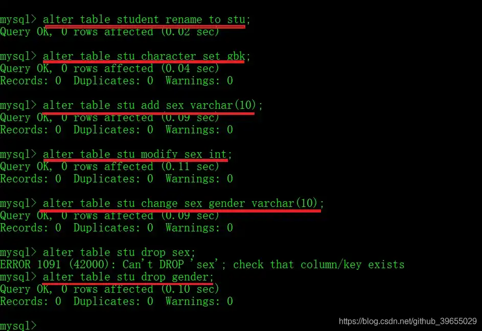

# MySQL 快速入门

> 作者：[村雨遥](https://github.com/cunyu1943)
> 
> 不要哀求，学会争取，若是如此，终有所获
> 

## 🎈 号外

最近，公众号之外，建立了微信交流群，不定期会在群里分享各种资源（影视、IT 编程、考试提升……）&知识。如果有需要，可以**扫码或者后台添加小编微信备注入群**。进群后**优先看群公告**，**呼叫群中【资源分享小助手】**，还能免费帮找资源哦～

<center>
 
</center>

## 数据库基本概念

### 什么是数据库

>   数据库，又称为数据管理系统，简而言之可视为电子化的文件柜——存储电子文件的处所，用户可以对文件中的资料运行新增、截取、更新、删除等操作。

>   所谓“数据库”是以 **一定方式** 储存在一起、能予多个用户共享、具有尽可能小的冗余度、与应用程序彼此独立的数据集合。一个数据库由多个表空间（`Tablespace`）构成。

>   数据库是结构化信息或数据（一般以电子形式存储在计算机系统中）的有组织的集合，通常由数据库管理系统 (DBMS) 来控制。在现实中，数据、`DBMS` 及关联应用一起被称为数据库系统，通常简称为数据库。

### 数据库的特点

1.  能够对数据持久化存储，相当于一个文件系统；
2.  方便存储和管理数据；
3.  使用统一的方式来操作（`SQL`）；

### 常见数据库软件


上图是截至 2021 年 4 月数据库使用率排行榜前 10 榜单，可以看到主要有 Oracle、MySQL、SQL Server、Redis、MongoDB、PostgreSQL、Elasticsearch，Db2 等数据库。而我们之所以选择 MySQL，主要有如下两个原因：

1.  **使用量大**，相比于其他数据库，其使用量仅次于 Oracle；
2.  **开源免费**，虽然 Oracle 很好，但是授权的价格却让人望而却步，许多小公司根本无力承担这笔费用，而选用开源免费的 MySQL 就成了大家的选择；

## MySQL

对于 MySQL 的安装，我这里以压缩包版本的安装为例。

### 安装

1.  **下载安装包**

首先去下载对应安装包，下载地址如下：

>   https://dev.mysql.com/downloads/mysql/

2.  **加载安装包到安装目录**

将下载后的压缩包接要到我们需要安装 MySQL 的路径，以下以我的安装路径 `D:\Softs\mysql-8.0.24-winx64` 为例。

3.  **配置文件**

一般来讲，解压后的文件目录中是不存在配置文件 `my.ini` 的，需要我们自己新建一个，新建后的目录结构如下图所示：


接着我们在配置文件中加入以下配置：

```ini
[mysqld]
# 设置3306端口
port=3306
# 设置mysql的安装目录
basedir=D:\Softs\mysql-8.0.24-winx64
# 设置mysql数据库的数据的存放目录
datadir=D:\Softs\mysql-8.0.24-winx64\data
max_allowed_packet = 20M
# 允许最大连接数
max_connections=200
# 允许连接失败的次数
max_connect_errors=10
# 服务端使用的字符集默认为utf8
character-set-server=utf8
#使用–skip-external-locking MySQL选项以避免外部锁定。该选项默认开启
; external-locking = FALSE
# 创建新表时将使用的默认存储引擎
; default-storage-engine=INNODB
; # 默认使用“mysql_native_password”插件认证
; default_authentication_plugin=mysql_native_password

; [mysqld_safe]
; log-error=D:\Softs\mysql-8.0.24-winx64\mysql_oldboy.err
; pid-file=D:\Softs\mysql-8.0.24-winx64\mysqld.pid
; # 定义mysql应该支持的sql语法，数据校验
; sql_mode=NO_ENGINE_SUBSTITUTION,STRICT_TRANS_TABLES
[mysql]
# 设置mysql客户端默认字符集
default-character-set=utf8
[client]
# 设置mysql客户端连接服务端时默认使用的端口
port=3306
# 设置mysql客户端默认字符集
default-character-set=utf8
```

4.  **配置环境变量**

- 打开控制面板->系统与安全->系统，进入高级系统设置，如下图所示；
    

- 然后进行环境变量的设置，如下图；
    
    

    

5.  **初始化**

控制台进入 MySQL 解压后的路径，然后以管理员身份执行如下命令；

```shell
mysqld --initialize --console
```

**注意**：执行成功后会打印出初始的 root 用户密码，一定要记住！！！方便后边修改密码；


6.  **安装数据库服务**

接上一步初始化数据库后，继续执行如下命令；

```shell
mysqld --install
```

因为博主已经安装过了，所以会提示服务已存在，若是第一次安装，则不会提示已安装；


### 卸载

卸载相对于安装就简单多了，只需要将我们的文件夹 `D:\Softs\mysql-8.0.24-winx64` 删除，然后将配置的环境变量删除即可。

### 配置

#### 启动 MySQL 服务

1.  **Windows 服务方式启动**

使用快捷键 `Win + X + G`，进入计算机管理界面，然后打开 **服务和应用程序 -> 服务**，找到 `MySQL` 服务，然后根据需要点击 **暂停**、**停止**、**重启动** 此服务即可；


2.  **终端命令打开**

Windows 下，使用快捷键 `Win + X + A`，以管理员权限打开命令控制符，然后使用如下命令打开、关闭、重启 MySQL 服务即可；

```bash
# 打开服务
net start mysql
# 关闭服务
net stop mysql
```


#### 登陆

安装并打开 MySQL 服务之后，我们就可以连接数据库进行使用了。MySQL 安装时默认提供了一个 `root` 用户，使用安装时设置的密码即可登陆。

1.  **mysql -u 用户名 -p**

```bash
mysql -u root -p
```


2.  **mysql -h ip地址 -u 用户名 -p**

```bash
mysql -h localhost -u root -p
```


#### 退出


```bash
exit;
quit;
```


## SQL

### 什么是 SQL

>   **Structured Query Language**：结构化查询语言是一种特定目的编程语言，用于管理关系数据库管理系统（RDBMS），或在关系流数据管理系统（RDSMS）中进行流处理。
>
>   SQL 基于关系代数和元组关系演算，包括一个数据定义语言和数据操纵语言。SQL 的范围包括数据插入、查询、更新和删除，数据库模式创建和修改，以及数据访问控制。尽管 SQL 经常被描述为，而且很大程度上是一种声明式编程（4GL），但是其也含有过程式编程的元素。

### SQL 通用语法

1.  SQL 语句能以单行或多行书写，以分号 `;` 表示一条语句的结束；

2.  MySQL 中的 SQL 语句不区分大小写，但是为了将关键字和自定义变量分开，建议关键字使用大写；

3.  MySQL 的 3 种注释方式；

    -   **单行注释**

    ```bash
    SQL语句 -- 注释内容
    SQL语句 # 注释内容
    ```

    

    

-   **多行注释**

```bash
SQL语句 /* 注释内容 */
```


### 常用 SQL 语句

对于 SQL 语句，我们可以分为如下几类：

-   **DDL**
-   **DML**
-   **DQL**
-   **DCL**

以下就分别来看看各类语句的具体相关信息。 

#### DDL（Data Definition Language）

1.  **定义**

用于 **定义数据库对象**：数据库、表、列等，相关关键字：`CREATE`、`DROP`、`ALTER`……

2.  **数据库操作**

-   **创建**

    -   创建数据库

    ```sql
    CREATE DATABASE 数据库名;
    ```

    -   创建数据库前先判断是否存在，不存在再创建

    ```sql
    CREATE DATABASE IF NOT EXISTS 数据库名;
    ```

    -   创建数据库的同时指定字符集

    ```sql
    CREATE DATABASE 数据库名 CHARACTER SET 字符集名;
    ```


-   **查询**

    -   查询所有数据库名称；

    ```sql
    SHOW DATABASES;
    ```

    -   查询某一数据库的字符集和它的创建语句；

    ```sql
    SHOW CREATE DATABASE 数据库名;
    ```


-   **更新**

    -   修改表名

    ```sql
    RENAME TABEL 表名 TO 新表名;
    ```

    -   修改数据库字符集

    ```sql
    ALTER DATABASE 数据库名 CHARACTER SET 字符集名;
    ```


-   **删除**

    -   删除数据库

    ```sql
    DROP DATABASE 数据库名;
    ```

    -   判断数据库是否存在，存在再删除

    ```sql
    DROP DATABASE IF EXISTS 数据库名;
    ```


-   **使用**

    -   使用某一个数据库

    ```sql
    USE 数据库名;
    ```

    -   查询当前正在使用的数据库

    ```sql
    SELECT DATABASE();
    ```


3.  **表操作**

-   **创建**

    -   语法

    ```sql
    CREATE TABLE 表名(
    	列名1 数据类型,
        列名2 数据类型,
        ……
        列名n 数据类型
    );
    ```

    -   常用数据类型

    | 类型        | 说明                               |
    | ----------- | ---------------------------------- |
    | `int`       | 整数类型                           |
    | `double`    | 小数类型                           |
    | `varchar`   | 字符串                             |
    | `date`      | 日期，只含年月日                   |
    | `datetime`  | 日期，不仅包含年月日，还包括时分秒 |
    | `timestamp` | 时间戳，包含年月日时分秒           |

    -   表复制

    ```sql
    CREATE TABLE 新表名 LIKE 被复制的表名;
    ```


-   **查询**

    -   查询某个数据库中所有的表

    ```sql
    SHOW TABLES;
    ```

    -   查询表结构

    ```sql
    DESC 表名;
    ```


-   **更新**

    -   修改表名

    ```sql
    ALTER TABLE 旧表名 RENAME TO 新表名;
    ```

    -   修改表的字符集

    ```sql
    ALTER TABLE 表名 CHARACTER SET 字符集名;
    ```

    -   在表中添加一列

    ```sql
    ALTER TABLE 表名 ADD 列名 数据类型;
    ```

    -   修改列名称以及对应的数据类型

    ```sql
    ALTER TABLE 表名 MODIFY 列名 新数据类型;
    ALTER TABLE 表名 CHANGE 列名 新列名 新数据类型;
    ```

    -   删除列

    ```sql
    ALTER TABLE 表名 DROP 列名;
    ```




-   **删除**

    -   直接删除表

    ```sql
    DROP TABLE 表名;
    ```

    -   判断表是否存在，存在则删除

    ```sql
    DROP TABLE IF EXISTS 表名;
    ```


​    

#### DML（Data Manipulation Language）

1.  **定义**

用于 **对数据库中表的数据进行增删改**，相关关键字：`INSERT`、`UPDATE`、`DELETE`……

2.  **添加数据**

	```sql
	INSERT INTO 表名(列名1, 列名2, ……, 列名n) VALUES (值1, 值2, ……, 值n);
	```

3.  **删除数据**

    -   删除所有记录，有多少条记录就执行多少次删除操作

    ```sql
    DELETE FROM 表名 [WHERE 条件];
    ```

    -   删除所有数据，先删除表，然后创建一张结构一样的表，比 `DELETE` 效率更高

    ```sql
    TRUNCATE TABLE 表名;
    ```

4.  **修改数据**

	```sql
	UPDATE 表名 SET 列名1=值1, 类名2=值2, ……, 类名n=值n [WHERE 条件];
	```


#### DQL（Data Query Language）

1.  **定义**

用于 **查询数据库中的数据**，相关关键字：`SELECT`、`HAVING`、`WHERE`……

2.  **语法**

```sql
SELECT 
	字段列表
FROM
	表名列表
WHERE
	条件列表
GROUP BY
	分组字段
HAVING
	分组后的条件
ORDER BY
	排序
LIMIT
	分页限定
OFFSET
	开始分页的起始位置
```

3.  **基础查询**

    -   多字段查询

    ```sql
    SELECT 字段1,字段2,…… FROM 表名;
    ```

    -   去重查询

    ```sql
    SELECT DISTINCT 去重字段,字段1,字段2,…… FROM 表名;
    ```

    -   起别名

    ```sql
    # 两者其一
    SELECT 字段名 AS 别名 FROM 表名;
    SELECT 字段名 别名 FROM 表名;
    ```

4.  **条件查询**

    -   `WHERE` 后加条件

| 关键字                          | 意思                                                 | 例子                                 |
| ------------------------------- | ---------------------------------------------------- | ------------------------------------ |
| `>`、`<`、`>=`、`<=`、`=`、`!=` | 大于、小于、不小于、不大于、等于、不等于             | `col_name != 4`                      |
| `BETWEEN…AND…`                  | 介于两数之间，包含左右边界                           | `col_name BETWEEN 10 AND 100`        |
| `NOT BETWEEN…AND…`              | 不在两数之间                                         | `col_name NOT BETWEEN 10 AND 100`    |
| `IN(…)`                         | 在一个列表中                                         | `col_name IN (1, 4, 5)`              |
| `NOT IN(…)`                     | 不在一个列表                                         | `col_name NOT IN (1, 4, 5)`          |
| `LIKE`                          | 模糊查询，`_` 表示单个的任意字符，`%` 表示多个字符串 | `col_name like "ABC_"`               |
| `IS NULL`                       | 判断某一字段是否为 `NULL`                            | `col_name IS NULL`                   |
| `AND` 或 `&&`                   | 表示并行关系                                         | `col_name1 == 5 AND col_name2 == 10` |
| `OR` 或 `||`                    | 表示满足其中任一条件即可                             | `col_name1 == 5 OR col_name2 == 10`  |
| `NOT` 或 `!`                    | 表示否定                                             | `col_name IS NOT NULL`               |


#### DCL（Data Control Language）

1.  **定义**

用于 **定义数据库的访问权限和安全级别，以及用户创建**，相关关键字：`GRANT`、`REVOKE`……

2.  **授权**

```sql
GRANT 权限 ON 数据库名.表名 用户@'主机IP' IDENTIFIED BY 用户密码;
```

3.  **撤回授权权限**

```sql
REVOKE 权限 数据库名.表名 ON FROM 用户名;
```


## 图形化工具

在本地安装好数据库之后，我们可以通过命令行来进行操作，但是为了更加直观的看到我们的数据库属性和数据，我们一般都会选择图形化的工具来辅助我们进行开发。而这里我们推荐 DBeaver（https://dbeaver.io）。

这是一款通用的免费跨平台数据库工具，供开发人员、数据库管理员、分析人员和所有需要使用数据库的人使用。而且支持当前所有流行的数据库：MySQL,、PostgreSQL,、SQLite,、Oracle,、DB2,、SQL Server,、Sybase,、MS Access,、Teradata,、Firebird,、Apache Hive,、Phoenix,、Presto 等。

### 安装过程

1. 双击打开下载好的 `.exe` 安装包，然后选择语言；


2. 进入安装程序，点击 **下一步**  继续；
    

3. 接受相关许可证协议；
    

4. 为所有使用该电脑的用户安装还是只为你当前的用户安装，一般选择所有用户；


5. 选择组件，一般默认即可，继续下一步；


6. 选择安装路径，一般建议存在你日常安装软件的地方，不要直接装在 C 盘；


7. 是否创建快捷方式，要的话就勾选，不要就不用管，直接安装；


8. 安装过程开始，等待结束就安装好了，然后根据自己喜好选择是否创建桌面快捷方式，最后点击完成即可；


### 连接数据库

1. 打开主界面后，依次打开 `文件 -> 新建 -> DBeaver -> 数据库连接`，然后下一步；


2. 选择对应数据库软件，我们这里以 MySQL 为例，然后选择下一步；


3. 输入数据库的地址、用户名、密码、端口号（默认是 3306）等信息，然后点击完成即可；


4. 连接成功，会在主界面中显示出当前连接数据库中的数据库信息；


可以看到 DBeaver 不仅仅支持查看数据库的相关属性，还能看到数据库的 ER 图，可以说是十分方便了；


以上就是关于如何安装以及简单使用 DBeaver 的相关知识了，更多关于 DBeaver 的高级使用技巧，等着你去探索！

## 总结

好了，以上就是今天的所有内容了。主要介绍了数据库的相关概念，并对 MySQL 的安装、卸载及配置进行了讲解。紧接着又对 SQL 进行了讲解，并对日常使用最多的一些 SQL 基础语句进行了介绍。最后，则是介绍了针对数据库图形化操作的工具 - DBeaver。如果你想要熟练地掌握常见的 SQL 语句，进一步提高自己的开发效率，那就赶紧去练习吧！