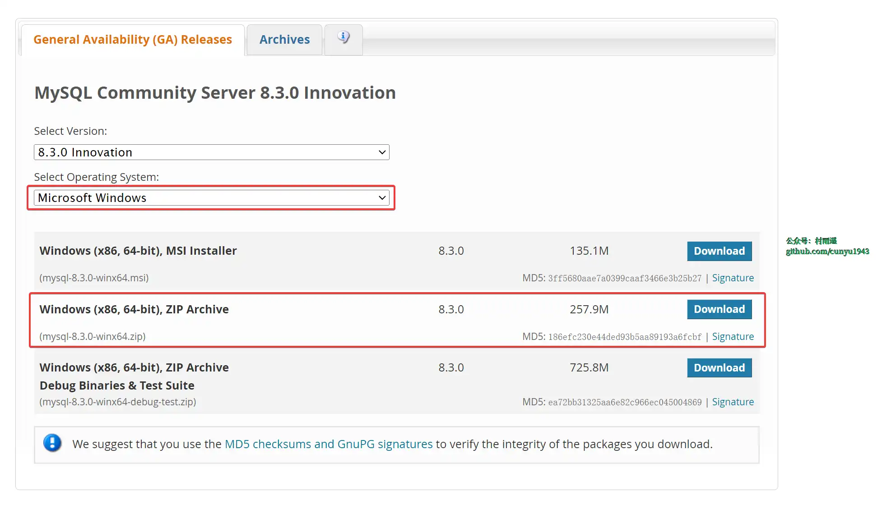
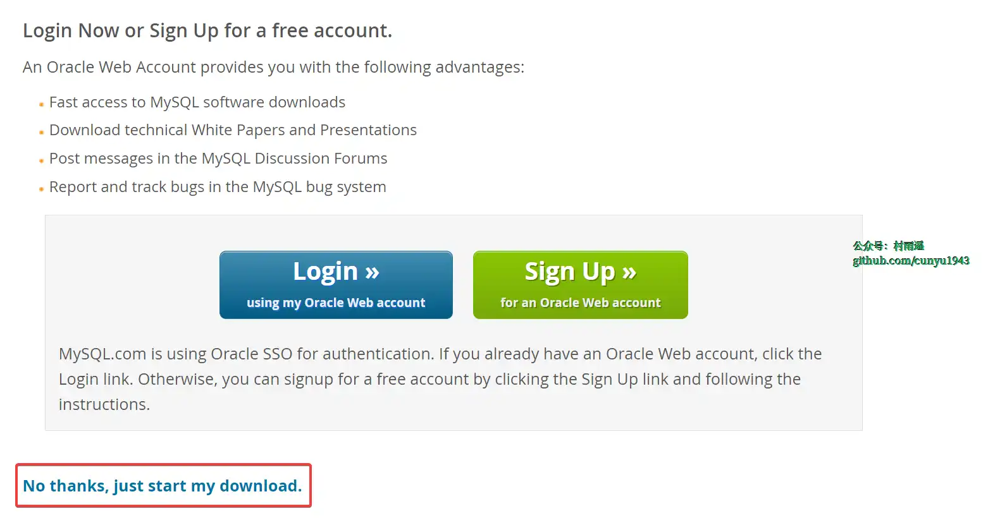
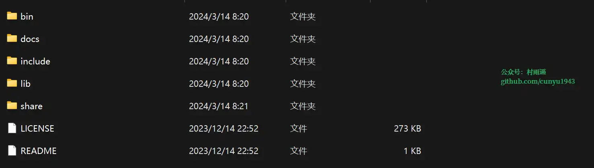
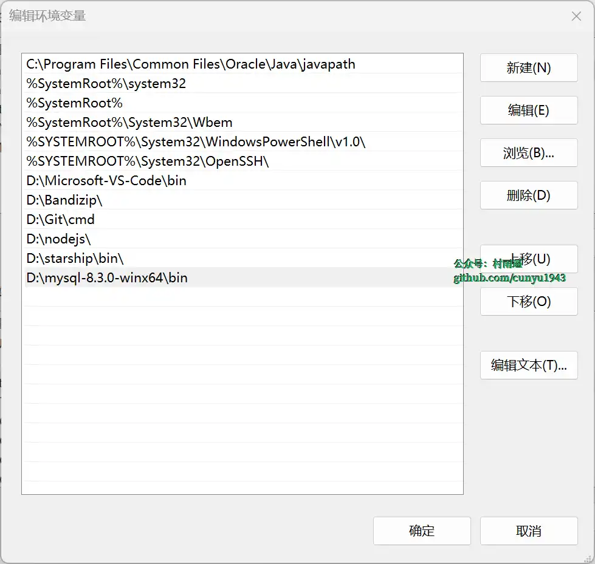
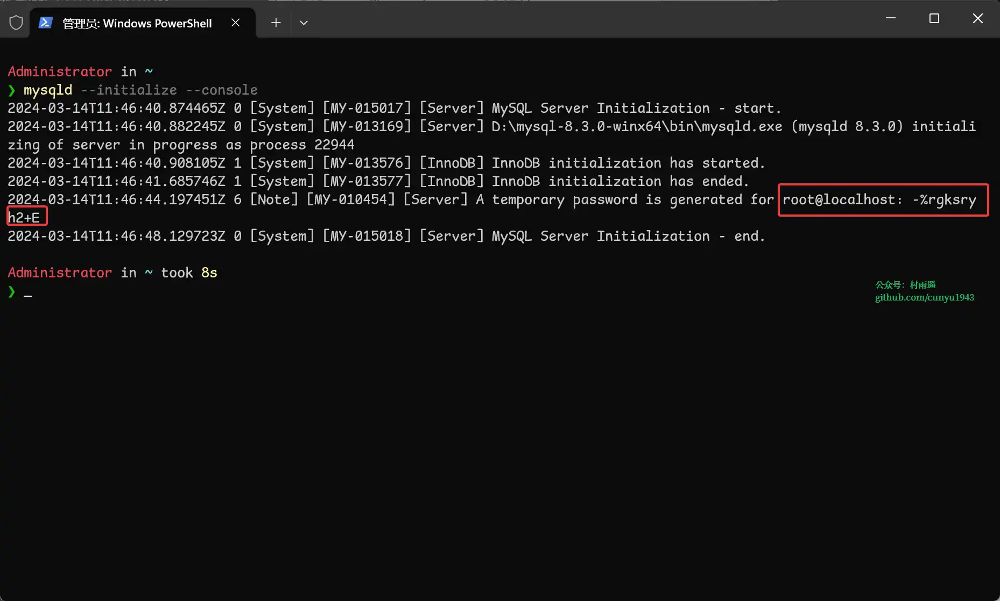
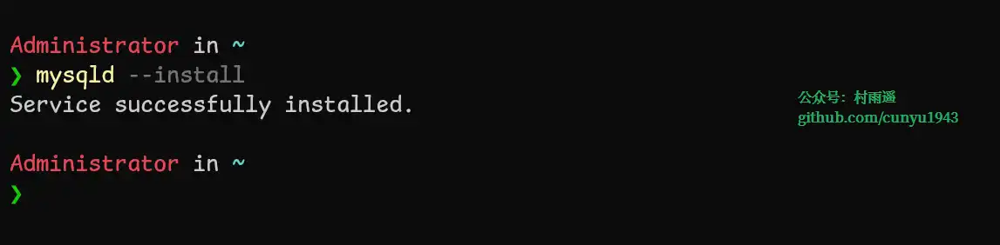
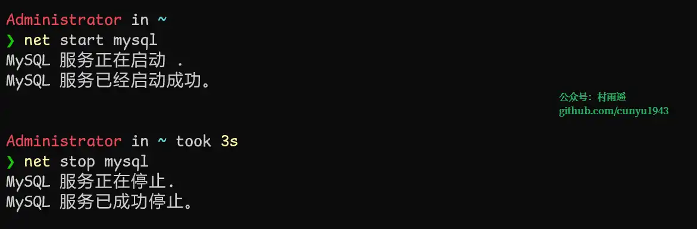
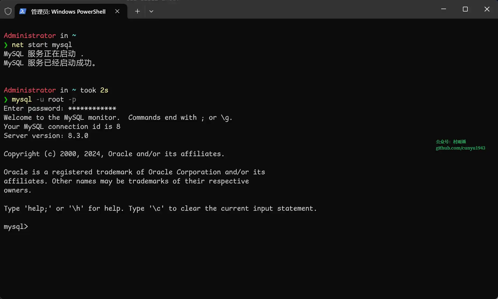
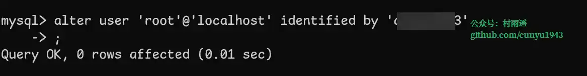

# 开发环境搭建

## 🎈 号外

最近，公众号之外，建立了微信交流群，不定期会在群里分享各种资源（影视、IT 编程、考试提升……）&知识。如果有需要，可以**扫码或者后台添加小编微信备注入群**。进群后**优先看群公告**，**呼叫群中【资源分享小助手】**，还能免费帮找资源哦～

<center>
 
</center>

## 下载

> https://dev.mysql.com/downloads/mysql/





## 安装

第一步，解压缩下载后的压缩包。



第二步，添加环境变量，在系统变量的 `Path` 下新增指向 `MySQL` 的 `bin` 目录。



第三步，在 `MySQL` 解压目录下新建配置文件 `my.ini`，然后写入以下内容。其中 `D:\mysql-8.3.0-winx64` 是解压后的路径，需要根据自己实际情况更改。

```ini
[mysqld]
# 设置3306端口
port=3306
# 设置mysql的安装目录
basedir=D:\mysql-8.3.0-winx64
# 设置mysql数据库的数据的存放目录
datadir=D:\mysql-8.3.0-winx64\data
# 允许最大连接数
max_connections=200
# 允许连接失败的次数
max_connect_errors=10
# 服务端使用的字符集默认为utf8
character-set-server=utf8
#使用–skip-external-locking MySQL选项以避免外部锁定。该选项默认开启
external-locking = FALSE
# 创建新表时将使用的默认存储引擎
default-storage-engine=INNODB 
# 默认使用“mysql_native_password”插件认证
default_authentication_plugin=mysql_native_password

[mysqld_safe]
log-error=D:\mysql-8.3.0-winx64\mysql.err
pid-file=D:\mysql-8.3.0-winx64\mysqld.pid
# 定义mysql应该支持的sql语法，数据校验
sql_mode=NO_ENGINE_SUBSTITUTION,STRICT_TRANS_TABLES
[mysql]
# 设置mysql客户端默认字符集
default-character-set=utf8
[client]
# 设置mysql客户端连接服务端时默认使用的端口
port=3306
# 设置mysql客户端默认字符集
default-character-set=utf8
```

第四步，以管理员权限打开控制台，输入以下命令，会打印初始化的 `root` 密码，一定要记住，待会儿要用它来改密码。

```shell
mysqld --initialize --console
```



第五步，安装 `MySQL` 服务。

```shell
mysqld --install
```




最后，我们就可以通过以下命令来启动和关闭 `MySQL` 服务了。

```shell
# 开启
net start mysql
# 关闭
net stop mysql
```



## 修改密码

安装时，我们已经有了 `root` 用户的初始密码，但是随机生成的密码比较难记，所以大多时候都会修改默认密码。

修改密码前，我们需要登录 `root` 用户。

```shell
mysql -u root -p
```



紧接着，我们对 `root` 用户默认密码进行修改。

```shell
alter user 'root'@'localhost' identified by '新密码';
```



最后，退出登录后就可以用我们刚改好的密码进行重新登录了。

