# JDK 安装及入门实例


> 作者：[村雨遥](https://github.com/cunyu1943)
> 
> 不要哀求，学会争取，若是如此，终有所获
>
> 原文：https://mp.weixin.qq.com/s/geOWlAwVMhtmmIMvFvjSpQ


## 一、前言

作为一个入门的学习者，要进行 Java 开发，那怎么能少得了 JDK 呢？本文就先来看看如何安装并配置 JDK，为后续的学习做好铺垫。

在正式学习之前，我们先来了解一下 Java 开发环境的完整生态。现代 Java 开发不仅需要 JDK，还需要一个趁手的 IDE（集成开发环境）。目前市场上主流的 Java IDE 有：

- **IntelliJ IDEA**：专业 Java 开发者的首选，智能代码补全、强大的重构能力和调试功能，据统计超过 68% 的专业 Java 开发者使用它
- **Visual Studio Code**：轻量级编辑器，通过 Java Extension Pack 可以获得良好的 Java 开发体验，完全免费
- **Eclipse**：经典开源 IDE，插件生态丰富，适合传统企业级项目

对于初学者而言，推荐使用 IntelliJ IDEA 社区版（免费）或 VS Code + Java Extension Pack。

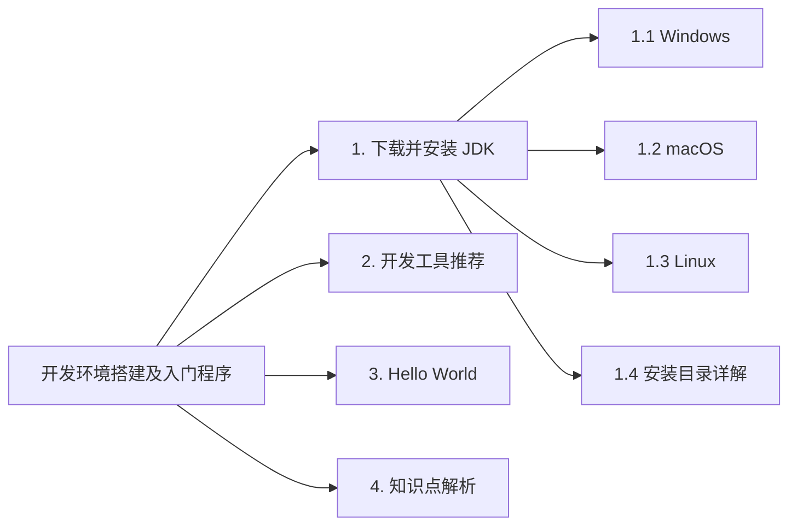

关于 JDK 版本选择，目前主流的 LTS（长期支持）版本有：
- **JDK 17**：成熟稳定，企业级应用首选
- **JDK 21**：最新的 LTS 版本，包含虚拟线程等重磅特性
- **JDK 8**：虽然老旧，但仍有不少 legacy 项目在使用

本文以 JDK 17 为例进行演示，它是目前最推荐的初学者版本，既具备现代特性，又拥有最完善的学习资源和社区支持。

## 二、下载并安装 JDK

什么是 JDK 呢？JDK（Java Development Kit）即 Java 开发者工具包，使我们学习 Java 语言必须安装的一个工具。

这里主要以 Windows 和 macOS 系统中 JDK 的安装为例，一来因为考虑到大家用的最多的还是 Windows 和 macOS 系统，二来则是因为手边没有安装 Linux 图形化系统。如果恰好你使用的是 Linux 系统，那么推荐你参考一下其他的资料，同样你也可以参考我的另一篇文章：[手把手带你玩转 Ubuntu](https://cunyu1943.blog.csdn.net/article/details/105648148)。

### 1. Windows

#### 1.1 下载 JDK

1.  首先进入 [Oracle 官网](https://www.oracle.com/java/technologies/javase-downloads.html)，然后找到自己想要的 JDK 版本，这边以 JDK 17 为例（推荐初学者使用 LTS 版本）；

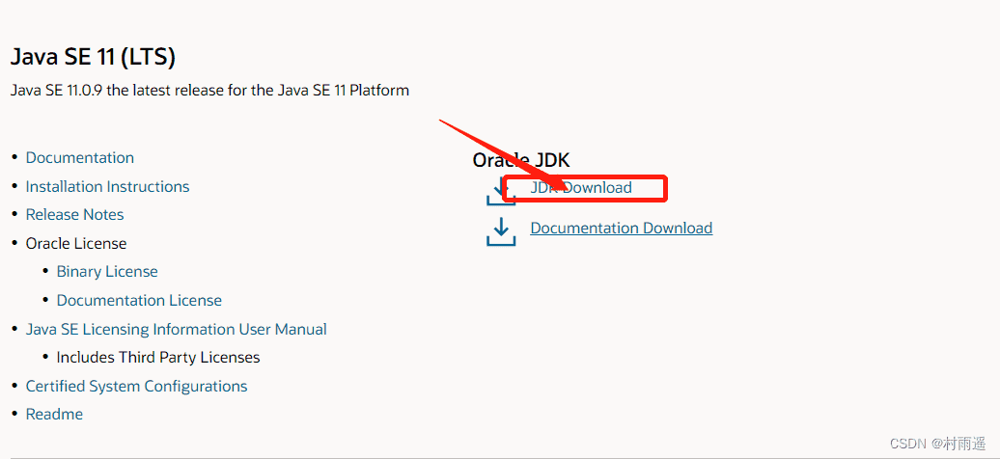

::: tip 国内镜像加速下载
如果觉得 Oracle 官网下载速度较慢，可以使用国内镜像源：
- 华为云镜像：https://repo.huaweicloud.com/java/jdk/
- 阿里云镜像：https://mirrors.aliyun.com/OpenJDK/
:::

2.  点击 JDK Download 后，它会跳转到具体下载页面，然后根据自己的系统来进行选择，此处以 Windows 10 64 位为例；

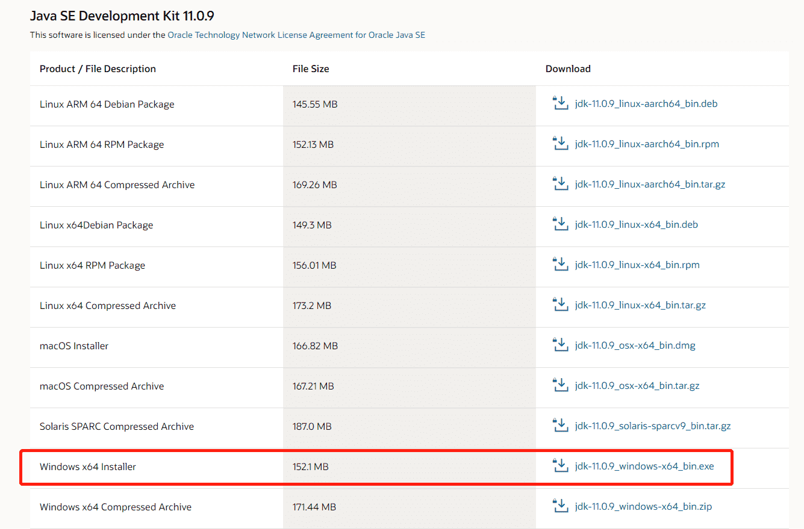

3.  点击最后的连接后，它会让你同意协议，勾选同意，然后登陆你的 Oracle 账户即可开始下载，若是没有 Oracle 账户，点击下面的创建一个即可；

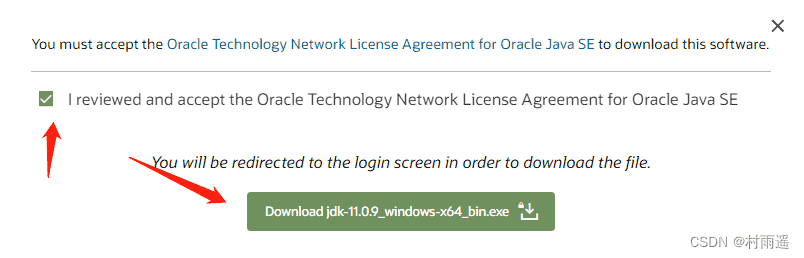

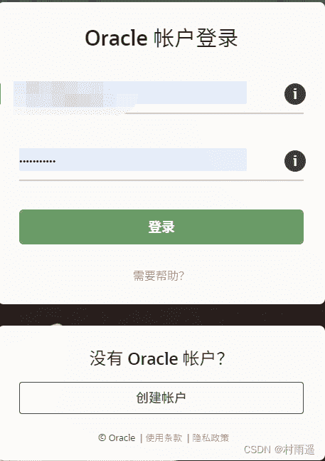

#### 1.2 安装

4.  下载完成后，进行安装即可，安装流程和我们平常安装软件的一样，就再赘述，需要注意的是要记住如下的安装路径，因为一般我们都不会安装到默认路径，所以一定要记住你所安装到的路径，这关系到后续的配置步骤；

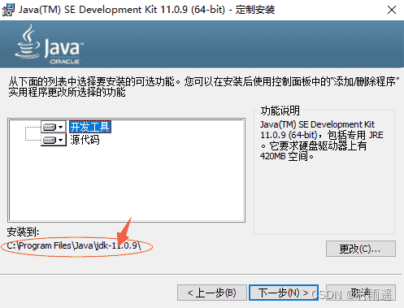

::: tip 安装路径建议
- 安装路径最好不要包含中文或特殊字符
- 建议使用简单路径，如 `D:\jdk\jdk17`
- 避免路径中有空格，这可能导致后续配置问题
:::

#### 1.3 配置 JDK

好了，经过上面的配置，我们的 JDK 就已经安装好了，但是这个使用你是用不了的，我们还需要进一步的配置；

打开系统属性来进行环境变量配置，打开系统属性并进行配置的方式如下：

1.  **Windows + R** 快捷键组合唤醒 Windows 运行窗口，然后输入 `sysdm.cpl`，紧接着回车即可，一般会打开如下界面，然后点击最上方的 **高级**；

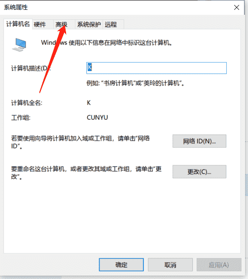

2.  点击高级后，就会打开如下界面，然后打开环境变量；

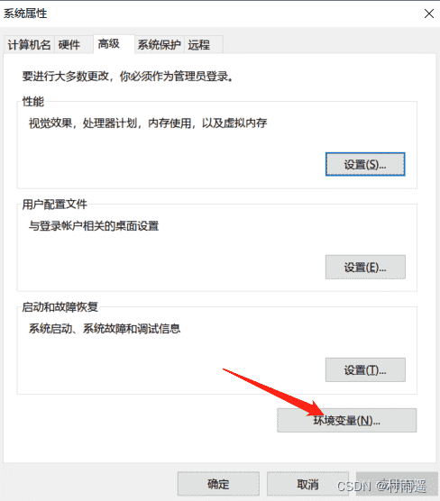

3.  新建环境变量 **JAVA_HOME**，然后变量值填入刚才安装 JDK 的路径（刚才提醒过要记住！）；

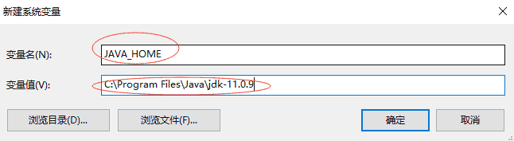

4.  编辑 **Path** 环境变量，然后新建一个变量值，填入如下内容：`%JAVA_HOME%\bin`；

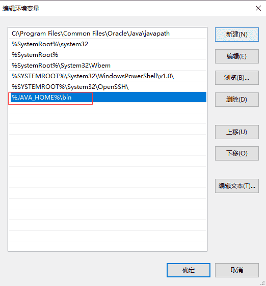

5.  各种确定，然后突出系统属性即可，到这一步，理论上我们的 JDK 就安装并配置成功了，接下来我们就去确认一下到底安装好了没；

#### 1.4 验证 JDK

按照上述步骤操作完成之后，接下来就是验证了，一般我们可以通过如下三个命令来进行验证；

```sh
# 查看 JDK 版本
java -version

# 编译命令
javac

# 运行命令
java
```

打开命令控制台（**Windows + R，然后输入 cmd 回车**），然后输入如上三个命令，如果安装成功，一般是会出现如下内容的；

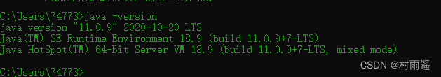

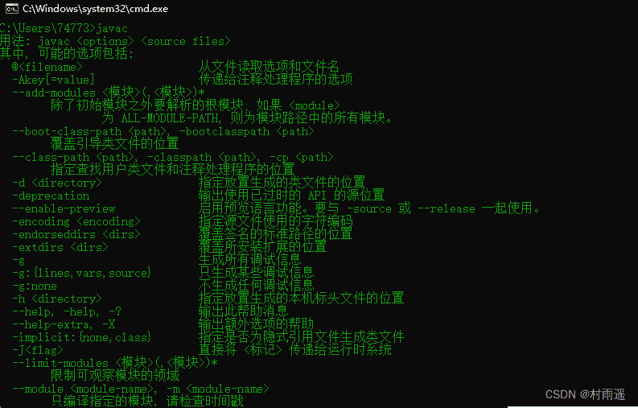

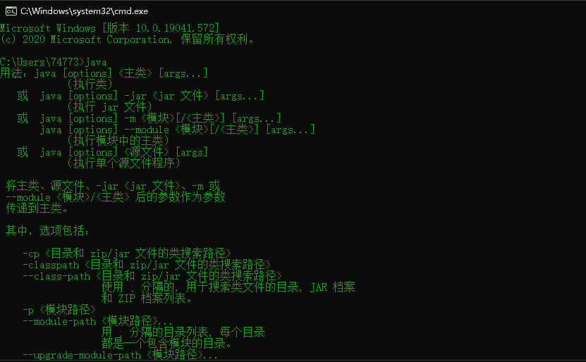

::: tip 常见问题排查
如果出现 `'java' 不是内部或外部命令` 之类的错误，请检查：
1. JAVA_HOME 环境变量是否正确设置
2. Path 中是否添加了 `%JAVA_HOME%\bin`
3. 是否重新打开了命令提示符窗口
4. JDK 安装路径是否包含中文或特殊字符
:::

### 2. macOS

#### 2.1 通过 Homebrew 安装（推荐）

macOS 用户推荐使用 Homebrew 包管理器来安装 JDK，这种方式更加便捷，且不需要手动配置环境变量。

1.  首先确保已安装 Homebrew，如果没有可以在终端中执行：

```sh
/bin/bash -c "$(curl -fsSL https://raw.githubusercontent.com/Homebrew/install/HEAD/install.sh)"
```

2.  安装 JDK 17（推荐）：

```sh
brew install openjdk@17
```

3.  配置环境变量，将以下内容添加到 `~/.zshrc` 或 `~/.bash_profile`：

```sh
echo 'export PATH="/usr/local/opt/openjdk@17/bin:$PATH"' >> ~/.zshrc
source ~/.zshrc
```

4.  验证安装：

```sh
java -version
```

#### 2.2 通过官方安装包安装

如果选择使用官方安装包，可以按照以下步骤操作：

1.  首先去 [官网下载](https://www.oracle.com/java/technologies/javase-jdk11-downloads.html) 对应安装包；

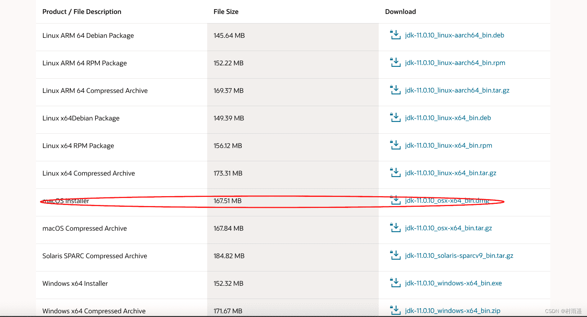

2.  接受相关协议并登录下载；

3.  双击下载好的 `.dmg` 安装包，然后开始安装；

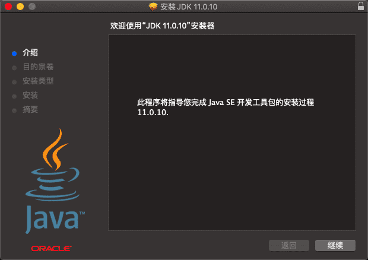

4.  安装过程中会让你输入密码，也就是你本机的密码。

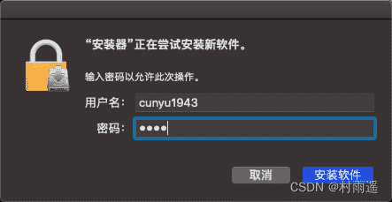

5.  安装成功；

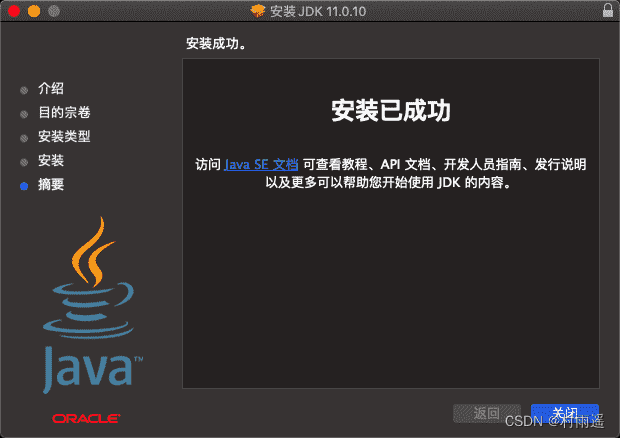

#### 2.3 验证

不同于 Windows，macOS 下不用再去配置了，它会给你自动配置好，我们只需要去验证即可；

1.  查看 JDK 版本；

```sh
java -version
```

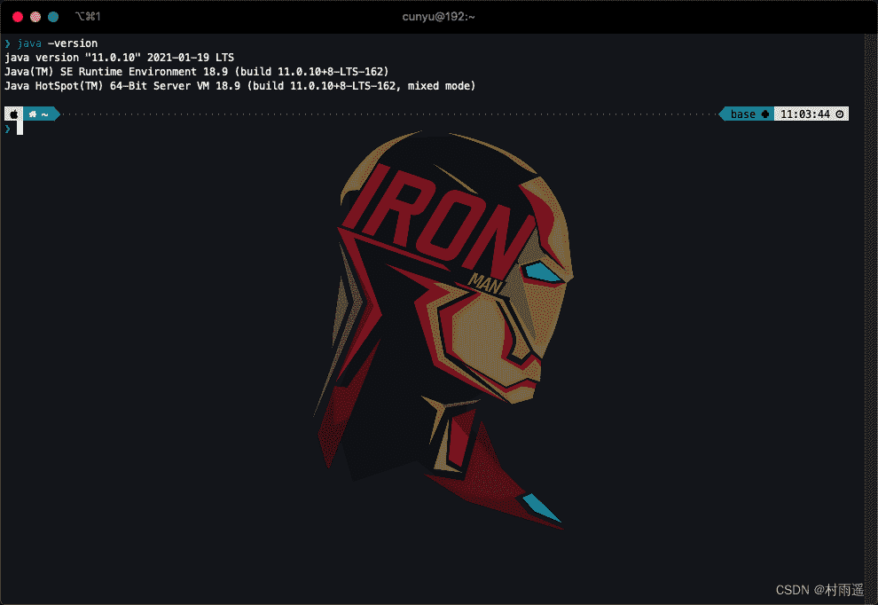

2.  编译命令；

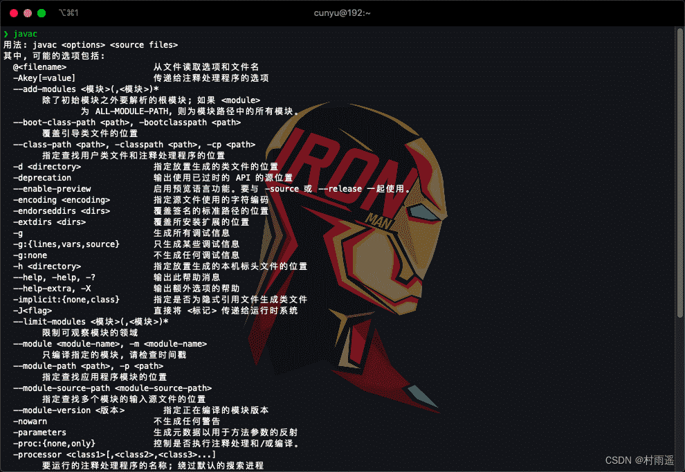

3.  运行命令；

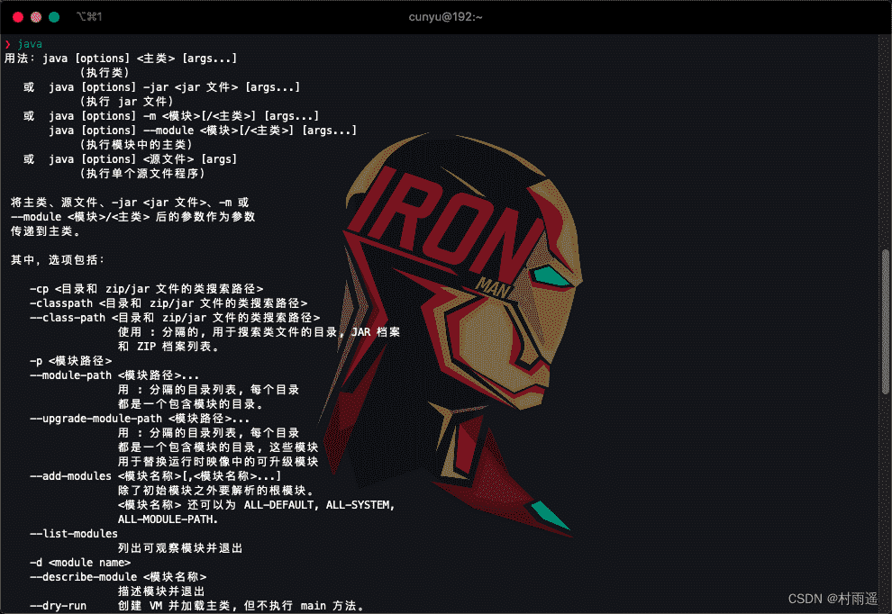

### 3. Linux

Linux 系统有多种安装方式，以下介绍常用的两种方法。

#### 3.1 通过 apt 安装（Ubuntu/Debian）

```sh
# 更新软件包列表
sudo apt update

# 安装 OpenJDK 17
sudo apt install openjdk-17-jdk

# 验证安装
java -version
```

#### 3.2 通过 tar.gz 手动安装

1.  下载 JDK tar.gz 包（如 `jdk-17_linux-x64_bin.tar.gz`）

2.  解压到指定目录（通常放在 `/opt` 下）：

```sh
sudo tar -xzvf jdk-17_linux-x64_bin.tar.gz -C /opt
```

3.  配置环境变量，编辑 `~/.bashrc` 或 `~/.profile`：

```sh
export JAVA_HOME=/opt/jdk-17
export PATH=$JAVA_HOME/bin:$PATH
```

4.  使配置生效：

```sh
source ~/.bashrc
```

5.  验证安装：

```sh
java -version
javac -version
```

### 4. 安装目录详解

安装好 `JDK` 之后，打开安装路径，通常情况下会有如下的目录结构：

| 目录      |                                                                                           |
| --------- | ----------------------------------------------------------------------------------------- |
| `bin`     | 用于存放各种工具命令，比如我们最常用的 `javac`、`java` 等                                 |
| `conf`    | 存放相关配置文件，如 Java 运行时配置                                                     |
| `include` | 存放一些平台特定的头文件，比如 `Windows`、`macOS`、`Linux` 平台下这里的头文件是有所不同的 |
| `jmods`   | 存放各种模块化的 JDK 组件                                                                |
| `legal`   | 存放各模块的授权文件                                                                      |
| `lib`     | 存放工具的一些补充 `jar` 包，以及 JDK 核心类库                                            |

::: tip 重要工具一览
- `java`：启动 Java 应用程序的解释器
- `javac`：Java 编译器，将 .java 文件编译成 .class 字节码文件
- `jar`：Java 归档工具，用于打包 Java 类库
- `javadoc`：Java 文档生成器，根据源代码注释生成 API 文档
- `jdb`：Java 调试器，用于调试 Java 程序
:::

## 二、开发工具推荐

现代 Java 开发离不开一个好的 IDE，以下是几种主流的选择：

### 1. IntelliJ IDEA（推荐）

IntelliJ IDEA 是目前最受欢迎的 Java IDE，由 JetBrains 公司开发。据统计，超过 68% 的专业 Java 开发者使用它。

**特点**：
- 智能代码补全和重构能力业界领先
- 强大的调试功能，支持多种断点类型
- 优秀的 Maven/Gradle 集成
- 支持 Spring、Jakarta EE 等主流框架

**版本选择**：
- **社区版（免费）**：适合学习 Java 基础，足够满足初学者需求
- **终极版（付费）**：包含更多高级功能，适合企业级开发

**下载地址**：https://www.jetbrains.com/idea/download/

### 2. Visual Studio Code

VS Code 是微软开发的轻量级代码编辑器，通过扩展可以支持 Java 开发。

**特点**：
- 启动速度快，占用资源少
- 插件生态丰富，可扩展性强
- 跨平台支持好
- 完全免费

**Java 开发必备扩展**：
- Language Support for Java (Red Hat)
- Debugger for Java
- Test Runner for Java
- Maven for Java
- Project Manager for Java

**下载地址**：https://code.visualstudio.com/

### 3. Eclipse

Eclipse 是经典的开源 IDE，虽然市场份额有所下降，但在传统企业级项目中仍有广泛应用。

**特点**：
- 完全免费开源
- 插件生态极其丰富
- 适合大型团队协作开发

**下载地址**：https://www.eclipse.org/downloads/

::: tip 初学者建议
对于 Java 初学者，推荐按以下优先级选择 IDE：
1. **IntelliJ IDEA 社区版** — 功能全面，对新手友好
2. **VS Code + Java Extension Pack** — 轻量级，适合多语言开发场景
3. **Eclipse** — 适合对 Eclipse 熟悉的开发者
:::

## 三、你的第一个 Java 程序：HelloWorld

好了，经过上面的安装配置，我们就可以开始我们的第一个 Java 程序编写了。

要开发一个 Java 程序，主要分成 3 个步骤：

1.  **编写代码** — 使用文本编辑器或 IDE 编写 Java 源代码文件
2.  **编译代码** — 使用 `javac` 命令将 .java 文件编译成 .class 字节码文件
3.  **运行代码** — 使用 `java` 命令执行编译后的字节码文件

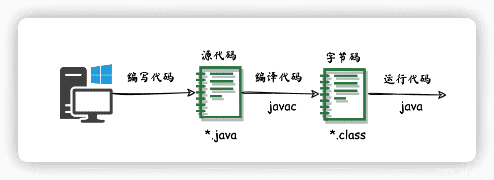

我们不需要任何的基础，只需要按照上面的步骤配置好 JDK 之后，然后以上三个步骤逐一来进行就可以了。下面就来进行具体实践：

### 1. 编写代码

打开编辑器（推荐 `VS Code` 或 `IntelliJ IDEA`），如果没有，记事本也成，然后写入如下内容，然后保存为 `Main.java`，这里文件名一定要是 `Main`，文件后缀名为 `.java`。

```java
public class Main {
    public static void main(String[] args) {
        System.out.println("Hello World!");
    }
}
```

::: tip 代码编写规范
- Java 是大小写敏感的语言，`Main` 和 `main` 是不同的标识符
- 类名必须与文件名相同，且首字母大写
- 每条语句以分号 `;` 结尾
- 使用花括号 `{}` 定义代码块
- 养成良好的缩进习惯，代码更易读
:::

### 2. 编译代码

打开控制命令台，然后进入上述文件存放的路径，使用如下命令进行编译，然后会生成一个 `Main.class` 文件；

```sh
javac Main.java
```


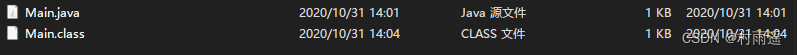

编译成功后，会在同目录下生成 `Main.class` 文件，这是 Java 字节码文件，可以被 Java 虚拟机（JVM）执行。

### 3. 运行代码

运行，使用如下命令进行运行，然后就可以看到打印出的最终结果了！

```sh
java Main
```


::: tip 注意事项
- 运行命令中使用的是类名 `Main`，而不是文件名 `Main.class`
- 不要添加 `.class` 后缀，否则会报错
- 如果使用 IDE，通常可以直接点击运行按钮，更加便捷
:::

## 四、知识点说明

我们的 Hello World 是打印出来了，但是你肯定对里边的代码很感兴趣，这一节就主要针对我们的 Hello World 程序进行说明；

```java
public class Main {
    public static void main(String[] args) {
        System.out.println("Hello World!");
    }
}
```

完整的程序代码如上，下面逐一解释各个部分的含义：

### 1. public class Main

- `public`：权限修饰符，表示这个类是公开的，可以被其他类访问。Java 中还有 `protected`、`default`（不写修饰符）、`private` 这几种权限修饰符
- `class`：Java 关键字，用于声明一个类
- `Main`：类名，在 Java 中，类名必须与文件名相同，否则编译会报错。类名通常使用大写字母开头

::: tip 类命名规范
- 类名必须与文件名相同
- 应使用有意义的名称，使用 PascalCase 命名法（首字母大写）
- 一个 Java 文件中只能有一个 public 类
:::

### 2. public static void main(String[] args)

这是 Java 程序的主方法，是所有 Java 程序的入口点。

- `public`：表示该方法是公开的，JVM 可以从外部调用
- `static`：表示该方法是静态的，可以直接通过类名调用，而不需要创建类的实例
- `void`：表示该方法没有返回值
- `main`：方法名，JVM 只会识别这个名字作为程序入口
- `String[] args`：方法的参数，这是一个字符串数组，用于接收命令行参数

::: tip main 方法的重要性
每个可执行的 Java 程序都必须包含一个 `main` 方法，它是程序执行的起点。没有 main 方法，程序将无法独立运行。
:::

### 3. System.out.println("Hello World!");

这是 Java 中最常用的输出语句。

- `System`：Java 系统类，提供访问系统资源的能力
- `out`：System 类的静态成员，表示标准输出流（默认是控制台）
- `println`：打印并换行的方法，类似的还有 `print`（打印不换行）
- `"Hello World!"`：要输出的字符串，必须用双引号括起来

```java
System.out.println("第一条输出");
System.out.print("第二条输出");  // 不会换行
System.out.println("第三条输出");
```

输出结果：
```
第一条输出
第二条输出第三条输出
```

### 4. Java 代码整体结构

```java
public class Main {    // 1. 类声明
    public static void main(String[] args) {  // 2. main 方法（程序入口）
        System.out.println("Hello World!");   // 3. 输出语句
    }  // main 方法结束
}  // 类结束
```

一个完整的 Java 程序结构：
- 必须有一个 public 类
- public 类名必须与文件名相同
- public 类中必须包含 main 方法
- main 方法是程序的入口点

## 五、总结

好了，今天的内容到此就结束了，主要介绍了如何在 Windows、macOS 和 Linux 中安装 JDK，具体过程可以总结如下：

- **安装**：下载并安装 JDK，建议选择 LTS 版本（如 JDK 17 或 JDK 21）
- **配置**：配置 JAVA_HOME 环境变量，并将 JDK 的 bin 目录添加到 PATH
- **验证**：使用 `java -version`、`javac -version` 和 `java` 命令验证安装

然后编写了我们的第一个 `Hello World` 程序，并利用安装好的的 JDK 对其进行编译和运行。最后，则是对我们的 `Hello World` 程序中的相关知识进行了详细介绍。

::: tip 下一步学习建议
- 熟练使用 IDE（如 IntelliJ IDEA）来编写和运行 Java 程序
- 学习 Java 基本语法、数据类型、运算符等基础知识
- 了解面向对象编程的概念：类、对象、继承、封装、多态
- 学习常用的 Java API，如集合框架、IO 操作、异常处理等
- 尝试编写一些小项目来巩固所学知识
:::

恭喜你完成了 Java 开发环境搭建！现在你已经具备了开始 Java 编程的基础。继续加油，探索 Java 编程的精彩世界！

