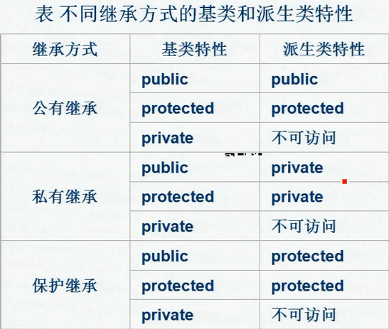
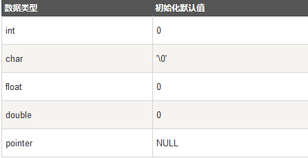

# 知识点总结

::: info 共勉
不要哀求，学会争取。若是如此，终有所获。
:::

## const 在不同位置时的不同意义

- 指针类型前：声明一个指向常量的指针，程序中不能通过指针来改变它所指向的值，但指针本身的值可以改变，即指针可以指向其他数据；
- \"*"号和指针名之间，声明一个指针常量(常指针)，指针本身的值不可改变，即不能指向其他数据，但指向的数据的值可以改变；
- 两个地方都加，声明指向常量的指针常量，指针本身的值不可改变，指向的数据也不能通过指针改变；

## 函数指针

- 使用函数指针之前，必须先赋值，使它指向一个函数入口地址，赋值语法格式为：函数指针名 = 函数名，其中函数名代表的函数必须是一个已经定义过的，和函数指针具有相同返回类型的函数，指针调用函数格式：`(*指针变量)(实参列表)`；

## 访问权限

- public：可被任意实体访问；
- protected：只允许本类及子类的成员函数访问；
- private：只允许本类的成员函数访问；

## 构造函数

- 创建对象时，自动调用构造函数，不能在程序中直接调用，可有任意类型参数，但不能有返回类型；
- 构造函数作用：为对象分配空间、为数据成员赋初值、请求其他资源；
- 构造函数工作：初始化虚函数表、建立基类对象、建立非静态数据成员对象、安置虚基类对象信息、执行构造函数体中的代码；
- 若一个类中没有定义构造函数，编译器会自动生成不带参数的默认构造函数，格式为：

```c++
<类名>::<默认构造函数名>()
{
}
```

## 析构函数

- 析构函数作用：清除对象、释放内存；
- 析构函数工作：执行析构函数中的代码、将对象占据的存储空间归还系统、做公共及用户要求的善后工作；
- 析构函数无参数和返回值，一个类中只能定义一个析构函数，故不能重载，格式为：

```c++
~<类名>();
```

## 内存布局

- 全局数据区：存放全局变量、静态数据、常量；
- 代码区：存放类成员函数、其他函数代码；
- 栈区：存放局部变量、函数参数、返回数据、返回地址；
- 堆区：自由存储区；

## 运算符重载重载形式

- 重载为类的成员函数，参数个数比原来的运算数少一个

```c++
<函数类型> operator <运算符> (<形参列表>)
{
<函数体>;
}
```

- 重载为类的友元函数，参数个数与原运算数个数一样多；

```c++
friend <函数类型> operator <运算符> (<形参列表>)

{

<函数体>;

}
```

- 函数重载：返回值类型可以相同可以不同，但形参列表一定不同；

## 静态数据成员

- 初始化格式：```<类型><类名>::<静态数据成员>=<值>;```
- 引用格式：```<类名>::<静态数据成员>;```

## 继承方式

- 私有继承 private：父类的公有成员和保护成员作为子类的的私有成员，且不能被子类的派生类访问；
- 公有继承 public：父类的公有成员和保护成员作为子类的成员时，仍保持原有状态，父类私有成员仍为私有；
- 保护继承 protected：父类的公有成员和保护成员成为子类的保护成员，且只能被他的派生类成员函数或友元访问，父类私有成员仍为私有；



## 派生类构造函数调用顺序：

- 调用基类的构造函数，调用顺序按继承时说明的顺序；
- 调用子对象类的构造函数，调用顺序按在类中说明的顺序；
- 派生类构造函数体中内容；

## 函数模版

```C++
template < 模板形参表 >template <typename T>
返回值类型 函数名（形式参数列表）
{
函数体语句
}
例：
template <typename T>
void swap( T& v1, T& v2)
{
T temp;
temp = v1;
v1 = v2;
v2 = temp;
}
```

## 虚函数

- 虚函数必须是类的成员函数，不能是友元，但可以是另一个类的友元，不能为全局函数，也不能为静态函数，析构函数可以为虚函数，但构造函数不能为虚函数；

## 变量初始化

- 局部变量：定义时，系统不会进行初始化；
- 全局变量：定义时，系统自动初始化，



## 友元函数

- 在类中定义过，但不是成员函数，定义在类外部，但有权访问类中成员；

## this 指针

- 只有成员函数才有 `this `指针，友元函数没有 `this` 指针；

## 静态成员函数与普通成员函数区别：

- 静态成员函数没有 `this` 指针，只能访问静态成员（包括静态成员变量和静态成员函数）；
- 普通成员函数有 `this` 指针，可以访问类中任意成员，而静态成员函数无 `this `指针； 


## ⏳ 联系

想解锁更多知识？不妨关注我的微信公众号：**村雨遥（id：JavaPark）**。

扫一扫，探索另一个全新的世界。


<Share colorful />

