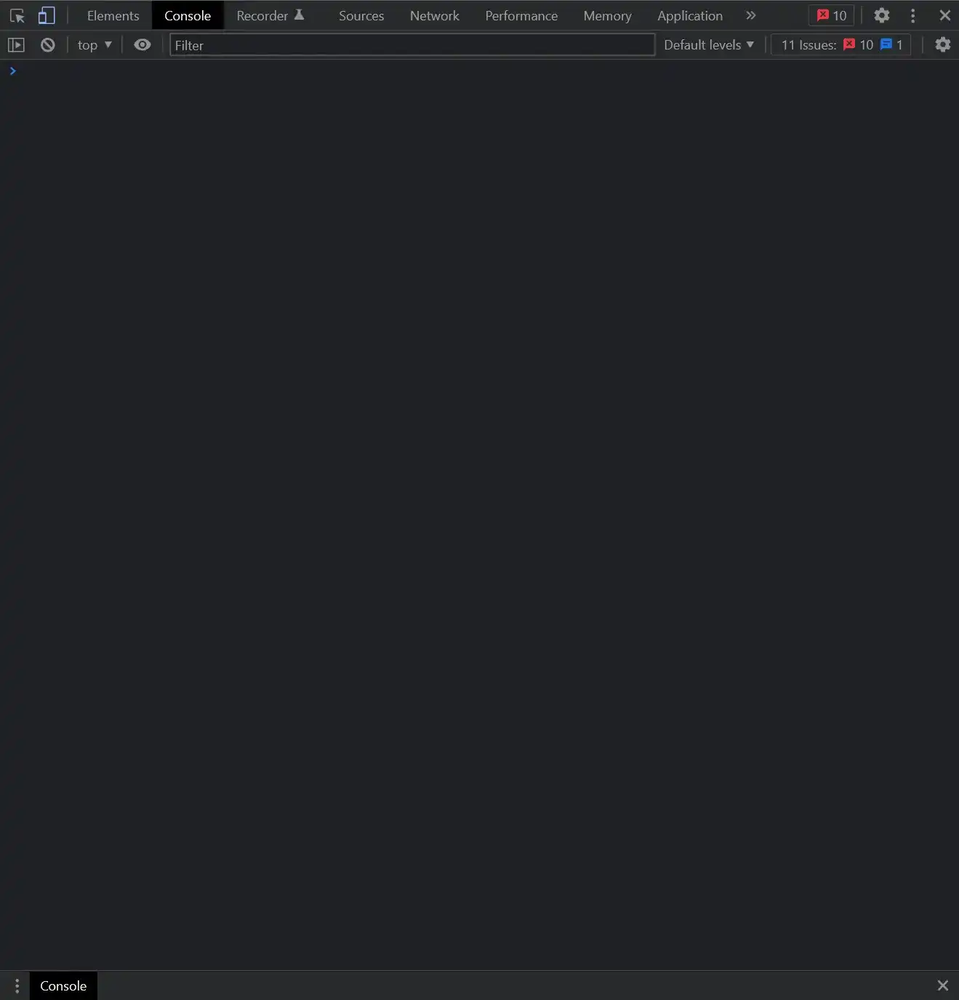
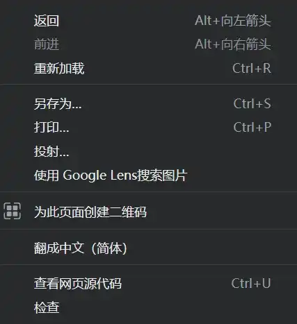
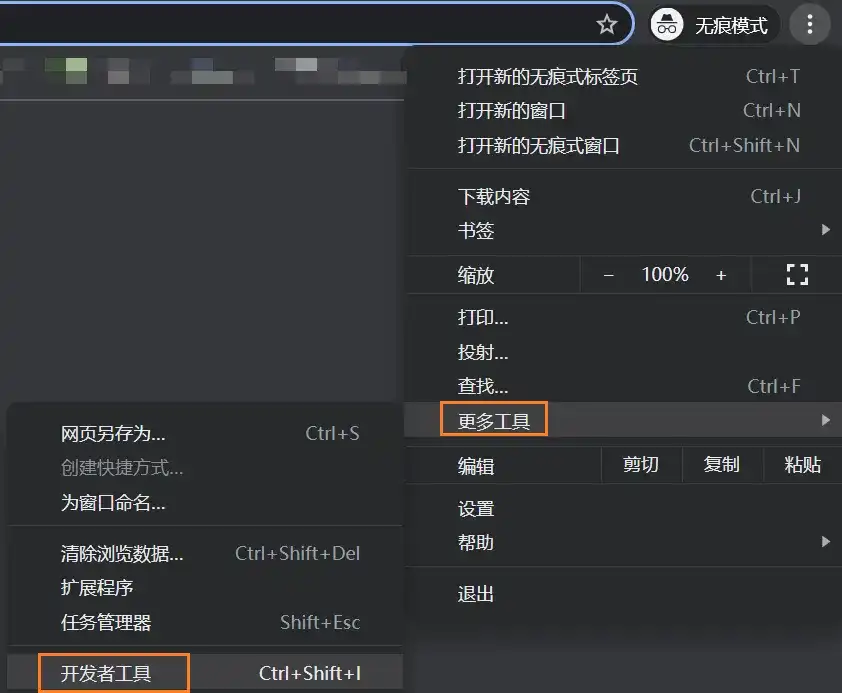
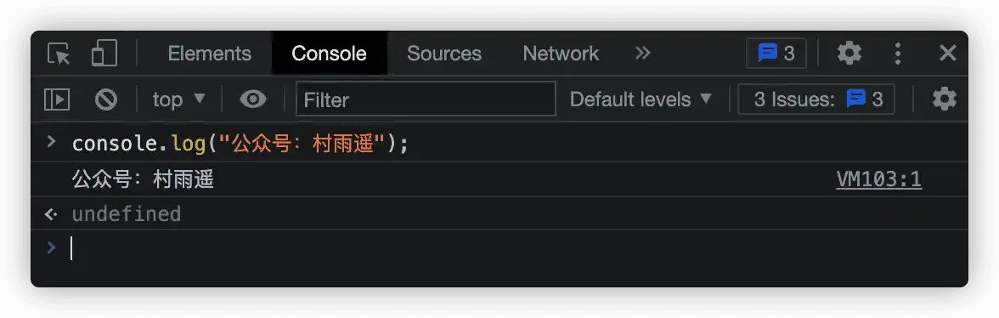
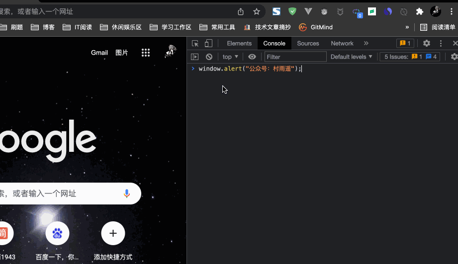
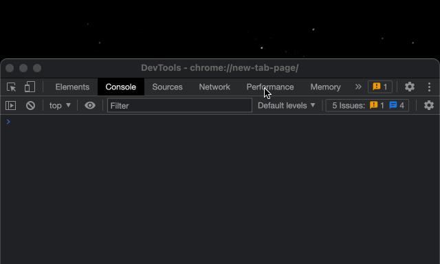
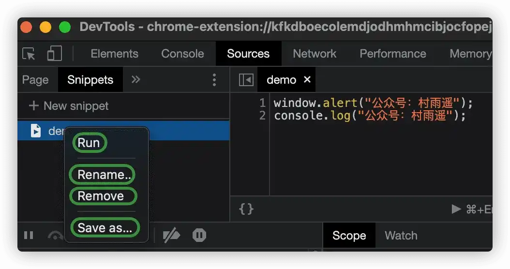
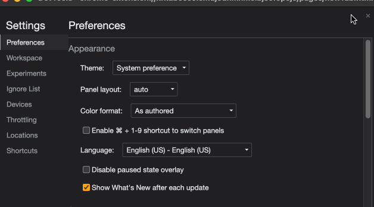

# Chrome 中执行 JavaScript 代码

## 前言

要在浏览器中执行 `JavaScript` 脚本，首先你的浏览器得支持。现在主流推荐 `Chrome` 浏览器，也可以使用基于 `Chromium` 的 `Edge` 浏览器。下面来介绍如何在 `Chrome` 中打开开发者工具，以及如何在开发者工具中运行调试 `JavaScript` 代码。

## 打开开发者工具

Chrome 中的开发者工具界面如下图所示。



要打开 Chrome 开发者工具来运行调试前端代码，常见的有 3 种方式。

1.   **右键“检查”**

在 Chrome 中打开一个页面之后，我们可以在页面中单击鼠标右键，然后在菜单中中选择**“检查”**，这样就可以打开开发者工具了。



2.   **快捷键 F12**

同样的，一般在 Chrome 中，可以直接通过 `F12` 快捷键来打开开发者工具。

3.   **菜单进入**

依次从右上角菜单栏中选择 `更多工具 -> 开发者工具` 开启。当然，这里也可以看到，其实我们也可以通过另一组快捷键来开启（`Ctrl + Shift + I`）。如果你对 Chrome 足够熟悉，那么这也是一种可选的方式。



## 开发者工具中执行 JavaScript 代码

要在开发者工具中执行 JavaScript 代码，也主要可以利用两种方式，一种是在 `Console` 窗口对 JavaScript 代码进行调试，而另一种方式则是使用 Chrome 中的 snippets 小脚本来执行。

下面我将对这两种方式分别做一个介绍，以便大家能熟练掌握。

1.   **Console 窗口执行**

在上面打开开发者工具之后，我们会发现一个 Console 窗口，此时只要在 Console 窗口中 `>` 符号后边输入我们需要执行的代码，然后回车即可执行。

以下是两个实例，第一个实例将会在控制台中打印**公众号：村雨遥**，而第二个实例则会在浏览器中弹窗并显示**公众号：村雨遥**。

```javascript
console.log("公众号：村雨遥");
```



```javascript
window.alert("公众号：村雨遥");
```



2.   **Snippet 脚本**

除开在 Console 窗口中执行 JavaScript 脚本之外，我们还可以在 Chrome 中创建一个脚本，然后再执行，具体方式如下。

在开发者工具中切换到 Sources 菜单，然后选择其中的 `Snippets` 选项卡，接着点击下方的 `+ New snippet` 来新建一个脚本文件。

我们可以对新建的脚本文件进行重命名，然后在右侧的框中编写我们的 JavaScript 代码，编写完成之后点击 `Ctrl + Enter` 即可执行，效果同在 Console 中一样。

以下是一个 Snippet 脚本执行实例，新建的脚本执行后，先是弹窗，同时在 Console 界面打印出了内容。

```javascript
window.alert("公众号：村雨遥");
console.log("公众号：村雨遥");
```




在创建的 Snippet 脚本上单击鼠标右键，我们可以进行如下操作：

-   **Run**：运行，执行我们创建的脚本。
-   **Rename**：重命名，对我们创建的脚本进行重命名。
-   **Remove**：删除，移除我们创建的脚本。
-   **Save as**：另存为，将我们创建的脚本导出。



## 注意

我们会发现打开的 Chrome 开发者工具都是英文形式的，但实际上现在的 Chrome 开发者工具早已经支持中文。如果您对英文界面使用起来有所困难，可以通过以下的方式将开发者工具切换为简体中文。

点击开发者工具右上角的 ⚙，然后选择 `Language` 为 `Chinese`，也就是我们的中文，接着重新载入开发者工具即可。



## 总结 

以上就是今天的所有内容了，主要介绍了如何打开 Chrome 中的开发者工具，并且利用开发者工具如何来执行 JavaScript 脚本。

如果您觉得本文还不错，欢迎点赞、收藏、转发，您的关注是我坚持的最大动力！