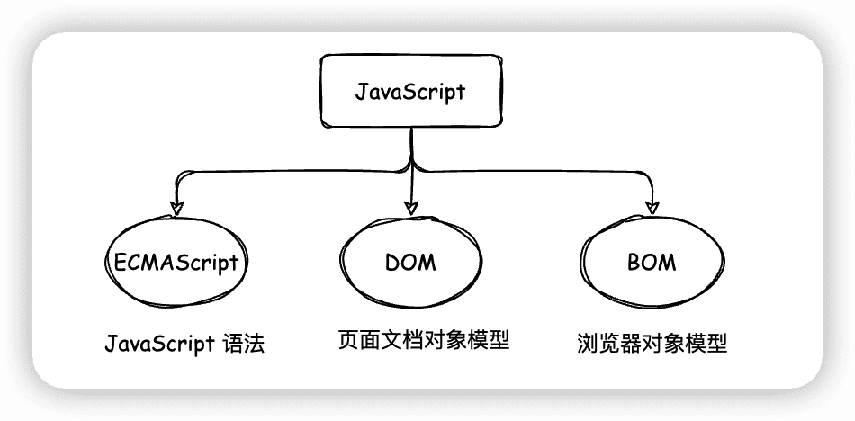
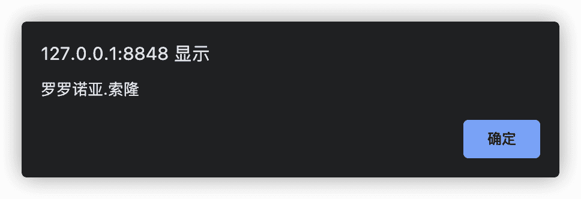
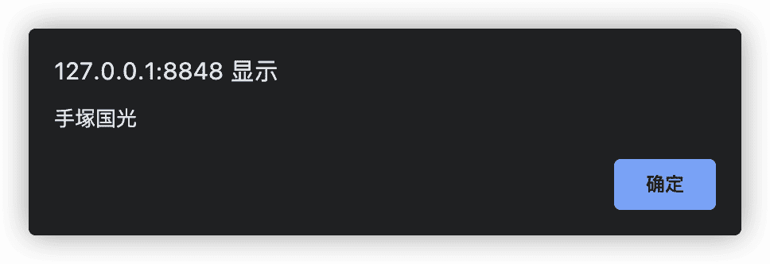

# 简介

## 什么是 JavaScript

作为世界上最流行的语言之一，是一种运行在客户端的脚本语言。而所谓脚本语言，就是不需要编译就能运行的编程语言，JavaScript 在运行过程中通过 JS 解释器来逐行解释然后执行。

## JavaScript 能做什么？

最初的时候，JavaScript 被设计出来的初衷是为了实现表单的动态校验，比如密码长度校验、邮箱格式校验等。但渐渐随着 JavaScript 的发展，JavaScript 变得越来越强大，也发展出了许多产物，如 `Node.js`、`Electron`、`Cordova`、`Ruff`、`cocos2d-js`。利用这些产物，我们可以用来进行服务器的开发、桌面程序的搭建、APP 的开发、硬件-物联网的控制、游戏开发等等工作。

## HTML、CSS、JavaScript 之间的关系

HTML 和 CSS 不同于 JavaScript，它们都是描述类语言，其中 HTML 主要用于决定网页结构和内容（决定网页上能看到什么），而 CSS 则主要用于定义网页所呈现给用户的模样（决定网页是否美观）。JavaScript 则是专注于实现业务逻辑和页面控制（决定网页提供的功能）。

如果把这三者比作一个王者荣耀中的英雄的话，那 HTML 就相当于原皮的英雄，而 CSS 则是相当于英雄的皮肤，让我们的英雄更帅气，而 JavaScript 则相当于英雄的技能，我们可以通过控制英雄通过技能来实现杀敌清兵的效果。

## 浏览器如何执行 JavaScript

JavaScript 一般运行在网页中的，所以一般是在浏览器中运行。而浏览器一般分为两部分，一个是**渲染引擎**，另一个则是 **JS 引擎**，两者的功能如下：

-   **渲染引擎**：用于解析 HTML 和 CSS 代码，大家一般把它叫做内核，比如 Chrome 浏览器的  Blink，Firefox 浏览器的 Gecko。
-   **JavaScript 引擎**：也叫做 JavaScript 解释器，主要用于读取网页中的 JavaScript 代码，然后对其处理用执行，如 Chrome 浏览器的 V8，Firefox 的 TraceMonkey。

所以名义上虽然说是浏览器执行了 JavaScript 代码，但如果看底层的话，却会发现其实 JavaScript 代码是通过浏览器中的 JavaScript 引擎来执行的。JavaScript 引擎在执行代码时会逐行解释源代码，将其转换为机器语言，然后交由计算机执行。也正因为如此，所以将 JavaScript 划分为脚本语言，它会逐行去解释执行，而不是像 HTML、CSS 类似的标记语言。

## JavaScript 的组成



1.   **ECMAScript**

ECMAScript 是由 ECMA 国际进行标准化的一门编程语言，往往被大家称为 JavaScript 或者 JScript，但实际上并不是一个东西，后两者其实是基于 ECMAScript 的实现和扩展。其中，JavaScript 是由网景公司所提出，而 JScript 则是由微软公司所提出。 所以 ECMAScript 更像是一种规范，它规定了 JavaScript 的编程语法和基础核心知识，然后所有的浏览器厂商都需要共同遵守这一套 JavaScript 语法工业标准。

2.   **DOM**

DOM（Document Object Model）即文档对象模型，是由 W3C 组织推荐的用于处理可扩展标记语言的**标准编程接口**。通过 DOM 所提供的各种接口，我们就能够轻易地对网页上的各种元素进行操作，如调整位置、大小、颜色等。

3.   **BOM**

     BOM（Browser Object Model）即浏览器对象模型，它提供了独立于内容，能够与浏览器进行交互的对象结构。通过使用 BOM，我们就能够十分方便的操作浏览器窗口，如弹出提示框、控制跳转、获取分辨率等操作。

## JavaScript 入门体验

JavaScript 的书写位置主要有 3 种，分别是行内式、内嵌式和外部式，以下就分别来看看各种方式的写法。

1.   **行内式**

首先是行内式，顾名思义，所谓行内式，就是将少量的 JavaScript 代码直接写在 HTML 标签的时间属性中，比如下面的代码。通过点击页面中的按钮，页面就会弹窗。

```html
<!DOCTYPE html>
<html>
	<head>
		<meta charset="utf-8" />
		<meta name="viewport" content="width=device-width, initial-scale=1">
		<title>JavaScript 入门体验</title>
	</head>
	<body>
		<input type="button" value="楚子航" onclick="alert('路明非')"/>
	</body>
</html>
```


行内式的特点就是比较简单，但是也存在很多问题。比如可读性较差，如果需要在 HTML 编写大量 JavaScript 代码时，此时阅读就很不方便。除此之外，JavaScript 和 HTML 中都会使用到引号，如果出现多层引号相互嵌套时，会非常容易混淆，导致代码实现结果出错。所以除非特殊情况，否则一般不推荐使用行内式。

2.   **内嵌式**

相比于单行式，内嵌式就更加清晰明了。我们通过将 JavaScript 代码封装到 `<script>` 标签中，然后就可以实现简单的弹窗功能了。内嵌式的代码可读性更高，也更方便纠错。

```html
<!DOCTYPE html>
<html>
	<head>
		<meta charset="utf-8" />
		<meta name="viewport" content="width=device-width, initial-scale=1">
		<title>JavaScript 入门体验</title>
		<script>
			alert("罗罗诺亚.索隆")
		</script>
	</head>
	<body>
	</body>
</html>
```




3.   **外部式**

最后一种就是外部式，通过在外部新建一个后缀名为 `.js` 的文件，然后将 JavaScript 直接写到该文件中，最后在 HTML 页面中通过 `<script>` 标签的 `src` 属性引入即可。

外部式的优点是很明显的：

-   首先，可读性提高。JavaScript 代码量较大时，通过放在独立的文件中，排除了 HTML 和 CSS 元素的干扰。
-   其次，代码复用率提高。假设我们其他业务需要同样的功能，我们只需要将封装好的 `.js` 文件引用过去即可使用。

```js
alert("手塚国光")
```

```html
<!DOCTYPE html>
<html>
	<head>
		<meta charset="utf-8" />
		<meta name="viewport" content="width=device-width, initial-scale=1">
		<title>JavaScript 入门体验</title>
		<script src="js/my.js"></script>
	</head>
	<body>
	</body>
</html>
```




## 总结

本文主要从 JavaScript 的组成定义，功能使用，同 HTML 与CSS 之间的关系以及最简单的入门体验几个方面，对 JavaScript 做了一个简单的介绍。如果你也是刚学习 JavaScript 的新手，那就一起学起来吧。