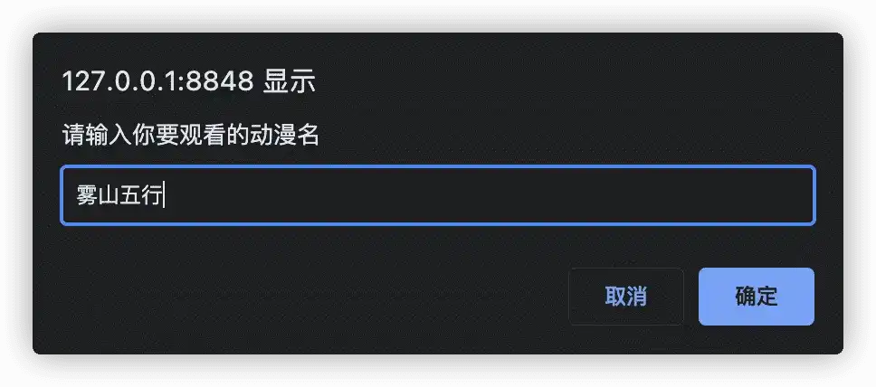
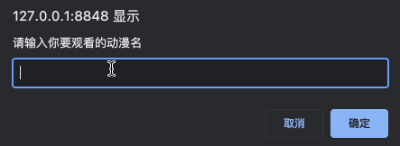
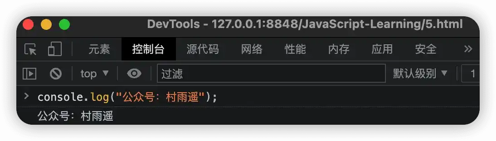

# 注释、输入输出、变量

## 注释

为了提高代码的可读性，我们往往需要在代码中添加一些额外的信息，但是我们又不想让这些信息影响到代码的执行。这时候，我们就需要使用到注释。JavaScript 中，主要有两种注释，一种是单行注释，另一种则是多行注释，和 Java 中的注释很相似。

1.   **单行注释**

单行注释以 `//` 开头，后边接上需要注释的信息即可。

```js
// 单行注释
alert("虞姬");
```

2.   **多行注释**

多行注释则是以 `/*` 开头，以 `*/` 结尾，两者中间所包含的内容则是我们的注释。

```js
/* 
	多行注释 
 */
alert("网球王子");
```

## 输入输出

为了方便信息的输入输出，JavaScript 中也像其他编程语言一样，提供了常用的输入输出语句。而其中最常用的，莫过于以下 3 个方法了。

| 方法               | 功能                         | 归属   |
| ------------------ | ---------------------------- | ------ |
| `alert(msg)`       | 弹出警示框                   | 浏览器 |
| `console.log(msg)` | 控制台打印输出信息           | 浏览器 |
| `prompt(info)`     | 弹出输入框，用户可以输入信息 | 浏览器 |

1.   **prompt(info)**

通过使用该方法，我们可以让用户在打开页面时让浏览器自动弹出输入框，然后用户就能够根据提示来进行信息输入。以下是一个简单的示例，通过弹窗让用户输入想要观看的动漫。

```html
<!DOCTYPE html>
<html>
	<head>
		<meta charset="utf-8" />
		<meta name="viewport" content="width=device-width, initial-scale=1">
		<title>Java 基础语法</title>
	</head>
	<body>
		<script>
			prompt('请输入你要观看的动漫名');
		</script>
	</body>
</html>
```



2.   **alert(msg)**

该方法可以在网页中弹出警示框，将信息展示给用户。紧接着上一个方法，假设用户输入后我们要让用户再次看到他刚才的输入，那我们就可以通过弹窗将刚才输入的信息进行展示。

```html
<!DOCTYPE html>
<html>
	<head>
		<meta charset="utf-8" />
		<meta name="viewport" content="width=device-width, initial-scale=1">
		<title>Java 基础语法</title>
	</head>
	<body>
		<script>
			var name = prompt('请输入你要观看的动漫名');
			alert(name);
		</script>
	</body>
</html>
```



3.   **console(msg)**

这个方法主要是用于在浏览器的控制台打开，而一般用户也用不到这个，更多的是开发人员用于调试开发时使用。



## 变量

### 什么是变量

其实在上面的例子中我已经试用过变量了，也就是在使用 `alert(msg)` 方法举例时，其中用的 `name` 其实就是一个变量。

所谓变量，可以把它看做是用来存放数据的容器。我们通过**变量名**来获取容器中的数据，也可以进行数据修改等操作。其本质其实是程序在内存中所申请的用来存放数据的一块空间。

### 如何使用变量

要使用一个变量也很简单，同样以下面的例子来说。

```js
var name = prompt('请输入你要观看的动漫名');
alert(name);
```

主要可以把变量的使用拆解为两个步骤，第一步就是对变量进行声明，第二步则是对变量进行赋值。上面的例子是将两个步骤合二为一，而这个过程我们也叫做 **变量的初始化**，在声明变量的同时也给对象赋了值。如果要对其进行拆分，则可以拆分为以下步骤：

```js
// 声明变量
var name;
// 变量赋值
name = prompt('请输入你要观看的动漫名');
// 使用变量
alert(name);
```

其中 `var` 是 JavaScript 中的一个关键字，用于声明变量。 通过使用该关键字对变量进行声明后，计算机就会自动为变量分配内存空间，而无需我们程序员去操作。`name` 则是我们所定义的变量名，通过变量名，我们就可以访问计算机在内存中所分配的空间了。

### 变量命名规范

学习了变量的定义以及如何使用变量，接下来就要看看如何规范地进行变量命名。变量命名时，我们常常需要遵守以下的相关规则。

1.   只能由字母（`a-zA-Z`）、数字（`0-9`）、美元符号（`$`）、下划线（`_`） 组成。
2.   严格区分大小写。
3.   不能以数字开头。
4.   不能是 JavaScript 中的关键字、保留字。
5.   变量名应该有意义，而且应当遵守驼峰命名法。

## 总结

以上就是 JavaScript 中的注释、输入输出、变量的相关知识点了。通过这些知识点的学习，我们应该能够掌握变量的定义、使用、命名规则，如何在 JavaScript 中使用注释以及注释的分类，最后则是如何在浏览器中通过弹窗实现简单的输入输出。