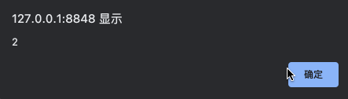
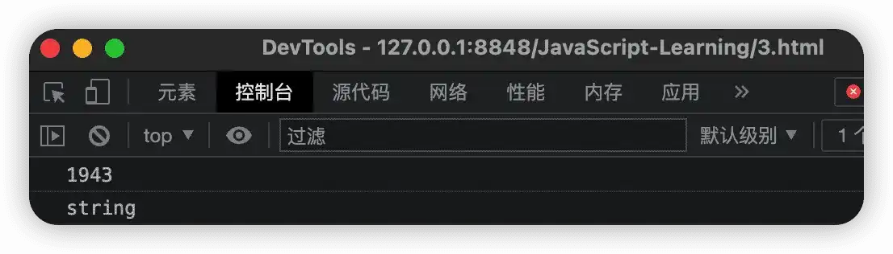

# 数据类型

## 导读

初步了解 JavaScript 之后，我们又学习了注释、输入输出以及变量的相关知识。本文紧接上两部分，来继续带领大家学习 JavaScript 中的数据类型知识，本文主要内容如下：

1.   数据类型简介
2.   数据类型分类
3.   变量数据类型获取
4.   常用的数据类型转换

## 简介

在计算机中，不同数据所需要的存储空间是不一样的，为了尽可能的提高内存利用率，方便把数据划分为所需内存大小不同的数据，于是需要将不同数据定义为对应的数据类型。

最常见的就是字符串和数字，就像“公众号：村雨遥”这个字符串和 1943 这个数字所对应的类型是不一样。

不同于 Java 这样的编程语言，JavaScript 是一种弱类型的语言。这意味在 JavaScript 中，不用提前声明变量的类型，在程序运行过程中，JavaScript 引擎会自动确定变量类型。在 Java 中，如果我们要定义一个变量，通常需要像如下形式：

```java
int name = "村雨遥";
```

但是在 JavaScript 中，我们只需要按照下面的方式定义即可。

```js
var name = '村雨遥';
```

也正是由于 JavaScript 的动态特性，所以在 JavaScript 中，变量的数据类型是可以变化的。

以下是一个变量数据类型动态变化的实例，一开始变量是一个字符串，然后我们又把它变成了数字类型。

```js
var name = '村雨遥';
name = 1943;
```

## 数据类型分类

在 JavaScript 中，数据类型可以分为两大类：

-   **基本数据类型**：`Number`、`String`、`Boolean`、`Undefined`、`Null`

-   **复杂数据类型**：`object`

基本数据类型详情如下表所示：

| 数据类型    | 说明                                                     | 默认值      |
| ----------- | -------------------------------------------------------- | ----------- |
| `Number`    | 数字类型，包括整形和浮点型                               | 0           |
| `String`    | 字符串类型                                               | `""`        |
| `Boolean`   | 布尔值类型                                               | `false`     |
| `Undefined` | 如果一个变量声明了但是未赋值，则此时该变量为 `undefined` | `undefined` |
| `Null`      | `var num = null`，声明变量 `num` 为空值                  | `null`      |

### 数字类型（`Number`）

JavaScript 中，不分整型和浮点型，它们统一称之为数字类型。也就是说，JavaScript 中数字类型的既可以保存整数值，也可以保存小数值。

```js
var num = 1943;
var wepublic = "村雨遥";
```

数字型中，有以下几个特殊值需要值得注意：

-   **最大值**：`Number.MAX_VALUE`
-   **最小值**：`Number.MIN_VALUE`
-   **无穷大**：`Infinity`，表示大于任何数值。
-   **无穷小**：`-Infinity`，表示小于任何数值。
-   **非数字**：`NaN`，`Not a number`，表示一个非数字。

如果要确认一个变量是否是非数字，JavaScript 提供了一个方法 `isNaN(x)`。如果 `x` 是一个数字，则返回 `false`，如果 `x` 不是数字，则返回 `true`。

```js
alert(isNaN('村雨遥'));
alert(isNaN(12));
```


### 字符串类型（`String`）

JavaScript 中，把用引号括起来的任意文本叫做字符串类型，其中引号既可以使用双引号 `""`，也可以使用单引号 `''`。

以下的 `name` 就是一个字符串类型，可以使用单引号或双引号将其包括，两者的功能是一样的。

```js
var name;
name = '村雨遥';
name = "村雨遥";
```

除此之外，和其他编程语言一样，JavaScript 也提供了许多转义符，常见的转义符如下表所示。


| 转义符 | 说明       |
| ------ | ---------- |
| `\n`   | 换行       |
| `\\`   | `\` 右斜杠 |
| `\'`   | `'` 单引号 |
| `\"`   | `"` 双引号 |
| `\t`   | `tab` 缩进 |
| `\b`   | 空格       |

JavaScript 中对于字符串的常用操作主要有以下几种。

1.   **获取字符串长度**

字符串是由如果字符所组成，而字符串的长度就是这些字符的数量。在 JavaScript 中，可以通过字符串的 `length` 属性获取整个个字符串的长度。

```js
var wepublic = '村雨遥';
alert(wepublic.length);
```


2.   **字符串拼接**

如果存在多个字符串，可以使用 `+` 来进行拼接，其具体方式为：

>   字符串 + 任何类型 = 拼接后的新字符串

```js
var wepublic = '村雨遥：';
var id = 'cunyu1943';
alert(wepublic + id);
```


### 布尔类型（`Boolean`）

只有 `true` 和 `false` 两个值，`true` 代表真，而 `false` 表示假。但是当它们和数字类型相加时，此时 `true` 的值就变成了 1，而 `false` 的值变成了 0。

```js
// 2
alert(true + 1);
// 1
alert(false + 1);
```



### `Undefined` 和 `Null`

在 JavaScript 中，如果一个变量被声明后但却没有赋值，那么此时该变量的默认值就是 `undefined`。

如果一个对象的值未设置，那么则该对象此时为 `null`。

## 获取变量数据类型

假设我们有一个变量，但是没有找到他的定义所在位置，那么此时也不用慌，JavaScript 提供了 `typeof` 关键字来帮助我们确定变量的数据类型。

```js
var num = 1943;
console.log(typeof num);
var wepublic = '村雨遥';
console.log(typeof wepublic);
var focus = true;
console.log(typeof focus);
```


## 数据类型转换

日常开发中，在浏览器中通过表单或者 `prompt` 等获取来的变量默认都是字符串类型，但实际上我们所需要的类型往往都不是字符串，此时就需要对变量的数据类型进行转换。而这一过程就叫做数据类型转换，即将一种数据类型的变量转换为另一种数据类型。

最常用的主要有以下三种：

-   **转换为字符串类型**
-   **转换为数字类型**
-   **转换为布尔类型**

### 转换为字符串类型

转换为字符串类型的方法总结如下表，以下就分别来看看这三种方法的使用。

| 方法                | 说明                         |
| ------------------- | ---------------------------- |
| `toString()`        | 转换为字符串                 |
| `String()` 强制转换 | 转换为字符串                 |
| `+` 拼接            | 和字符串拼接的结果都是字符串 |

1.   **toString()**

通过调用 `toString()` ，可以实现由其他类型向字符串类型的转变。

```js
var num = 1943;
var str = num.toString()
console.log(str);
console.log(typeof str);
```


2.   **String()**

```js
var num = 1943;
var str = String(num);
console.log(str);
console.log(typeof str);
```


3.   **`+` 拼接**

字符串和其他任意类型的变量相拼接，最后得到的一定是字符串。

```js
var num = 1943;
var str = num + "";
console.log(str);
console.log(typeof str);
```



### 转换为数字类型

最常用的一般是字符串类型转换为数字类型，这里既可以将字符串类型转换为具体的整数数值类型或者浮点数数值类型，也可以将直接将其转换为数值型而不用区分整数数值还是浮点数数值。除此之外，还经常利用运算符来进行隐式转换。

| 方法                   | 说明                           |
| ---------------------- | ------------------------------ |
| `parseInt(string)`     | 字符串类型转换为整数数值类型   |
| `parseFloat(string)`   | 字符串类型转换为浮点数数值类型 |
| `Number()`             | 字符串转换为数值型             |
| `-`、`*`、`/` 隐式转换 | 利用算数运算隐式转换为数值型   |

1.   **parseInt(string)**

```js
var str = '1943';
var num = parseInt(str);
console.log(num);
console.log(typeof num);
```


2.   **parseFloat(string)**

```js
var str = '19.43';
var num = parseFloat(str);
console.log(num);
console.log(typeof num);
```


3.   **Number()**

```js
var str1 = '19.43';
var str2 = '1943';
var num1 = Number(str1);
var num2 = Number(str2);
console.log(num1);
console.log(typeof num1);
console.log(num2);
console.log(typeof num2);
```


4.   **运算符隐式转换**

```js
var str1 = '2022';
var str2 = '2';
var num1 = str1 * str2;
var num2 = str1 / str2;
var num3 = str1 - str2;
console.log(num1);
console.log(typeof num1);
console.log(num2);
console.log(typeof num2);
console.log(num3);
console.log(typeof num3);
```


### 转换为布尔类型

| 方法        | 说明                     |
| ----------- | ------------------------ |
| `Boolean()` | 将其他类型转换为布尔类型 |

在 JavaScript 中，代表**空、否定**的值都会转变为 `false`，比如 `''`、 `0`、`NaN`、`undefined`、`null` 等。而其他值则会转换为 `true`。

```js
// false
console.log(Boolean(''));
// false
console.log(Boolean(NaN));
// true
console.log(Boolean(1943));
// true
console.log(Boolean('村雨遥'));
```


