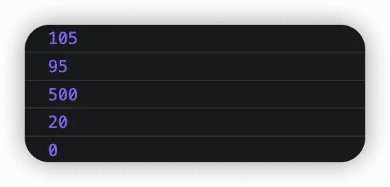
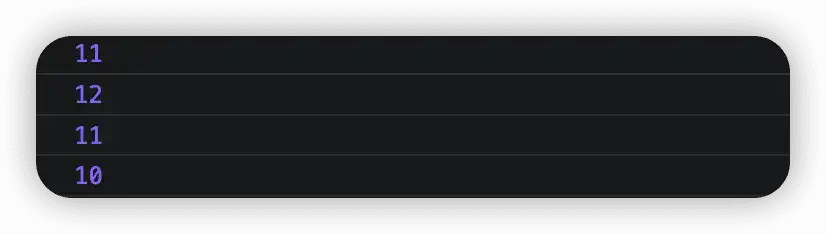
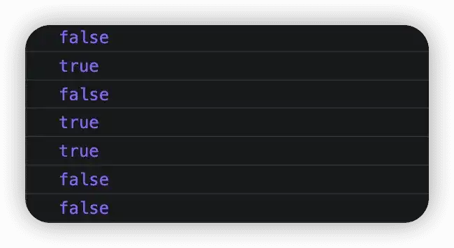
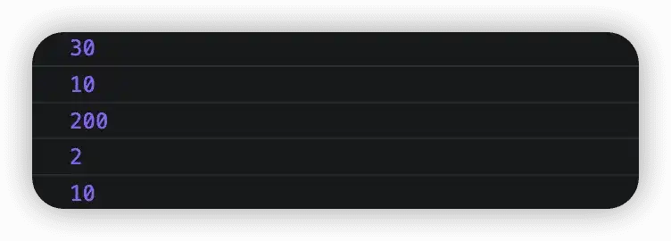

# 操作符

运算符（`operator`），也叫做操作符，主要是用于实现赋值、比较以及执行算数运算等功能的符号。在 JavaScript 中，主要有以下几类常见的运算符：

-   算数运算符
-   递增递减运算符
-   比较运算符
-   逻辑运算符
-   赋值运算符

以下就分别来看看，这些运算符都是怎么用的。

## 算数运算符

这个我们应该都不陌生，从小学开始，我们就学习加、减、乘、除、取余等算数运算。而算数运算符也就是供我们算术运算所使用的的符号，主要用来执行两个变量或值的算数运算。

| 运算符 | 说明 |
| ------ | ---- |
| $+$    | 加   |
| $-$    | 减   |
| $*$    | 乘   |
| $/$    | 除   |
| $\%$   | 取余 |

```js
var num1 = 100;
var num2 = 5;
// 105
console.log(num1 + num2);
// 95
console.log(num1 - num2);
// 500
console.log(num1 * num2);
// 20
console.log(num1 / num2);
// 100 % 5 = 0
console.log(num1 % num2);
```



但是在进行算数运算时，特别需要注意的是浮点数的计算，浮点数值的最高精度是 17 位小数，但算数运算时却远不如整数。同时，我们也需要注意，不要用浮点数来直接进行比较。

## 表达式与返回值

所谓表达式，就由数字、运算符、变量等组成的式子。而且表达式最终能够求得一个结果，而这个返回给我们的值就叫做返回值。

## 递增递减运算符

如果要实现让一个变量自己加 1，以前的做法是按照如下方式：

```js
var num = 1;
num = num + 1;
```

但现在可以利用递增计算符（`++`）来给实现给变量加 1，同样，递增计算符的位置也会对最终的结果造成影响。

如果递增计算符放在变量前面，则该递增计算符又称为前置递增运算符。若递增计算符放在变量后面，则称为后置递增运算符。

同样类比，有递增那就有递减。而且和递增一样，也可以根据递减运算符所放置的位置将其分为前置递减运算符和后置递减运算符。

```js
var num = 10;
// 前置递增
++num;
console.log(num);
// 后置递增
num++;
console.log(num);
// 前置递减
--num;
console.log(num);
// 后置递减
num--;
console.log(num);
```



前置和后置如果是单独使用，那么它们实现的效果是一样的。而两者的区别在于：

-   使用前置时：先自加/减 1，然后再返回结果。
-   使用后置式：先返回原值，然后再自加/减 1。

```js
var num = 10;
console.log(num++ + 10);
num = 10;
console.log(++num + 10);
```


## 比较运算符

比较运算符又叫做关系运算符，是两个数据之间进行比较时所使用的运算符，通过比较，返回一个布尔值作为比较运算的结果，常见的比较运算符总结见下表。

| 运算符 | 说明                     |
| ------ | ------------------------ |
| `<`    | 小于                     |
| `>`    | 大于                     |
| `>=`   | 大于等于                 |
| `<=`   | 小于等于                 |
| `==`   | 判等，值相等即可         |
| `!=`   | 不等于                   |
| `===`  | 全等，值和数据类型都一致 |

```js
var num1 = 1;
var num2 = 10;
var str1 = '1';
console.log(num1 > num2);
console.log(num1 < num2);
console.log(num1 >= num2);
console.log(num1 <= num2);
console.log(num1 == str1);
console.log(num1 != str1);
console.log(num1 === str1);
```



可以注意到 `==` 和 `===` 是不一样的，我们在比较时，一定要注意它们之间的区别。

## 逻辑运算符

逻辑运算符是用来进行布尔值运算的运算符，其最终返回结果也是一个布尔值，常用于条件判断。常见的逻辑运算符见下表。

| 运算符 | 说明   |
| ------ | ------ |
| `&`    | 与     |
| `&&`   | 逻辑与 |
| `|`    | 或     |
| `||`   | 逻辑或 |
| `!`    | 逻辑非 |

其中 `&` 和 `&&` 的区别在于：`&` 中一旦符号前布尔值为 `false` 时，还会继续符号后布尔值的运算，然后判定两个布尔值的运算结果为 `false`。而 `&&` 一旦符号前布尔值为 `false`，就不再进行符号后布尔值的运算，直接判定两个布尔值最终结果为 `false`，这个过程就叫做短路运算。

而 `||` 表示只要符号前后任一布尔值为 `true`，则最终结果为 `true`。

```js
// false
console.log(1 > 2 && 2 > 1)
// true
console.log(1 > 2 || 2 > 1)
// false
console.log(!true)
```

## 赋值运算符

顾名思义，所谓赋值运算符就是用来将数据赋值给变量的运算符，常用的赋值运算符总结如下。

| 运算符       | 说明               |
| ------------ | ------------------ |
| `=`          | 直接赋值           |
| `+=、-=`     | 加、减一个数后赋值 |
| `*=、/=、%=` | 乘、除、取余后赋值 |

```js
// 直接赋值
var num1 = 10;
var num2 = 20;
// 30
console.log(num1 += num2);
num1 = 10;
num2 = 20;
// 10
console.log(num2 -= num1);
num1 = 10;
num2 = 20;
// 200
console.log(num1 *= num2);
num1 = 10;
num2 = 20;
// 2
console.log(num2 /= num1);
num1 = 10;
num2 = 20;
// 10
console.log(num1 %= num2);
```



## 运算符优先级

运算符的优先级决定了我们表达式中运算执行的先后顺序，优先级越高，则执行顺序越靠前。常见的运算符的优先级分级如下表。总的来说，在开发过程中要尽量避免复杂的表达式，如果实在是要用，也可以多利用小括号来提高代码的可读性，防止因疏忽代码运算执行先后顺序而导致程序结果错误。

| 优先级 | 运算符     | 顺序                     |
| ------ | ---------- | ------------------------ |
| 1      | 小括号     | `()`                     |
| 2      | 一元运算符 | `++`、`--`、`!`          |
| 3      | 算数运算符 | `*`、`/`、`%`、 `+`、`-` |
| 4      | 关系运算符 | `>`、`>=` 、`<`、`<=`    |
| 5      | 相等运算符 | `==`、`!=`、`===`、`!==` |
| 6      | 逻辑运算法 | 先 `&&` 后 `||`          |
| 7      | 赋值运算符 | `=`                      |
| 8      | 逗号运算符 | `,`                      |

## 总结

本文的主要内容至此就结束了，主要对各种运算符进行了总结以及简单的应用。到这里，我们已经学习了 JavaScript 中的变量、数据类型、运算符、注释、输入输出。到这里我们应该可以根据所需知识写一些小的 demo，接下来就继续去看看流程控制的相关内容吧。