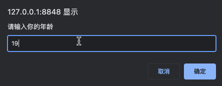

# 流程控制

一个程序中，各个代码之间的执行顺序对于程序结果是会造成影响的。就拿下面简单的例子来说，假如我们拿先使用 `num` 这个变量然后再定义和先定义变量再使用相比。先使用再定义会报错 `undefined`，而定义再使用就没有问题。也就是说，代码的先后顺序会对我们的程序结果造成直接影响。

```js
console.log(num);
var num = 10;
```

```js
var num = 10;
console.log(num);
```

而今天要说的流程控制，就是为了解决这个问题。通俗来讲，流程控制就是控制我们的代码按照既定的结构顺序来执行。

而流程控制主要分为三种结构，分别是：

-   **顺序结构**
-   **分支结构**
-   **循环结构**

这三种结构分别代表了三种代码执行的顺序，用流程图示意如下。

| 顺序结构                                                     | 分支结构                                                     | 循环结构                                                     |
| ------------------------------------------------------------ | ------------------------------------------------------------ | ------------------------------------------------------------ |
|  |  |  |

## 顺序结构流程控制

顺序结构是代码中最基本、最简单的流程控制，它没有特定的语法结构，代码会按照**代码位置的先后顺序，依次执行**。基本上程序中的代码都会存在顺序结构。

## 分支结构流程控制

由上而下执行代码时，根据不同的条件，从而流向不同的代码路径，最终得到不同的结果。JavaScript 中，提供了两种分支结构语句，分别是：

-   `if` 语句
-   `swtich` 语句

### if

`if` 的语法结构如下：

```js
if(条件表达式){
	// 执行语句
}
```

如果 `if` 语法结构中的条件表达式为 `true`，则执行大括号中的语句，若条件表达式结果为 `false`，则跳过大括号中的代码，执行大括号之后的代码。

```js
if(10 > 20){
    console.log('10 大于 20');
}
console.log('10 小于 20');
```


除开单分支语句 `if` 之外，JavaScript 也提供了双分支语句 `if…else…`，其语法结构如下：

```js
if(条件表达式){
	// 执行语句 1
}else{
    // 执行语句 2
}
```

如果条件表达式为 `true`，则执行条件语句 1，若条件表达式为 `false`，则执行语句 2。

```js
var age = prompt('请输入你的年龄');
if(age >= 18){
    alert('你可以玩王者荣耀 5 小时');
}else{
    alert('你只能玩王者荣耀 2 小时');
}
```




当然，除开单分支和双分支之外，还有多分支语句 `if…else…if…`，其语法结构如下：

```js
if(条件表达式 1){
    // 语句 1
}else if(条件表达式 2){
    // 语句 2
}else if …
```

通过多个条件来选择不同的语句执行，从而得到不同的结果。

### 三元表达式

除了使用 `if` 来进行条件选择之外我们也可以利用三元表达式来做一些简单的条件选择，其语法结构如下：

```js
条件表达式?条件表达式为真时执行语句:条件表达式为假时执行语句;
```

```js
10 > 4?alert('10 大于 4'):alert('10 小于 4');
```

三元表达式也可以转换为 `if` 条件分支判断，两者的效果是等价的。比如上面的三元表达式就可以转换为以下 `if` 条件表达式。

```js
if(10 > 4){
    alert('10 大于 4');
}else{
    alert('10 小于 4');
}
```

### switch

`switch` 语句对应于 `if` 语句中的多分支语句，主要用于基于不同条件来执行不同的代码。如果要针对变量设置一系列的**特定值**的选项时，就可以使用 `switch`。 

`switch` 语法结构如下，通过表达式的值和 `case` 中的选项值相匹配，如果有对应匹配项，则执行该 `case` 中的语句，如果没有对应匹配项，则执行 `default` 中的代码。

```js
switch(表达式){
    case value1:
	    // 执行语句1
    	break;
    case value2:
	    // 执行语句2
    	break;
    ……
    default:
        执行最后的语句;
}
```

### switch 和 `if else if` 的区别

一般情况下，两者是可以相互替换的。其中 `switch…case` 语句通常用于处理 `case` 是确定值的情况，而 `if…else…` 语句则更加的灵活，通常用语范围判断。

此外，`switch` 语句进行条件判断后会直接执行到程序的条件语句，效率更高。而 `if…else` 语句有多少种情况，就需要判断多少次，较为耗费时间。

## 循环结构流程控制

实际处理问题时，经常要做许多具有规律性的重复操作，为了更高效的完成这类操作，所以需要重复执行这些语句，而这就是我们程序中所说的循环结构。

在 JavaScript 中，主要有三种类型的循环语句：

-   `for` 循环
-   `while` 循环
-   `do…while` 循环

### for 循环

 程序中，一组被重复执行的语句被叫做**循环体**，而是否需要继续重复执行，取决于**循环的终止条件**，由循环体和循环终止条件共同组成语句就叫做**循环语句。**

`for` 循环主要用于将某些代码循环若干次，通常跟计数有关系，其语法结构如下：

```js
for(初始化变量;条件表达式;操作表达式){
    // 循环体
}
```

```js
// 计算 1 + 2 + …… + 100 的值
var i = 0;
var sum = 0;
for(i = 1; i <= 100; i++){
    sum += i;
}
console.log(sum);
```


`for` 循环语句的执行顺序可以总结为如下：

-   首先去执行初始化变量语句，该语句在整个 `for` 循环中只执行一次。
-   接着去执行条件表达式，若满足条件则执行循环体，如果不满足则退出循环。
-   执行完循环体之后，最后去执行操作表达式，至此第一轮循环结束。
-   然后开始第二轮循环，继续执行条件表达式，重复上面的两个步骤直到退出循环。

### while 循环

`while` 语句可以在表达式为真的情况下，循环执行某一段指定的代码，直到不满足表达式时才结束循环，其语法结构如下：

```js
while(条件表达式){
    // 循环体代码
}
```

执行时，先判断条件表达式，若结果为 `true`，则进入循环体执行循环体代码，如果结果为 `false`，则退出循环，执行 `while` 循环后边的代码。

```js
// 计算 1 + 2 + …… + 100 的值
var sum = 0;
var num = 1;
while(num <= 100){
    sum += num;
    num++;
}
// 5050
console.log(sum);
```

以上代码同样可以用于求 `1 + 2 + …… + 100` 的值，能够达到与 `for` 循环同样的效果。

### do…while 循环

`do…while` 其实是 `while` 循环的一个变体，其语法结构如下：

```js
do{
    // 循环体代码
}while(条件表达式);
```

执行时，无论如何都会先进入循环体执行一次循环体代码，然后再对条件表达式进行判断，如果条件为 `true`，则继续执行循环体代码，若条件为 `false`，则退出循环。

### continue 和 break 

`continue` 用于立即**跳出当次循环，继续进入下一次循环**。

```js
for(var i = 0; i <= 5; i++){
    if(i == 2){
        continue;
    }
    console.log(i);
}
```


以上实例中，设置了当 `i` 为 2 时，跳出当次循环，所以程序打印出了 `0-5` 中除 2 之外的其他元素。

`break` 主要用于立即**跳出整个循环**。

```js
for(var i = 0; i <= 5; i++){
    if(i == 2){
        break;
    }
    console.log(i);
}
```


以上实例设置了当 `i` 为 2 时跳出整个循环，所以程序只打印出了 0、1，2 及以后的数不再打印。

## 总结

以上就是关于流程控制中顺序结构、分支结构以及循环结构的相关知识点了，通过学习，你觉得掌握了多少呢，能用所学知识实现一个 9 * 9 乘法表么？想试试么，那就评论区见真章吧！