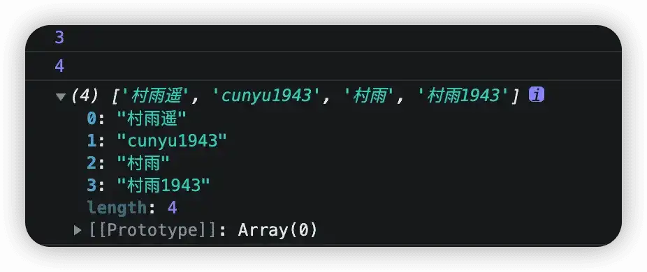
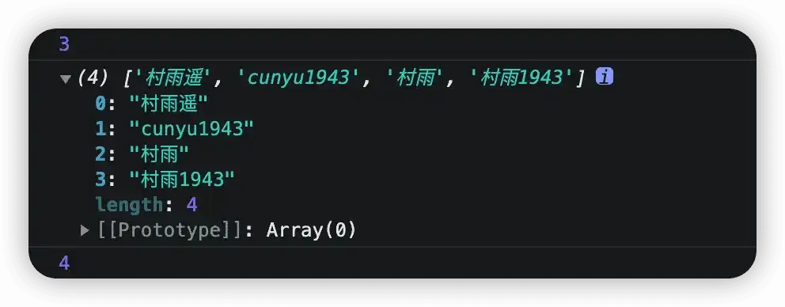

# 数组

## 什么是数组

之前的学习中，如果我们要存储一个值，一般都是通过变量来存储。但如果我们现在想要存储一系列的值，又该如何存储呢，你可能会说可以用多个变量来进行存储。这种方法也可以，但如果你想，一旦值过多，那岂不是就要多个变量，到时候管理就很混乱了。这时候就想，有没有一个可以存储多个值的数据结构，方便我们进行多个值的存储管理呢？

针对上面这一需求，提出了数组这一数据结构。

数组是指一组数据的集合，数组中的每个数据被称为元素，而且数组中可以存放任意类型的元素。通过使用数组，当我们需要存储多个值时，就可以不用再去多个创建变量，而只需要创建一个数组就好了。

```js
var num = 1;
var arr = [1, 2, 3, 4, 5];
```

## 如何创建数组

既然知道了数组这种数据结构，那怎么才能创建一个数组呢。这里主要用两种方式：

-   利用关键字 `new` 创建数组。
-   利用数组字面量创建数组。

### 利用 `new` 创建数组

这里其实跟 JavaScript 中的面向对象相关，和 Java 中也类似，其语法结构为：

```js
var 数组名 = new Array();
```

除了数组名，其他都是固定的，通过这种方式，我们就创建了一个新的空数组，此时中没有任何元素，数组长度为 0。

```js
var arr = new Array();
console.log(arr);
```

### 利用数组字面量创建数组

除开利用关键字 `new` 来创建数组之外，也可以利用字面量来创建数组，其语法结构如下：

```js
var 数组名 = [];
```

通过这种方式所创建的数组也是一个空数组，效果和利用 `new` 创建空数组一样，此时数组长度为 0，里边没有任何元素。

```js
var arr = [];
console.log(arr);
```

此外，还可以创建带有初始值的数组，其中的各个元素用逗号 `,` 分隔，其语法结构如下：

```js
var 数组名 = [value1, value2, value3];
```

```js
var arr = ['村雨遥', 'cunyu1943', '村雨'];
console.log(arr);
```


通过字面量的方式，我们就创建了一个含有三个初始值的数组。

## 获取数组中元素

创建好了数组，接下来就是如何拿到数组里边的元素了。JavaScript 中，是通过索引（下标）来访问数组中的元素的。需要注意的是，数组索引是从 0 开始的，而不是从 1 开始。

```js
var arr = ['村雨遥', 'cunyu1943', '村雨'];
// 村雨遥
console.log(arr[0]);
```


以上的实例中，我们通过索引获取到了数组中的第一个元素 `村雨遥`。

通过索引不仅能访问数组元素，还能设置和修改数组元素，通过 `数组名[索引]` 的形式即可实现。

```js
var arr = ['村雨遥', 'cunyu1943', '村雨'];
// 村雨遥
console.log(arr[0]);
// 修改数组元素
arr[0] = '村雨1943'
// 村雨1943
console.log(arr[0]);
```


## 遍历数组

如果要拿到数组中的所有元素，那是不是得一个一个以 `数组名[索引]` 的形式来获取呢？答案是，不用！

还记得我们之前学习的循环么，通过循环，我们就能十分简单地实现获取数组所有元素。

不过在那之前，我们还可以学习下如何获取数组的长度，数组提供了一个属性 `length`，通过该属性，我们就能获取到数组的长度（即数组中元素个数）。

```js
var arr = ['村雨遥', 'cunyu1943', '村雨'];
// 3
console.log(arr.length);
```


接着，我们就可以通过循环来获取到数组中的所有元素了。

```js
var arr = ['村雨遥', 'cunyu1943', '村雨'];
for(var i = 0; i < arr.length; i++){
    console.log(arr[i]);
}
```


## 数组新增元素

学习了创建数组、如何获取数组元素以及遍历数组，接下来就来看看，如何往初始化后的数组中新增元素。

先来看看第一种，我们修改数组的长度，然后再往数组里边新增元素。

```js
var arr = ['村雨遥', 'cunyu1943', '村雨'];
console.log(arr.length);
arr.length = 4;
console.log(arr.length);
arr[3] = '村雨1943';
console.log(arr);
```



通过实例结果可以看到，通过修改数组长度奏效了，数组长度从一开始的 3 变成了 4，而且数组中增加元素也成功了。

再来看看第二种，我们通过修改索引号的方式来增加数组元素。

```js
var arr = ['村雨遥', 'cunyu1943', '村雨'];
console.log(arr.length);
arr[3] = '村雨1943';
console.log(arr);
console.log(arr.length);
```



同样达到了往数组中新增元素的效果，区别在于没有事先修改数组长度，而是直接修改数组索引的方式来增加元素。

需要注意的时，在向数组中增加元素时，不能利用数组原有的索引来增加元素，否则会修改掉数组原有元素。

```js
var arr = ['村雨遥', 'cunyu1943', '村雨'];
// 会修改掉数组中原有元素
arr[1] = '村雨1943';
console.log(arr);
```


## 总结

以上就是今天的所有内容了，主要从数组的定义、如何创建数组、如何获取数组中元素、遍历数组以及新增数组元素几个方面总结了数组的知识点。关于更多数组的操作，期待大家和我一起去探索发现！