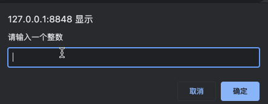

# 函数

## 函数简介

编程时，可能会定义许多相同或者功能相似的代码，此时我们每需要使用一次，就需要重写编写一次。虽然利用循环结构也能够实现一些简单的重复操作，但是功能较为局限。此时，我们就需要使用到 JavaScript 中的函数。

所谓函数，就是通过将一段可以重复调用的代码块进行封装，从而实现代码的重复利用。

## 函数使用

了解了函数是个啥，接下来就来看看如何使用函数。

函数使用，主要可以分为两步：**声明函数**和**调用函数**。

-   **函数声明**

函数声明，也就是说明函数用来干啥的，其语法结构如下：

```js
function 函数名(){
    // 函数体
}
```

其中 `function` 是声明函数的关键字，而函数一般是对应某一个功能，所以函数名一般是动词。

-   **函数调用**

既然声明了函数，那就要去调用！调用函数时，通过调用其函数名来执行函数体代码，其语法结构如下：

```js
函数名();
```

以下我们在 JavaScript 中定义一个函数，用于求 `1 + 2 + … + num` 的值。

```js
function sum(num){
    let result = 0;
    for(let i = 1; i <= num; i++){
        result += i;
    }
    return result;
}

let num = prompt('请输入一个整数');
alert('和为：' + sum(num));
```



## 函数的参数

为了让函数能够准确地实现我们的功能，有时候我们需要用到参数。而参数又分为形参和实参，其中，形参位于声明函数的小括号中，而实参位于函数调用的小括号中。

声明带有参数的函数时，其语法结构如下：

```js
function 函数名(形参1, 形参2……){
    // 函数体
}
```

当需要调用函数时，则可以通过以下形式调用。

```js
函数名(实参1, 实参2……);
```

函数声明时，在函数名后的小括号中紧跟一些参数，这些参数被叫做**形参**，而在函数调用时，同样需要传递对应的参数，而这些参数就叫做**实参**。两者的区别总结如下：

| 参数     | 说明                                                   |
| -------- | ------------------------------------------------------ |
| **形参** | 形式上的参数，函数定义时传递的参数                     |
| **实参** | 实际上的参数，函数调用时传递的参数，实参是传递给形参的 |

所以参数的作用在于，在函数内部某些不能固定的值，可以通过参数在调用函数时传递不同的值进行。

假设我们定义一个函数时，传递了不同数量的参数，就可能出现以下情况。

-   实参个数与形参个数相匹配
-   实参个数多于形参个数
-   实参个数少于形参个数

以下以实例来分别看着三种情况会出现怎样的结果。

```js
function sum(num){
    let result = 0;
    for(let i = 1; i <= num; i++){
        result += i;
    }
    return result;
}

let num = 10;
console.log('和为：' + sum(num));
console.log('和为：' + sum(num, 20));
console.log('和为：' + sum());
```


可以看到实参和形参个数匹配时，程序输出了正确的结果，而当实参个数大于形参个数时，程序同样输出了正确的结果。而当实参个数小于形参个数时，程序结果出错。因此，在定义和调用参数时，一定要注意形参和实参的匹配问题，否则可能会导致程序出错。

## 函数返回值

在调用函数时，我们会希望将函数调用的结果返回到调用者，此时就可以通过关键字 `return` 语句来实现，其语法结构如下：

```js
function 函数名(形参1, 形参2……){
    // 函数体
    return 返回结果;
}
```

其实上面的实例中我已经给出了函数的返回值了，其中 `result` 就是函数的返回值。实例中将函数的结果进行了返回，所以在调用时直接能够直接进行输出。

当然，不是所有函数都需要返回值，具体是否需要要根据自己的实际需求来编写。

## 作用域

通常来讲，程序中用到的代码并不是一直有效的，而用于限定这个代码可用范围的就是这段代码的**作用域**。因为作用域的存在，改高了程序逻辑的局部性，增强了可靠性，最大程度上减少了代码中的冲突。

JavaScript 中，主要有三种作用域：

-   全局作用域
-   局部作用域
-   块级作用域

1.   **全局作用域**

顾名思义，全局作用域也就是在整个代码中都有效。作用于所有代码执行的环境。

2.   **局部作用域**

局部有效，作用于函数内的代码环境，因为和函数息息相关，所以也叫做函数作用域。

3.   **块级作用域**

块级作用域由 `{}` 所包含，比如 `if` 和 `for` 语句中的 `{}`。

```js
let num = 1943;
function demo(num1, num2){
    let tmp = num1;
    num1 = num2;
    num2 = tmp;
}
demo(num, 10);
```

以上实例中 `num` 的作用域是全局作用域，`num1` 和 `num2` 的作用域为局部作用域，而 `tmp` 的作用域则是块级作用域。

## 匿名函数

所谓匿名函数，其实指的就是没有函数名的函数。其语法结构如下，主要有两种定义的方式。

```js
(function (){
    // 函数体
});
```

```js
(function (){
    // 函数体
});
```

```js
(function (num1, num2){
    console.log(num1 + num2);
});
```

以上就是一个简单的匿名函数，要注意匿名函数是不能单独使用的，它通常作为立即执行函数的基础。

为了避免全局变量之间的污染，因此我们有时候需要在定义函数时立即执行函数，这时候我们就可以使用到立即执行函数。立即执行函数是基于匿名函数来实现的，也没有函数名，但是他会在定义后立即执行，其语法结构如下。

立即执行函数也有两种形式，第一种是将匿名函数包裹在一个括号运算符中，然后再跟一个括号。

```js
(function (){
    // 函数体
})();
```

另一种则是在匿名函数后面跟上一个括号，然后再将整个包裹在一个括号运算符中。

```js
(function (){
    // 函数体
}());
```

```js
(function (num1, num2){
    console.log(num1 + num2);
}(10, 20));
```


但是需要注意的是，如果存在多个匿名函数，那它们之间要用 `;` 分隔开，否则将会导致报错。

## 总结

以上就是本文的所有内容了，主要讲解了关于函数的简介、使用、参数、返回值、作用域以及常用的匿名函数。其中可能有一些小的知识点没有顾虑到，如果有什么遗漏的地方，大家可以指出来，然后根据大家所提的建议进行文章修改，让内容更加详细。