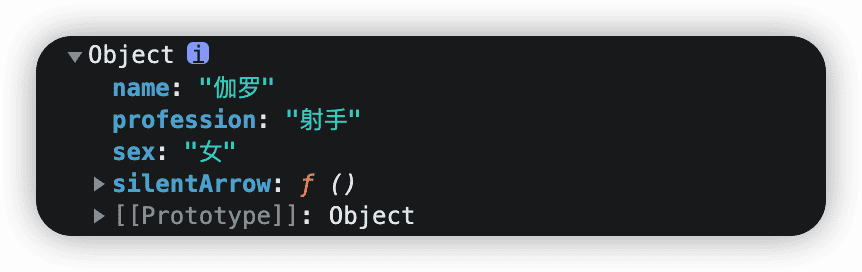
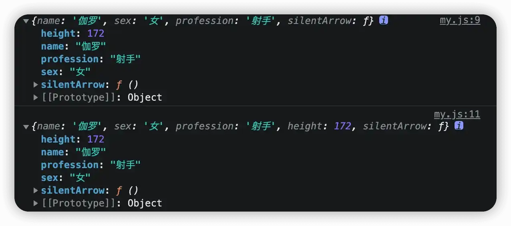
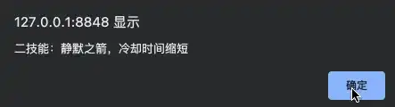
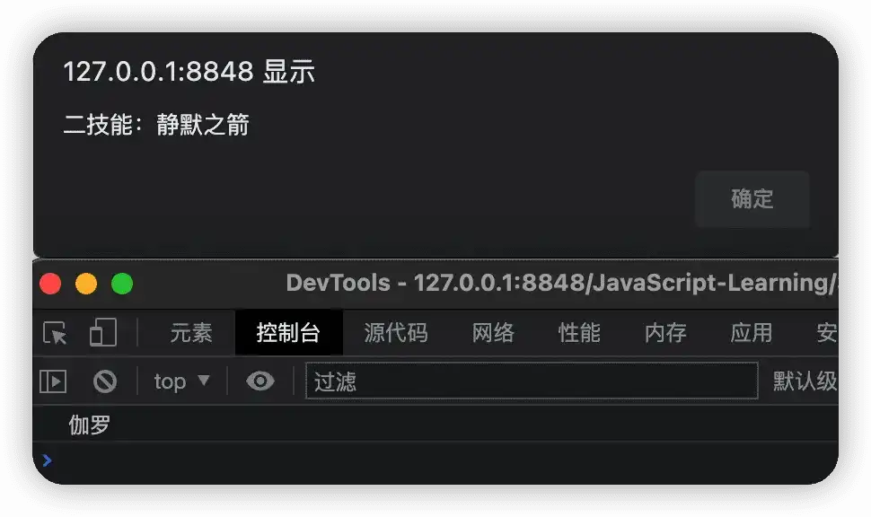
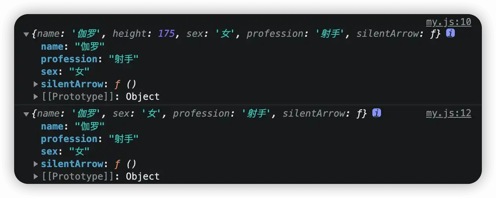
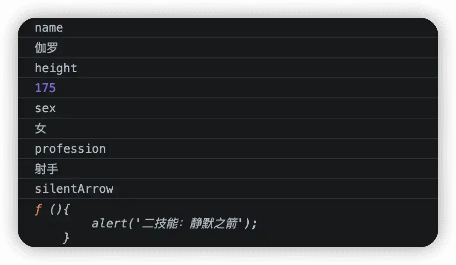
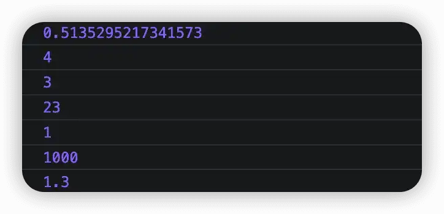

# 面向对象

## 什么是对象

之前学习的数据类型在存储一些复杂的信息时，十分不方便，而且也难以区分。为此，为了更加详细方便的描述某一个事物，因而提出面向对象的概念。

那什么是对象呢？

所谓对象，也是 JavaScript 中的一种数据类型，可以看做是一系列无序数据的集合。

有了对象，就可以用来描述某一个事物，比如用对象来描述一个人。其中人的一些静态特征比如姓名、年龄、性别、身高、体重我们就可以用数字类型、字符串类型、数组、布尔类型等数据结构来表示，而人的一些动作比如吃喝拉撒啥的，就可以用函数来进行表示。

## 如何使用对象

要使用对象之前，我们需要先进行声明，其语法结构如下：

```js
let 对象名 = {};
```

比如要创建一个王者荣耀中的英雄对象，则可以按照如下方式：

```js
let hero = {};
```

那既然创建了一个对象，那对象里边还有各种属性和方法呀。比如英雄的性别、职业、初始血条值、初始魔法值等等，此外，各个英雄还有各自的技能，用于杀敌清兵。

我们将上面的英雄对象添加上属性和方法，其语法结构如下：

```js
let 对象名 = {
    属性名: 属性值,
    方法名: 函数
}
```

```js
let hero = {
    name: '妲己',
    sex: '女',
    profession: '法师',
    skill: ['灵魂冲击', '偶像魅力', '女王崇拜']
}
```

声明对象并添加若干属性之后，我们既可以利用 `.` 或者 `[]` 来获取对象中属性所对应的值。紧接着上述实例，我们定义了一个英雄对象，并含有姓名、性别、职业、技能等属性，假设我们要获取其中的姓名属性，这可以通过以下两种方式来获得。

```js
方法名.属性名;
```

```js
alert(hero.name);
```

```js
方法名[属性名];
```

```js
alert(hero['name']);
```

除开属性之外我们的英雄还拥有其他行为，比如放各种技能。以下我们就来看看，如何在对象中添加一个方法。

```js
let hero = {
    soulCrash: function(){
        alert('一技能：灵魂冲击');
    }
}
```

对象中的方式是由方法名和函数两部分共同组成，并且中间使用 `:` 分隔。

当要使用该方法是，就可以通过以下方式来调用。

```js
对象名.方法名();
```

```js
hero.soulCrash();
```

## 操作对象

对象作为一种无序的数据集合，要对对象进行操作，无非是给对象增加、修改、查询、删除各个属性或方法。

假设我们现在有以下的对象：

```js
let hero = {
    name: '伽罗',
    sex: '女',
    profession: '射手',
    silentArrow: function(){
        alert('二技能：静默之箭');
    }
}
console.log(hero);
```



1.   **增加**

现在我们要给 `hero` 属性添加一个新的属性，就可以通过以下的语法形式形式：

```js
对象名.新属性名 = 新属性值;
```

```js
let hero = {
    name: '伽罗',
    sex: '女',
    profession: '射手',
    silentArrow: function(){
        alert('二技能：静默之箭');
    }
}
console.log(hero);
hero.height = 172;
console.log(hero);
```



2.   **修改**

如果要修改其中的一个属性或者方法，则可以通过以下的方式：

```js
// 修改属性
对象名.属性名 = 新的属性值;
// 修改方法
对象名.方法名 = function(){
    // 函数体;
}
```

以下为修改属性和方法的实例：

```js
let hero = {
    name: '伽罗',
    sex: '女',
    profession: '射手',
    silentArrow: function(){
        alert('二技能：静默之箭');
    }
}
console.log(hero);
hero.silentArrow();
hero.height = 175;
hero.silentArrow = function(){
    alert('二技能：静默之箭，冷却时间缩短');
}
console.log(hero);
hero.silentArrow();
```





3.   **查询**

而如果要查询对象的属性或者方法，则可以使用的方式：

```js
// 查询属性，以下方法 2 选 1
对象名.属性名;
对象名[属性名];
// 查询方法
对象名.方法名();
```

```js
let hero = {
    name: '伽罗',
    height: 175,
    sex: '女',
    profession: '射手',
    silentArrow: function(){
        alert('二技能：静默之箭');
    }
}
console.log(hero.name);
console.log(hero.silentArrow());
```



4.   **删除**

删除对象中的属性，可以通过以下方式：

```js
delete 对象名.属性名;
```

```js
let hero = {
    name: '伽罗',
    height: 175,
    sex: '女',
    profession: '射手',
    silentArrow: function(){
        alert('二技能：静默之箭');
    }
}
console.log(hero);
delete hero.height;
console.log(hero);
```



## 遍历对象

 类似于数组，如果我们想要输出数组中的所有元素，我们可以对数组进行遍历。而同样的，对象也可以进行遍历，从而输出对象中所有属性和方法。

但是由于对象是无序的，而且也不像数组一样可以通过 `length` 属性来确定数组长度，因此要遍历对象，需要用到一个增强型的 `for` 循环，其语法结构如下：

```js
for(let 变量 in 对象名){
    // 循环体
}
```

例如针对以下对象，要输出对象的属性及其属性值，则可以通过 `for…in` 的方式。

```js
let hero = {
    name: '伽罗',
    height: 175,
    sex: '女',
    profession: '射手',
    silentArrow: function(){
        alert('二技能：静默之箭');
    }
}
```

```js
for(let key in hero){
    // 打印属性名
    console.log(key);
    // 打印属性值
    console.log(hero[key]);
}
```



## 内置对象

所谓内置对象，就是 JavaScript 中内部已经提供的对象，里边包含了各种属性和方法，当我们开发者需要时，就可以直接进行调用而不必去重新创建。

我们常用的有 `Math` 对象，它提供了一些用于数学运算符的方法，常见方法总结如下：

| 方法       | 说明                                                   |
| ---------- | ------------------------------------------------------ |
| `random()` | 生成 0 - 1 之间的随机数，左闭右开，即包括 0 但不包括 1 |
| `ceil()`   | 向上取整                                               |
| `floor()`  | 向下取整                                               |
| `max()`    | 求最大值                                               |
| `min()`    | 求最小值                                               |
| `pow()`    | 幂运算                                                 |
| `abs()`    | 求绝对值                                               |

```js
console.log(Math.random());
console.log(Math.ceil(3.2));
console.log(Math.floor(3.2));
console.log(Math.max(1, 23, 4, 5));
console.log(Math.min(1, 23, 4, 5));
console.log(Math.pow(10, 3));
console.log(Math.abs(-1.3));
```




## 总结

通过学习本文，你应该知道什么是对象，怎么使用对象，以及如何操作和遍历对象。除此之外，你还应该知道 JavaScript 中的最常见的内置对象 `Math`，并学习利用 `Math` 所提供的常用方法来简化日常开发工作。更多关于 JavaScript 中对象的知识，欢迎留言补充！