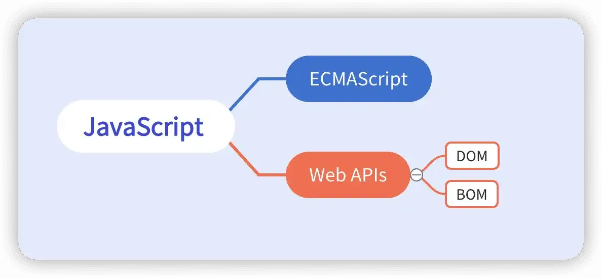
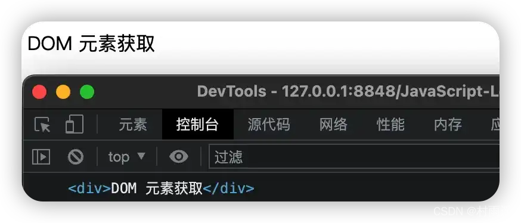

# DOM 元素获取、属性修改

> 作者：[村雨遥](https://github.com/cunyu1943)
> 
> 不要哀求，学会争取，若是如此，终有所获
> 
>

## 🎈 号外

最近，公众号之外，建立了微信交流群，不定期会在群里分享各种资源（影视、IT 编程、考试提升……）&知识。如果有需要，可以**扫码或者后台添加小编微信备注入群**。进群后**优先看群公告**，**呼叫群中【资源分享小助手】**，还能免费帮找资源哦～

<center>
 
</center>

## 什么是 Web API

Web API 是指网页服务器或者网页浏览器的应用程序接口。简单来讲，就是我们在编写 JavaScript 代码时，可以通过 Web API 来操作 HTML 网页和浏览器。

Web API 又可以分为两类：

-   DOM（文档对象模型）
-   BOM（浏览器对象模型）



DOM（`Document Object Model`），即文档对象模型，主要用来呈现以及与 HTML 或 XML 文档交互的 API。说白了就是用来操作网页内容，实现各种特效，让用户用起来更顺手。

再来看看 DOM 树的概念，DOM 树又叫文档树，指的是将 HTML 文档以树状结构直观呈现出来，从而将 HTML 中标签与标签之间的关系直观体现出来。

我们都知道 HTML 页面中包含了许多标签，而 DOM 对象就是浏览器根据这些标签所生成的 JavaScript 对象。通过这个对象，我们就可以找到标签的各种属性，而通过修改这个对象的属性的结果也会映射到 HTML 页面中标签中。也就是说，通过修改 JavaScript 中的对象属性，我们就能够改变对象对应 HTML 中的标签属性。

```js
<!DOCTYPE html>
<html>
	<head>
		<meta charset="utf-8" />
		<meta name="viewport" content="width=device-width, initial-scale=1">
		<title>DOM</title>
	</head>
	<body>
		<button>点击</button>
		<script>
			// 获取 JavaScript 对象
			let btn = document.querySelector('button');
			// 打印所有属性
			console.dir(btn);
			// 修改对象属性
			btn.innerText = '村雨遥';
		</script>
	</body>
</html>
```

可以看到原本 `button` 标签的属性 `innerText` 从原先的点击变成了 村雨遥，说明通过修改 JavaScript 对象属性从而改变 HTML 中标签属性的目的达到了。

## DOM 对象获取
1. **匹配的首个元素**
上一小节实例中我们其实已经获取过相关 DOM 对象了，也就是以下这一句：
```js
let btn = document.querySelector('button');
```

这其实是通过 CSS 选择器来获取的我们网页中的标签，通过以下语法，我们将会从网页中选择到匹配的第一个元素。
```js
document.querySelector('CSS 选择器');
```
其中的参数包含了一个或多个有效的 CSS 选择器字符串，然后返回的结果就是匹配到的 CSS 选择器中的**第一个元素**，是一个 `HTMLElement` 元素。当然，如果没有匹配到任何元素，则返回 `null`。

以下是一个获取 DOM 对象的实例。

```html
<!DOCTYPE html>
<html>
	<head>
		<meta charset="utf-8" />
		<meta name="viewport" content="width=device-width, initial-scale=1">
		<title>DOM 元素获取</title>
	</head>
	<body>
		<div>DOM 元素获取</div>

		<script>
			// 获取 js 元素
			let div = document.querySelector('div');
			console.log(div);
		</script>
	</body>

</html>

```



2. **匹配的多个元素**

之前我们已经学习了如何获取匹配的首个元素，但是在日常开发中，我们常常需要获取匹配到的多个元素，此时我们就可以使用如下语法来获取匹配的多个元素。
```js
document.querySelectorAll('CSS 选择器');
```

```html
<!DOCTYPE html>
<html>
	<head>
		<meta charset="utf-8" />
		<meta name="viewport" content="width=device-width, initial-scale=1">
		<title>DOM 元素获取</title>
	</head>
	<body>
		<div>DOM 元素获取1</div>
		<div>DOM 元素获取2</div>

		<script>
			// 获取 js 元素
			let div = document.querySelectorAll('div');
			console.log(div);
		</script>
	</body>

</html>
````


除开上述两种获取 DOM 对象之外，还提供了一些用于获取 DOM 元素的方法。最常见的几种总结如下：

-   根据 `id` 获取一个元素

```js
document.getElementById('id 元素名');
```

-   根据标签获取页面中的一类元素

```js
document.getElementsByTagName('标签名');
```

-   根据类名获取页面中的元素

```js
document.getElementsByClassName('类名')
```

以下是一个分别利用上述方法来获取页面中 DOM 元素的实例。

```js
<!DOCTYPE html>
<html>
	<head>
		<meta charset="utf-8" />
		<meta name="viewport" content="width=device-width, initial-scale=1">
		<title>DOM 元素获取</title>
	</head>
	<body>
		<div id="id1">DOM 元素获取1</div>
		<div id="id2">DOM 元素获取2</div>
		<div class="class1">DOM 元素获取3</div>
		<div class="class1">DOM 元素获取4</div>

		<script>
			// 获取 js 元素
			let divs = document.getElementsByTagName('div');
			console.log(divs);
			let id1 = document.getElementById('id1');
			console.log(id1);
			let id2 = document.getElementById('id2');
			console.log(id2);
			let classes = document.getElementsByClassName('class1');
			console.log(classes);
		</script>
	</body>

</html>
```


## DOM 元素内容

既然已经学会了如何获取 DOM 元素，接下来就是看看如何修改元素中的内容。

这里 Web API 主要提供了三种方式，分别是：

-   `document.write()`
-   `innerText` 属性
-   `innerHTML` 属性

### doucument.write()

该方法只能将文本内容追加到 `</body>`  标签前面的位置，而且文本内容中所包含的标签也同样会被解析。

```js
<!DOCTYPE html>
<html>
	<head>
		<meta charset="utf-8" />
		<meta name="viewport" content="width=device-width, initial-scale=1">
		<title>DOM 元素内容</title>
	</head>
	<body>
		<script>
			document.write('公众号：村雨遥！</br>');
			document.write("<font color='red'>wePublic: cunyu1943</font>");
		</script>
	</body>
</html>
```


### innerText 属性

通过该属性，可以将文本内容添加或者更新到任意标签的位置，而且文本中的标签也不会被解析。

```html
<!DOCTYPE html>
<html>
	<head>
		<meta charset="utf-8" />
		<meta name="viewport" content="width=device-width, initial-scale=1">
		<title>DOM 元素内容</title>

	</head>
	<body>
		<div>
			测试
		</div>
		<script>
			let div = document.querySelector('div');
			div.innerText = 'Hello World!';
            div.innerText = '<h1>一级标题</h1>';
		</script>
	</body>
</html>
```


### innerHTML 属性

除了 `innerText` 属性之外，也可以是使用 `innerHTML` 属性来对文本内容进行添加或者更新，但不同于 `innerText` 的是，`innerHTML` 会将文本内容中中的标签也进行解析。

```js
<!DOCTYPE html>
<html>
	<head>
		<meta charset="utf-8" />
		<meta name="viewport" content="width=device-width, initial-scale=1">
		<title>DOM 元素内容</title>

	</head>
	<body>
		<div>
			测试
		</div>
		<script>
			let div = document.querySelector('div');
			div.innerHTML = 'Java Park!';
			div.innerHTML = '<a href="https://cunyu1943.github.io/JavaPark">JavaPark</a>';
		</script>
	</body>
</html>
```


### 修改元素样式属性

出了修改文本内容，我们还可以实现对元素样式的控制，主要可以通过以下三种方式：

-   通过 `style` 属性操作 CSS
-   通过类名 `className` 操作 CSS
-   通过 `classList` 操作类控制 CSS


1.   **通过 `style` 属性操作 CSS**

语法结构如下：

```js
对象.style.样式属性 = 样式属性值;
```

```html
<!DOCTYPE html>
<html>
	<head>
		<meta charset="utf-8" />
		<meta name="viewport" content="width=device-width, initial-scale=1">
		<title>属性修改</title>
		<style>
			div {
				background-color: black;
				width: 6.25rem;
				height: 12.5rem;
			}
		</style>
	</head>
	<body>
		<div>

		</div>
		<script>
			let div = document.querySelector('div');
			div.style.backgroundColor = 'green';
		</script>
	</body>
</html>
```


2.   通过类名 `className` 操作 CSS

当设计修改的样式较多时，如果直接通过 `style` 属性修改比较麻烦，此时就可以通过操作 CSS 类名的方式来进行批量修改，其语法结构如下：

```js
元素.className = '类名';
```

```js
<!DOCTYPE html>
<html>
	<head>
		<meta charset="utf-8" />
		<meta name="viewport" content="width=device-width, initial-scale=1">
		<title>属性修改</title>
		<style>
			div {
				background-color: black;
				width: 6.25rem;
				height: 12.5rem;
			}

			.demo {
				background-color: greenyellow;
				width: 25rem;
				height: 31.25rem;
			}
		</style>
	</head>
	<body>
		<div class="demo">

		</div>
		<script>
			let div = document.querySelector('div');
			div.className = 'demo';
		</script>
	</body>
</html>
```


使用类名来操作 CSS 时，需要注意一下，如果原先的元素中已经有了 CSS 类，那么此时新增的 CSS 类将覆盖之前 CSS 类。

3.   **通过 `classList` 来操作 CSS**

针对通过类名 `className` 操作 CSS 会覆盖以前类名的问题，JavaScript 中又提供了 `classList` 的方式来追加和删除类名。

| 方法             | 说明       |
| ---------------- | ---------- |
| `add('类名')`    | 追加一个类 |
| `remove('类名')` | 删除一个类 |
| `toggle('类名')` | 切换一个类 |

```html
<!DOCTYPE html>
<html>
	<head>
		<meta charset="utf-8" />
		<meta name="viewport" content="width=device-width, initial-scale=1">
		<title>属性修改</title>
		<style>
			div {
				background-color: black;
				width: 6.25rem;
				height: 12.5rem;
			}

			.demo1 {
				background-color: greenyellow;
				width: 10rem;
				height: 15rem;
			}

			.demo2 {
				background-color: aquamarine;
				width: 9.375rem;
				height: 12.5rem;
			}
		</style>
	</head>
	<body>
		<div class="demo">

		</div>
		<script>
			let div = document.querySelector('div');
			div.classList.add('demo1');
			div.classList.toggle('demo2');
			div.classList.remove('demo2');
		</script>
	</body>
</html>
```


## 总结

本文首先讲了什么是 Web API，然后根据 Web API 所提供的各种方法，从页面中获取 DOM 对象，并对 DOM 对象中的元素内容进行设置和修改。

主要内容集中在常用的 DOM 对象获取方法 `querySelector()`、`querySelectorAll()`，以及 DOM 元素内容 3 种修改方式 `document.write()`、`innerText`、`innerHTML` ，最后介绍了如何对 DOM 元素的样式修改，实现样式的增加、转换和删除。
