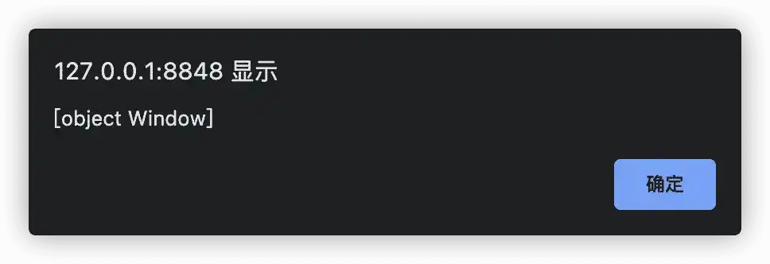

# DOM 事件

## 事件

### 什么是事件

在之前 DOM 的学习中，我们主要学习了如何获取 DOM 元素，并且学会了如何给获取的元素进行属性修改等操作。但这些基本都是静态的修改，并没有接触到一些动作。而今天要学习的事件，其实就是这些动作的总称。

所谓事件，就是在编程时系统内所发生的动作或者发生的事情，比如在网页中点击一个按钮之后，我们就能实现登录或者注册之类的功能。

### 事件监听

事件监听，就是让程序检测是否有事件产生，一旦有事件触发，就立即调用一个函数做出响应，这个过程就叫做注册事件。其语法结构如下：

```js
元素.addEventListener('事件', 要执行的函数);
```

要实现事件监听，要同时包含以下三要素：

-   **事件源**：也就是上面语法中所对应的元素，指的是谁发出的事件，也就是网页中哪个 DOM 元素被事件所触发。
-   **事件**：以何种方式触发，比如鼠标单击 `click`。
-   **事件调用函数**：也就是语法结构中要执行的函数，我们触发事件后，需要去做什么。

```html
<!DOCTYPE html>
<html>
	<head>
		<meta charset="utf-8" />
		<meta name="viewport" content="width=device-width, initial-scale=1">
		<title>DOM 事件</title>
	</head>
	<body>
		<button>点击开始</button>
		<script>
			let btn = document.querySelector('button');
			btn.addEventListener('click', function() {
				alert('马上开始');
			});
		</script>
	</body>
</html>
```

以上就是一个事件监听的实例，通过在网页中点击按钮，就会执行事件调用函数，弹窗显示内容。

### 事件类型

学习了事件的定义以及如何实现一个最简单的事件监听，接下来就来看看，Web API 中为 DOM 提供的常用事件类型有哪些。

主要有 4 种类型的事件，分为：

-   **鼠标事件**
-   **焦点事件**
-   **键盘事件**
-   **文本事件**

以下就分别来看看这些类型的事件又可以细分为哪些小类。

1.   **鼠标事件**

| 事件         | 说明     |
| ------------ | -------- |
| `click`      | 鼠标点击 |
| `mouseenter` | 鼠标经过 |
| `mouseleave` | 鼠标离开 |

2.   **焦点事件**

| 事件    | 说明     |
| ------- | -------- |
| `focus` | 获得焦点 |
| `blur`  | 失去焦点 |

3.   **键盘触发**

| 事件      | 说明         |
| --------- | ------------ |
| `keydown` | 键盘按下触发 |
| `keyup`   | 键盘抬起触发 |

4.   **文本事件**

| 事件    | 说明         |
| ------- | ------------ |
| `input` | 用户输入事件 |

## 高阶函数

高阶函数，简单的说可以被理解为函数的高级应用，JavaScript 中函数能够当成值来对待，然后基于这个值来实现函数的高级应用。

### 函数表达式

函数表达式其实和普通的函数没有本质上的区别，以下是一个函数表达式和一个普通函数。

-   函数表达式

```js
let sum1 = function(x, y) {
    return x + y;
}
```

-   普通函数

```js
function sum2(x, y){
    return x + y;
}
```

在调用时，可以发现调用方式其实都一样，两者最终得到的结果也一致。

```js
// 函数表达式调用
sum1(10, 20);
// 普通函数调用
sum2(10, 20);
```

### 回调函数

如果有两个函数 A 和 B，假设我们将函数 A 作为参数传递给函数 B，那么我们此时将函数 A 叫做 **回调函数**。总结来说就是如果一个函数被当做参数来传递给另一个函数时，则这个被当做参数的函数就叫做回调函数。

```js
function A(){
    ……
}
// 此时 A 就是一个回调函数
setInterval(A, 100);
```

## 环境对象

环境对象是指函数内部特殊的变量 `this`，它代表着当前函数运行时所处的环境。

JavaScript 中，`this` 不是固定不变的，它会随着执行环境的变化而变化。`this` 在不同位置，也有着不同的含义。

| 位置     | 含义                        |
| -------- | --------------------------- |
| 方法中   | `this` 表示该方法所属的对象 |
| 单独使用 | `this` 表示全局对象         |
| 函数中   | `this` 表示全局对象         |
| 事件中   | `this` 表示接收事件的元素   |

1.   **方法中**

假设有一个对象，则此时对象方法 `info` 中的 `this` 就代表 `hero` 这个对象。

```js
let hero = {
    name: '伽罗',
    sex: '女',
    info: function(){
        return this.name + " , " + this.sex;
    }
}
```

2.   **单独使用**

单独使用时，`this` 指向了全局对象。

```js
let num = this;
alert(num);
```



3.   **函数中**

函数中使用 `this` 时，同样指向全局对象。

```js
function func(){
    return this;
}
alert(func());
```


## 总结

本文主要从什么是事件、如何实现事件监听和常见的事件类型三个方面介绍了关于事件的知识点。此外，从函数表达式和回调函数对函数的高阶用法做了简要介绍。最后则是对使用最多的 `this` 在不同环境中使用时所代表的一些含义。