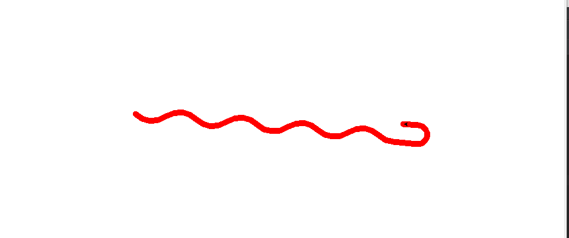

# turtle 库使用

> 作者：[村雨遥](https://github.com/cunyu1943)
> 
> 不要哀求，学会争取，若是如此，终有所获
> 
>
 

## 🎈 号外

最近，公众号之外，建立了微信交流群，不定期会在群里分享各种资源（影视、IT 编程、考试提升……）&知识。如果有需要，可以**扫码或者后台添加小编微信备注入群**。进群后**优先看群公告**，**呼叫群中【资源分享小助手】**，还能免费帮找资源哦～

<center>
 
</center>

## Turtle图形库

Turtle 库是 Python 内置的图形化模块，属于标准库之一，位于 Python 安装目录的 lib 文件夹下，常用函数有以下几种：

### 画笔控制函数

1. ```penup()```:抬起画笔； 
 2. ```pendown()```:落下画笔；
 3. ```pensize(width)```:画笔宽度；
 4. ```pencolor(color)```:画笔颜色；
	

### 运动控制函数
 1. ```forward(d)/fd(d)```:直行d个像素；
 2. ```circle(r, extent = None)```:绘制半径为 r，角度为 extent 的弧形，圆心默认在海龟左侧距离 r 的位置；
	

### 方向控制函数
1. ```setheading(angle)/seth(angle)```:改变前进方向；
2. ```left(angle)```:海龟左转；
3. ```right(angle)```:海龟右转；

## 绘制蟒蛇
### 代码

```python
# coding=utf-8
# 绘制蟒蛇
import turtle
turtle.penup()
turtle.pencolor("red")
turtle.forward(-250)
turtle.pendown()
turtle.pensize(10)
turtle.right(45)
for i in range(4):
    turtle.circle(40, 80)
    turtle.circle(-40, 80)
turtle.circle(40, 80 / 2)
turtle.fd(40)
turtle.circle(16, 180)
turtle.fd(40 * 2 / 3)
turtle.done()
```
## 结果

## 绘制五角星
### 代码
```python
#coding=utf-8
# 绘制五角星
import turtle
turtle.pensize(5)
turtle.pencolor("red")
turtle.forward(200)
for i in range(4):
    turtle.right(144)
    turtle.fd(200)
turtle.done()
```
## 结果

## 绘制时钟
### 代码

```python
#绘制时钟
# coding=utf-8
import turtle as tt
from datetime import *

# 当前日期属于一周的第几天
def Week(t):
    week = ["星期一", "星期二", "星期三", "星期四", "星期五", "星期六", "星期日"]
    return week[t.weekday()]

# 获取当前时间
def Date(t):
    y = t.year
    m = t.month
    d = t.day
    cur_hour = t.hour;
    cur_min = t.minute;
    cur_sec = t.second;
    return "%s-%d-%d %d:%02d:%02d" % (y, m, d, cur_hour, cur_min, cur_sec)

# 移动画笔,距离为distance
def movePen(distance):
    tt.penup()
    tt.pensize(5)
    tt.pencolor("blue")
    tt.fd(distance)
    tt.pendown()

# 绘制表针
def makeHands(name, length):
    # 清空窗口，重置turtule状态为初始状态
    tt.reset()
    movePen(-length * 0.1)
    # 开始记录多边形的顶点
    tt.begin_poly()
    tt.fd(length * 1.1)
    # 停止记录多边形的顶点
    tt.end_poly()
    # 返回记录的多边形
    handForm = tt.get_poly()
    tt.register_shape(name, handForm)

# 初始化
def initial():
    global secHand, minHand, hurHand, printer
    # 重置方向向北(上)，正角度为顺时针
    tt.mode("logo")
    # 建立并初始化表针
    makeHands("secHand", 180)
    makeHands("minHand", 150)
    makeHands("hurHand", 110)
    secHand = tt.Turtle()
    secHand.shape("secHand")
    minHand = tt.Turtle()
    minHand.shape("minHand")
    hurHand = tt.Turtle()
    hurHand.shape("hurHand")

    for hand in secHand, minHand, hurHand:
        hand.shapesize(1, 1, 4)
        hand.speed(0)

    # 输出文字
    printer = tt.Turtle()
    # 隐藏画笔
    printer.hideturtle()
    printer.penup()

# 绘制表盘外框
def drawClock(R):
    # 清空窗口，重置turtule状态为初始状态
    tt.reset()
    # 画笔尺寸
    tt.pensize(5)
    for i in range(60):
        movePen(R)
        if i % 5 == 0:
            tt.fd(20)
            movePen(-R - 20)

            movePen(R + 20)
            if i == 0:
                # 写文本
                tt.write(int(12), align="center", font=("Consolas", 14, "bold"))
            elif i == 30:
                movePen(25)
                tt.write(int(i / 5), align="center", font=("Consolas", 14, "bold"))
                movePen(-25)
            elif (i == 25 or i == 35):
                movePen(20)
                tt.write(int(i / 5), align="center", font=("Consolas", 14, "bold"))
                movePen(-20)
            else:
                tt.write(int(i / 5), align="center", font=("Consolas", 14, "bold"))
            movePen(-R - 20)
        else:
            # 绘制指定半径和颜色的点
            tt.dot(5, "red")
            movePen(-R)
        tt.right(6)

# 表针的动态显示
def handsMove():
    t = datetime.today()
    second = t.second + t.microsecond * 0.000001
    minute = t.minute + second / 60.0
    hour = t.hour + minute / 60.0
    secHand.seth(6 * second)
    minHand.seth(6 * minute)
    hurHand.seth(30 * hour)

    tt.tracer(False)
    printer.fd(65)
    tt.pencolor("green")
    printer.write(Week(t), align="center", font = ("黑体", 14))
    printer.back(130)
    printer.write(Date(t), align="center", font = ("Consolas", 14))
    # 设置当前画笔位置为原点，方向朝东
    printer.home()
    tt.tracer(True)

    # 经过100ms后继续调用handsMove函数
    tt.ontimer(handsMove, 100)

# 调用定义的函数，打开和关闭动画，为更新图纸设置延迟；
tt.tracer(False)
initial()
drawClock(200)
tt.tracer(True)
handsMove()
tt.mainloop()
```
### 结果


## ⏳ 联系

想解锁更多知识？不妨关注我的微信公众号：**村雨遥（id：JavaPark）**。

扫一扫，探索另一个全新的世界。

<center>

</center>

