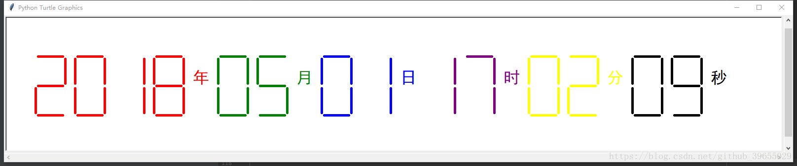

# 数码管绘制

> 作者：[村雨遥](https://github.com/cunyu1943)
> 
> 不要哀求，学会争取，若是如此，终有所获
> 
>


## 🎈 号外

最近，公众号之外，建立了微信交流群，不定期会在群里分享各种资源（影视、IT 编程、考试提升……）&知识。如果有需要，可以**扫码或者后台添加小编微信备注入群**。进群后**优先看群公告**，**呼叫群中【资源分享小助手】**，还能免费帮找资源哦～

<center>
 
</center>

##  利用 Python 中的 turtle 图形库绘制七段数码管，显示当前时间。

## 代码

```python
# coding:utf-8
# 绘制七段数码管，显示当前时间
import time
import turtle as tt

# 绘制间隔
def drawGap():
    tt.penup()
    tt.fd(5)

# 绘制单段数码管
def drawLine(draw):
    drawGap()

    if(draw):
        tt.pendown()
    else:
        tt.penup()

    tt.fd(50)
    drawGap()
    tt.right(90)

# 绘制当前时间
def drawDate(date):
    tt.pencolor("red")
    for i in date:
        if i == '+':
            tt.write("年", font = ("黑体", 25, "normal"))
            tt.pencolor("green")
            tt.fd(50)
        elif i == '-':
            tt.write("月", font=("黑体", 25, "normal"))
            tt.pencolor("blue")
            tt.fd(50)
        elif i == '*':
            tt.write("日", font=("黑体", 25, "normal"))
            tt.pencolor("purple")
            tt.fd(50)
        elif i == '=':
            tt.write("时", font=("黑体", 25, "normal"))
            tt.pencolor("yellow")
            tt.fd(50)
        elif i == '#':
            tt.write("分", font=("黑体", 25, "normal"))
            tt.pencolor("black")
            tt.fd(50)
        elif i == '$':
            tt.write("秒", font=("黑体", 25, "normal"))

        else:
            drawDigit(eval(i))

# 绘制数码管
def drawDigit(cur_time):
    if cur_time in [2, 3, 4, 5, 6, 8, 9]:
        drawLine(True)
    else:
        drawLine(False)

    if cur_time in [0, 1, 3, 4, 5, 6, 7, 8, 9]:
        drawLine(True)
    else:
        drawLine(False)

    if cur_time in [0, 2, 3, 5, 6, 8, 9]:
        drawLine(True)
    else:
        drawLine(False)

    if cur_time in [0, 2, 6, 8]:
        drawLine(True)
    else:
        drawLine(False)

    tt.left(90)
    
    if cur_time in [0, 4, 5, 6, 8, 9]:
        drawLine(True)
    else:
        drawLine(False)

    if cur_time in [0, 2, 3, 5, 6, 7, 8, 9]:
        drawLine(True)
    else:
        drawLine(False)

    if cur_time in [0, 1, 2, 3, 4, 7, 8, 9]:
        drawLine(True)
    else:
        drawLine(False)

    tt.left(180)
    tt.penup()
    tt.fd(20)

# 主函数
def main():
    tt.setup(1600, 300, 200, 200)
    tt.penup()
    tt.fd(-730)
    tt.pensize(5)
    drawDate(time.strftime('%Y+%m-%d*%H=%M#%S$', time.localtime()))
    tt.hideturtle()
    tt.done()

if __name__ == "__main__":
    main()

```


## 结果

## 总结
通过在mooc网学习相关知识，借鉴相关代码，最终实现本次设计。

## ⏳ 联系

想解锁更多知识？不妨关注我的微信公众号：**村雨遥（id：JavaPark）**。

扫一扫，探索另一个全新的世界。

<center>

</center>

