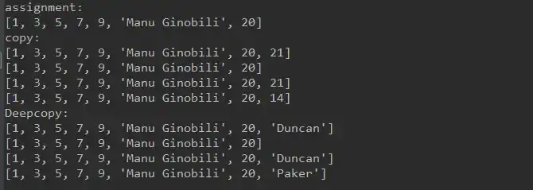
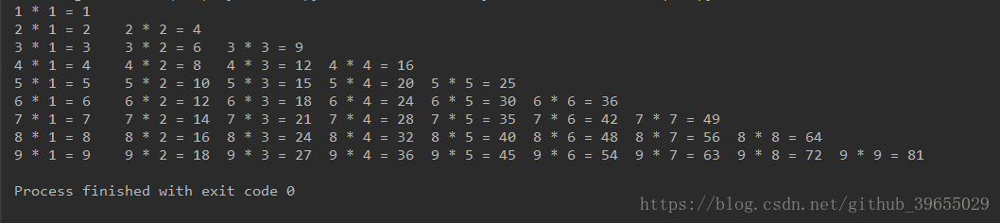
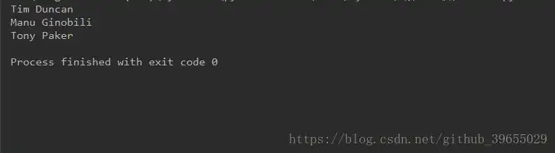
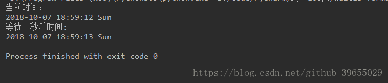

# Python3 编程实例（6 - 10）

::: info 共勉
不要哀求，学会争取。若是如此，终有所获。
:::

## 实例 6

### 题目
输入一个整数 `n`，然后打印出斐波那契数列的第 `n` 个值。
### 分析
利用递归计算斐波那契数列，输入斐波那契数列的 `n` 位，调用递归计算出第 `n` 位的数列值。
### 代码
```python
if __name__ == '__main__':
    def fib(num):
        if num <= 2:
            result = 1
        else:
            result = fib(num - 1) + fib(num - 2)
        return result


    while True:
        num = int(input('num = '))
        print('斐波那契数列的第 %d 个值是 %d' % (num, fib(num)))
```
## 实例7

### 题目
将一个列表的数据复制到另一个列表中；
### 分析
Python复制数据有三种方式：直接赋值、浅拷贝、深拷贝；

### 代码
```python
#!/usr/bin/python3
# -*- coding: utf-8 -*-
# @Time    : 2018-10-4 10:20
# @Author  : Manu
# @Site    : 
# @File    : copy.py
# @Software: PyCharm

import copy

# 直接赋值，相当于对象引用，即就是另起一个名字
print('assignment:')
list1 = [1, 3, 5, 7, 9, 'Manu Ginobili', 20]
list2 = list1
print(list2)

# 浅拷贝(copy)，拷贝父对象，不拷贝子对象
print('copy:')
list1 = [1, 3, 5, 7, 9, 'Manu Ginobili', 20]
list2 = list1.copy()

list1.append(21)
print(list1)
print(list2)

list2.append(14)
print(list1)
print(list2)

# 深拷贝(deepcopy)，完全拷贝父对象及子对象
print('Deepcopy:')
list1 = [1, 3, 5, 7, 9, 'Manu Ginobili', 20]
list2 = copy.deepcopy(list1)

list1.append('Duncan')
print(list1)
print(list2)

list2.append('Paker')
print(list1)
print(list2)
```
### 结果


## 实例8

### 题目
输出 9*9 乘法口诀表
### 分析
两层循环，将乘法口诀表以左下三角格式打印出
### 代码

```python

#!/usr/bin/python3
# -*- coding: utf-8 -*-
# @Time    : 2018-10-7 18:38
# @Author  : Manu
# @Site    : 
# @File    : multiple.py
# @Software: PyCharm

for i in range(1, 10):
    for j in range(1, i + 1):
        print('%d * %d = %d\t' %(i, j, i * j), end=' ')
    print()
```

### 结果


## 实例9

### 题目

暂停一秒输出；

### 分析

调用`time`模块中的`sleep()`方法即可；

### 代码
```python
#!/usr/bin/python3
# -*- coding: utf-8 -*-
# @Time    : 2018-10-7 18:47
# @Author  : Manu
# @Site    : 
# @File    : wait1s.py
# @Software: PyCharm

import time

spurs = ['Tim Duncan', 'Manu Ginobili', 'Tony Paker']
for spur in spurs:
    print(spur)
    time.sleep(1)
```
### 结果
打印出结果时会有明显的停顿。



## 实例10

### 题目
暂停一秒输出，并格式化当前时间；

### 分析

使用`time`模块的`strftime()`方法实现；

### 代码
```python
#!/usr/bin/python3
# -*- coding: utf-8 -*-
# @Time    : 2018-10-7 18:54
# @Author  : Manu
# @Site    : 
# @File    : wait1s_format.py
# @Software: PyCharm

import time

print('当前时间:')
print(time.strftime("%Y-%m-%d %H:%M:%S %a", time.localtime()))
time.sleep(1)
print('等待一秒后时间:')
print(time.strftime("%Y-%m-%d %H:%M:%S %a", time.localtime()))
```

### 结果


## ⏳ 联系

想解锁更多知识？不妨关注我的微信公众号：**村雨遥（id：JavaPark）**。

扫一扫，探索另一个全新的世界。


<Share colorful />