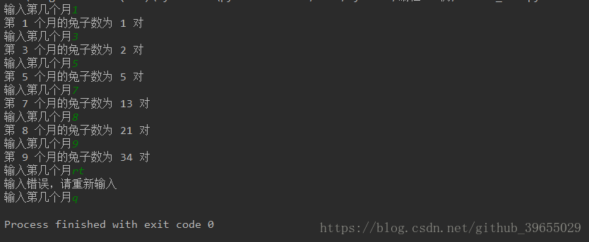
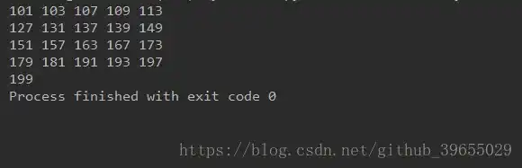
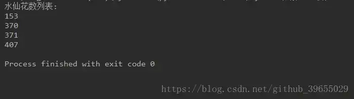
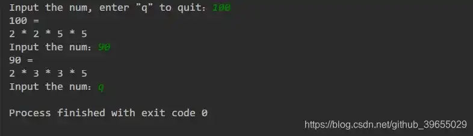
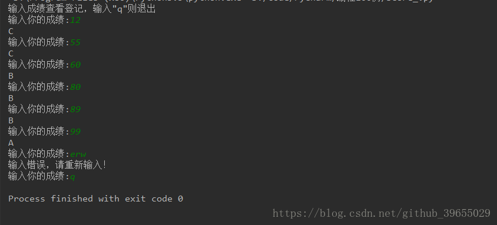

# Python3 编程实例（11 - 15）

::: info 共勉
不要哀求，学会争取。若是如此，终有所获。
:::

## 实例11

### 题目
古典问题：有一对兔子，从出生后第3个月起每个月都生一对兔子，小兔子长到第三个月后每个月又生一对兔子，假如兔子都不死，问每个月的兔子总数为多少？
### 分析
可通过定义一个函数，然后利用递归的思想将其实现；
### 代码
```python
#!/usr/bin/python3
# -*- coding:utf-8 -*-
# @Time    : 2018-10-10 8:49
# @Author  : Manu
# @Site    : 
# @File    : rabbit_num.py
# @Software: PyCharm


def rabbit_num(month):
    if month == 1 or month == 2:
        return 1
    else:
        return rabbit_num(month-2) + rabbit_num(month-1)

while True:
    month = input('输入第几个月')
    if month.isdigit():
        month = int(month)
        print('第 %d 个月的兔子数为 %d 对' %(month, rabbit_num(month)))
    elif month == 'q':
        break
    else:
        print('输入错误，请重新输入')

```
### 结果

## 实例12

### 题目
判断101-200之间有多少个素数，并输出所有素数；
### 分析
先设置一个标志位默认为`False`，进入循环判断是否为素数，不为素数则置为`True`，然后将标志位为`False`的数输出则为所求素数；
### 代码
```python
#!/usr/bin/python3
# -*- coding: utf-8 -*-
# @Time    : 2018-10-7 19:06
# @Author  : Manu
# @Site    : 
# @File    : prime_number.py
# @Software: PyCharm

import math

flag = False
count = 0
for i in range(101, 201):
    for j in range(2, int(math.sqrt(i + 1)) + 1):
        if i % j == 0:
            flag = True
            break
    if flag == False:
        count += 1
        print(i, end='\t')
        if count % 5 == 0:
            print()
    flag = False
```
### 结果

## 实例13

### 题目
打印出所有的"水仙花数"，所谓"水仙花数"是指一个三位数，其各位数字立方和等于该数本身
### 分析
对100-1000之内的三位数进行循环，求出这些三位数各自个位、十位、百位上的数，然后将他们的立方和与这个三位数比较，若两者相等则说明这个三位数是水仙花数；
### 代码
```python
#!/usr/bin/python3
# -*- coding:utf-8 -*-
# @Time    : 2018-10-10 8:25
# @Author  : Manu
# @Site    : 
# @File    : narcissistic_num.py
# @Software: PyCharm


print('水仙花数列表:')
for i in range(100, 1000):
    ge = i % 10
    shi = i // 10 % 10
    bai = i // 100

    if i == (ge ** 3 + shi ** 3 + bai ** 3):
        print(i)
```
### 结果

## 实例14

### 题目
将一个正整数分解质因数；
### 分析
- 若这个质数恰等于n，则说明分解质因数的过程结束，打印即可；
- 若n!=k，但n能被k整除，则应打印出k的值，并用n除以k的商，作为新的正整数n，重复执行第一步；
- 若n不能被k整除，则用k+1作为k的值,重复执行第一步；

### 代码
```python
#!/usr/bin/python3
# -*- coding:utf-8 -*-
# @Time    : 2018-10-8 18:41
# @Author  : Manu
# @Site    : 
# @File    : Prime.py
# @Software: PyCharm

def prime(n):
    print(str(n) + ' = ')
    if not isinstance(n, int) or n <= 0 :
        print('Please input a valid number !')
        exit(0)
    elif n in [1] :
        print(n)
    while n not in [1]:
        for index in range(2, int(n + 1)):
            if n % index == 0:
                n /= index
                if n == 1:
                    print(index)
                else :
                    print(str(index) + " *", end=' ')
                break

num = input('Input the num, enter "q" to quit：')
while num != 'q':
    prime(int(num))
    num = input('Input the num：')

```

### 结果


## 实例15

### 题目
利用条件运算符的嵌套来完成此题：学习成绩>=90分的同学用A表示，60-89分之间的用B表示，60分以下的用C表示；
### 分析
输入成绩，判断是否为数字，是数字则判定属于哪个等级，若不是数字怎根据代码设定返回重新输入成绩或者直接退出程序；
### 代码
```python
#!/usr/bin/python3
# -*- coding:utf-8 -*-
# @Time    : 2018-10-10 8:33
# @Author  : Manu
# @Site    : 
# @File    : score_.py
# @Software: PyCharm

print('输入成绩查看登记，输入"q"则退出')
while True:
    score = input('输入你的成绩:')

    if score.isdigit():

        score_rank = int(score) // 10

        if score_rank >= 9:
            print('A')
        elif score_rank >= 6 and score_rank < 9:
            print('B')
        else:
            print('C')
    elif score == 'q':
        break
    else:
        print('输入错误，请重新输入！')

```
### 结果



## ⏳ 联系

想解锁更多知识？不妨关注我的微信公众号：**村雨遥（id：JavaPark）**。

扫一扫，探索另一个全新的世界。


<Share colorful />