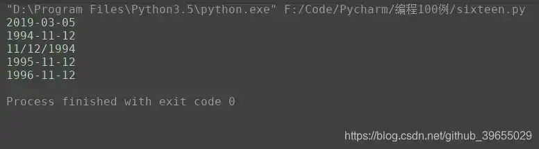
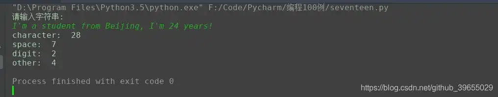
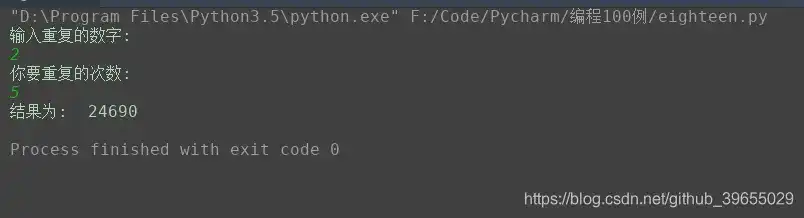
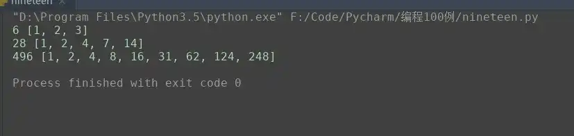
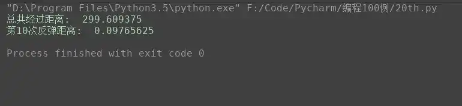

# Python3 编程实例（16 - 20）

>
> 不要哀求，学会争取。若是如此，终有所获。
> 

## 🎈 号外

最近，公众号之外，建立了微信交流群，不定期会在群里分享各种资源（影视、IT 编程、考试提升……）&知识。如果有需要，可以**扫码或者后台添加小编微信备注入群**。进群后**优先看群公告**，**呼叫群中【资源分享小助手】**，还能免费帮找资源哦～

<center>
 
</center>

## 实例16

### 题目
输出指定格式的日期；
### 分析
没啥说的，直接调用 `datetime` 模块即可；
### 代码

```python
#!/usr/bin/env python
# -*- coding: utf-8 -*-
# @Time    : 2019/3/5 22:47
# @Author  : cunyu
# @Site    : cunyu1943.github.io
# @File    : sixteen.py
# @Software: PyCharm

import datetime

if __name__=='__main__':
	# 输出当前日期
	print(datetime.date.today())

	# 创建日期对象
	Z_Birth = datetime.date(1994,11,12)
	print(Z_Birth)

	# 指定格式输出
	print(Z_Birth.strftime('%m/%d/%Y'))

	# 日期替换
	Z_Birth = Z_Birth.replace(year=Z_Birth.year+1)
	print(Z_Birth)

	# 日期运算
	Next_Z_Birth = Z_Birth + datetime.timedelta(days=366)
	print(Next_Z_Birth)
```

### 结果



## 实例17

### 题目
输入一行字符，分别统计出其中英文字母、空格、数字和其它字符的个数；
### 分析
遍历字符串，然后统计其中是否为对应种类即可；
### 代码

```python
#!/usr/bin/env python
# -*- coding: utf-8 -*-
# @Time    : 2019/3/6 21:37
# @Author  : cunyu
# @Site    : cunyu1943.github.io
# @File    : seventeen.py
# @Software: PyCharm

import string

s = input('请输入字符串:\n')
num_letter = 0
num_space = 0
num_digit = 0
num_other = 0

for i in range(len(s)):
	if s[i].isspace():
		num_space += 1
	elif s[i].isdigit():
		num_digit += 1
	elif s[i].isalpha():
		num_letter += 1
	else:
		num_other += 1

print('character: ', num_letter)
print('space: ', num_space)
print('digit: ', num_digit)
print('other: ', num_other)
```

### 结果



## 实例18

### 题目
求 s=a+aa+aaa+aaaa+aa...a 的值，其中a是一个数字。例如 2+22+222+2222+22222 (此时共有 5 个数相加)，几个数相加由键盘控制；

### 代码

```python
#!/usr/bin/env python
# -*- coding: utf-8 -*-
# @Time    : 2019/3/6 21:46
# @Author  : cunyu
# @Site    : cunyu1943.github.io
# @File    : eighteen.py
# @Software: PyCharm

num = input('输入重复的数字:\n')
times = int(input('你要重复的次数:\n'))

answer = 0
for i in range(times):
	answer += int(num)
	num += num[0]

print('结果为: ', answer)

```

### 结果



## 实例19

### 题目
一个数如果恰好等于它的因子之和，这个数就称为"完数"。例如6=1＋2＋3.编程找出1000以内的所有完数；

### 代码

```python
#!/usr/bin/env python
# -*- coding: utf-8 -*-
# @Time    : 2019/3/6 21:57
# @Author  : cunyu
# @Site    : cunyu1943.github.io
# @File    : nineteen.py
# @Software: PyCharm


for num in range(2, 1001):
	arr = []
	for i in range(1, num):
		if num % i == 0:
			arr.append(i)
	if sum(arr) == num:
		print(num, arr)
```

### 结果



## 实例20

### 题目
一球从100米高度自由落下，每次落地后反跳回原高度的一半；再落下，求它在第10次落地时，共经过多少米？第10次反弹多高？

### 代码

```python
#!/usr/bin/env python
# -*- coding: utf-8 -*-
# @Time    : 2019/3/6 22:10
# @Author  : cunyu
# @Site    : cunyu1943.github.io
# @File    : 20th.py
# @Software: PyCharm

# 初始距离
distance = 100

total = 0

total += distance

# 第10次落地时，经历了9次弹起到落地
for i in range(9):
	distance /= 2
	total += 2 * distance

print('总共经过距离: ', total)
print('第10次反弹距离: ', distance / 2)
```

### 结果

 

## ⏳ 联系

想解锁更多知识？不妨关注我的微信公众号：**村雨遥（id：JavaPark）**。

扫一扫，探索另一个全新的世界。

<center>

</center>