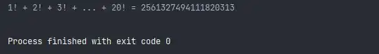

# Python3 编程实例（21 - 25）

::: info 共勉
不要哀求，学会争取。若是如此，终有所获。
:::

## 实例 21

### 题目

猴子吃桃问题：猴子第一天摘下若干个桃子，当即吃了一半，还不瘾，又多吃了一个第二天早上又将剩下的桃子吃掉一半，又多吃了一个。以后每天早上都吃了前一天剩下的一半零一个。到第 10 天早上想再吃时，见只剩下一个桃子了。求第一天共摘了多少。

### 分析

采取逆向思维的方法，从后往前推断。

### 代码

```python
#!/usr/bin/env python
# -*- coding: utf-8 -*-
# @version : 1.0
# @Time    : 2021/3/31 20:42
# @Author  : cunyu
# @Email   : 747731461@qq.com
# @Site    : https://cunyu1943.site
# 公众号    : 村雨遥
# @File    : 21.py
# @Software: PyCharm
# @Desc    : 练习实例21

if __name__ == '__main__':
    end = 1
    start = 0
    for day in range(10, 1, -1):
        start = (end + 1) * 2
        end = start

    print('第一天的桃子：' + str(start))

```


### 结果


## 实例 22

### 题目

两个乒乓球队进行比赛，各出三人。甲队为 a,b,c 三人，乙队为 x,y,z 三人。已抽签决定比赛名单。有人向队员打听比赛的名单。a 说他不和 x 比，c 说他不和 x,z 比，请编程序找出三队赛手的名单。

### 分析

三层循环，然后再加判断即可；

### 代码

```python
#!/usr/bin/env python
# -*- coding: utf-8 -*-
# @version : 1.0
# @Time    : 2021/3/31 20:45
# @Author  : cunyu
# @Email   : 747731461@qq.com
# @Site    : https://cunyu1943.site
# 公众号    : 村雨遥
# @File    : 22.py
# @Software: PyCharm
# @Desc    : 练习实例22

if __name__ == '__main__':
    for i in range(ord('x'), ord('z') + 1):
        for j in range(ord('x'), ord('z') + 1):
            if i != j:
                for k in range(ord('x'), ord('z') + 1):
                    if (i != k) and (j != k):
                        if (i != ord('x')) and (k != ord('x')) and (k != ord('z')):
                            print('对战名单：\na <-> %s\nb <-> %s\nc <-> %s' % (chr(i), chr(j), chr(k)))
```


### 结果


## 实例 23

### 题目

打印出如下图案（菱形）:

```
   *
  ***
 *****
*******
 *****
  ***
   *
```

### 分析

先把图形分成两部分来看待，前四行一个规律，后三行一个规律，利用双重 for 循环，第一层控制行，第二层控制列。

### 代码

```python
#!/usr/bin/env python
# -*- coding: utf-8 -*-
# @version : 1.0
# @Time    : 2021/4/10 9:32
# @Author  : cunyu
# @Email   : 747731461@qq.com
# @Site    : https://cunyu1943.site
# 公众号    : 村雨遥
# @File    : 23.py
# @Software: PyCharm
# @Desc    : 练习实例23

if __name__ == '__main__':
    for i in range(4):
        for j in range(2 - i + 1):
            print(" ", end='')
        for k in range(2 * i + 1):
            print("*", end='')
        print()

    for i in range(3):
        for j in range(i + 1):
            print(" ", end='')
        for k in range(4 - 2 * i + 1):
            print("*", end='')
        print()

```


### 结果


## 实例 24

### 题目

有一分数序列：2/1，3/2，5/3，8/5，13/8，21/13...求出这个数列的前20项之和。

### 分析

仔细观察数列的分子分母，可以看到，当前分数的分子等于上一个分数的分子分母之和，而当前分数的分母就等于上一个分数的分子；

### 代码

```python
#!/usr/bin/env python
# -*- coding: utf-8 -*-
# @version : 1.0
# @Time    : 2021/4/10 9:58
# @Author  : cunyu
# @Email   : 747731461@qq.com
# @Site    : https://cunyu1943.site
# 公众号    : 村雨遥
# @File    : 24.py
# @Software: PyCharm
# @Desc    : 练习实例24

if __name__ == '__main__':
    numerator = 2
    denominator = 1
    sum = 0
    for i in range(1, 21):
        sum += numerator * 1.0 / denominator
        tmp = numerator
        numerator += denominator
        denominator = tmp
    print('数列之和：' + str(sum))

```


### 结果


## 实例 25

### 题目

求 1+2!+3!+...+20! 的和。

### 分析

和累加比较类似，先计算累乘，然后相加即可；

### 代码

```python
#!/usr/bin/env python
# -*- coding: utf-8 -*-
# @version : 1.0
# @Time    : 2021/4/10 10:02
# @Author  : cunyu
# @Email   : 747731461@qq.com
# @Site    : https://cunyu1943.site
# 公众号    : 村雨遥
# @File    : 25.py
# @Software: PyCharm
# @Desc    : 练习实例25

if __name__ == '__main__':
    sum = 0
    tmp = 1
    for i in range(1, 21):
        tmp *= i
        sum += tmp
    print('1! + 2! + 3! + ... + 20! = ' + str(sum))
```


### 结果



## ⏳ 联系

想解锁更多知识？不妨关注我的微信公众号：**村雨遥（id：JavaPark）**。

扫一扫，探索另一个全新的世界。


<Share colorful />