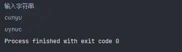

# Python3 编程实例（26 - 30）

>
> 不要哀求，学会争取。若是如此，终有所获。
> 

## 🎈 号外

最近，公众号之外，建立了微信交流群，不定期会在群里分享各种资源（影视、IT 编程、考试提升……）&知识。如果有需要，可以**扫码或者后台添加小编微信备注入群**。进群后**优先看群公告**，**呼叫群中【资源分享小助手】**，还能免费帮找资源哦～

<center>
 
</center>

## 实例 26

### 题目

利用递归方法求 5!。

### 分析

递归公式：$f(n) = f(n - 1) * n$；

### 代码

```python
#!/usr/bin/env python
# -*- coding: utf-8 -*-
# @version : 1.0
# @Time    : 2021/4/10 10:07
# @Author  : cunyu
# @Email   : 747731461@qq.com
# @Site    : https://cunyu1943.site
# 公众号    : 村雨遥
# @File    : 26.py
# @Software: PyCharm
# @Desc    : 练习实例26

def fact(num):
    if num == 0:
        return 1
    else:
        return fact(num - 1) * num


if __name__ == '__main__':
    print(fact(5))

```


### 结果


## 实例 27

### 题目

利用递归函数调用方式，将所输入的 5 个字符，以相反顺序打印出来。

### 分析

注意边界条件（即字符串长度为 0 时）；

### 代码

```python
#!/usr/bin/env python
# -*- coding: utf-8 -*-
# @version : 1.0
# @Time    : 2021/4/10 10:09
# @Author  : cunyu
# @Email   : 747731461@qq.com
# @Site    : https://cunyu1943.site
# 公众号    : 村雨遥
# @File    : 27.py
# @Software: PyCharm
# @Desc    : 练习实例27

def reverseString(str, length):
    if (length == 0):
        return
    print(str[length - 1], end='')
    reverseString(str, length - 1)


if __name__ == '__main__':
    str = input("输入字符串\n")
    reverseString(str, len(str))
```


### 结果



## 实例 28

### 题目

有5个人坐在一起，问第五个人多少岁？他说比第4个人大2岁。问第4个人岁数，他说比第3个人大2岁。问第三个人，又说比第2人大两岁。问第2个人，说比第一个人大两岁。最后问第一个人，他说是10岁。请问第五个人多大？

### 分析

利用递归的方法，递归分为回推和递推两个阶段。要想知道第五个人岁数，需知道第四人的岁数，依次类推，推到第一人（10岁），再往回推。

### 代码

```python
#!/usr/bin/env python
# -*- coding: utf-8 -*-
# @version : 1.0
# @Time    : 2021/4/10 10:16
# @Author  : cunyu
# @Email   : 747731461@qq.com
# @Site    : https://cunyu1943.site
# 公众号    : 村雨遥
# @File    : 28.py
# @Software: PyCharm
# @Desc    : 练习实例28

def age(num):
    if num == 1:
        return 10
    else:
        return 2 + age(num - 1)


if __name__ == '__main__':
    print("第五个人的年龄：" + str(age(5)))
```


### 结果


## 实例 29

### 题目

给一个不多于5位的正整数，要求：一、求它是几位数，二、逆序打印出各位数字。

### 分析

重点在于如何将这个正整数分解，然后再逆序打印即可；

### 代码

```python
#!/usr/bin/env python
# -*- coding: utf-8 -*-
# @version : 1.0
# @Time    : 2021/4/10 10:19
# @Author  : cunyu
# @Email   : 747731461@qq.com
# @Site    : https://cunyu1943.site
# 公众号    : 村雨遥
# @File    : 29.py
# @Software: PyCharm
# @Desc    : 练习实例29

if __name__ == '__main__':
    num = int(input("输入一多于 5 位的正整数\n"))
    one = num % 10
    ten = num % 100 // 10
    hundred = num % 1000 // 100
    thousand = num % 10000 // 1000
    million = num // 10000

    if million != 0:
        print("5 位数：", one, ten, hundred, thousand, million)
    elif thousand != 0:
        print("4 位数：", one, ten, hundred, thousand)
    elif hundred != 0:
        print("3 位数：", one, ten, hundred)
    elif ten != 0:
        print("2 位数：", one, ten)
    elif one != 0:
        print("1 位数：", one)

```


### 结果


## 实例 30

### 题目

一个 5 位数，判断它是不是回文数。即 12321 是回文数，个位与万位相同，十位与千位相同。

### 分析

和上一个例子一样，重点在于分解该整数，然后再判断个位和万位，十位和千位是否相同；

### 代码

```python
#!/usr/bin/env python
# -*- coding: utf-8 -*-
# @version : 1.0
# @Time    : 2021/4/10 10:30
# @Author  : cunyu
# @Email   : 747731461@qq.com
# @Site    : https://cunyu1943.site
# 公众号    : 村雨遥
# @File    : 30.py
# @Software: PyCharm
# @Desc    : 练习实例30

if __name__ == '__main__':
    num = int(input("输入一个 5 位的正整数\n"))
    one = num % 10
    ten = num % 100 // 10
    hundred = num % 1000 // 100
    thousand = num % 10000 // 1000
    million = num // 10000

    if one == million and ten == thousand:
        print("%d 是一个回文数" % num)
    else:
        print("%d 不是一个回文数" % num)
```


### 结果


## ⏳ 联系

想解锁更多知识？不妨关注我的微信公众号：**村雨遥（id：JavaPark）**。

扫一扫，探索另一个全新的世界。

<center>

</center>