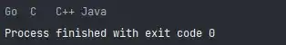

# Python3 编程实例（31 - 35）

::: info 共勉
不要哀求，学会争取。若是如此，终有所获。
:::

## 实例 31

### 题目

请输入星期几的第一个字母来判断一下是星期几，如果第一个字母一样，则继续判断第二个字母。

### 分析

用 `switch` 语句比较好，如果第一个字母一样，则判断用 `switch` 语句或 `if` 语句判断第二个字母。

### 代码

```python
#!/usr/bin/env python
# -*- coding: utf-8 -*-
# @version : 1.0
# @Time    : 2021/4/10 10:35
# @Author  : cunyu
# @Email   : 747731461@qq.com
# @Site    : https://cunyu1943.site
# 公众号    : 村雨遥
# @File    : 31.py
# @Software: PyCharm
# @Desc    : 练习实例31

if __name__ == '__main__':

    letter = input("输入星期几的英文:")

    if letter == 'S':
        print('继续输入第二个字母:')
        letter = input("请输入:")
        if letter == 'a':
            print('星期六：Saturday')
        elif letter == 'u':
            print('星期天：Sunday')
        else:
            print('输入错误')

    elif letter == 'F':
        print('星期五：Friday')

    elif letter == 'M':
        print('星期一：Monday')

    elif letter == 'T':
        print('继续输入第二个字母:')
        letter = input("请输入:")

        if letter == 'u':
            print('星期二：Tuesday')
        elif letter == 'h':
            print('星期四：Thursday')
        else:
            print('输入错误')

    elif letter == 'W':
        print('星期三：Wednesday')
    else:
        print('输入错误')

```


### 结果


## 实例 32

### 题目

按相反的顺序输出列表的值。

### 分析

考察Python 中对列表的操作。

### 代码

```python
#!/usr/bin/env python
# -*- coding: utf-8 -*-
# @version : 1.0
# @Time    : 2021/4/10 10:38
# @Author  : cunyu
# @Email   : 747731461@qq.com
# @Site    : https://cunyu1943.site
# 公众号    : 村雨遥
# @File    : 32.py
# @Software: PyCharm
# @Desc    : 练习实例32

if __name__ == '__main__':
    lists = ['Java', 'C++', 'C', "Go"]
    for item in lists[::-1]:
        print(item, end='\t')

```


### 结果



## 实例 33

### 题目

按逗号分隔列表。

### 分析

利用 `join` 函数连接。

### 代码

```python
#!/usr/bin/env python
# -*- coding: utf-8 -*-
# @version : 1.0
# @Time    : 2021/4/10 10:40
# @Author  : cunyu
# @Email   : 747731461@qq.com
# @Site    : https://cunyu1943.site
# 公众号    : 村雨遥
# @File    : 33.py
# @Software: PyCharm
# @Desc    : 练习实例33

if __name__ == '__main__':
    lists = [1, 3, 4, 5, 6]

    for i in range(len(lists)):
        if i == len(lists) - 1:
            print(lists[i], end='')
        else:
            print(lists[i], end=',')

```


### 结果


## 实例 34

### 题目

练习函数调用。

### 分析

使用函数，输出三次字符串。

### 代码

```python
#!/usr/bin/env python
# -*- coding: utf-8 -*-
# @version : 1.0
# @Time    : 2021/4/10 10:59
# @Author  : cunyu
# @Email   : 747731461@qq.com
# @Site    : https://cunyu1943.site
# 公众号    : 村雨遥
# @File    : 34.py
# @Software: PyCharm
# @Desc    : 练习实例34

def function(str):
    print(str)


if __name__ == '__main__':
    str = input("输入字符串\n")
    for i in range(3):
        function(str)

```


### 结果


## 实例 35

### 题目

文本颜色设置。

### 分析

终端的字符颜色通过转义序列控制，常见显示颜色的参数如下：

| 显示方式 | 效果         | 前景色 | 背景色 | 颜色描述 |
| :------- | :----------- | :----- | :----- | :------- |
| 0        | 终端默认设置 | 30     | 40     | 黑色     |
| 1        | 高亮显示     | 31     | 41     | 红色     |
| 4        | 使用下划线   | 32     | 42     | 绿色     |
| 5        | 闪烁         | 33     | 43     | 黄色     |
| 7        | 反白显示     | 34     | 44     | 蓝色     |
| 8        | 不可见       | 35     | 45     | 紫红色   |
| 22       | 非高亮显示   | 36     | 46     | 青蓝色   |
| 24       | 去下划线     | 37     | 47     | 白色     |
| 25       | 去闪烁       |        |        |          |
| 27       | 非反白显示   |        |        |          |
| 28       | 可见         |        |        |          |

### 代码

```python
#!/usr/bin/env python
# -*- coding: utf-8 -*-
# @version : 1.0
# @Time    : 2021/4/10 11:02
# @Author  : cunyu
# @Email   : 747731461@qq.com
# @Site    : https://cunyu1943.site
# 公众号    : 村雨遥
# @File    : 35.py
# @Software: PyCharm
# @Desc    : 练习实例35

class bcolors:
    HEADER = '\033[95m'
    OKBLUE = '\033[94m'
    OKGREEN = '\033[92m'
    WARNING = '\033[93m'
    FAIL = '\033[91m'
    ENDC = '\033[0m'
    BOLD = '\033[1m'
    UNDERLINE = '\033[4m'


if __name__ == '__main__':
    print(bcolors.WARNING + "警告的颜色字体?" + bcolors.ENDC)

```


### 结果


## ⏳ 联系

想解锁更多知识？不妨关注我的微信公众号：**村雨遥（id：JavaPark）**。

扫一扫，探索另一个全新的世界。


<Share colorful />