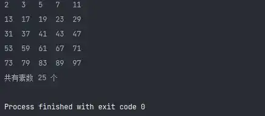
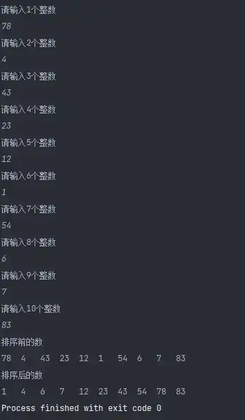
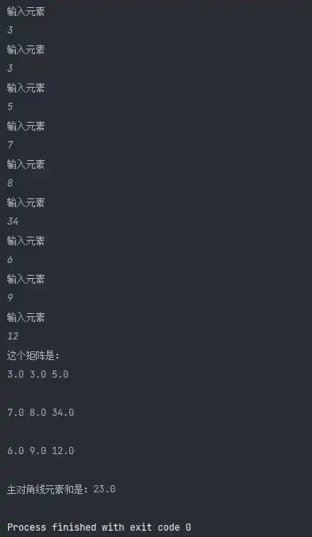
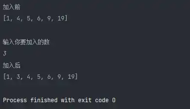
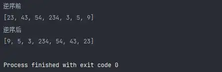

# Python3 编程实例（36 - 40）

>
> 不要哀求，学会争取。若是如此，终有所获。
> 

## 🎈 号外

最近，公众号之外，建立了微信交流群，不定期会在群里分享各种资源（影视、IT 编程、考试提升……）&知识。如果有需要，可以**扫码或者后台添加小编微信备注入群**。进群后**优先看群公告**，**呼叫群中【资源分享小助手】**，还能免费帮找资源哦～

<center>
 
</center>

## 实例 36

### 题目

求 100 之内的素数。

### 分析

所谓素数就是除 1 和自身外，无法被其他数整除的数，那就循环比这个数的平方根还小的数，并取模，如果都不能整除，那么这个数就是素数。

### 代码

```python
#!/usr/bin/env python
# -*- coding: utf-8 -*-
# @version : 1.0
# @Time    : 2021/4/10 11:02
# @Author  : cunyu
# @Email   : 747731461@qq.com
# @Site    : https://cunyu1943.site
# 公众号    : 村雨遥
# @File    : 36.py
# @Software: PyCharm
# @Desc    : 练习实例36

if __name__ == '__main__':
    count = 0
    for i in range(1, 101):
        if i > 1:
            for j in range(2, i):
                if (i % j == 0):
                    break
            else:
                print(i, end='\t')
                count += 1
                if (count % 5 == 0):
                    print()
    print("共有素数 %d 个" % count)
```


### 结果



## 实例 37

### 题目

对 10 个数进行排序。

### 分析

利用选择法，即从后 9 个比较过程中，选择一个最小的与第一个元素交换，下次类推，即用第二个元素与后 8 个进行比较，并进行交换。

### 代码

```python
#!/usr/bin/env python
# -*- coding: utf-8 -*-
# @version : 1.0
# @Time    : 2021/4/10 11:09
# @Author  : cunyu
# @Email   : 747731461@qq.com
# @Site    : https://cunyu1943.site
# 公众号    : 村雨遥
# @File    : 37.py
# @Software: PyCharm
# @Desc    : 练习实例37

if __name__ == '__main__':
    lists = []
    for i in range(10):
        lists.append(int(input("请输入" + str(i + 1) + "个整数\n")))
    print("排序前的数")
    for item in lists:
        print(item, end='\t')

    # 排序
    for i in range(9):
        min = i
        for j in range(i + 1, 10):
            if lists[min] > lists[j]:
                min = j
        tmp = lists[i]
        lists[i] = lists[min]
        lists[min] = tmp
    print("\n排序后的数")
    for item in lists:
        print(item, end='\t')
```


### 结果



## 实例 38

### 题目

求一个 3 * 3 矩阵主对角线元素之和。


### 分析

分别输入矩阵的 9 个元素，然后求对角线元素之和，对角线元素的行列坐标相等。

### 代码

```python
#!/usr/bin/env python
# -*- coding: utf-8 -*-
# @version : 1.0
# @Time    : 2021/4/10 12:36
# @Author  : cunyu
# @Email   : 747731461@qq.com
# @Site    : https://cunyu1943.site
# 公众号    : 村雨遥
# @File    : 38.py
# @Software: PyCharm
# @Desc    : 练习实例38


if __name__ == '__main__':
    lists = []
    sum = 0.0

    for i in range(3):
        lists.append([])
        for j in range(3):
            lists[i].append(float(input("输入元素\n")))

    print("这个矩阵是：")
    for i in range(3):
        for j in range(3):
            print(lists[i][j], end='\t')
        print("\n")

    for i in range(3):
        sum += lists[i][i]

    print("主对角线元素和是：" + str(sum))

```


### 结果



## 实例 39

### 题目

有一个已经排好序的数组。现输入一个数，要求按原来的规律将它插入数组中。

### 分析

调用 `sorted_add(s, number)`，表示在有序列表 s 中正确位置插入 number 元素；

### 代码

```python
#!/usr/bin/env python
# -*- coding: utf-8 -*-
# @version : 1.0
# @Time    : 2021/4/10 12:49
# @Author  : cunyu
# @Email   : 747731461@qq.com
# @Site    : https://cunyu1943.site
# 公众号    : 村雨遥
# @File    : 39.py
# @Software: PyCharm
# @Desc    : 练习实例39

def sorted_add(lists, num):
    for i in range(len(lists)):
        if lists[i] > num:
            lists.insert(i, num)
            break
        if i == len(lists) - 1:
            lists.append(num)


if __name__ == '__main__':
    lists = [1, 4, 5, 6, 9, 19]
    print("加入前")
    print(lists)

    num = int(input("\n输入你要加入的数\n"))
    sorted_add(lists, num)
    print("加入后")
    print(lists)

```


### 结果



## 实例 40

### 题目

将一个数组逆序输出。

### 分析

直接用第一个与最后一个交换即可。

### 代码

```python
#!/usr/bin/env python
# -*- coding: utf-8 -*-
# @version : 1.0
# @Time    : 2021/4/10 13:11
# @Author  : cunyu
# @Email   : 747731461@qq.com
# @Site    : https://cunyu1943.site
# 公众号    : 村雨遥
# @File    : 40.py
# @Software: PyCharm
# @Desc    : 练习实例40

if __name__ == '__main__':
    lists = [23, 43, 54, 234, 3, 5, 9]
    print("逆序前")
    print(lists)
    size = len(lists)
    for i in range(len(lists) // 2):
        lists[i], lists[size - i - 1] = lists[size - i - 1], lists[i]
    print("逆序后")
    print(lists)
```

### 结果



## ⏳ 联系

想解锁更多知识？不妨关注我的微信公众号：**村雨遥（id：JavaPark）**。

扫一扫，探索另一个全新的世界。

<center>

</center>