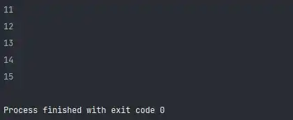
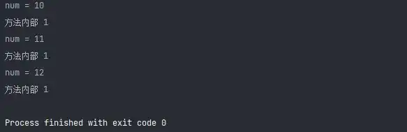
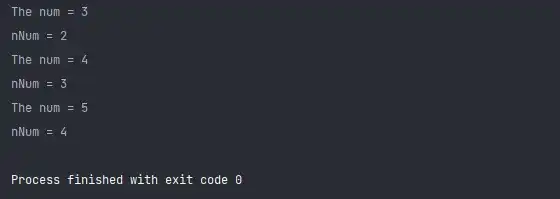
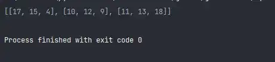
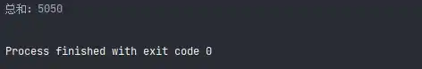

# Python3 编程实例（41 - 45）

::: info 共勉
不要哀求，学会争取。若是如此，终有所获。
:::

## 实例 41

### 题目

模仿静态变量的用法。

### 分析

所谓静态变量其实就是说它的作用域是整个程序。

### 代码

```python
#!/usr/bin/env python
# -*- coding: utf-8 -*-
# @version : 1.0
# @Time    : 2021/4/10 13:24
# @Author  : cunyu
# @Email   : 747731461@qq.com
# @Site    : https://cunyu1943.site
# 公众号    : 村雨遥
# @File    : 41.py
# @Software: PyCharm
# @Desc    : 练习实例41

class Demo:
    static_value = 10

    def addStatic(self):
        self.static_value += 1
        print(self.static_value)


if __name__ == '__main__':
    demo = Demo()
    for i in range(5):
        demo.addStatic()
```


### 结果



## 实例 42

### 题目

学习使用 auto 定义变量的用法。

### 分析

Python 中不存在 auto 关键字，所以利用变量作用域来进行示范。

### 代码

```python
#!/usr/bin/env python
# -*- coding: utf-8 -*-
# @version : 1.0
# @Time    : 2021/4/10 13:28
# @Author  : cunyu
# @Email   : 747731461@qq.com
# @Site    : https://cunyu1943.site
# 公众号    : 村雨遥
# @File    : 42.py
# @Software: PyCharm
# @Desc    : 练习实例42


def autofunc():
    num = 1
    print('方法内部 %d' % num)
    num += 1


if __name__ == '__main__':
    num = 10
    for i in range(3):
        print('num = %d' % num)
        num += 1
        autofunc()

```


### 结果



## 实例 43

### 题目

模仿静态变量 (static) 另一案例。

### 分析

类似于实例 41。

### 代码

```python
#!/usr/bin/env python
# -*- coding: utf-8 -*-
# @version : 1.0
# @Time    : 2021/4/10 13:34
# @Author  : cunyu
# @Email   : 747731461@qq.com
# @Site    : https://cunyu1943.site
# 公众号    : 村雨遥
# @File    : 43.py
# @Software: PyCharm
# @Desc    : 练习实例43

class Num:
    nNum = 1

    def inc(self):
        self.nNum += 1
        print('nNum = %d' % self.nNum)


if __name__ == '__main__':
    nNum = 2
    inst = Num()
    for i in range(3):
        nNum += 1
        print('The num = %d' % nNum)
        inst.inc()

```


### 结果



## 实例 44

### 题目

两个 3 行 3 列的矩阵，实现其对应位置的数据相加，并返回一个新矩阵：

```
X = [[12,7,3],
    [4 ,5,6],
    [7 ,8,9]]

Y = [[5,8,1],
    [6,7,3],
    [4,5,9]]
```

### 分析

只需要将矩阵对应位置上的元素进行相加，存放到新的矩阵中即可。

### 代码

```python
#!/usr/bin/env python
# -*- coding: utf-8 -*-
# @version : 1.0
# @Time    : 2021/4/10 20:35
# @Author  : cunyu
# @Email   : 747731461@qq.com
# @Site    : https://cunyu1943.site
# 公众号    : 村雨遥
# @File    : 44.py
# @Software: PyCharm
# @Desc    : 练习实例44

if __name__ == '__main__':
    X = [[12, 7, 3],
         [4, 5, 6],
         [7, 8, 9]]

    Y = [[5, 8, 1],
         [6, 7, 3],
         [4, 5, 9]]

    result = [[0, 0, 0],
              [0, 0, 0],
              [0, 0, 0]]

    for i in range(len(X)):
        for j in range(len(X[0])):
            result[i][j] = X[i][j] + Y[i][j]

    print(result)

```


### 结果



## 实例 45

### 题目

统计 1 到 100 之和。

### 分析

就是一个累加的过程，利用循环即可实现。

### 代码

```python
#!/usr/bin/env python
# -*- coding: utf-8 -*-
# @version : 1.0
# @Time    : 2021/4/10 20:39
# @Author  : cunyu
# @Email   : 747731461@qq.com
# @Site    : https://cunyu1943.site
# 公众号    : 村雨遥
# @File    : 45.py
# @Software: PyCharm
# @Desc    : 练习实例45

if __name__ == '__main__':
    sum = 0
    for i in range(1, 101):
        sum += i
    print("总和：%d" % sum)

```


### 结果



## ⏳ 联系

想解锁更多知识？不妨关注我的微信公众号：**村雨遥（id：JavaPark）**。

扫一扫，探索另一个全新的世界。


<Share colorful />