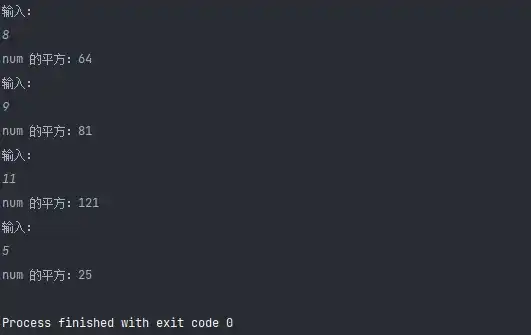
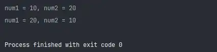
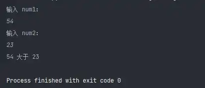
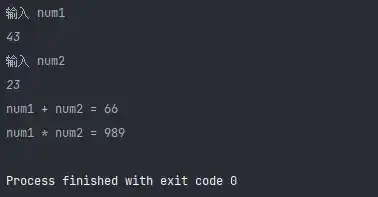
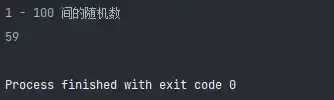

# Python3 编程实例（46 - 50）

::: info 共勉
不要哀求，学会争取。若是如此，终有所获。
:::

## 实例 46

### 题目

求输入数字的平方，如果平方运算后小于 50 则退出。

### 分析

判断输入数的平方和 50 的大小，然后做出判断即可。

### 代码

```python
#!/usr/bin/env python
# -*- coding: utf-8 -*-
# @version : 1.0
# @Time    : 2021/4/10 20:42
# @Author  : cunyu
# @Email   : 747731461@qq.com
# @Site    : https://cunyu1943.site
# 公众号    : 村雨遥
# @File    : 46.py
# @Software: PyCharm
# @Desc    : 练习实例46

if __name__ == '__main__':
    while True:
        num = int(input('输入：\n'))
        print('num 的平方：%d' % (num * num))
        if num * num < 50:
            break
```


### 结果



## 实例 47

### 题目

两个变量值互换。

### 分析

可以利用 Python 的连续赋值特性。

### 代码

```python
#!/usr/bin/env python
# -*- coding: utf-8 -*-
# @version : 1.0
# @Time    : 2021/4/10 20:45
# @Author  : cunyu
# @Email   : 747731461@qq.com
# @Site    : https://cunyu1943.site
# 公众号    : 村雨遥
# @File    : 47.py
# @Software: PyCharm
# @Desc    : 练习实例47

if __name__ == '__main__':
    num1 = 10
    num2 = 20
    print("num1 = %d, num2 = %d" % (num1, num2))
    num1, num2 = num2, num1
    print("num1 = %d, num2 = %d" % (num1, num2))

```


### 结果



## 实例 48

### 题目

数字比较。

### 分析

主要考虑如何输入数字，然后比较数字之间的大小关系。

### 代码

```python
#!/usr/bin/env python
# -*- coding: utf-8 -*-
# @version : 1.0
# @Time    : 2021/4/10 20:45
# @Author  : cunyu
# @Email   : 747731461@qq.com
# @Site    : https://cunyu1943.site
# 公众号    : 村雨遥
# @File    : 48.py
# @Software: PyCharm
# @Desc    : 练习实例48

if __name__ == '__main__':
    num1 = int(input("输入 num1：\n"))
    num2 = int(input("输入 num2：\n"))

    if num1 > num2:
        print('%d 大于 %d' % (num1, num2))
    elif num1 == num2:
        print('%d 等于 %d' % (num1, num2))
    elif num1 < num2:
        print('%d 小于 %d' % (num1, num2))

```


### 结果



## 实例 49

### 题目

使用 lambda 来创建匿名函数。

### 分析

考察用 lambda 来创建并使用函数的知识点。


### 代码

```python
#!/usr/bin/env python
# -*- coding: utf-8 -*-
# @version : 1.0
# @Time    : 2021/4/10 20:53
# @Author  : cunyu
# @Email   : 747731461@qq.com
# @Site    : https://cunyu1943.site
# 公众号    : 村雨遥
# @File    : 49.py
# @Software: PyCharm
# @Desc    : 练习实例49

if __name__ == '__main__':
    add = lambda num1, num2: num1 + num2
    mul = lambda num1, num2: num1 * num2

    num1 = int(input("输入 num1 \n"))
    num2 = int(input("输入 num2 \n"))
    result1 = add(num1, num2)
    print("num1 + num2 = %d" % add(num1, num2))
    print("num1 * num2 = %d" % mul(num1, num2))

```


### 结果



## 实例 50

### 题目

输出一个随机数。

### 分析

调用 `random` 模块。

### 代码

```python
#!/usr/bin/env python
# -*- coding: utf-8 -*-
# @version : 1.0
# @Time    : 2021/4/10 20:53
# @Author  : cunyu
# @Email   : 747731461@qq.com
# @Site    : https://cunyu1943.site
# 公众号    : 村雨遥
# @File    : 50.py
# @Software: PyCharm
# @Desc    : 练习实例50

import random

if __name__ == '__main__':
    print('1 - 100 间的随机数')
    print(random.randint(1, 100))

```


### 结果



## ⏳ 联系

想解锁更多知识？不妨关注我的微信公众号：**村雨遥（id：JavaPark）**。

扫一扫，探索另一个全新的世界。


<Share colorful />