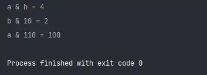
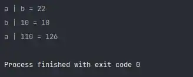
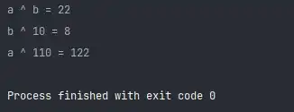
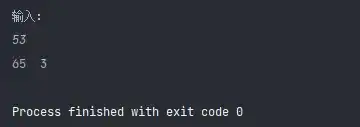

# Python3 编程实例（51 - 55）

::: info 共勉
不要哀求，学会争取。若是如此，终有所获。
:::

## 实例 51

### 题目

学习使用按位与 & 。

### 分析

按位与时，相当于将其转换为二进制，然后按照如下规则进行与运算即可；

-   `1 & 1 = 1`
-   `0 & 0 = 0`
-   `0 & 1 = 0`
-   `1 & 0 = 0`

### 代码

```Python
#!/usr/bin/env python
# -*- coding: utf-8 -*-
# @version : 1.0
# @Time    : 2021/4/10 21:06
# @Author  : cunyu
# @Email   : 747731461@qq.com
# @Site    : https://cunyu1943.site
# 公众号    : 村雨遥
# @File    : 51.py
# @Software: PyCharm
# @Desc    : 练习实例51

if __name__ == '__main__':
    a = 100
    b = 23
    print('a & b = %d' % (a & b))
    print('b & 10 = %d' % (b & 10))
    print('a & 110 = %d' % (a & 110))

```


### 结果



## 实例 52

### 题目

学习使用按位或 `|` 。

### 分析

按位或时，相当于将其转换为二进制，然后按照如下规则进行或运算即可；

-   `1 | 1 = 1`
-   `0 | 0 = 0`
-   `0 | 1 = 1`
-   `1 | 0 = 1`

### 代码

```Python
#!/usr/bin/env python
# -*- coding: utf-8 -*-
# @version : 1.0
# @Time    : 2021/4/10 21:09
# @Author  : cunyu
# @Email   : 747731461@qq.com
# @Site    : https://cunyu1943.site
# 公众号    : 村雨遥
# @File    : 52.py
# @Software: PyCharm
# @Desc    : 实例 52


if __name__ == '__main__':
    a = 20
    b = 2
    print('a | b = %d' % (a | b))
    print('b | 10 = %d' % (b | 10))
    print('a | 110 = %d' % (a | 110))

```


### 结果



## 实例 53

### 题目

学习使用按位异或 `^` 。

### 分析

按位异或时，相当于将其转换为二进制，然后按照如下规则进行异或运算即可；

-   `1 ^ 1 = 0`
-   `0 ^ 0 = 0`
-   `0 ^ 1 = 1`
-   `1 ^ 0 = 1`

### 代码

```Python
#!/usr/bin/env python
# -*- coding: utf-8 -*-
# @version : 1.0
# @Time    : 2021/4/10 21:23
# @Author  : cunyu
# @Email   : 747731461@qq.com
# @Site    : https://cunyu1943.site
# 公众号    : 村雨遥
# @File    : 53.py
# @Software: PyCharm
# @Desc    : 练习实例53

if __name__ == '__main__':
    a = 20
    b = 2
    print('a ^ b = %d' % (a ^ b))
    print('b ^ 10 = %d' % (b ^ 10))
    print('a ^ 110 = %d' % (a ^ 110))

```


### 结果



## 实例 54

### 题目

取一个整数 a 从右端开始的 4 〜 7 位。

### 分析

1.  先将 a 向右移动 4 位；
2.  设置一个低 4 位全为 1，其余全为 0 的数；
3.  然后将上面的两个数进行 `&` 运算即可；

### 代码

```Python
#!/usr/bin/env python
# -*- coding: utf-8 -*-
# @version : 1.0
# @Time    : 2021/4/10 21:25
# @Author  : cunyu
# @Email   : 747731461@qq.com
# @Site    : https://cunyu1943.site
# 公众号    : 村雨遥
# @File    : 54.py
# @Software: PyCharm
# @Desc    : 练习实例54

if __name__ == '__main__':
    num1 = int(input("输入：\n"))
    num2 = num1 >> 4
    num3 = ~(~0 << 4)
    num4 = num2 & num3
    print('%o\t%o' % (num1, num4))

```


### 结果



## 实例 55

### 题目

学习使用按位取反 `~`。

### 分析

按位取反，就是将其转换为二进制后，按照如下规则进行转换：

-   按位取反：二进制每一位取反，0 变为 1，1 变为 0；
-   最高位为符号位，整数符号位为 0，负数符号位为 1；

### 代码

```Python
#!/usr/bin/env python
# -*- coding: utf-8 -*-
# @version : 1.0
# @Time    : 2021/6/18 14:45
# @Author  : cunyu
# @Email   : 747731461@qq.com
# @Site    : https://cunyu1943.site
# 公众号    : 村雨遥
# @File    : 55.py
# @Software: PyCharm
# @Desc    : 实例 55

if __name__ == '__main__':
    while True:
        num = int(input("输入一个整数\n"))
        print("按位取反后的结果：" + str(~num))


```


### 结果


## ⏳ 联系

想解锁更多知识？不妨关注我的微信公众号：**村雨遥（id：JavaPark）**。

扫一扫，探索另一个全新的世界。


<Share colorful />