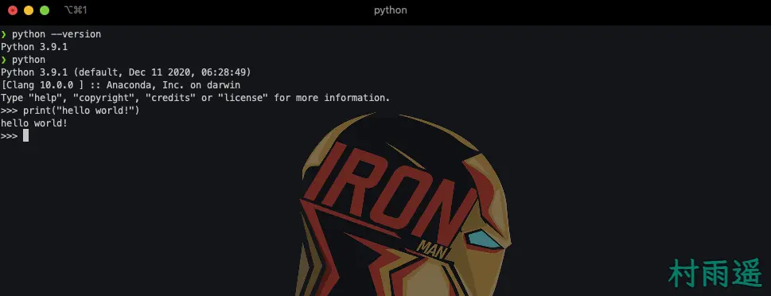

# 简介

::: info 共勉
不要哀求，学会争取。若是如此，终有所获。
:::

## 前言

既然要学习 Python，那总得先了解了解它是干啥的、它的发展历史、它有什么特点以及最最重要的，我们能用它干啥？这样才能在我们后续学习的过程中更好的利用好它，提升我们的效率。

本文内容安排如下：

1.  **什么是 Python**
2.  **Python 发展历史**
3.  **Python 优缺点**
4.  **Python 用途**
5.  **Python 解释器**
6.  **Python 开发工具**

##  Python 简介

###  Python 是什么

正如你所知道的，Python 它和 Java、C、C++ 一样，是一门编程语言。但是不同于其他语言的是，它是一个结合了解释性、编译性、互动性和面向对象的脚本语言。

Python 可以说是集大家所长，你可以用简单的几行代码就能实现神奇的效果，无论是简单的文字处理，还是大规模的数据分析，亦或是 WWW 游戏或者游戏，它都不在话下。

总结起来，相比于其他语言，它有着如下几点特色语法结构：

-   **解释性**：类似于 PHP 和 Perl，免去了编译这个环节；
-   **交互式**：即我们能够在终端中 Python 提示符 `>>>` 的后面直接执行代码；
-   **面向对象**：类似于 Java 和 C++，Python 也支持面向对象编程，即将代码封装在对象中；
-   **面向初学者**：相比于其他编程语言，Python 语法简单，往往只需要简单的几行代码就能实现其他语言需要一大段同样效果；

###  Python 发展历史

-   1989 年圣诞节：Guido von Rossum（也就是大家说的 “龟叔”）开始动手写 Python 语言的编译器；

-   1991 年 2 月：第一个 Python 编译器（同时也是解释器）诞生，底层基于 C 语言实现的，可以调用 C 语言的库函数。在早期的版本中，Python 已经提供了对“类”，“函数”，“异常处理”等构造块的支持，还有对列表、字典等核心数据类型，同时支持以模块为基础来构造应用程序；

-   1994 年 1 月：Python 1.0 正式发布；

-   2000 年 10 月 16 日：Python 2.0 发布，增加了完整的垃圾回收，提供了对 Unicode 的支持。与此同时，Python 的整个开发过程更加透明，社区对开发进度的影响逐渐扩大，生态圈开始慢慢形成；

-   2008 年 12 月 3 日：Python 3.0 发布，它并不完全兼容之前的 Python 代码，因此目前还有不少公司在项目和运维中使用 Python 2.x 版本；

后续的更新中，基本都是基于 Python 2.0 和 Python 3.0 更新，当前最新的版本应该是 Python 3.9.x 版本，是在 2021 年发布的。Python的版本号分为三段，形如 A.B.C。其中 A 表示大版本号，一般当整体重写，或出现不向后兼容的改变时，增加 A，即 2 或 3；B 表示功能更新，当出现新功能时就需要增加 B；而 C 则表示小的改动（例如：修复了某个Bug），一旦有修改就增加 C；

### Python 优缺点

Python 优点很多，总结起来主要有如下几点：

-   优雅、明确、简单；
-   开发效率高；
-   可移植性强；
-   可扩展性强；
-   可嵌入性好；

但是同时 Python 也存在着许多缺点，一般来讲主要集中在以下几点：

-   相对于C/C++等语言而言，运行速度慢；
-   线程间无法利用多CPU的问题；
-   代码不能加密；

###  应用领域

- 云计算；
- WEB开发；
- 系统运维；
- 图形GUI；
- 金融分析；
- 科学运算、人工智能；

## 安装 Python 解释器

要正式迈入 Python 学习之路，首先你得保证你使用的电脑上已经有了 Python 解释器。安装之前，先介绍几个 Python 的解释器：

- **CPython**
即 C 语言实现的 Python，当我们从 Python 官网下载并安装后，就已经将这一解释器安装到了我们电脑中，在命令行中运行 Python 就是相当于启动了 CPyhton 解释器；
- **IPython**
基于 CPython 之上的一个交互式的解释器，其底层还是基于 CPython，只不过交互性比起 CPython 更好。就好比 Chrome 和 360 极速浏览器，虽然不同，但 360 极速浏览器的内核却是Chrome；
- **JPython**
运行于 Java 平台的 Python 解释器，能够直接将Python代码编译为 Java 字节码并执行；
- **PyPy**
 PyPy 最突出的优点就是可以提升Python代码的执行速度，它采用了JIT 技术，对 Python 代码进行了动态编译，这样一来 Python 代码的执行速度得以显著提升；
- **IronPython**
类似于 JPython，它是运行于微软 .Net 平台上的解释器，能够将 Python 代码编译成 .Net 的字节码；

通常来讲，要安装 Python 解释器，只需要去其 [官网](https://www.python.org/downloads/) 下载对应系统的安装包，然后进行安装即可，这也符合我们大多数人的使用习惯。但如果你确定要学习一段时间的 Python，并且以后要用它来进行各种工作，那么我更推荐使用 [`Miniconda`](https://docs.conda.io/en/latest/miniconda.html#)。它方便我们创建不同的环境，然后自由的在各个环境之间切换，对于后续的开发工作十分友好。

###  Miniconda 的安装

#### Windows

1.  首先，我们需要去下载选择对应版本的 [安装包](https://docs.conda.io/en/latest/miniconda.html#windows-installers)；
2.  然后双击下载好的 `.exe` 文件；
3.  然后根据屏幕指示，一步一步选择安装位置以及其他指示即可；
4.  完成安装之后，打开你的控制台，然后使用 `conda list` 进行测试，如果安装成功，此时就会列出你当前环境下所安装的包；
5.  如果要升级，使用 `conda update conda` 命令进行升级即可；

#### Linux

1.  首先下载对应 [安装包](https://docs.conda.io/en/latest/miniconda.html#linux-installers)；
2.  接着打开终端，进入你的安装包所在路径，使用如下命令进行安装即可；

```bash
chmod +x Miniconda3-latest-Linux-x86_64.sh
bash Miniconda3-latest-Linux-x86_64.sh
```

3.  按照提示进行安装即可（主要就是选择自己的安装位置以及是否设置环境变量）；
4.  安装完成后最好重启终端，然后使用 `conda list` 命令进行测试是否成功；
5.  如果要升级，使用 `conda update conda` 命令进行升级即可；

#### macOS

1.  下载 [安装包](https://docs.conda.io/en/latest/miniconda.html#macosx-installers)；
2.  如果下载的是 `.pkg` 格式，双击打开安装即可，如果不是，则打开终端，进入安装包所在路径，然后使用如下命令进行安装；

```bash
bash Miniconda3-latest-MacOSX-x86_64.sh
```

3.  根据屏幕提示进行安装；
4.  安装完成后最好重启终端，然后使用 `conda list` 命令进行测试是否成功；
5.  如果要升级，使用 `conda update conda` 命令进行升级即可；

#### ⚠️ 注意

一般来讲，Linux 和 macOS 都已经是默认安装了 Python 的，而且一般是 2.x 版本；

如果上面给出的下载链接过慢，可以移步 [清华镜像源](https://mirrors.tuna.tsinghua.edu.cn/anaconda/miniconda/) 进行下载；

### Hello World！

好了，我们的解释器安装好了，接下来就是激动人心的写代码了，那就从最最经典的 `hello world` 开始吧！

打开命令行提示符（Windows）或者终端（Linux/macOS）；

通过如下命令来查看我们的 Python 版本；

```bash
python -version
```

接着使用如下命令进入 Python 交互环境；

```bash
python
```

好了，现在就可以编写并运行我们的 `hello world` 程序了，只需要一行代码，就能打印出 `hello world`，而如果你要打印其他信息，只需要把括号中双引号引起的内容替换成你想要打印的信息即可，括号中的双引号不仅也可以用单引号代替；

```python
print("hello world")
```

运行结果如下图所示；



## 开发工具

要进行 Python 开发，我们只需要一个文本编辑器就可以了，但是要想提高效率，那你一定不能错过 Python 开发神器 - [Pycharm](https://www.jetbrains.com/pycharm/download/)。

Pycharm 分为社区版（Community）和专业版（Professional），两者的区别在于专业版功能更加强大，但同时的，专业版是收费的。对于我们日常使用开发，社区版已经足够用了，如果实在是需要用到专业版的功能，那么你可以选择购买序列号（或者去找个破解版）。关于它的安装和配置教程，到这里说的也挺多了，那就到下一篇文章再细说吧！

##  总结

本文到此就算结束了，主要是对 Python 进行了简单介绍，让大家对 Python 有一个大概的认识。然后介绍了如何安装 Python 解释器以及如何在终端中实现自己的 `hello world`，最后则是给大家推荐了一个 Python 开发工具，不过关于它的具体安装和配置就准备在下一篇文章中去讲了。如果你也感兴趣，那就赶紧去关注我吧！

## ⏳ 联系

想解锁更多知识？不妨关注我的微信公众号：**村雨遥（id：JavaPark）**。

扫一扫，探索另一个全新的世界。


<Share colorful />

