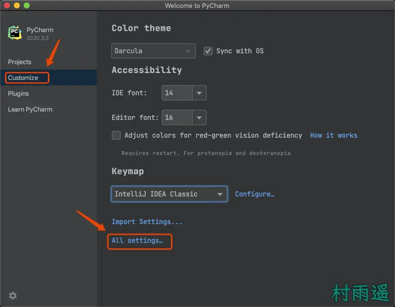

# 玩转 Pycharm

::: info 共勉
不要哀求，学会争取。若是如此，终有所获。
:::

## 前言

上一篇文章中，我们对 Python 进行了简介，并且介绍了如何安装 Python 解释器，并给大家推荐了 Python 开发神器 - Pycharm。

那今天，我们就来看看，如何安装以及配置这个神器，让我们的工作效率进一步提高！本文内容安排如下：

1.  **Pycharm 安装**
2.  **Pycharm 配置**
3.  **Pycharm 插件**
4.  **如何用 Pycharm 写程序**

## Pycharm 安装

这部分主要说一下如何安装 Pycharm，本文以 macOS 的安装为例，其他系统下的安装等有空了再做吧，😂，那下边就正式开始安装过程。

关于社区版和专业版的区别就不再多说了，正常来讲我们选社区版就足够了，不过因为我有专业版的账号，所以下边还是以专业版为例来安装，不过大家不用担心，两者的安装过程是一样的。

1.  首先去官网下载 [安装包](https://www.jetbrains.com/pycharm/)；

2.  双击下载好的 `.dmg` 安装包；

3.  将图标拖动到右边的 `Applications` 即可；

4.  好了，就是这么简单，我们的 Pycharm 已经安装好了，从启动台找到并打开就好了；

## Pycharm 配置

###  字体、主题设置

依次打开 `Customize -> All Settings -> Appearance & Behavior -> Appearance`，然后在右边选择自己喜欢的主题，以及字体，这里推荐使用 Jetbrains 家自己出品的字体 `JetBrains Mono`，然后大小的话，选择自己喜欢的号即可； 

上面设置的是 IDE 总体界面的字体和主题，下面来进行代码编辑器的字体和主题；

依次打开 `Customize -> All Settings -> Editor -> Font`，依次根据自己的喜好设置字体和大小；

然后依次打开 `Customize -> All Settings -> Editor -> Color Scheme`，然后选择自己喜欢的主题就好；

### 编码设置

一般来讲，macOS 下的默认编码是 UTF-8，但是 Windows 下的却不是，所以要设置一下才行；

依次打开 `Customize -> All Settings -> Editor -> File Encodings`，然后把右边框中的都设置为 UTF-8 即可；

### 开发模版设置

模板就是一种通用的格式，如果在 Pycharm 中设置了模板，那么每次创建一个 Python 文件的时候都会自动包含模板中的内容，方便我们后续开发；

依次打开 `Customize -> All Settings -> Editor -> File and Code Templates`，然后选择 `Python Script`，在右边框中填入自己要自定义的模板即可。而如果你要对其他文件设置模板，那方法也是一样的。

然后我们以后每次创建 Python 文件，上面的模板内容就都会预先定义好了。

### 插件

虽然 Pycharm 已经很 🐂🍺 了，但是它还有个厉害的地方在于它可以扩展插件。通过插件，能让我们的 Pycharm 用起来更爽。如果我们把 Pycharm 比做王者荣耀里边的英雄，那么插件就像红蓝 Buff，能让我们的英雄变得更加厉害。接下来，就让我来推荐给大家几款我常用的插件吧。

首先，既然要用插件，那我们得知道怎么安装吧。

好的，让我们依次打开 `Customize -> All Settings ->Plugins`，然后在右边的框中输入你想要的插件搜索即可，搜到结果之后，点击安装即可；

1.  **Rainbow Brackets**

人如其名，Rainbow 意为彩虹，而这款插件的作用就是给你的代码块之间很清晰的显示出各种颜色的高亮。或许你早已被代码中繁多的括号给搞蒙了，有了它，你就再也不用担心这个问题了。

2.  **Material Theme UI**

Material Theme UI 是JetBrains IDE（IntelliJ IDEA，WebStorm，Android Studio等）的插件，可将原始外观更改为 Material Design 外观。最初的灵感来自 Sublime Text 的 Material Theme，这个插件提供了一整套设置，可以按照你想要的方式调整 IDE，让你的 IDE 变得更加漂亮！

3.  **Key Promoter X**

Key Promoter X 帮助你在工作时学习必要的快捷方式。当你在 IDE 内的按钮上使用鼠标时，Key Promoter X 会显示您应该使用的键盘快捷键。

4.  **CodeGlance**

类似于 Sublime 中的代码小地图嵌入到编辑器窗格中，可用于快速定位代码；

5.  **leetcode editor**

作为一个程序员，摸鱼休闲的时候怎么能忘了刷题呢，这个插件能够让你在 Pycharm 中直接打开 Leetcode 的题目，就算你想在上班时间摸摸鱼，别人也看不出来你是在刷题呀，岂不是美哉。

## 用 Pycharm 写程序

好了，经过上面的步骤之后，我们就可以用 Pycharm 来写程序了，这一节我们就看看怎么用 Pycharm 实现最简单的 `hello world` ！

1.  首先，点击主界面中的 `New Project`；

2.   然后设置项目存放地址，以及配置 Python 解释器，最后点击右下角 `Create` 按钮即可；

3.  此时我们的项目就创建好了，不过此时项目是🈳️的，啥也没有，所以我们需要建立一个 Python 脚本，用来存放我们的代码。在项目上点击鼠标右键，依次点击 `New -> Python File`；

4.  填写你的脚本名称，⚠️ 虽然没明确说不能用中文，但是最好不要非主流，老老实实用英文就好；

5.  好了，脚本文件也建立好了，现在就是编写代码了；

6.  在代码编辑区域或者选中当前脚本文件，鼠标右键运行即可，或者你也可以使用快捷键 `Ctrl + Shift + F10` 运行；

## 总结

好了，关于 Pycharm 的安装和相关配置以及使用小技巧就介绍到这里了，更多进阶有趣的玩法，欢迎大家留言一起探讨，也欢迎大家加入我的交流群，和大家一起侃侃呀！

## ⏳ 联系

想解锁更多知识？不妨关注我的微信公众号：**村雨遥（id：JavaPark）**。

扫一扫，探索另一个全新的世界。

<Share colorful />

