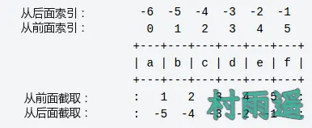
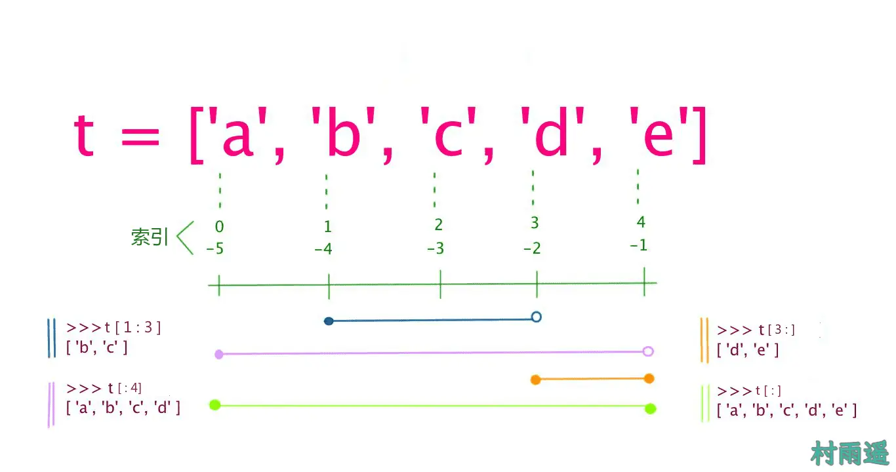

# 语言元素

::: info 共勉
不要哀求，学会争取。若是如此，终有所获。
:::

## 前言

之前的文章中，我们已经对 Python 有所了解了，并且也学会了 Pycharm 的安装及使用。现在该开始正式进入主题了，接下来就要学习 Python 的相关语法，以及如何使用他们进行编程。

今天主要内容就介绍 Python 中的如下知识点：

1.  **变量**
2.  **数据类型**
3.  **运算符**

## 变量

###  什么是变量

所谓变量，其实一开始是源自于数学。而在计算机语言中，变量指的是 **能够存储计算结果或者能够表示值的抽象概念**。

我们可以通过变量名来访问变量，在 Python 中，变量通常是可变的，它不仅仅能够表示数字，还能是任意数据类型。

###  变量命名规则

Python 中，是通过标识符来给变量命名，而标识符就是用于给程序中变量、类、方法命名的符号。简单来说，标识符就是合法的名字。而什么是合法的名字呢？那我们就来看看 Python 中标识符的命名规则。

Python 中，标识符 **必须以字母、下划线开头，然后后面可以跟上任意数目的字母、数字以及下划线，而且也区分大小写**。总结起来就是如下几点：

1.  **变量名只能包含字母、数字和下划线，而且只能以字母或下划线开头，不能以数字开头**，比如我们可以把一个变量命名为 `cunyu_1943、_cunyu1943` 但是不能命名为 `1943_cunyu`；

2.  **变量名中间不能包含空格，但是可以用下划线来进行分割**，比如可以命名为 `student_name`，但不能命名为 `student name`；
3.  **变量名应该尽量简短切具有描述性**，比如我们变量名为 `name`，那别人一看就知道这是表示名字的，但如果我们命名为 `n`，那可能就得花更多的时间来搞清楚它到底是啥意思；
4.  **不要把 Python 中的关键字和内置函数名用做变量名**，Python 中常见的关键字和内置函数如下表；

| 关键字     | 描述                                         |
| :--------- | :------------------------------------------- |
| `and`      | 逻辑运算符                                   |
| `as`       | 创建别名                                     |
| `assert`   | 用于调试                                     |
| `break`    | 跳出循环                                     |
| `class`    | 定义类                                       |
| `continue` | 继续循环的下一个迭代                         |
| `def`      | 定义函数                                     |
| `del`      | 删除对象                                     |
| `elif`     | 在条件语句中使用，等同于 else if             |
| `else`     | 用于条件语句                                 |
| `except`   | 处理异常，发生异常时如何执行                 |
| `False`    | 布尔值，比较运算的结果                       |
| `finally`  | 处理异常，无论是否存在异常，都将执行一段代码 |
| `for`      | 创建 for 循环                                |
| `from`     | 导入模块的特定部分                           |
| `global`   | 声明全局变量                                 |
| `if`       | 写一个条件语句                               |
| `import`   | 导入模块                                     |
| `in`       | 检查列表、元组等集合中是否存在某个值         |
| `is`       | 测试两个变量是否相等                         |
| `lambda`   | 创建匿名函数                                 |
| `None`     | 表示 `null` 值                               |
| `nonlocal` | 声明非局部变量                               |
| `not`      | 逻辑运算符                                   |
| `or`       | 逻辑运算符                                   |
| `pass`     | `null` 语句，一条什么都不做的语句            |
| `raise`    | 产生异常                                     |
| `return`   | 退出函数并返回值                             |
| `True`     | 布尔值，比较运算的结果                       |
| `try`      | 编写 `try...except` 语句                     |
| `while`    | 创建 `while` 循环                            |
| `with`     | 用于简化异常处理                             |
| `yield`    | 结束函数，返回生成器                         |

|                 |               | 内置函数       |                |                  |
| :-------------- | :------------ | :------------- | :------------- | ---------------- |
| `abs()`         | `delattr()`   | `hash()`       | `memoryview()` | `set()`          |
| `all()`         | `dict()`      | `help()`       | `min()`        | `setattr()`      |
| `any()`         | `dir()`       | `hex()`        | `next()`       | `slice()`        |
| `ascii()`       | `divmod()`    | `id()`         | `object()`     | `sorted()`       |
| `bin()`         | `enumerate()` | `input()`      | `oct()`        | `staticmethod()` |
| `bool()`        | `eval()`      | `int()`        | `open()`       | `str()`          |
| `breakpoint()`  | `exec()`      | `isinstance()` | `ord()`        | `sum()`          |
| `bytearray()`   | `filter()`    | `issubclass()` | `pow()`        | `super()`        |
| `bytes()`       | `float()`     | `iter()`       | `print()`      | `tuple()`        |
| `callable()`    | `format()`    | `len()`        | `property()`   | `type()`         |
| `chr()`         | `frozenset()` | `list()`       | `range()`      | `vars()`         |
| `classmethod()` | `getattr()`   | `locals()`     | `repr()`       | `zip()`          |
| `compile()`     | `globals()`   | `map()`        | `reversed()`   | `__import__()`   |
| `complex()`     | `hasattr()`   | `max()`        | `round()`      |                  |

## 数据类型

要处理各种文本、图形、音频、视频等数据，光使用数值类型是远远不够的，我们需要更多的数据类型来定义不同的数据。在 Python 中，主要有如下几种数据类型：

### 数字

数字数据类型用于存储数值，他们是 **不可改变** 的数据类型。也就是说，每改变一个数字数据类型，就会分配一个新的对象。

当我们给变量指定一个值时，数字对象就会被创建，而如果我们要删除这些对象的引用，就可以使用 `del` 语句；

```python
# 创建对象
number = 1
# 删除引用
del number
```

Python 支持如下不同的数字类型；

-   `int`：整型（⚠️ Python 2.x 中有 `int` 和 `long` 之分，但是 Python 3.x 中只有 `int`），能够处理任意大小的整数，而且支持常见的二进制、八进制、十进制以及十六进制；
-   `float`：浮点类型，也就是数学中的小数。一个浮点数的小数点位置是可变的，它不仅可以表示成数学写法（`456.78`），还支持科学记数法（`4.5678e2`）；
-   `complex`：复数类型，由实部和虚部组成，形如 `a + bj` 的形式，和数学中的复数表示一样，只是把 `i` 变成了 `j`；

### 字符串

以单引号或双引号括起来的任意文本，例如 `“cunyu1943”` 和 `‘cunyu1943’`，而且还可以书写成多行的形式（用三个单引号或三个双引号开头，三个单引号或三个双引号结尾）

```python
'''
公众号：村雨遥
blog：cunyu1943.site
'''

“”“
公众号：村雨遥
blog：cunyu1943.site
”“”
```

Python 中字符串有 2 种取值顺序：

1.  **从左向右索引**，索引值从 `0` 开始，最大索引值是字符串长度减 `1`；
2.  **从右向左索引**，索引值从 `-1` 开始，最大索引值是字符串开头；

如果我们要从字符串汇总获取一小段子字符串，则可以使用 `[头下标:尾下标]` 来进行截取。注意 **左闭右开** 原则，即通过  `[头下标:尾下标]` 方式获取的子字符串包含头下标的字符，但不包含尾下标的字符；

加入我们的字符串 `s = 'abcdef’`，则通过不同方式索引的结果如下图：



### 列表

`list` 是一种 **有序** 的集合，能随时向其中添加和删除元素，用 `[]` 标识，内部元素用逗号隔开，元素可以是字符、数字、字符串等数据类型，是 Python 中最常用的复合数据类型。类似于字符串，也可以用 `[头下标:尾下标]` 的方式来进行截取相应子列表，索引方式同字符串，示例如下：



`list` 中常用方法如下：

| 方法                                           | 说明                                                                         |
| ---------------------------------------------- | ---------------------------------------------------------------------------- |
| `len(list)`                                    | 列表元素个数                                                                 |
| `list(seq)`                                    | 将元组转换为列表                                                             |
| `list.pop()`                                   | 删除 `list` 末尾的元素                                                       |
| `list.pop(index)`                              | 删除 `list` 中索引位置为 `index` 的元素                                      |
| `list.append(obj)`                             | 在列表末尾添加新的对象                                                       |
| `list.count(obj)`                              | 统计某个元素在列表中出现的次数                                               |
| `list.insert(index, obj)`                      | 将对象插入列表指定位置                                                       |
| `list.remove(obj)`                             | 移除列表中某个值的第一个匹配项                                               |
| `list.reverse()`                               | 反转列表中元素                                                               |
| `list.index(obj)`                              | 从列表中找出某个值第一个匹配项的索引位置                                     |
| `list.sort(cmp=None, key=None, reverse=False)` | 对原列表进行排序，**reverse = True** 降序， **reverse = False** 升序（默认） |

如果我们要实现不同列表连接，应该这么办呢，此时我们可以使用 `+` 来连接不同的数组；

```python
>>> list1 = [1, 2, 3]
>>> list2 = [4, 5, 6]
>>> print(list2 + list2)
[1, 2, 3, 4, 5, 6]
```

而如果我们想要某个列表重复，则可以使用 `*` ；

```python
>>> list1 = [1, 3, 4]
>>> print(list1 * 2)
[1, 3, 4, 1, 3, 4]
```

### 元组

`tuple` 也是一种类似于 `list` 的 **有序** 列表，用 `()` 标识，内部元素用逗号隔开。它俩的一个最大区别在于： `tuple` 一旦初始化之后，就不能再修改了，相当于只读列表，所以 `tuple` 不像 `list` 一样有类似 `append()、insert()` 等方法；

常用方法如下：

| 方法         | 说明                 |
| ------------ | -------------------- |
| `len(tuple)` | 计算元组元素个数     |
| `tuple(seq)` | 将列表转换为元组     |
| `max(tuple)` | 返回元组中元素最大值 |
| `min(tuple)` | 返回元组中元素最小值 |

如果我们要定义一个空的元组，可以用如下的方式：

```python
tuple = ()
```

而如果元组中只有一个元素时，为了避免歧义，通常需要定义成如下形式：

```python
t = (1,)
```

### 字典

列表是有序的对象集合，而字典则是无序的对象集合，字典用 `{}`标识，元素间用逗号分隔，每个元素由 `key:value` 的形式组成。

两者之间的区别在于：字典中的元素是通过键值对来存取的，而不是通过偏移存取。

字典值虽然能够没有限制，但是键是有限制的，主要有如下两点需要记住：

1.  不允许同一个键出现两次；
2.  键必须不可变，所以它可以是数字、字符串或元组，但是不能用列表；

字典也有许多方法供我们使用，主要方法总结如下：

| 方法               | 说明                                                |
| ------------------ | --------------------------------------------------- |
| `len(dict)`        | 计算字典元素个数，即键的总数                        |
| `str(dict)`        | 输出字典可打印的字符串表示                          |
| `type(variable)`   | 返回输入的变量类型，如果变量是字典就返回字典类型    |
| `dict.clear()`     | 删除字典内所有元素                                  |
| `dict.copy()`      | 返回一个字典的浅复制                                |
| `dict.haskey(key)` | 如果键在字典 `dict` 里返回 `True`，否则返回 `False` |
| `dict.get(key)`    | 返回指定键的值                                      |
| `dict.keys()`      | 以列表返回一个字典所有的键                          |
| `dict.values()`    | 以列表返回字典中的所有值                            |
| `dict.items()`     | 以列表返回可遍历的(键, 值) 元组数组                 |
| `pop(key)`         | 删除字典给定键 `key` 所对应的值，返回值为被删除的值 |
| `popitem()`        | 返回并删除字典中的最后一对键和值                    |


### 布尔值

布尔值只有`True`、`False`两种值，要么是`True`，要么是`False`。在Python中，可以直接用`True`、`False` 直接表示布尔值，也可以通过布尔运算计算出来。

```python
>>> False
False
>>> 3 > 2
True
```

## 运算符

Python 支持多种运算符，但是运算符之间也是有优先级的，下表大致按照优先级从高到低的顺序列出了所有运算符，下面分别介绍运算符的类别；

| 运算符                     | 描述                                                   |
| :------------------------- | :----------------------------------------------------- |
| `**`                       | 指数 (最高优先级)                                      |
| `~ + -`                    | 按位翻转, 一元加号和减号 (最后两个的方法名为 +@ 和 -@) |
| `* / % //`                 | 乘，除，取模和取整除                                   |
| `+ -`                      | 加法减法                                               |
| `>> <<`                    | 右移，左移运算符                                       |
| `&`                        | 位 '`AND`'                                             |
| `^                         | `                                                      | 位运算符 |
| `<= < > >=`                | 比较运算符                                             |
| `<> == !=`                 | 等于运算符                                             |
| `= %= /= //= -= += *= **=` | 赋值运算符                                             |
| `is is not`                | 身份运算符                                             |
| `in not in`                | 成员运算符                                             |
| `not and or`               | 逻辑运算符                                             |

### 算术运算符

假设变量 `a = 10, b = 20`：

| 运算符 | 描述                                            | 实例                                                      |
| :----- | :---------------------------------------------- | :-------------------------------------------------------- |
| `+`    | 加 - 两个对象相加                               | `a + b` 输出结果 30                                       |
| `-`    | 减 - 得到负数或是一个数减去另一个数             | `a - b` 输出结果 -10                                      |
| `*`    | 乘 - 两个数相乘或是返回一个被重复若干次的字符串 | `a * b` 输出结果 200                                      |
| `/`    | 除 - `x` 除以 `y`                               | `b / a` 输出结果 2                                        |
| `%`    | 取模 - 返回除法的余数                           | `b % a` 输出结果 0                                        |
| `**`   | 幂 - 返回 `x` 的 `y` 次幂                       | `a**b ` 为 10 的 20 次方， 输出结果 100000000000000000000 |
| `//`   | 取整除 - 返回商的整数部分（**向下取整**）       | `>>> 9//2 4 >>> -9//2 -5`                                 |

### 比较运算符

假设变量 `a = 10, b = 20`：

| 运算符 | 描述                                                                                                                | 实例                                      |
| :----- | :------------------------------------------------------------------------------------------------------------------ | :---------------------------------------- |
| `==`   | 等于 - 比较对象是否相等                                                                                             | `(a == b)` 返回  `False`                  |
| `!=`   | 不等于 - 比较两个对象是否不相等                                                                                     | `(a != b) ` 返回  `True`                  |
| `<>`   | 不等于 - 比较两个对象是否不相等。**python3 已废弃。**                                                               | `(a <> b) `返回 `True`。这个运算符类似 != |
| `>`    | 大于 - 返回 `x` 是否大于 `y`                                                                                        | `(a > b)`  返回 `False`                   |
| `<`    | 小于 - 返回 `x` 是否小于 `y`。所有比较运算符返回 1 表示真，返回 0 表示假。这分别与特殊的变量 `True` 和 `False` 等价 | `(a < b) `返回 `True`                     |
| `>=`   | 大于等于 - 返回 `x` 是否大于等于 `y`                                                                                | `(a >= b)` 返回 `False`                   |
| `<=`   | 小于等于 - 返回 `x` 是否小于等于 `y`                                                                                | `(a <= b)` 返回 `True`                    |

###  赋值运算符

假设变量 `a = 10, b = 20`：

| 运算符 | 描述             | 实例                                        |
| :----- | :--------------- | :------------------------------------------ |
| `=`    | 简单的赋值运算符 | `c = a + b` 将 `a + b` 的运算结果赋值为 `c` |
| `+=`   | 加法赋值运算符   | `c += a` 等效于 `c = c + a`                 |
| `-=`   | 减法赋值运算符   | `c -= a` 等效于 `c = c - a`                 |
| `*=`   | 乘法赋值运算符   | `c *= a` 等效于 `c = c * a`                 |
| `/=`   | 除法赋值运算符   | `c /= a` 等效于` c = c / a`                 |
| `%=`   | 取模赋值运算符   | `c %= a` 等效于 `c = c % a`                 |
| `**=`  | 幂赋值运算符     | `c \**= a` 等效于 `c = c ** a`              |
| `//=`  | 取整除赋值运算符 | `c //= a` 等效于 `c = c // a`               |

###  逻辑运算符

假设变量 `a = 10, b = 20`：

| 运算符 | 逻辑表达式 | 描述                                                                             | 实例                        |
| :----- | :--------- | :------------------------------------------------------------------------------- | :-------------------------- |
| `and`  | `x and y`  | 布尔"与" - 如果 `x` 为 `False`，`x and y` 返回 `False`，否则它返回 `y` 的计算值  | `(a and b)` 返回 20         |
| `or`   | `x or y`   | 布尔"或" - 如果 `x` 是非 0，它返回 `x` 的值，否则它返回 `y` 的计算值             | `(a or b)` 返回 10          |
| `not`  | `not x`    | 布尔"非" - 如果 `x` 为 `True`，返回 `False` 。如果 `x` 为 `False`，它返回 `True` | `not(a and b)` 返回 `False` |


### 位运算符

假设变量 `a = 60, b = 13`：

按位运算符石将数字转换为二进制之后来进行计算的，则 `a = 00111100、b = 00001101`

| 运算符 | 描述                                                                                                     | 实例                                                                            |
| :----- | :------------------------------------------------------------------------------------------------------- | :------------------------------------------------------------------------------ |
| `&`    | 按位与运算符：参与运算的两个值,如果两个相应位都为 1,则该位的结果为 1,否则为 0                            | `(a & b)` 输出结果 12 ，二进制解释： 0000 1100                                  |
| `      | `                                                                                                        | 按位或运算符：只要对应的二个二进位有一个为 1 时，结果位就为 1                   | `(a | b)` 输出结果 61 ，二进制解释： 0011 1101 |
| `^`    | 按位异或运算符：当两对应的二进位相异时，结果为 1                                                         | `(a ^ b)` 输出结果 49 ，二进制解释： 0011 0001                                  |
| `~`    | 按位取反运算符：对数据的每个二进制位取反,即把 1 变为 0,把 0 变为 1 。**~x** 类似于 **-x-1**              | `(~a ) `输出结果 -61 ，二进制解释： 1100 0011，在一个有符号二进制数的补码形式。 |
| `<<`   | 左移动运算符：运算数的各二进位全部左移若干位，由 **<<** 右边的数字指定了移动的位数，高位丢弃，低位补 0。 | `a << 2` 输出结果 240 ，二进制解释： 1111 0000                                  |
| `>>`   | 右移动运算符：把 ">>” 左边的运算数的各二进位全部右移若干位，**>>** 右边的数字指定了移动的位数            | `a >> 2` 输出结果 15 ，二进制解释： 0000 1111                                   |

### 成员运算符

| 运算符   | 描述                                                        | 实例                                                      |
| :------- | :---------------------------------------------------------- | :-------------------------------------------------------- |
| `in`     | 如果在指定的序列中找到值返回 `True`，否则返回 `False`。     | `x` 在 `y` 序列中 , 如果 `x` 在 `y` 序列中返回 `True`     |
| `not in` | 如果在指定的序列中没有找到值返回 `True`，否则返回 `False`。 | `x` 不在 `y` 序列中 , 如果 `x` 不在 `y` 序列中返回 `True` |

### 身份运算符

身份运算符用于比较两个对象的存储单元：

| 运算符   | 描述                                          | 实例                                                                                               |
| :------- | :-------------------------------------------- | :------------------------------------------------------------------------------------------------- |
| `is`     | `is` 是判断两个标识符是不是引用自一个对象     | `x is y`, 类似 `id(x) == id(y)` , 如果引用的是同一个对象则返回 `True`，否则返回 `False`            |
| `is not` | `is not` 是判断两个标识符是不是引用自不同对象 | `x is not y` ， 类似 `id(a) != id(b)`。如果引用的不是同一个对象则返回结果 `True`，否则返回 `False` |

## 总结

好了，文章到这里也算🈶️挺多内容了，赶紧去仔细看看，然后动手实践起来吧。

如果你觉得我的文章对你有所帮助，那就赶紧去关注我吧。另外，为了方便大家交流，我还特意创建了微信交流群，如果你也有兴趣加入，关注我的公众号（村雨遥）回复 **加群**，我人工拉你入群哦。

## ⏳ 联系

想解锁更多知识？不妨关注我的微信公众号：**村雨遥（id：JavaPark）**。

扫一扫，探索另一个全新的世界。


<Share colorful />

