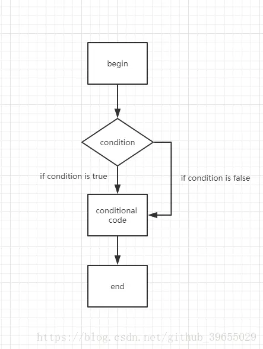
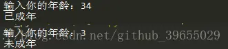
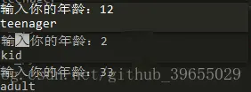
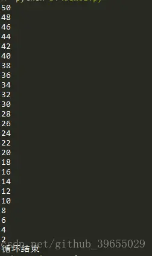
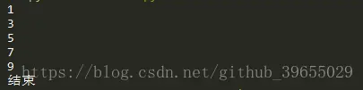
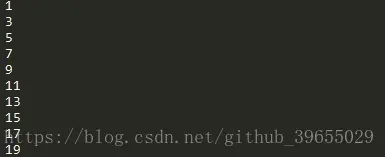

# 条件判断、循环以及循环的终止

> 作者：[村雨遥](https://github.com/cunyu1943)
> 
> 不要哀求，学会争取，若是如此，终有所获
> 
>

## 🎈 号外

最近，公众号之外，建立了微信交流群，不定期会在群里分享各种资源（影视、IT 编程、考试提升……）&知识。如果有需要，可以**扫码或者后台添加小编微信备注入群**。进群后**优先看群公告**，**呼叫群中【资源分享小助手】**，还能免费帮找资源哦～

<center>
 
</center>

## 条件判断

条件语句是用来判断给定条件是否满足，并根据判断所得结果从而决定所要执行的操作，通常的逻辑思路如下图；



### 单次判断
- 形式

```python
if <判断条件>：
	<执行>
else：
	<执行>
```

- 例子

```python
age = int(input("输入你的年龄："))
if age < 18:
	print("未成年")
else:
	print("已成年")
```

### 多次判断

- 形式

```python
if <判断条件1>:
    <执行1>
elif <判断条件2>:
    <执行2>
elif <判断条件3>:
    <执行3>
else:
    <执行4>
...
```

- 例子

```python
age = int(input("输入你的年龄："))
if age >= 18:
    print('adult')
elif age >= 6:
    print('teenager')
else:
    print('kid')
```


注意，`if` 语句是从上往下判断的；

## 循环
## while循环
当条件满足时，就不断循环，直到条件不再满足时即退出循环；

- 例子

```python
count = 50
while count > 0:
	print(str(count))
	count -= 2
print("循环结束")
```

### for...in 循环
- 例子

```python
sum = 0
for num in range(1, 10):
	sum += num
print(str(sum))
```
其中```range()```函数用于生成一个整数序列；

### 终止循环

- break
用于提前终止循环；

```python
num = 1
while num <= 100:
	if num >= 10:
		break
	print(num)
	num += 2
print("结束")
```


- continue

用于跳出当前循环，进入下一次循环；

```python
num = 0
while num < 20:
    num += 1
    if num % 2 == 0: 
        continue 
    print(num)
```


## 总结

本次相关 Python 中的 if 条件判断、for 循环、while 循环以及如何终止 for 或者 while 循环的介绍就到这里，如果你有更好的想法，欢迎评论共同交流！

## ⏳ 联系

想解锁更多知识？不妨关注我的微信公众号：**村雨遥（id：JavaPark）**。

扫一扫，探索另一个全新的世界。

<center>

</center>