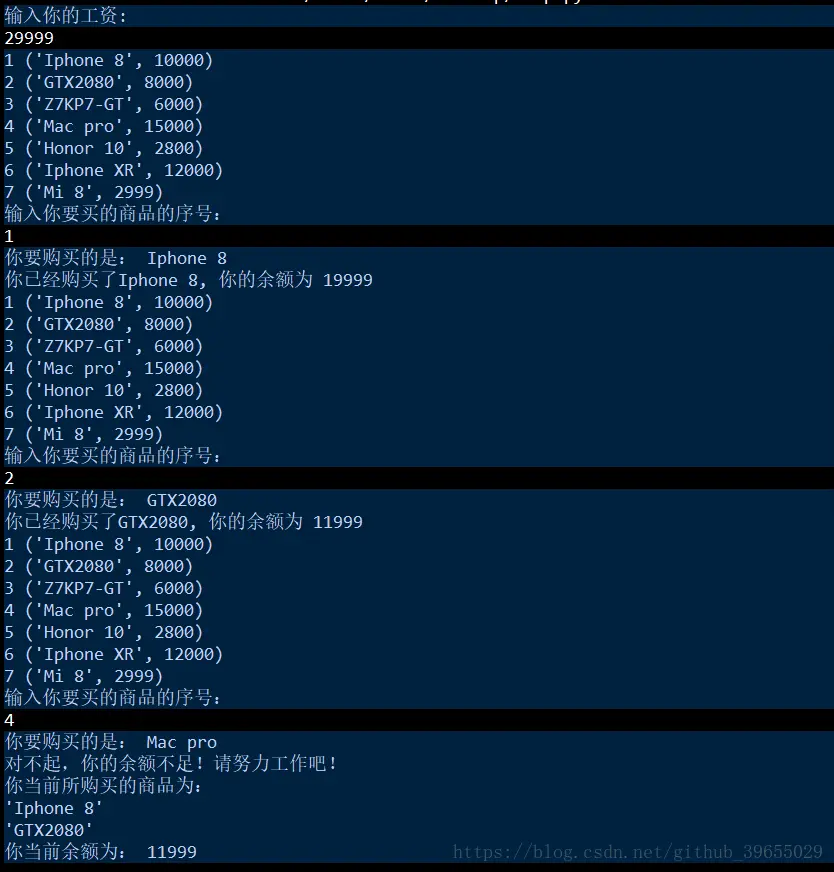
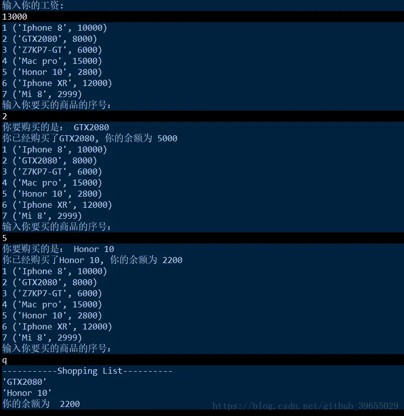
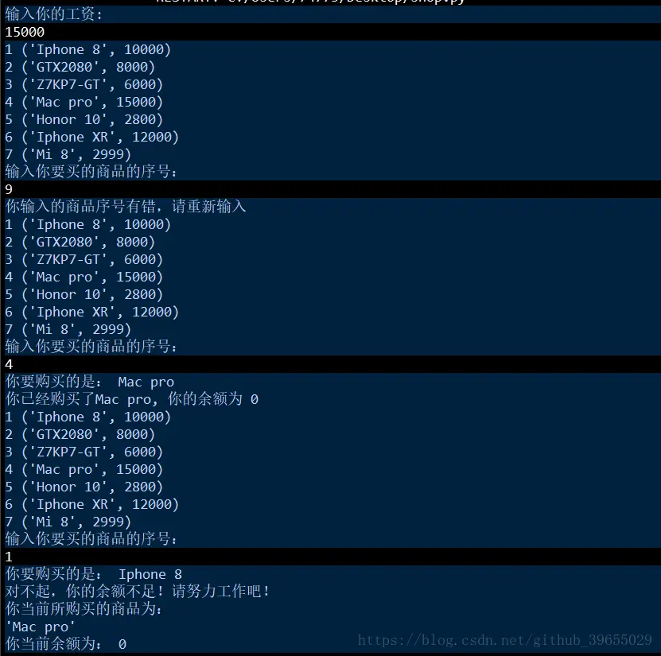

# Python 实现购物车

>
> 不要哀求，学会争取。若是如此，终有所获。
> 

## 🎈 号外

最近，公众号之外，建立了微信交流群，不定期会在群里分享各种资源（影视、IT 编程、考试提升……）&知识。如果有需要，可以**扫码或者后台添加小编微信备注入群**。进群后**优先看群公告**，**呼叫群中【资源分享小助手】**，还能免费帮找资源哦～

<center>
 
</center>

## 要求


## 代码

```python
# --*--coding:utf-8--*--
# Author: 村雨

import pprint

productList = [('Iphone 8', 10000),
               ('GTX2080', 8000),
               ('Z7KP7-GT', 6000),
               ('Mac pro', 15000),
               ('Honor 10', 2800),
               ('Iphone XR', 12000),
               ('Mi 8', 2999)
               ]

shoppingList = []

print('输入你的工资:')
salary = input()
if not salary.isdigit():
    print('请输入整数')
else:
    salary = int(salary)
    while True:
        for index, item in enumerate(productList):
            print(index + 1, item)
        print('输入你要买的商品的序号：')
        userWant = input()
        if userWant.isdigit():
            userWant = int(userWant)
            if userWant <= len(productList) and userWant > 0:
                print('你要购买的是：', productList[userWant - 1][0])
                if salary >= productList[userWant - 1][1]:
                    shoppingList.append(productList[userWant - 1][0])
                    salary -= productList[userWant - 1][1]
                    print('你已经购买了' + productList[userWant - 1][0] + ', 你的余额为 ' + str(salary))
                else:
                    print('对不起，你的余额不足！请努力工作吧！')
                    print('你当前所购买的商品为：')
                    for brought in shoppingList:
                        pprint.pprint(brought)
                    print('你当前余额为：', salary)
                    exit()
            else:
                print('你输入的商品序号有错，请重新输入')
        elif userWant == 'q':
            print('-----------Shopping List----------')
            for brought in shoppingList:
                pprint.pprint(brought)
            print('你的余额为 ', salary)
            exit()
        else:
            print('Invalid input！！！')
```

## 结果






## ⏳ 联系

想解锁更多知识？不妨关注我的微信公众号：**村雨遥（id：JavaPark）**。

扫一扫，探索另一个全新的世界。

<center>

</center>