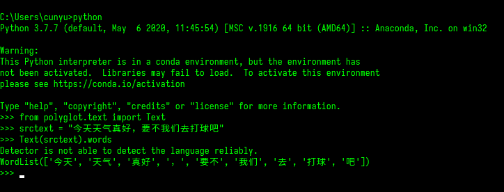

# Python 3.7 安装 polyglot 失败

::: info 共勉
不要哀求，学会争取。若是如此，终有所获。
:::


## 一、前言

学习自然语言处理的过程中，在使用 `polyglot` 工具进行分词时，安装 `polyglot` 后发现使用时总是出现如下错误：

```bash
ImportError: cannot import name 'Locale' from 'icu'
```

防止下次再次遇见，特在此记录如下。博主使用的环境变量如下：

-   Windows 10
-   Python 3.7

以下解决方案均基于已经安装 `polyglot` 之上，若你还没有安装，请运行如下命令进行安装。

```shell
pip install polyglot
```

另外，本文只针对 Windows 平台，若是 Linux 平台，可能不适用，还请谅解。

## 二、解决方法

### 1. 安装 pyicu

在网上搜到的解决方案，有的可以通过直接安装 `pyicu` 即可解决，安装命令如下：

```bash
pip install pyicu
```

我尝试过这个方法，最终没能解决我的问题，但还是在这里贴出来，方便大家也尝试一下，能解决最好不过，不能的话也排除了这种方法。

### 2. 安装依赖包

到 [Python Extension Packages for Windows - Christoph Gohlke (uci.edu)](https://www.lfd.uci.edu/~gohlke/pythonlibs/) 去下载所需要的依赖包：

-   **pycld2**
-   **PyICU**
-   **Morfessor**

具体下载的版本请根据你的 Python 版本进行对应下载，还有一点请注意，我的 Python 3.7 版本在安装 PyICU 2.6 版本时，会报错平台不支持，此时可以尝试安装旧的版本解决该问题；

下载好上述依赖包之后，都是以 `.whl` 为后缀，然后进行安装，安装过程如下：

1.  首先从控制台进入依赖包所在文件夹；
2.  然后使用如下命令进行安装即可；

```bash
pip install xxx.whl
```

## 三、总结

通过上面的步骤，我们就可以完成 polyglot 相关依赖的安装了。一开始安装失败问题就得到了解决，也希望对你有所帮助！

最后，既然安装成功了，那就得试一下呀！以下是一个利用 `polyglot` 分词的结果，可以看看效果如何哦。
另外，你觉得相比于 `jieba`、`SnowNLP`、`PkuSeg`、`THULAC`、`HanLP` 等分词工具，谁的效果更胜一筹呢？



## ⏳ 联系

想解锁更多知识？不妨关注我的微信公众号：**村雨遥（id：JavaPark）**。

扫一扫，探索另一个全新的世界。


<Share colorful />