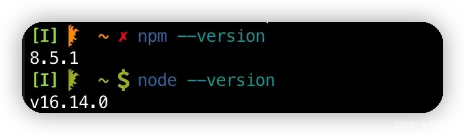
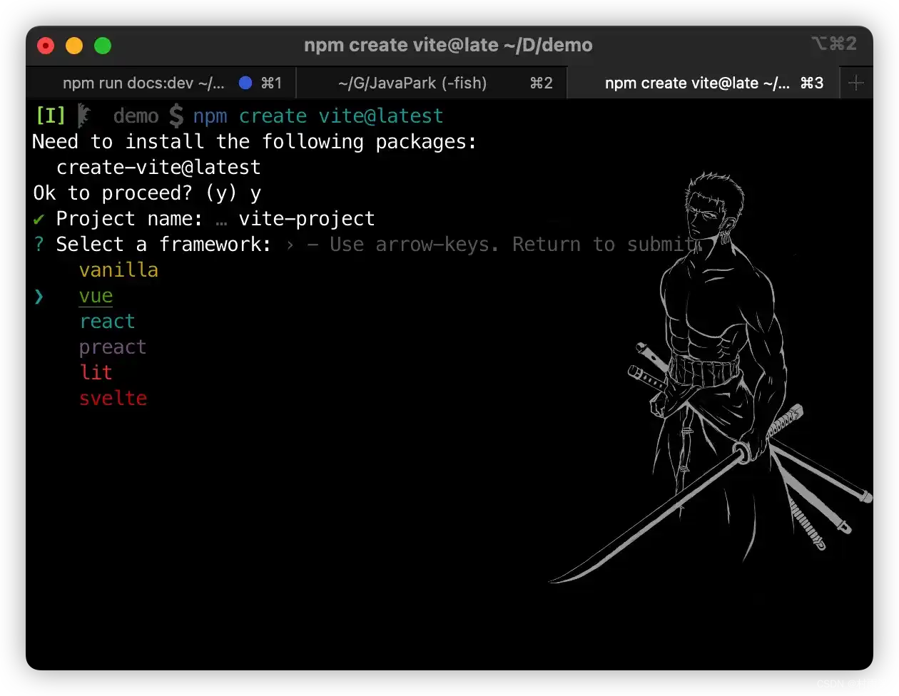
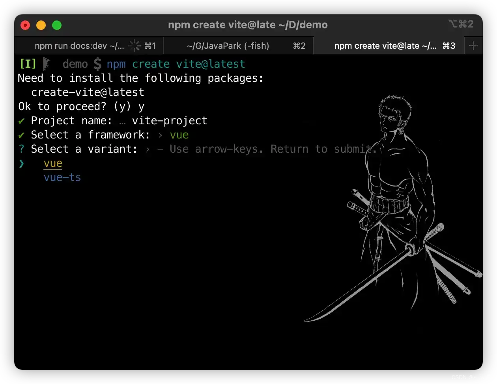
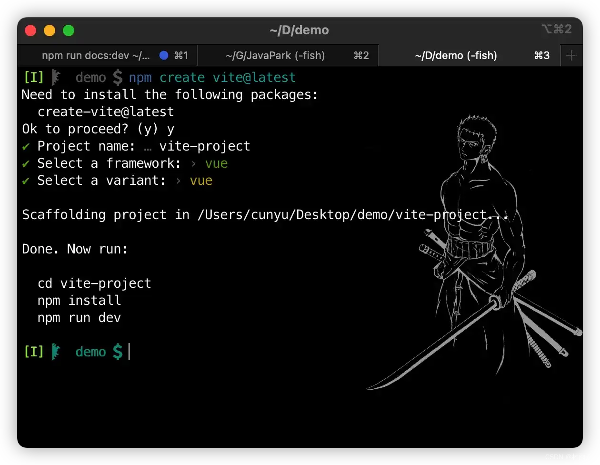
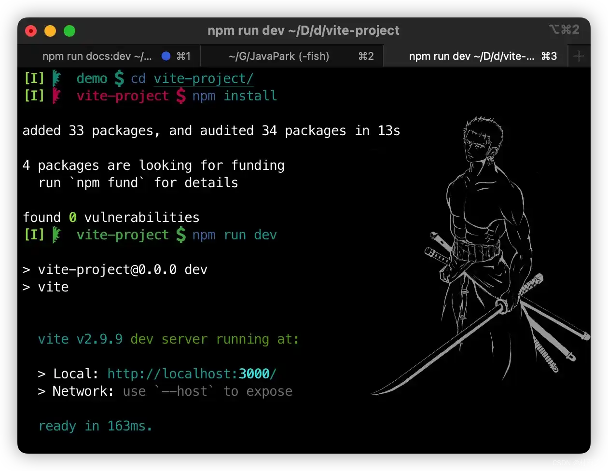
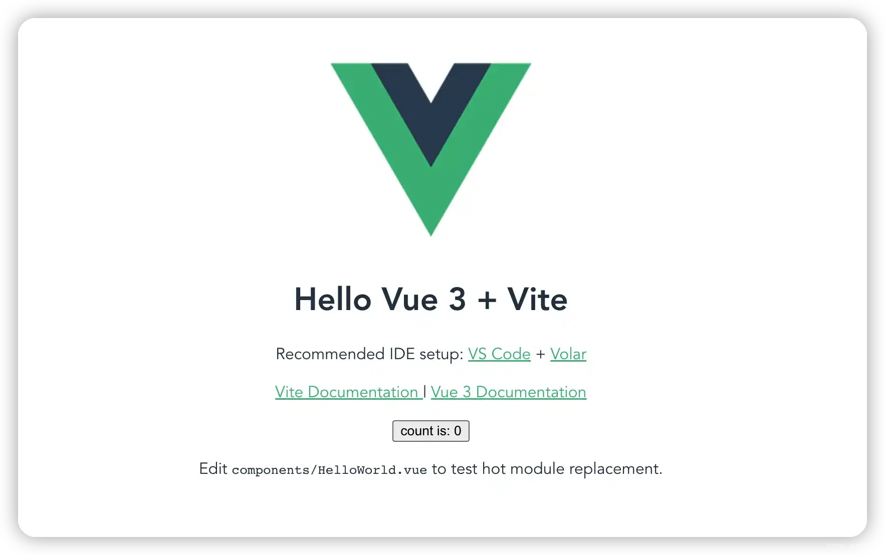
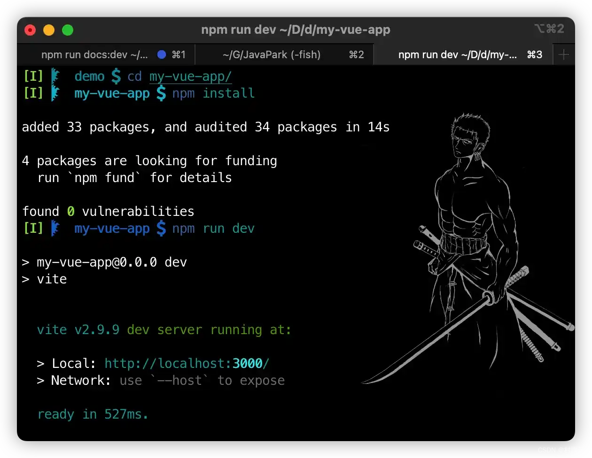

# 搭建 Vue + Vite 入门项目

## 前言

虽然市面上有很多的打包工具，例如 `webpack`、`Rollup` 以及 `Parcel` 等。毫无疑问，通过使用这些工具，在很大程度上改善了前端开发者的游戏体验。
但随着业务变得越来越复杂，我们不得构建比之前更大型的应用。此时，所需要处理的代码量也越来越大。这时候，上面提到的打包工具就开始遇到性能瓶颈，我们可能需要很长的时间才能启动开发服务器，这样一来，开发效率就变得越来越低。
针对这一现状，大佬们又构建了一个打包工具 ，也就是今天文章的主角 - `Vite`。`Vite` 旨在利用生态系统中的新进展来解决上面的问题，通过将应用中的 **依赖** 和 **源码** 相分开，从而缩减开发服务器的启动时间。

## webpack、Rollup、Vite 的区别

由于自己更多的是和后端打交道，所以这里对三者的区别介绍仅限于表面，至于更深一层的代码层面的区别，还请各位自行去了解。经过查阅资料，这里简单给出下 `webpack`、`Rollup` 以及 `Vite` 的区别，先说一个总结论：

> **webpack** 更适合打包项目，`Rollup` 更适合打包库，而 `Vite` 基于 `Rollup`，实现了热更新的同时也十分适合打包项目。


| 工具 | webpack                                                      | Rollup                                                       | Vite                                                         |
| ---- | ------------------------------------------------------------ | ------------------------------------------------------------ | ------------------------------------------------------------ |
| 区别 | 1. 支持代码切割，从而实现分包<br />2. 支持 `HMR`，实现热更新 | 1. 基于 `esm` 打包，生成的文件体积更小<br />2. 原生支持 `tree-shaking` | 1. 生产环境通过 `Rollup` 打包生成 `esm` 模块包，因此打包的体积小<br />2. 生产环境基于浏览器支持 `esm`，让浏览器解析模块，然后服务器按需编译返回<br />3. 热更新，实现按需编译，不像 `webpack` 需全部重新编译并更新 |

## 搭建 Vite 项目

说完上边的内容之后，接下来就来看看，如何大家我们的第一个 `Vite` 项目。

需要注意的是，要使用 `Vite` 的前提是电脑中有 `Node.js`，而且版本需要 `>=12.0.0`，至于个别模块可能需要更高版本的 `Node.js` 才能正常运行，此时就需要注意升级 `Node.js` 的版本。

如果你不清楚你的电脑中是否安装了 `Node.js`，那么可以在控制台中使用如下命令进行查询。

```sh
// 查看 node 版本
node --version
// 查看 npm 版本
npm --version
```



如何还是不太清楚，那么可以参考我之前的一篇文章：

>   [Windows 教程：Node.js 安装教程](https://cunyu1943.github.io/JavaPark/efficiency/windows/nodejs-install.html)


初始工作做好之后，我们就可以开始搭建我们的第一个 `Vite` 项目了。

如果我们只是要构建一个 `Vite` 项目，那么简单地使用以下命令即可。

```sh
npm create vite@latest
```

然后根据提示进行相关设置即可，这里需要注意的是它会让我们选择框架，这就需要根据我们的需求来进行选择了。

比如我们要创建一个基于 `Vue` 的项目，那么可以选择 `Vue` 模板，然后再进行下一步。



选择变体，是基于 `Vue` 还是 `Vue-ts`。



最后，等待项目创建完毕即可。



然后根据它的提示，依次执行以下三个命令即可。

```sh
// vite-project 是项目名
cd vite-project 
npm install
npm run dev
```



接着在浏览器中访问以下地址：

>   `http://localhost:3000`

如果一切正常，那么应该就会出现以下的界面了，至此我们的第一个 `Vite` + `Vue` 项目就搭建成功了！



当然，除开使用上面的命令来创建之外，我们还可以通过附加的命令选项来执行项目的名称和想要使用的模板。不过这里需要注意，根据你电脑上 `npm` 版本的不同，需要使用不同的命令。

如果你的 `npm` 是 `6.x` 版本，那么要使用以下命令：

```sh
// my-vue-app 是项目名称，--template 后紧跟模板
npm create vite@latest my-vue-app --template vue
```

如果 `npm` 版本 `7.x` 及以上版本，那么则需要使用如下命令，一定不要忘记多出来的 `–`。

```sh
// my-vue-app 是项目名称，--template 后紧跟模板
npm create vite@latest my-vue-app -- --template vue
```


同样的，我们依次执行提示的三条命令。

```sh
cd my-vue-app
npm install
npm run dev
```



最后，同样在浏览器中访问 `http://localhost:3000`，不出意外同样可以看到以下的界面。


## 总结

以上就是本文的所有内容了，主要介绍了 `Vite` 由来的背景，并简单对比了下 `webpack`、`Rollup` 和 `Vite` 三个打包工具的区别，最后则是利用两种方式来创建了 `Vite` + `Vue` 的实例。