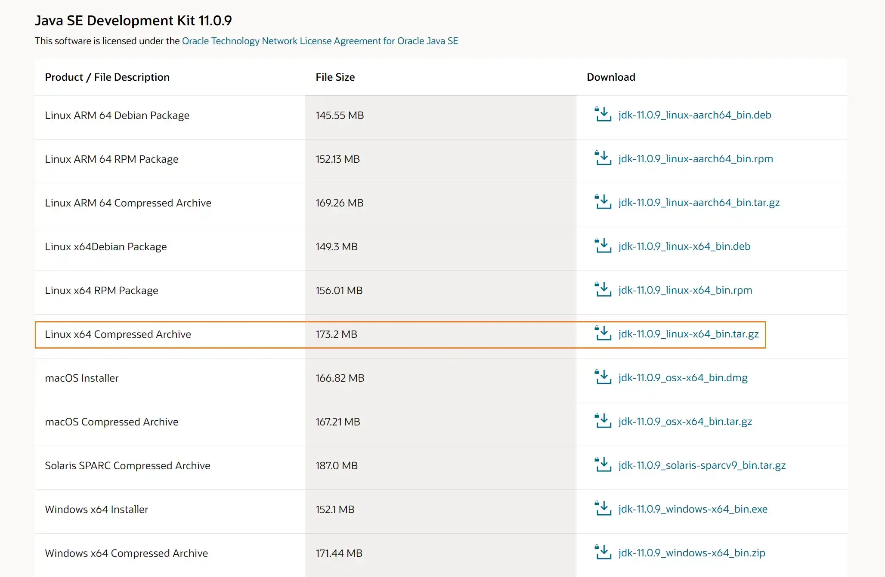
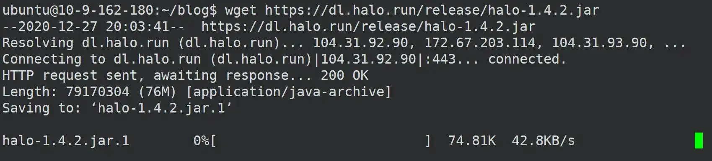
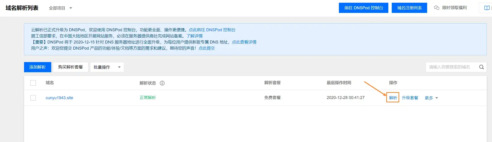
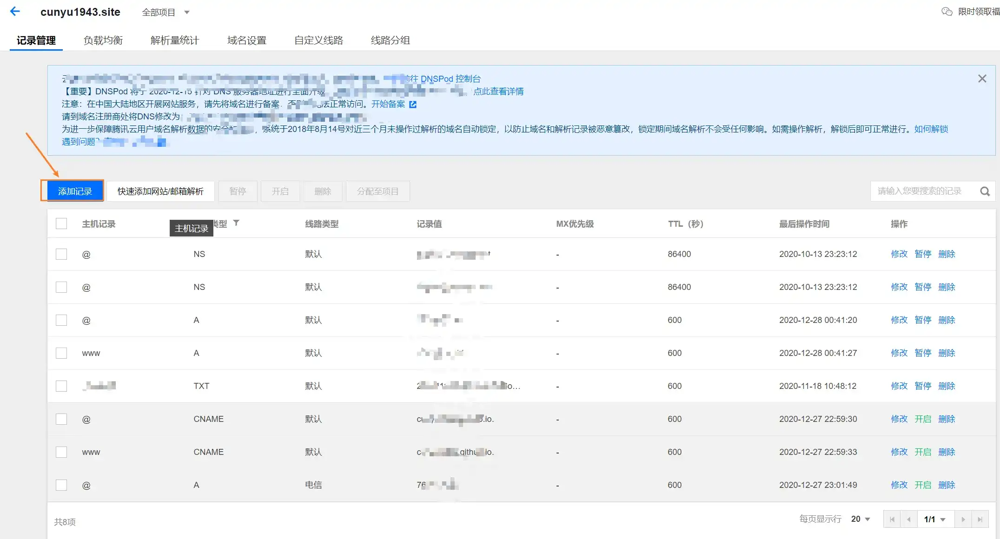
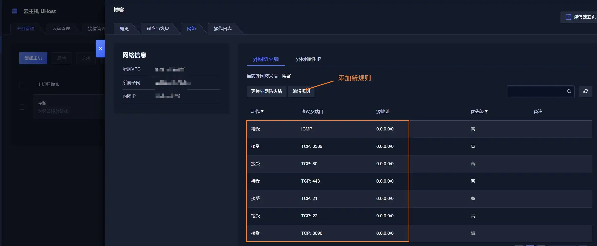
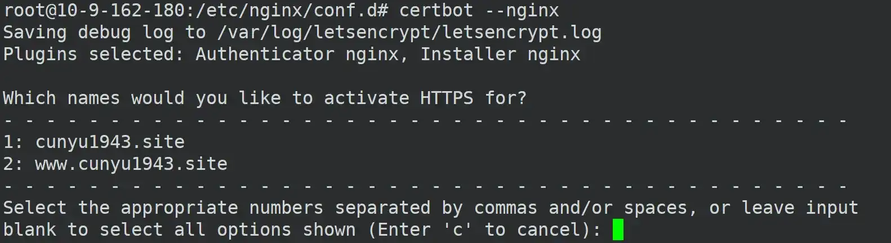
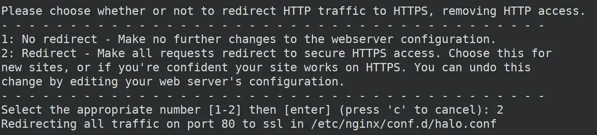
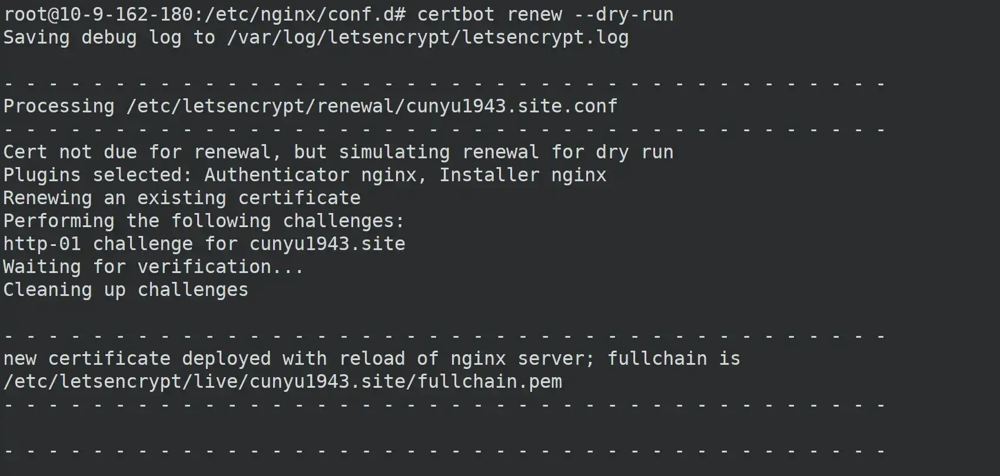

# Halo 博客搭建教程

## 前言

### 说在前面

之前一直有在各大平台发布博客内容，然后个人博客一直使用的是 Hexo + Github Pages 的方式，但随着内容增多，Github Pages 访问的也不稳定，所以想着自己搞个服务器和域名搭个博客，最终选定 [Halo](https://halo.run/) 这个博客框架，搭建属于自己的博客。

此内容从零到一手把手记录如何搭建，记录自己的搭建过程，也给后面的朋友们提供一个指南，少走些冤枉路，尽快上手。

### 环境配置

自己花了 210 左右在 UCloud 买了三年的服务器，然后在腾讯花了将近 200 买了个域名，服务器版本是 Ubuntu 18.04 64 位，理论上讲下面的配置适合于 Ubuntu 系所有版本，个别有出入的地方还请谅解。所以在正式开始之前，你需要满足以下几个条件：

1.  一台 Ubuntu 系统的服务器（Centos 系统的参考 [官网教程](https://halo.run/archives/install-with-linux.html) 即可）；
2.  一个域名；

##  Java 环境配置

###  安装

1.  首先去 [官网](https://www.oracle.com/java/technologies/javase-downloads.html) 下载 JDK，选择自己想要的版本即可，一般推荐 JDK 1.8+ 的版本；



2.  解压下载后的文件；

```bash
tar -zxvf jdk-11.0.9_linux-x64_bin.tar.gz
```

3.  配置环境变量，切换到 root 用户，然后编辑 `/etc/profile` 文件，添加如下内容（注意路径切换为你自己放置解压缩包后的位置）；

```
export JAVA_HOME=/environment/jdk/jdk-11.0.9
export PATH=$JAVA_HOME/bin:$PATH
```

###  验证

安装好之后就是验证是否成功，一般我们用如下命令进行检测；

```bash
# 查看 jdk 版本
java -version

# 编译命令
javac

# 运行命令
java
```

##  安装 Halo

### 下载 Halo 运行包

要下载 Halo 运行包，可以通过两种方式，更推荐第二种，下载起来更快：

1.  Github releases：https://github.com/halo-dev/halo/releases
2.  Nova 提供的下载站：[https://dl.halo.run](https://dl.halo.run/)

利用如下命令进行下载，以 1.4.2 版本为例，如果要下载其他版本，换版本号即可！

```bash
wget https://dl.halo.run/release/halo-1.4.2.jar
```



###  配置

1.  下载配置文件（下载后的文件存放在 `~/.halo/application.yaml`）；

```bash
curl -o ~/.halo/application.yaml --create-dirs https://dl.halo.run/config/application-template.yaml
```

2.  修改配置，参考 [官方文档](https://halo.run/archives/install-with-linux.html) 修改即可；

```bash
server:
  port: 8090

  # Response data gzip.
  compression:
    enabled: false
spring:
  datasource:
    # H2 database configuration.
    driver-class-name: org.h2.Driver
    url: jdbc:h2:file:~/.halo/db/halo
    username: admin
    password: 123456

    # MySQL database configuration.
  #    driver-class-name: com.mysql.cj.jdbc.Driver
  #    url: jdbc:mysql://127.0.0.1:3306/halodb?characterEncoding=utf8&useSSL=false&serverTimezone=Asia/Shanghai&allowPublicKeyRetrieval=true
  #    username: root
  #    password: 123456

  # H2 database console configuration.
  h2:
    console:
      settings:
        web-allow-others: false
      path: /h2-console
      enabled: false

halo:
  # Your admin client path is https://your-domain/{admin-path}
  admin-path: admin

  # memory or level
  cache: memory
```

###  运行 Halo

配置好 Java  环境，同时下载好 Halo 运行包之后，我们就可以使用如下命令运行了；

```bash
java -jar halo-latest.jar
```

然后在本地浏览器中访问如下地址即可；

>   http://ip:8090

## 进阶配置

###  开机自启

1.  下载 Halo 官方 `service` 模板，然后对其进行修改（此时需要管理员权限）；

```bash
sudo curl -o /etc/systemd/system/halo.service --create-dirs https://dl.halo.run/config/halo.service
```

2.  修改配置文件

具体可以参考 [官方文档](https://halo.run/archives/install-with-linux.html)；

需要注意的几点：

-   填写你的 JDK 绝对路径；
-   填写你的 Halo 运行包所在绝对路径；
-   填写运行 Halo 服务的用户名；

3.  测试

```bash
# 修改 service 后需要 Systemd
sudo systemctl daemon-reload

# 使 Halo 开机自启
sudo systemctl enable halo

# 启动 Halo
sudo service halo start

# 重启 Halo
sudo service halo restart

# 停止 Halo
sudo service halo stop

# 查看 Halo 的运行状态
sudo service halo status
```

###  Halo 更新

Halo 是一个活跃的社区，目前一直在开发迭代中，后续如果发布了新的版本，而我们又想要升级，这时候就可以按照如下步骤来进行操作了；

1.  首先，我们需要对我们原有数据进行备份，防止丢失

```bash
cp -r ~/.halo ~/.halo.bak
```

2.  接着备份久的 Halo 安装包，防止新的安装包出现问题后无法回滚；

```bash
mv halo-latest.jar halo-latest.jar.bak
```

3.  做好备份工作之后，就是下载最新的 Halo 安装包了，其中 `{{verison}}` 对应最新版本号；

```bash
wget https://dl.halo.run/release/halo-{{version}}.jar -O halo-latest.jar
```

4.  测试一下最新版的 Halo 能否运行成功；

```bash
java -jar halo-latest.jar
```

5.  测试步骤如果成功了，那我们直接重启 Halo 服务就好了；

```bash
sudo service halo restart
```

## 域名访问

通过上面的配置之后，我们只能通过 `ip:port` 的方式进行访问，如果我们想让别人来访问，那么有一个域名就十分有必要了。在正式进行配置域名之前，需要确保如下几件准备工作：

1.  Halo 已经能够正确运行，且运行端口不是 `80` 端口；
2.  确保域名解析到服务器 IP，而且确保服务器已经备案（国内服务器都需要，国外无需）；
3.  打开服务器的 `80` 和 `443` 端口；

### 配置域名解析服务器 IP

因为我的域名是在腾讯买的，所以这里以腾讯为例；

1.  首先打开 [域名解析列表](https://console.cloud.tencent.com/cns)，并点击右侧解析进入解析界面；



2.  接着添加记录；



添加如下两条记录，其他字段保持默认即可；

| 主机记录 | 记录类型 | 记录值        |
| -------- | -------- | ------------- |
| `@`      | `A`      | 你的服务器 IP |
| `www`    | `A`      | 你的服务器 IP |

###  打开服务器对应端口

1.  登录你的服务器，然后打开主机管理界面；
2.  接着编辑防火墙，将需要打开的端口打开即可，一般打开如下的协议端口就可以了；

-   ICMP
-   3389
-   80
-   443
-   21
-   22
-   8090



###  利用 Nginx 进行反向代理

1.  安装 Nginx

```bash
sudo apt-get install nginx
```

2.  设置开机自启动 Nginx

```bash
systemctl enable nginx
```

3.  启动 Nginx

```bash
sudo service nginx start
```

4.  配置 Nginx

首先下载 Halo 官方的 Nginx 配置模板；

```bash
curl -o /etc/nginx/conf.d/halo.conf --create-dirs https://dl.halo.run/config/nginx.conf
```

然后对其进行修改；

```bash
sudo vim /etc/nginx/conf.d/halo.conf
```

只需要将其中的 `example.com` 修改成自己的域名即可，比如我的域名是 `cunyu1943.site`；

```bash
server {
    listen 80;

    server_name example.com www.example.com;

    location / {
        proxy_set_header HOST $host;
        proxy_set_header X-Forwarded-Proto $scheme;
        proxy_set_header X-Real-IP $remote_addr;
        proxy_set_header X-Forwarded-For $proxy_add_x_forwarded_for;

        proxy_pass http://127.0.0.1:8090/;
    }
}
```

5.  自动配置 SSL 证书

首先安装 certbot nginx 插件；

```bash
sudo apt-get install python-certbot-nginx
```

接着执行配置，过程中会询问为哪个域名添加证书，以及是否重定向，如实选择即可；

```bash
sudo certbot --nginx 
```





最后，设置自动续约即可；

```bash
sudo certbot renew --dry-run
```



6.  完成上述步骤之后，大功告成了，我们就可以通过自己的域名来访问自己的博客了，比如我的博客就是：

>   https://cunyu1943.site

## 总结

好了，经过上面的一系列设置，我们的博客就搭建完成了，是不是好简单的说，那就别犹豫，赶紧动手搞起来吧！

最后再贴以下自己的博客地址，欢迎大家来留言，交换友链呀！

>   https://cunyu1943.site