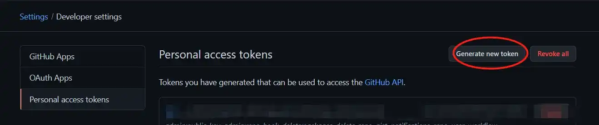
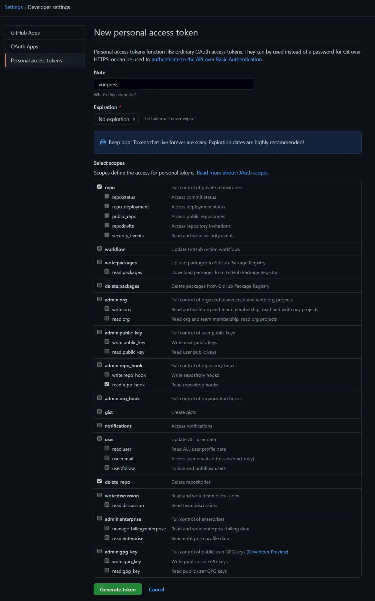
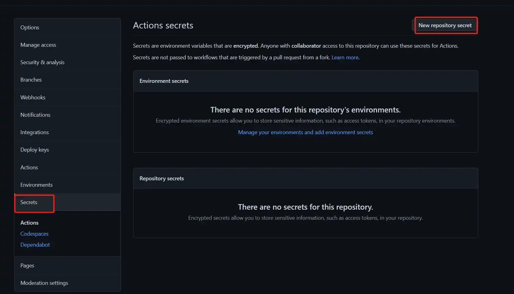
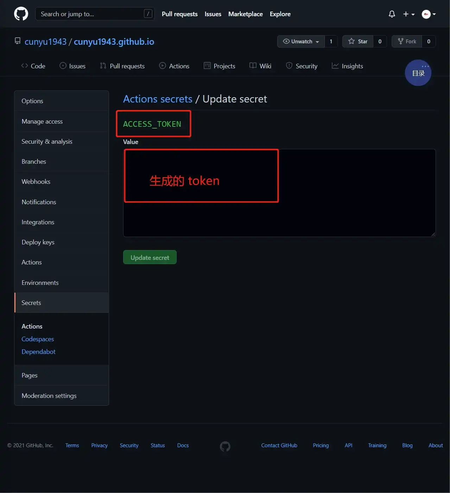
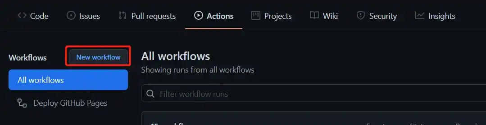
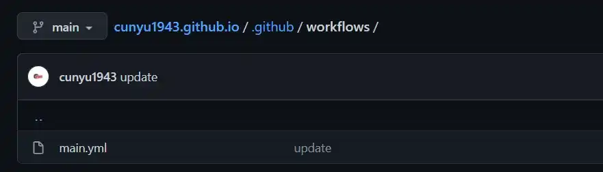
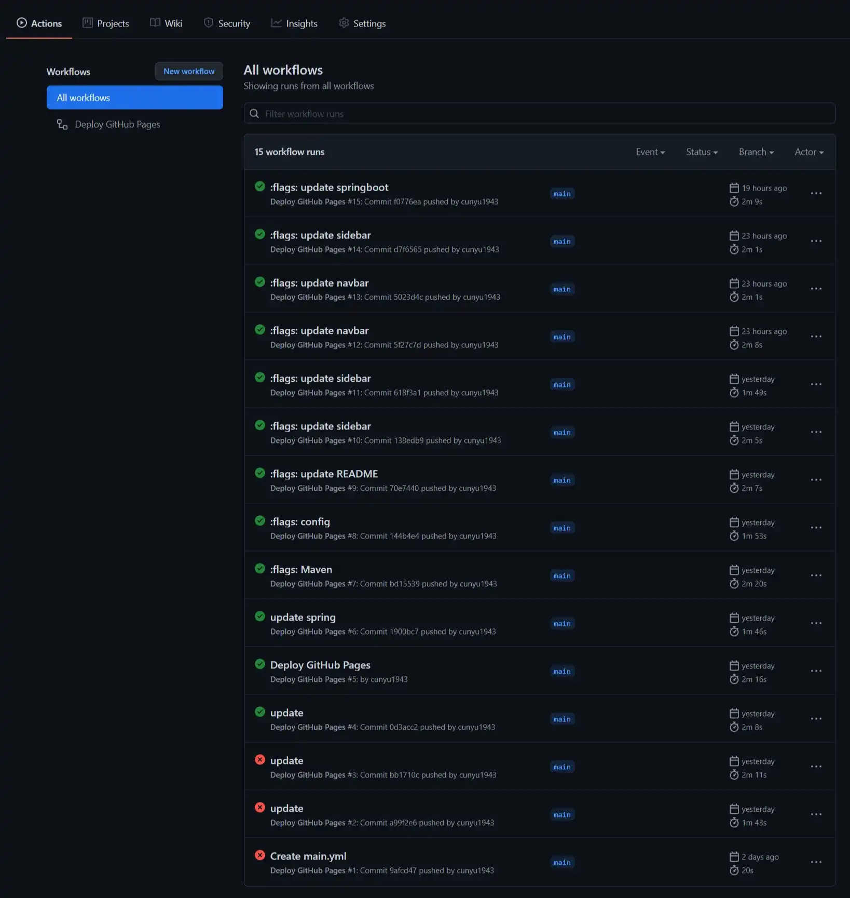
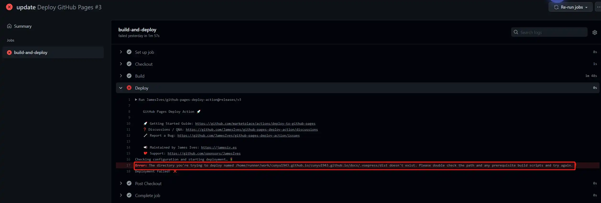

# Vuepress + GitHub Actions 实现博客自动部署

## 前言

正常我们利用 Vuepress 搭建一个文档博客之后，往往都是通过如下步骤来部署一篇博客：

1.   首先写文章；
2.   写完文章之后生成静态文件，这里一般使用的是 `npm run build` 命令，但也有使用 `yarn build` 的；

3.   将我们生成的静态文件推送到 Github Pages；
4.   访问我们对应的网址，查看我们的推送是否成功。

上述步骤看似简单，但一旦文档过多时，生成静态文件就十分耗费时间。这时候我们就想了，有不有一种方法，能够帮我们自动构建静态文件然后部署到 Github Pages 上呢。刚好，Github 官方提供了这个一个工具：Github Actions。利用它，我们就能够将重心转移到创作之后，每次创作之后推送到远程之后它就会自动后续工作，接下来我们就来看看如何利用 Github Action 实现自动部署我们的博客。

## 生成 Token

要部署 Actions，那么它就需要有能够操作我们仓库的权限，因此需要提前设置个人访问令牌（Github personal access）。设置方法如下：进入 Github 后，点击我们的头像，然后依次进入 `Settings -> Developer settings -> Personal access tokens`，对应地址就是 [Token 生成](https://github.com/settings/tokens)。然后点击右上方的 `Generate new token`，接着输入 token 的名字，这个名字可以随意，不过还是推荐根据它的用途来命名。然后选 `Expiration`，也就是这个 Token 的有效期，如果我们要长期用，建议选为 `No expiration`，意思就是无期限。最后就是选权限，一般来讲这里选 `repo` 就够了，但是如果你不确定，那就全都选上也行。然后点击 `Generate Token`，会生成一个令牌，注意这里它只会出现一次，一旦刷新该网页就不见了，所以最好把它复制到你的备忘录备份一下，而且我们待会也是需要用到这个 Token 的。





## 设置 Secrets

进入你存放你博客源码的项目，然后以此点击 `Settings -> Secrets`，接着点击右上角的 `New repository secret`，新建一个 `Secret`。这里的名字要命名为 `ACCESS_TOKEN`，然后 `Value` 就是我们上一步中所生成的 Token。





## 编写 Action

进入项目的的 `Actions` 选项，然后新建一个 `workflow`（我是因为已经建立过了，所以才是下面的界面），默认新建的 `workflow` 名字是  `main.yml` 这个可以自己自定义，根据你自己喜好来就行了。



生成后的 `main.yml` 位于项目的 `.github/workflows` 目录下。



接下来是在 `main.yml` 中填入如下信息即可，具体实例的可以参考我的博客实例：

>   https://github.com/cunyu1943/cunyu1943.github.io/

```yml
# name 可以自定义
name: Deploy GitHub Pages

# 触发条件：在 push 到 main/master 分支后，新的 Github 项目 应该都是 main，而之前的项目一般都是 master
on:
  push:
    branches:
      - main

# 任务
jobs:
  build-and-deploy:
    # 服务器环境：最新版 Ubuntu
    runs-on: ubuntu-latest
    steps:
      # 拉取代码
      - name: Checkout
        uses: actions/checkout@v2
        with:
          persist-credentials: false

      # 生成静态文件
      - name: Build
        run: npm install && npm run docs:build

      # 部署到 GitHub Pages
      - name: Deploy
        uses: JamesIves/github-pages-deploy-action@releases/v3
        with:
          ACCESS_TOKEN: ${{ secrets.ACCESS_TOKEN }} # 也就是我们刚才生成的 secret
          BRANCH: gh-pages # 部署到 gh-pages 分支，因为 main 分支存放的一般是源码，而 gh-pages 分支则用来存放生成的静态文件
          FOLDER: docs/.vuepress/dist # vuepress 生成的静态文件存放的地方
```

## 验证

经过上面的的步骤配置好之后，就可以点击仓库的 `Actions` 来查看部署情况了。



如果是绿色的，说明自动部署成功了，如果是红色，那就说明部署失败。这个时候我们可以点进去看看部署失败的日志信息。

以我部署失败的一个实例来讲，可以看到主要是在部署步骤出了问题，我们就可以根据给出的错误日志来找出问题所在，然后找方法解决它了。

我这里错误的大体意思就是说我 Vuepress 项目下的的 `dist` 目录不存在，而解决方法则是在 Vuepress 的配置文件中的 `dist` 设置为 `docs/.vuepress/dist` 即可。



## 总结

以上就是关于 Vuepress + Github Actions 实现自动部署的所有内容了，如果对你有所帮助，那就帮忙点赞关注吧！

最后，贴出我的博客地址，可以去看看效果！

-   项目文件：https://github.com/cunyu1943/cunyu1943.github.io
-   预览地址：https://cunyu1943.github.io/