# Hexo + Github Pages 博客搭建教程


:::info 共勉
不要哀求，学会争取。若是如此，终有所获。
:::

## 前言

现在市面上已经有许多博客了，比如 `CSDN`、掘金、博客园、简书等等。我们可以直接在上面发表内容，而且交互比较人性化，而且也能被搜索引擎检索到。但是总归是别人的平台，经常会受限，因此我们就希望能有自己的博客。之前也尝试过搭建过不同的博客类型，折腾了不少工作，最终决定定型，采用 `Hexo + Github Pages` 的方式。今天就带大家一起来搭建自己的博客。由于是采用 `Hexo + Github Pages` 的方式，所以都是免费的，只是需要有一定的动手能力！

## Hexo 简介

[Hexo](https://hexo.io/zh-cn/docs/ "Hexo") 是一个快速、简洁且高效的静态博客框架。`Hexo` 使用 `Markdown`（或其他渲染引擎）解析文章，在几秒内，即可利用靓丽的主题生成静态网页。我们只需要通过 `Markdown` 语法写好自己的博客内容，然后通过简单的命令就能够将生成的网页上传到 `Github`，然后大家都可以来访问你的网页了。既方便了自己，也给了自己一个展示自己成果的平台，是不是一举两得。

## 搭建步骤

搭建之前，需要做一些准备工作，首先需要确保你的电脑上已经上安装好了 `Git` 和 `Node.Js`，然后才能开始安装 `Hexo`，那么首先我们先来看看如何准备这这些环境。

### Git

#### 安装

1.  **Window**：[下载并安装](https://git-scm.com/download/win "下载并安装")
2.  **macOS**：[下载并安装](https://sourceforge.net/projects/git-osx-installer/ "下载并安装")
3.  **Linux（Debian，Ubuntu）**：`sudo apt-get install git-core`
4.  **Linux（Fedora、RedHat、CentOS）**：`sudo yum install git-core`

#### 设置

安装成功后，将 `git` 与 `GitHub` 账号绑定，右键打开 `Git Bash`，然后设置配置信息：

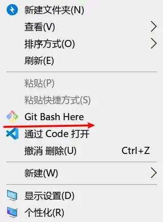

```shell
# 配置用户名和邮箱
git config --global user.name "github 用户名"
git config --global user.email "github 注册邮箱"
```

比如我的配置就是：

```java
git config --global user.name "cunyu1943"
git config --global user.email "747731461@qq.com"
```

接着生成 `ssh` 密钥文件，输入如下命令后直接三次回车即可，一般不需要设置密码。

```shell
# 生成 ssh 密钥
ssh-keygen -t rsa -C "github 注册邮箱"
```

生成秘钥的命令：

```bash
ssh-keygen -t rsa -C "747731461@qq.com"
```

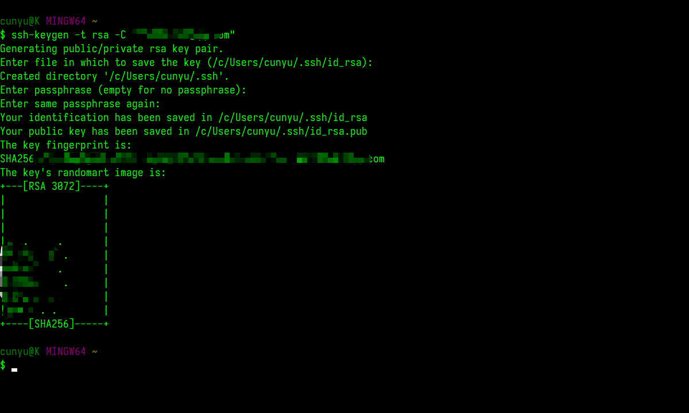

一般执行上述命令之后，会生成 `id_rsa` 和 `id_rsa.pub` 两个文件，前者是我们私有的，而后者则是对外开放的。接着找到生成的 `.ssh` 的文件夹中的 `id_rsa.pub` 密钥，将内容复制；

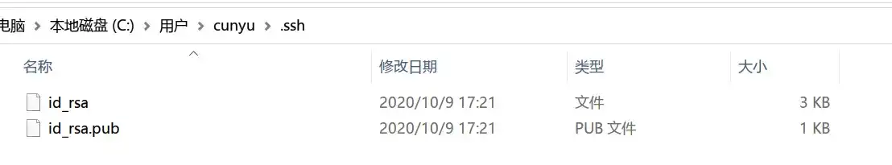

然后打开 [GitHub-Settings-Keys](https://github.com/settings/keys "GitHub-Settings-Keys") 页面，创建一个新的 `SSH key`，填写 `Title` 和 `Key`，`Title` 可以随意，而 `Key` 的内容则是我们刚才复制的 `id_rsa.pub` 中的内容，最后点击 `Add SSH key` 即可；

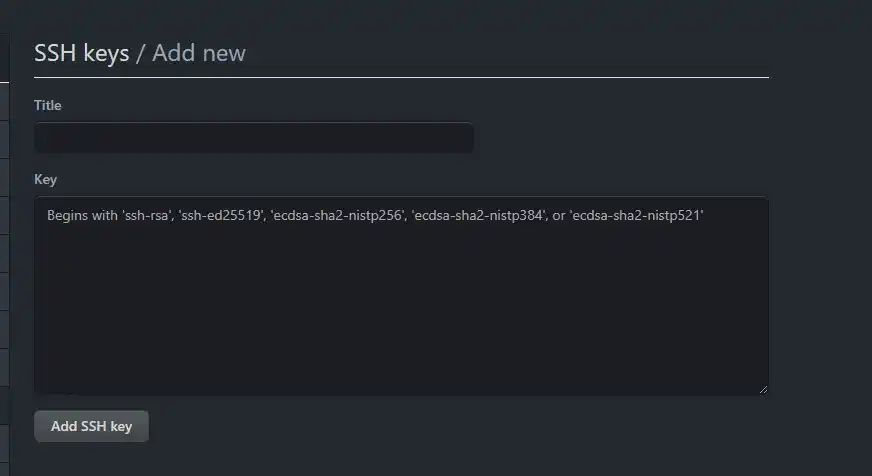

### Node.Js 安装

#### 安装

去官网下载最新的稳定版 [Node.JS](https://nodejs.org/en/ "Node.JS") ，一般推荐 64 位（大家应该现在用的电脑基本都是 64 位的吧），安装的话很简单，基本就是下一步下一步点击就好了。如果还是不知道如何安装，可以参考我的另一篇博客：[Windows 下 Node.js 的安装（多图版）](https://blog.csdn.net/github_39655029/article/details/105397485 "Windows 下 Node.js 的安装（多图版）")

#### 验证

安装完成后，要查看我们是否安装成功，可以打开命令提示符（`Win + R`），输入 `cmd` 打开控制台，输入如下命令，如果出现对应版本号，说明安装成功了。

```bash
node -v
npm -v
```

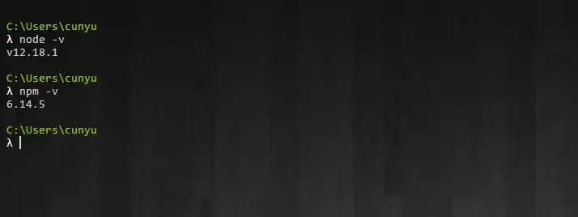

#### 设置

由于下载包是从国外服务器，所以速度较慢，因此我们推荐用阿里的国内镜像进行设置；

```bash
npm config set registry https://registry.npm.taobao.org
```

### Hexo 安装

在你的硬盘上找个地儿，用来存放你的博客文件，比如我的就在 `D:personalFiles/github/blog`，这个文件夹你可以根据自己的喜好来设置。然后从命令台进入当前文件夹，接下来就是安装过程了；

1.  首先安装 `Hexo`

```bash
npm i hexo-cli -g
```

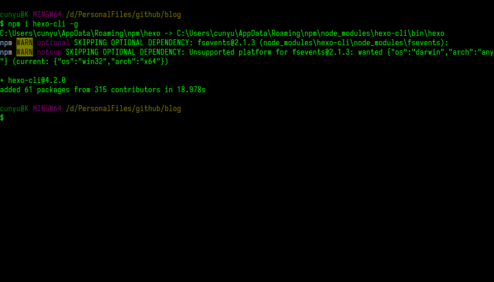

2.  新建一个文件夹用于存放你的博客，比如我的是 `blog`，然后进入该文件夹，并用如下命令进行初始化并安装必备组件；

```bash
hexo init .
npm install
```

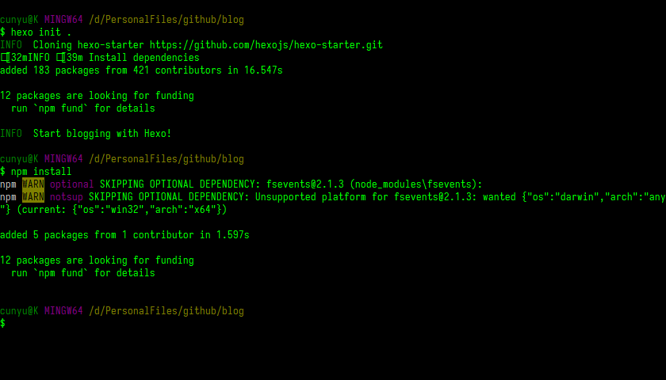

3.  初始化后，目录结构如下；

```shell
.
├── _config.yml # 网站配置信息
├── package.json # 应用程序信息
├── scaffolds # 模板文件夹
├── source # 存放用户资源
|   ├── _drafts
|   └── _posts
└── themes # 主题文件夹
```

4.  然后输入如下命令，然后在浏览器中打开 `http://localhost:4000`；

```shell
# 新建博客
hexo new "博客名"
# 生成静态网页
hexo g
# 打开本地服务器
hexo s
```

然后就可以看到如下的界面，不过我的是经过修改过的，所以和你的会不一样。

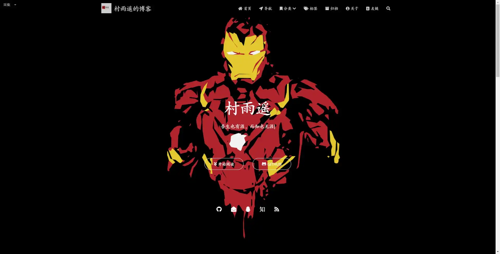

### Github 个人仓库

完成上面的步骤之后，我们就能在本地进行预览了，不过我们如果想要发布到网上供别人看的话，那就得利用 `Github Pages` 的功能了，下边就来介绍如何结合 `Hexo + Github Pages` ，将我们的博客推送到网上去，方便大家在任何地方访问！

> 首先你得有个 `GitHub` 账号，如果没有的，请出门 [右转](https://github.com/ "右转") 先去注册个账号；

有了账号之后，新建一个仓库，而且得确保你的仓库是 `public`，你要搞个 `private`，谁能访问的了？？？同时，仓库名一定要是：

> **用户名.github.io**
>
> **用户名.github.io**
>
> **用户名.github.io**

这个用户名建议不要太复杂，但是又要能体现你个人特点，因为后续让别人访问你的博客时，就要通过 `https://用户名.github.io` 这个域名来访问。比如我的用户名是 **cunyu1943**，所以我的仓库就是 [cunyu1943.github.io](https://github.com/cunyu1943/cunyu1943.github.io "cunyu1943.github.io")：


### 部署到 Github

完成上面的步骤后，你应该能在本地进行预览了，接下来就是推送网站到 `Github Pages` 了，然后我们就能被其他人访问了。

只需要在我们刚才的博客根目录中的站点配置文件 `_config.yml` ，设置为你的个人仓库名即可：

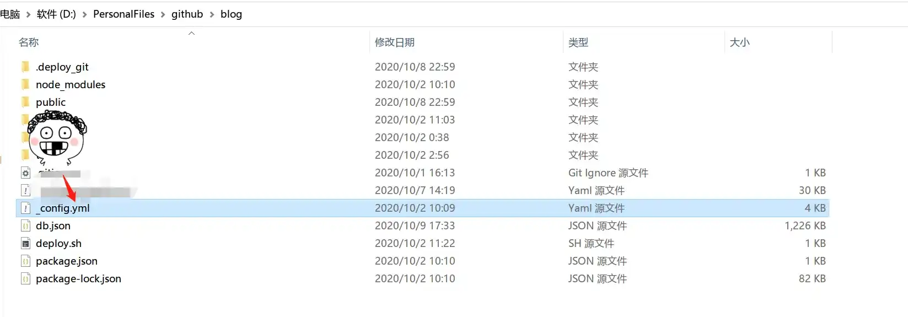

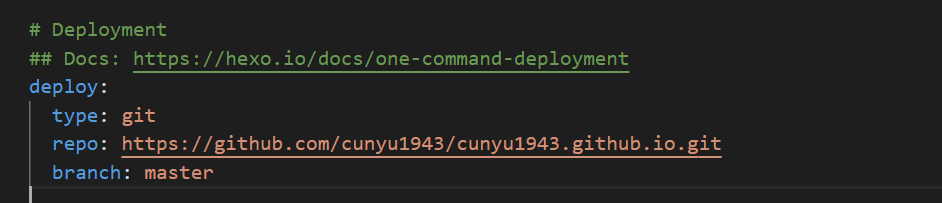

完成上述步骤之后，主要使用如下命令，就能将我们本地的内容推送到远程 `GitHub` 仓库了，然后在浏览器中访问：

> https://用户名.github.io

比如我的博客 [村雨遥的博客](https://cunyu1943.github.io/ "村雨遥的博客")；

```
hexo clean
hexo g
hexo d
```


### Gitee 个人仓库

上面说完部署到 `Github`，接下来就说说怎么部署到 `Gitee`，老规矩，首先你得需要一个 `Gitee` 账号，如果没有的，出门 [右转](https://gitee.com/ "右转") 先去注册个账号。

然后新建一个仓库，同样有几点需要注意的：

1.  保证你的仓库是 `public`；
2.  仓库名是 **你的用户名**，这一点和 `Github` 略有不同，不需要是 **用户名.gitee.io**；

比如我的用户名是 `cunyu1943`，所以我的仓库名就是 [cunyu1943](https://gitee.com/cunyu1943/cunyu1943 "cunyu1943")。

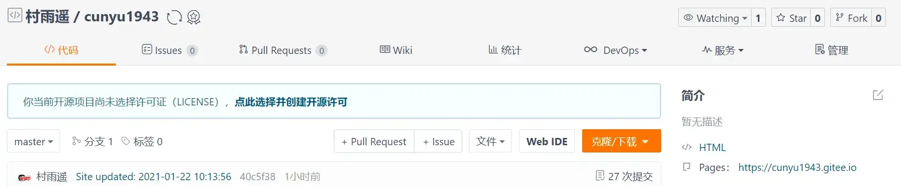

### 部署到 Gitee

完成上面的步骤后，你应该能在本地进行预览了，接下来就是推送网站到 `Gitee Pages` 了，然后我们就能被其他人访问了。这里需要注意的是，`Gitee Pages` 不像 `Github Pages` 会自动更新，它需要你每次推送后，去更新一下，如果想要自动更新，就需要开通 `Gitee` 的会员。

然后需要在我们刚才的博客根目录中的站点配置文件 `_config.yml` ，设置为你的个人仓库名即可：


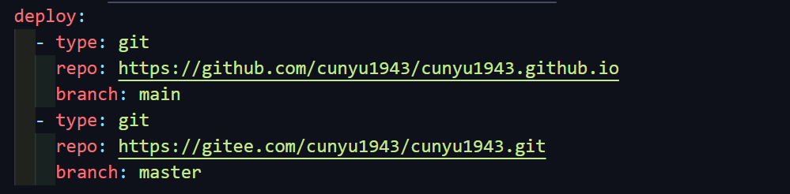

完成上述步骤之后，主要使用如下命令，就能将我们本地的内容推送到远程 `Gitee` 仓库了，去手动更新 `Gitee Pages` 后，然后在浏览器中访问：

> https://用户名.gitee.io

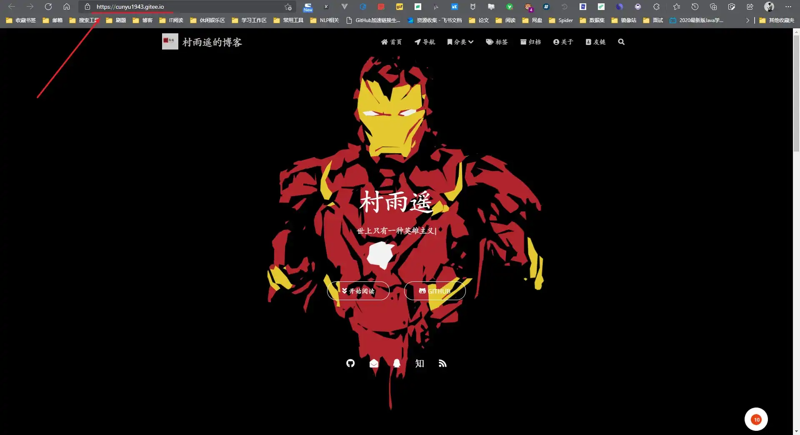

## 如何写新博客并推送到远程

通过上面的步骤后，你的博客应该就已经搭建成功，而且能通过 `https://用户名.github.io` 的方式进行访问了。接下来如果我们要发一篇新的博客内容，又应该怎么办呢？接下来就详细讲一下如何操作。

1.  首先进入博客所在文件夹，然后右键进入控制台，用如下命令进行创建新的文章；

```shell
hexo n "博客标题名"
```

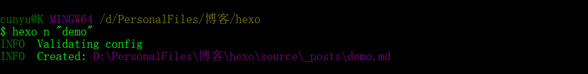

2.  接着在 `blog/source/_posts` 目录下应该就会有创建好的以文章标题名命名的 `Markdown` 文件；

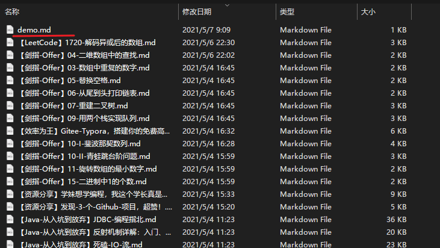

3.  接着打开该文件，编写你自己想要的内容即可；

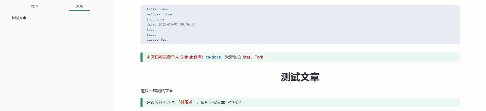

4.  接着在控制台使用如下命令，将其推送到远程 `GitHub` 仓库，等过一会儿之后，访问即可看到刚才推送的新文章了！

```shell
hexo g
hexo d
```

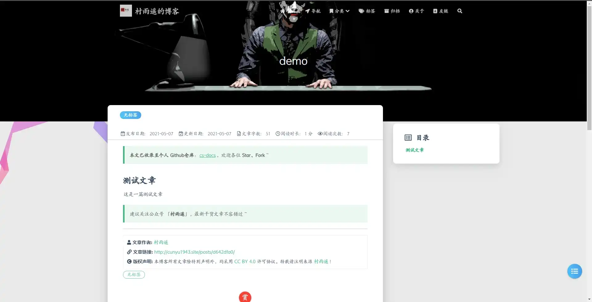

## 如何绑定自定义域名

通过 `用户名.github.io` 的方式来访问总归是有些不方便，如果我们需要自己的个性域名，又应该如何设置呢？那么在此之前，你需要有一个已经备案好的域名，如果没有的话，请到阿里云、腾讯云等场商购买自己的域名，然后通过该平台备案，然后添加两条解析记录，以我的腾讯云为例：

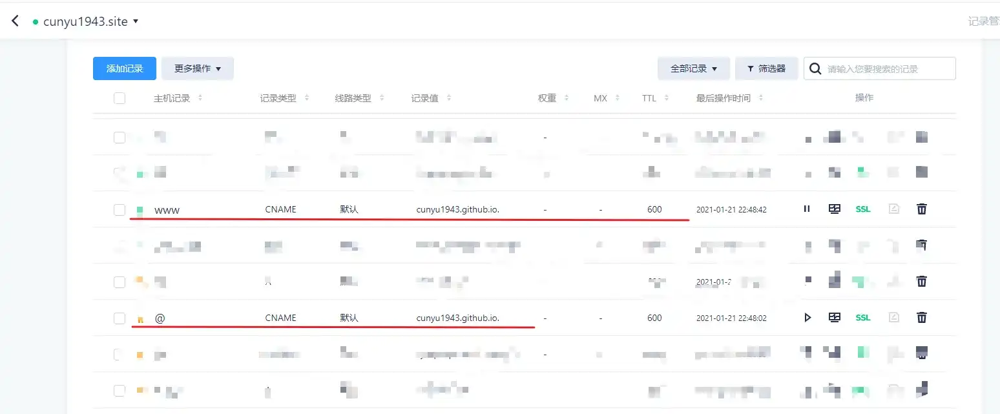

备好案并设置解析之后，在 `Github` 的博客项目中，依次点击 `Settings->Pages`，然后在 `Custom domain` 添加你的域名即可，最后 `Save` 即可，此时你的博客根目录下应该会多一个 `CNAME` 的文件，然后你就可以通过自己的域名来访问你的博客了。

当然，有时候可能经过上面的设置后，博客根目录下不会出现名为 `CNAME` 的文件，如果没有，我们可以通过在本地博客 `/source` 目录下手动建立一个 `CNAME` 文件（无后缀），然后把你的域名填进去并保存，最后依次执行如下命令将设置上传到 `Github` 即可 ~

```bash
hexo g
hexo d
```

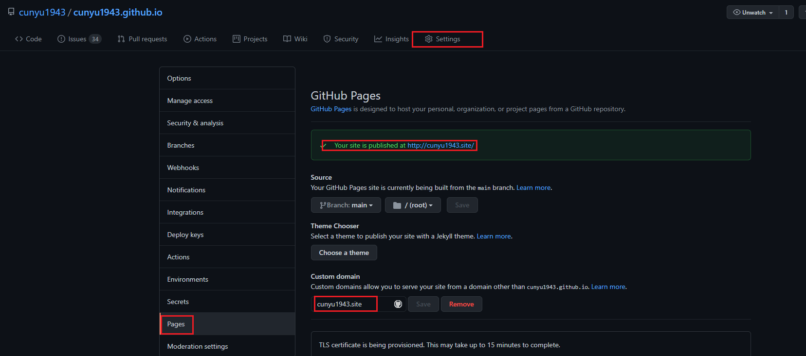

比如我的域名为 `cunyu1943.site`，通过设置之后，我们就可以通过 https://cunyu1943.site 来访问我的博客了。

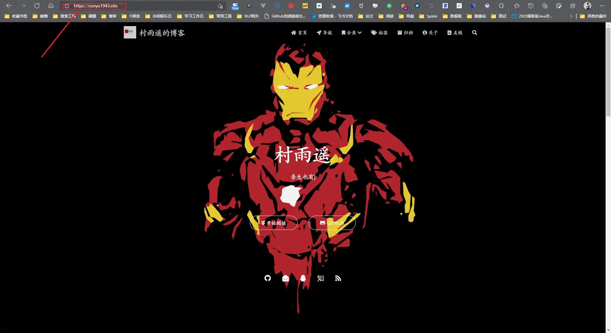

## 美化

经过上面的设置之后，我们只是得到了一个简单地博客，如果你也想让你的博客像我的一样酷（zhuang）炫（bi），就要用到主题了，我采用的主题是 [hexo-theme-matery](https://github.com/blinkfox/hexo-theme-matery "hexo-theme-matery")，一个基于材料设计和响应式设计而成的主题，而且关于如何设置它也有十分详细的文档，如果存在不懂得问题，还可以及时提交 issue，作者回复也十分及时。

如果你不想过于折腾，那么你完成上面的步骤之后，也可以直接采用我的博客源代码，然后把里边的个人配置改一下就 `ok` 了，我的博客源码地址：[hexo-theme-matery-personal](https://github.com/cunyu1943/hexo-theme-matery-personal "cunyu1943/hexo-theme-matery-personal")

大家直接下载下来，然后把 `node_modules.zip` 进行解压，然后修改其中的部分配置（也就是你的 `Github`、网名啥的呀个人信息），主要是修改根目录下的 `_config.yml` 和 `_config.hexo-theme-matery.yml`，然后就可以直接写博客了。当然，前提是你把环境啥的都搭建好了。

`PS`：我对于配置文件中的某些关键信息进行了隐藏，比如 `gitalk`、`gitment`、`Valine`、`baiduAnalytics` 等，这些需要你自己去注册并获取自己的信息，请记得修改，否则可能导致失败。

## 总结

至此，我们的博客就搭建完成了，是不是很简单，赶紧去试试吧！

对于文中不清楚的地方，欢迎留言，我会在看到的第一时间回复你！
