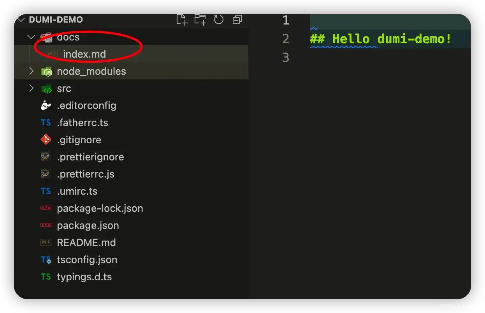

# dumi 搭建文档型博客

## 前言

之前已经讲过如何利用网上各种开源的框架来搭建自己的博客，比如 `docsify`、`Hexo`、`VuePress`、`Halo` 等。前三者可以直接搭配 `Github` 就能免费得到一个专属自己的博客，而 `Halo` 可能需要自己有服务器，然后将服务部署在自己的服务器里。

最近在网上冲浪的时候，又发现了一款文档工具，那就是 `dumi`。从中文拼音来发音，就是 **嘟米**。这是一款为组件开发场景而是的文档工具，和 `father` 组成一条龙服务。`father` 负责构建，`dumi` 则负责组件开发以及组件文档的生成，一起为开发者提供了一站式的组件开发体验。

今天就一起来看看，如何利用 `dumi` 搭建自己的文档型网站。

## dumi 特性

既然要用 `dumi`，那首先就来看看它的一些特性，可以总结如下：

-   开箱即用，我们只需要将注意力集中在组件开发和文档编写即可。
-   丰富的 `Markdown` 扩展，不止于渲染组件 `demo`。
-   基于 `TypeScript` 类型定义，能够自动生成组件 `API`。
-   支持自定义主题，还能创建专属的 `Markdown` 组件。
-   支持移动端组件库，内置移动端搞钱渲染方案。
-   一行命令搞定组件资产数据化，串联下游生产力工具。

## 搭建过程

### 首要准备

既然都说了 `dumi` 是基于 `TypeScript` 类型定义，那怎么离得开 `Node.js` 呢？所以，在正式搭建过程开始前，你得保证你的电脑上安装了 `Node.js`，而且还得确保它的版本不低于 `10.13`。

如果你已经装过了 `Node.js`，但是不确定其版本，那么使用以下命令来查看。

```sh
node -v
```


### 脚手架初始化

`dumi` 支持两种初始化脚手架的方式，一种是组件开发脚手架，另一种则是静态站点脚手架，这里主要介绍如何使用组件开发脚手架。

组件开发脚手架不仅包含了 `dumi` 和基础的文档，还包含了一个简单的组件、`umi-test` 和 `father-build`， 能够轻松实现组件开发、文档编写、测试用例编写、组件打包的全流程。

在本地新建一个空文件夹，方便管理脚手架，然后在初始化一个文档模式的组件库开发脚手架。

```sh
mkdir dumi-demo
cd dumi-demo
npx @umijs/create-dumi-lib
```


初始化完成之后，执行以下命令，然后在浏览器其中打开 `http://localhost:8080` 就可以进行预览了。

```sh
npx dumi dev
```


### 编写文档

查看我们的项目目录，可以发现 `docs` 文件，这里就是我们编写文档的地方。项目初始化时，默认只有 `index.md` 也就是上面我们访问 `http://localhost:8080` 页面中所称呈现的内容。



接着我们在 `docs` 目录下新增修改 `Markdown` 文档，它就会帮我们自动渲染到前端页面中。


## 总结

以上就是利用 `dumi` 搭建文档型网站的具体过程了。当然，除了作为博客之外，我们还可以利用它来进行前端组件化开发，不断给你的网站添加新功能！
