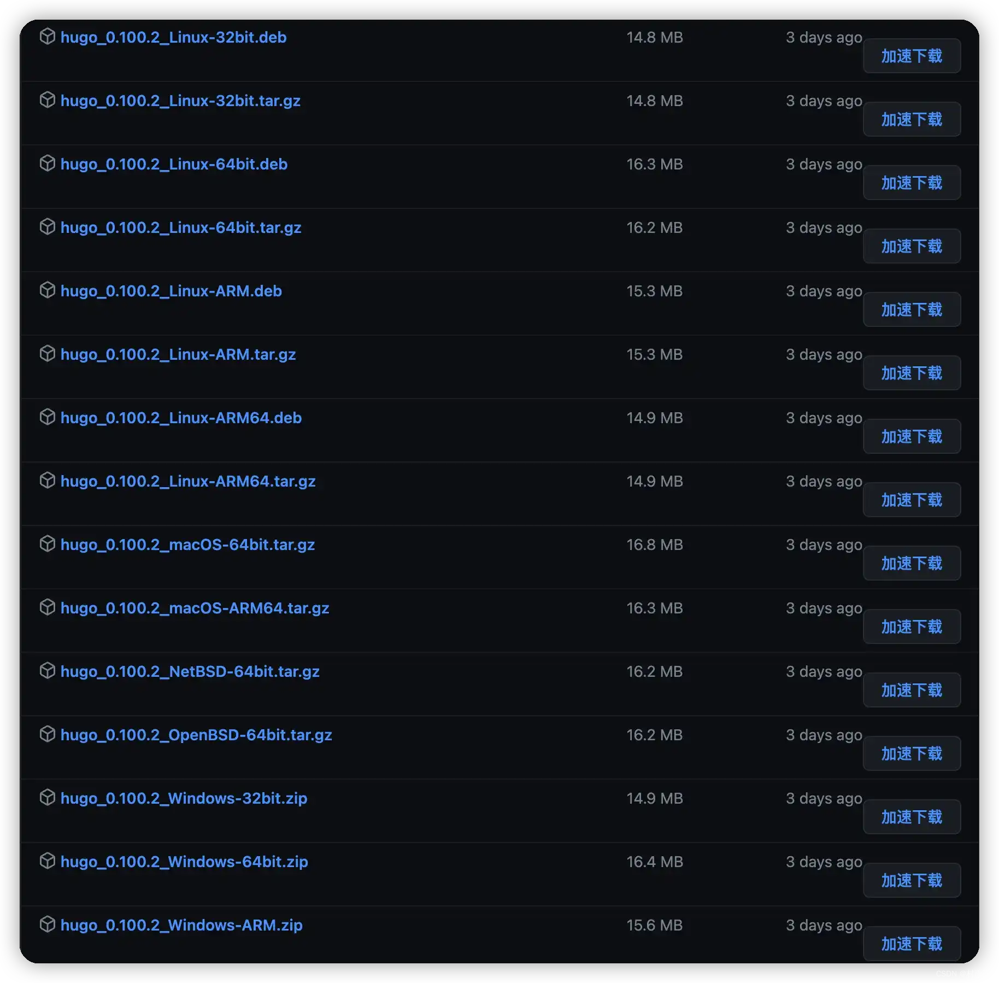
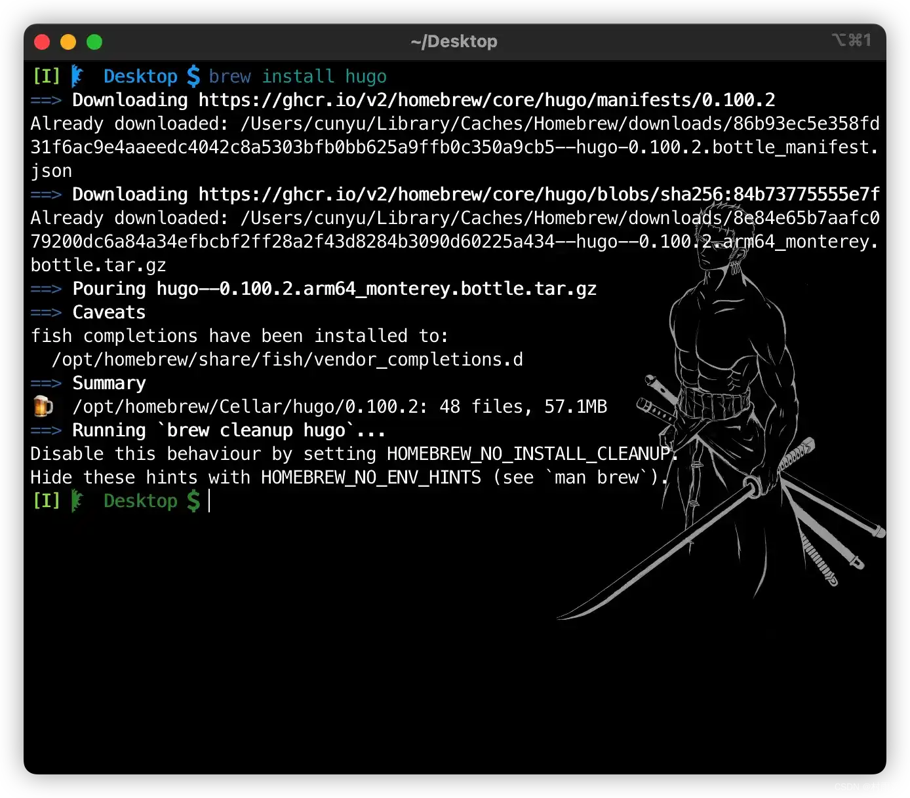
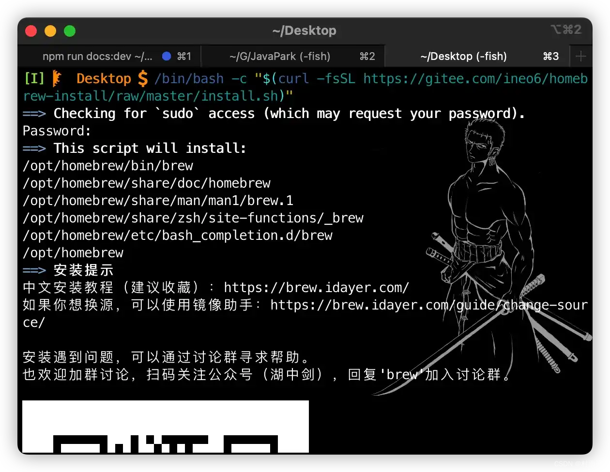
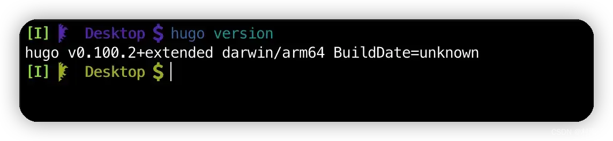
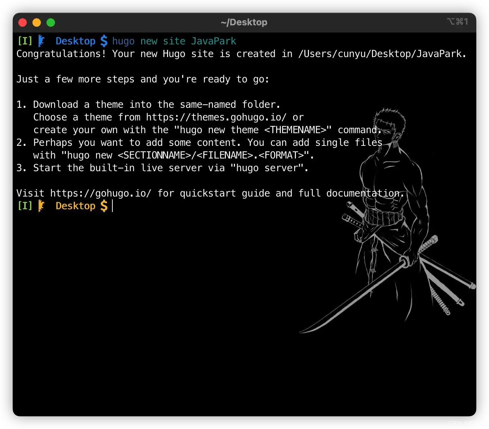
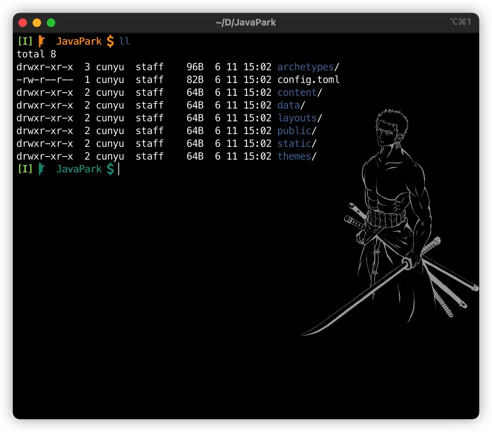
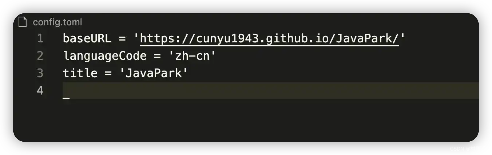
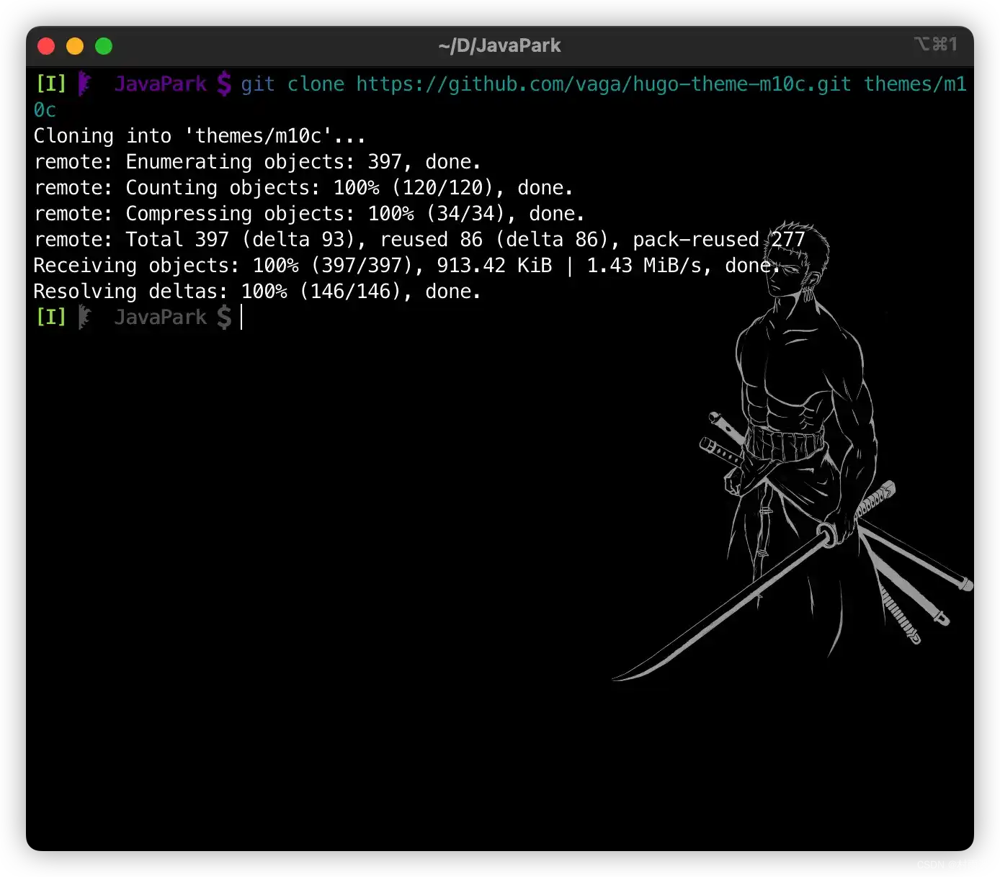
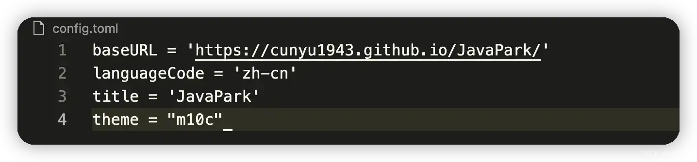
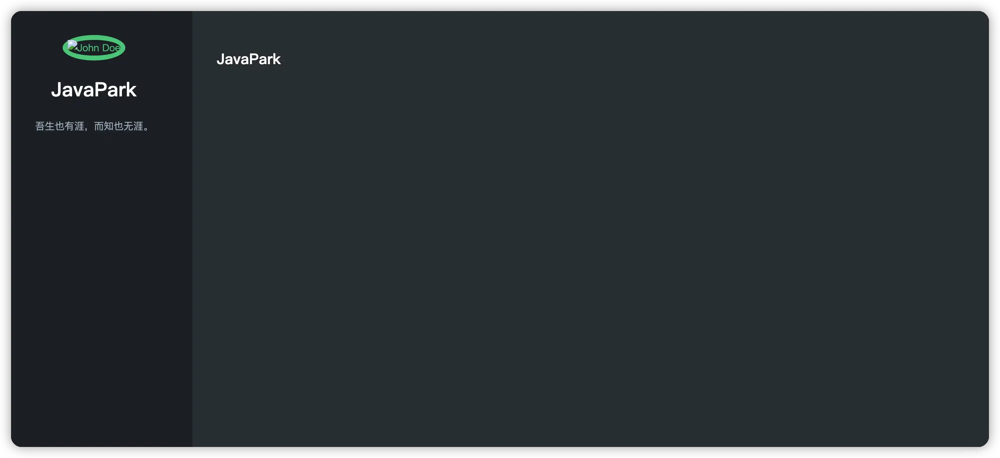

# Hugo + Github Pages 博客搭建教程

## 前言

有了利用 `Hexo`、`docsify`、`vuepress` 等框架来搭建博客的经历之后，我们来今天又来看看 `Hugo`。`Hugo` 是一款基于 `Go` 语言而实现的静态网站生成器，具有简单易用、高效易扩展、快速部署的特点。

这里先给出 `Hugo` 的中英文官方文档，方便大家遇到问题时查阅：

1.   [`Hugo` 中文文档](https://www.gohugo.org/)
2.   [`Hugo` 英文文档](https://gohugo.io/documentation/)

接下来就来看看，如何利用 `Hugo` 来搭建一个博客。

## 搭建过程

### 安装 Hugo

既然要使用 `Hugo`，那么首先需要对它进行安装。如果要通过二进制安装包的方式进行安装，那么首先需要到这里去进行选择适合自己平台的安装包，然后下载它。

>   [下载链接](https://github.com/gohugoio/hugo/releases)

这里不仅有适合 `Windows` 平台的安装包，还包括了 `Linux` 平台和 `macOS` 平台的安装包。不仅如此，针对不同用户，还细心地提供了 `32` 位和 `64` 位来供选择。更甚至针对不同架构的芯片也提供了相应的安装包，可以说是十分细心了。



不过这里我演示主要是基于 `macOS` 平台，所以我就不通过安装包的形式来进行安装了，这里通过 `homebrew` 一行命令就能够轻松搞定。

```sh
brew install hugo
```



如果你的 `macOS` 上还没有安装 `homebrew`，那么先抓紧去安装下吧。

这里温馨提示下，国内用户依照 `homebrew` 官网的方式来进行安装基本上都是会失败的，所以这里给大家推荐另一种安装方式，通过以下脚本进行安装即可。

```sh
/bin/bash -c "$(curl -fsSL https://gitee.com/ineo6/homebrew-install/raw/master/install.sh)"
```



### 检查是否成功

虽然通过上述的命令安装后，控制台是提示我们安装成功了，但我们心里没谱呀，就想看看到低安装成功了没。那这个时候就可以通过查看 `Hugo` 版本号的方式，来却 `Hugo` 是否安装成功。

```sh
hugo version
```



如果安装成功了，那么执行命令后就会像我们上面那样，提示你所安装的 `Hugo` 的版本。

### 初始化网站

既然安装好了，接下来就是初始化我们的网站目录了。通过以下命令，我们就能够完成 `Hugo` 项目的初始化了！

```sh
hugo new site [项目名称]
```

```sh
hugo new site JavaPark
```



项目初始化后，得到的目录如下。



这里主要需要需要注意 `config.toml` ，这是项目的配置文件，主要用于配置 `Hugo`，该文件中的配置会对整个工程有效。`theme` 目录下主要用于放置主题，里边一般还会有一个 `theme.toml`，用于配置主题。

默认情况下，`config.toml` 里边只会有以下三个配置。



### 设置主题

为了给我们的网站设置样式，我们需要去选择一个喜欢的主题。`Hugo` 虽然不像 `Hexo` 提供了较多的主题，但是也还是有很多不错的，大家可以去皮肤列表找。

>   [皮肤列表](https://themes.gohugo.io/)

这里我选择了一个皮肤 [`m10c`](https://themes.gohugo.io/themes/hugo-theme-m10c/)，进入我们初始化的项目，然后利用如下命令将主题下载到 `theme` 文件夹下。

```sh
git clone https://github.com/vaga/hugo-theme-m10c.git themes/m10c
```



接着到项目配置文件 `config.toml` 中，设置主题。

```toml
theme = "m10c"
```



### 预览

设置好主题之后，就可以进行预览了！使用如下命令启动 `Hugo` 服务器，然后进入 `http://localhost:1313` 就可以进行预览了！

```sh
hugo server -D
```



## 总结

以上就是如何利用 `Hugo` 搭建一个博客了，主要从 `Hugo` 安装、初始化项目、主题设置、预览等几个方面介绍了 `Hugo` 的使用，剩下的就是写作了。这是件很难的事，希望大家能一直坚持下去。其实 `Hugo` 里边还有好多玩法，这里就不做一一介绍了，大家可以去官网探索更多玩法。