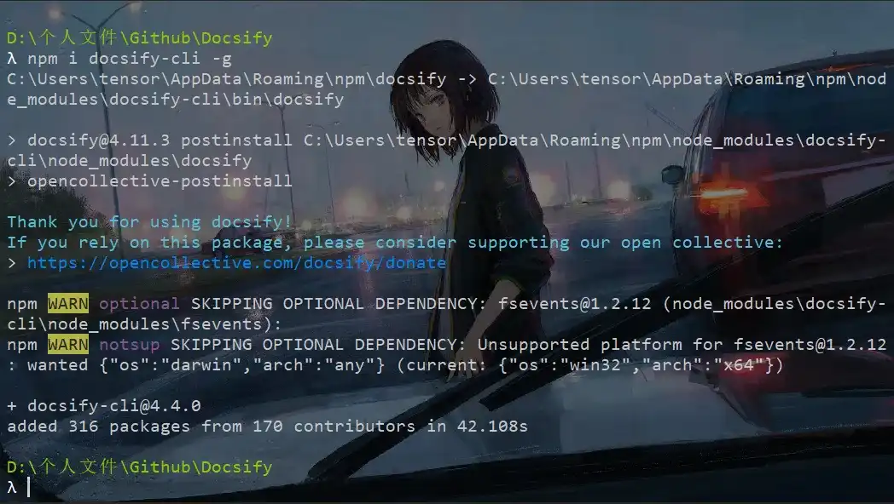
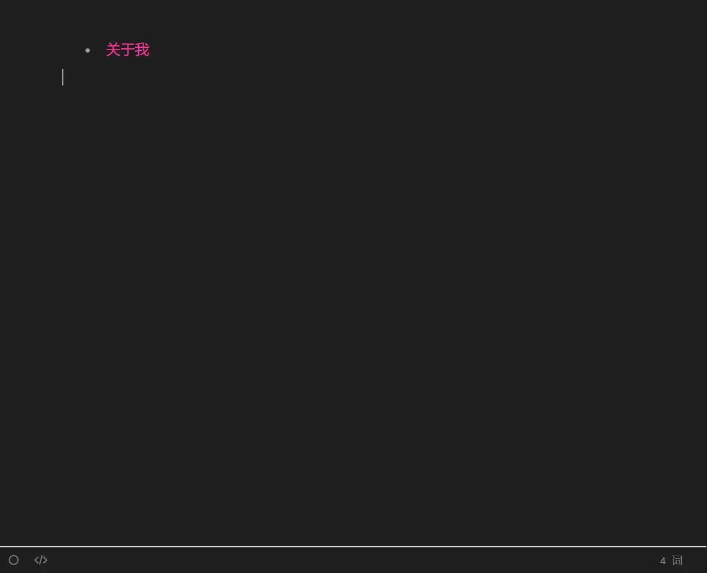
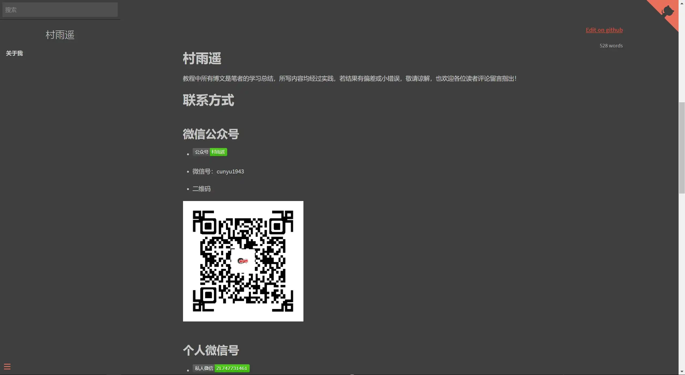
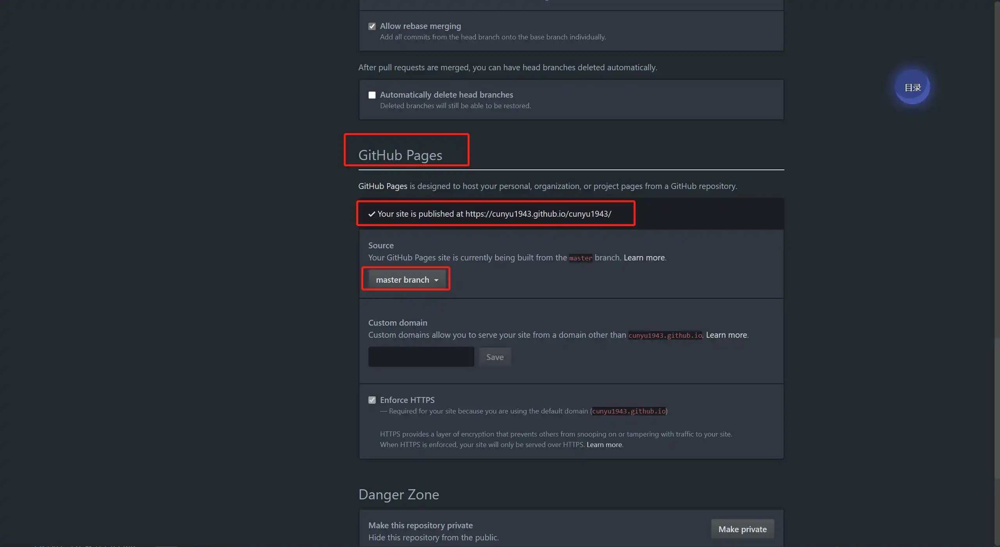
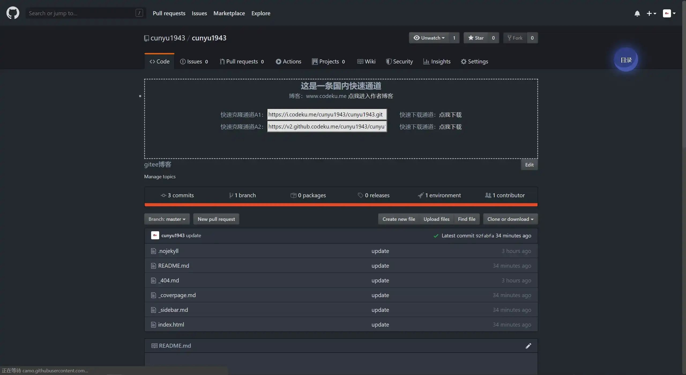
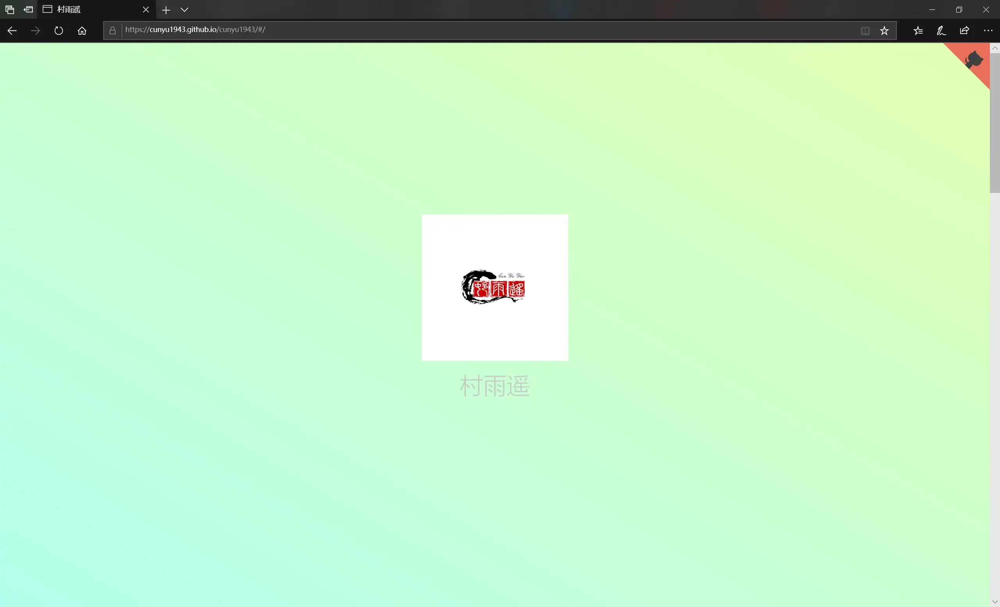

# docsify 文档型博客搭建

## 前言

在开始之前，请先确保你已经满足以下两个条件：

- 自己的电脑上安装了 `Node.js`；

- 拥有自己的 `Github/Gitee` 账号；

## 快速安装并开始

### 安装

首先使用如下命令在自己的电脑上安装 `docsify-cli` 工具，方便后续的创建和预览自己的文档网站；

```shell
npm i docsify-cli -g
```



### 项目初始化

在自己的电脑上创建一个项目文件夹，比如我的是 `Docsify`，然后进入该文件夹并打开命令行工具，通过如下命令来初始化项目；

```shell
docsify init ./
```


### 项目目录结构

经过初始化后，可以发现项目文件夹的目录结构如下，主要有三个文件，其功能如下：

```shell
.
    .nojekyll
    index.html
    README.md
```

- `index.html` : 入口文件，也叫配置文件，相关配置均在其中；

- `README.md` :  作为主页内容渲染；

- `.nojekyll` : 防止 `Github Pages` 忽略下划线开头的文件；

### 本地预览

当我们编辑好文档后，想要在本地预览时，可通过如下命令运行本地服务器，然后在浏览器中访问 `http://localhost:3000` 进行实时预览（其中 3000 端口是 `docsify` 默认访问端口）；

```shell
docsify serve ./
```


## 项目配置

### 配置文件 `index.html`

该文件中主要配置了文档网站的名字以及开启一些配置选项，比如我修改后的配置如下：

```html
<!DOCTYPE html>
<html lang="en">

<head>
  <meta charset="UTF-8">
  <title>村雨遥</title>
  <meta http-equiv="X-UA-Compatible" content="IE=edge,chrome=1" />
  <meta name="description" content="Description">
  <meta name="viewport"
    content="width=device-width, user-scalable=no, initial-scale=1.0, maximum-scale=1.0, minimum-scale=1.0">
  <link rel="stylesheet" href="//unpkg.com/docsify/lib/themes/dark.css">
</head>

<body>
  <div id="app"></div>
  <!-- docsify-edit-on-github -->
  <script src="//unpkg.com/docsify-edit-on-github/index.js"></script>
  <script>
    window.$docsify = {
      name: '村雨遥',
      repo: 'https://gitub.com/cunyu1943/cunyu1943',
      maxLevel: 5,//最大支持渲染的标题层级
      subMaxLevel: 3,
      homepage: 'README.md',
      coverpage: true, // 封面
      loadSidebar: true, // 侧边栏
      autoHeader: true,
      notFoundPage: true, // 找不到页面时
      auto2top: true,//切换页面后是否自动跳转到页面顶部
      //全文搜索
      search: {
        //maxAge: 86400000, // 过期时间，单位毫秒，默认一天
        paths: 'auto',
        placeholder: '搜索',
        noData: '未找到结果',
        // 搜索标题的最大程级, 1 - 6
        depth: 3,
      },
      plugins: [
        EditOnGithubPlugin.create('https://githee.com/cunyu1943/cunyu1943/')
      ],
    }
  </script>
  <script src="//unpkg.com/docsify/lib/docsify.min.js"></script>
  <!--Java代码高亮-->
  <script src="//unpkg.com/prismjs/components/prism-java.js"></script>
  <script src="//unpkg.com/prismjs/components/prism-python.js"></script>
  <!--全文搜索,直接用官方提供的无法生效-->
  <script src="https://cdn.bootcss.com/docsify/4.5.9/plugins/search.min.js"></script>
  <!-- 复制到剪贴板 -->
  <script src="//unpkg.com/docsify-copy-code"></script>
  <!-- emoji -->
  <script src="//unpkg.com/docsify/lib/plugins/emoji.js"></script>
  <!-- 图片缩放 -->
  <script src="//unpkg.com/docsify/lib/plugins/zoom-image.js"></script>
  <!-- 字数统计 -->
  <script src="//unpkg.com/docsify-count/dist/countable.js"></script>
</body>

</html>
```

### 侧边栏

上述配置中侧边栏已经打开，即 `loadSidebar: true`，此时新建一个 `_sidebar.md` 文件，在其中加入你所要显示的内容；



### 封面

上述配置中封面已经打开，即 `coverpage: true`，此时新建一个 `_coverpage.md` 文件，在其中加入你所要显示的内容，比如我的封面；


### 主页内容

即 `README.md` 的内容，比如我的最终结果显示如下；



### 更多

如果还需要了解更多详情，可以访问[官网教程](https://docsify.js.org/#/zh-cn/quickstart)；

## 部署

进行上述操作之后，我们就可以将其部署到 `GitHub Pages`，然后供别人访问了是不是很激动，部署详情如下：

### 新建仓库

即和平常创建的步骤一样，但是要注意打开 `Github Pages` 功能；



### 提交项目

将本地的项目提交到远程；



### 预览

在浏览器中访问创建仓库时的给的网址即可在线预览我们的网站了，比如我的是：`https://cunyu1943.github.io/cunyu1943`，默认会显示封面页；



## 总结

经过上述的配置之后，我们就成功利用 `docsify` 成功搭建自己的文档类型网站了。